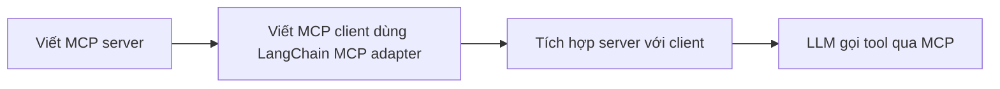

# 🚀 Từ Người Dùng đến Người Xây: Tự Tay Viết MCP Server và MCP Client với LangChain

> Nguồn: `130-Intro.txt` · [Udemy](https://ua.udemy.com/course/langchain/learn/lecture/52636615)

Chào các bạn, mình là Eden đây! 👋 Ở các bài trước, chúng ta đã tích hợp thành công một **MCP server dựng sẵn** với một **MCP client dựng sẵn**. Nhưng dừng ở đó thì chưa "đã" — đã đến lúc chúng ta lặn sâu thêm một tầng nữa rồi.

Trong vài video tới đây, chúng ta sẽ lần lượt **tự tay hiện thực hóa các MCP server**, rồi **tự tay hiện thực hóa MCP client**, và cuối cùng là **tích hợp những server do chính mình xây với client do chính mình xây**.

---

### 🗺️ Bức tranh lớn: Chúng ta sẽ làm gì?

Mục tiêu của chặng này rất rõ ràng:

1. **Hiện thực hóa MCP server** — không dùng đồ có sẵn nữa, mà tự viết.
2. **Hiện thực hóa MCP client** — để giao tiếp được với chính những server mình vừa tạo.
3. **Tích hợp hai phần lại** — nối các MCP server tự xây với MCP client tự xây.

Toàn bộ chặng này đi theo luồng sau:

Nghe có vẻ "nặng đô", nhưng thực ra mọi thứ sẽ rất mượt vì chúng ta đã có nền tảng vững chắc từ các bài trước. *Đừng lo lắng nếu bạn chưa hình dung hết — mình sẽ đi từng bước cùng bạn.*

Điều mình muốn các bạn ghi nhớ: ở các bài trước, chúng ta **dùng MCP như một người dùng cuối**. Còn lần này, chúng ta sẽ **hiểu và làm chủ nó từ bên trong** — biết server phơi tool ra sao, client gọi tool như thế nào.

| Tiêu chí | Dùng đồ có sẵn (bài trước) | Tự xây (chặng này) |
|---|---|---|
| Vai trò của bạn | Người dùng cuối | Người xây dựng |
| Server | MCP server dựng sẵn | Tự viết, phơi tool của chính mình |
| Client | MCP client dựng sẵn | Dùng LangChain MCP adapter |
| Mục tiêu | Tích hợp nhanh | Hiểu và làm chủ bên trong |

Đây là video mở màn cho chặng hands-on này, nên các bạn không cần phải ghi nhớ gì cả. Cứ nắm lấy lộ trình, rồi chúng ta sẽ bắt tay vào việc ngay. Mình hứa là khi đi hết chặng này, cả MCP server lẫn MCP client sẽ không còn là "chiếc hộp đen" với các bạn nữa.

---

### ⚙️ Vũ khí bí mật: LangChain MCP Adapter

Điểm đáng chú ý nhất trong kế hoạch lần này là chúng ta sẽ xây dựng MCP client dựa trên gói **LangChain MCP adapter (bộ chuyển đổi MCP của LangChain)**.

Cụ thể, gói này sẽ giúp chúng ta:

* **Chuyển đổi các MCP server thành LangChain tools** — biến những server "ngoài hệ sinh thái" thành công cụ mà agent LangChain hiểu được.
* **Cung cấp sẵn MCP client** — để kết nối và khai thác các server đó một cách gọn gàng.

Các bạn cứ coi đây như một chuyến "hậu trường": thay vì chỉ dùng những gói có sẵn, lần này chúng ta sẽ mở tung nắp ca-pô và xem mọi thứ vận hành như thế nào.

Nói cách khác, chúng ta không phải tự chế lại "dây nối" giữa hai thế giới MCP và LangChain — adapter đã lo phần việc nặng nhọc đó cho chúng ta.

---

### 🎯 Tự kiểm tra nhanh

**Câu 1:** Chặng này khác gì so với các bài trước khi tích hợp MCP?

<b>Xem đáp án</b>

**Đáp án:** Các bài trước mình dùng MCP như người dùng cuối với đồ dựng sẵn; lần này tự xây cả server lẫn client.

Giải thích: Mục tiêu là hiểu và làm chủ MCP từ bên trong.

Tham chiếu: Mục Bức tranh lớn.

**Câu 2:** Ba việc chính của chặng hands-on này là gì?

<b>Xem đáp án</b>

**Đáp án:** Hiện thực hóa MCP server, hiện thực hóa MCP client, rồi tích hợp hai phần lại.

Giải thích: Lộ trình được nêu ngay đầu bài.

Tham chiếu: Mục Bức tranh lớn.

**Câu 3:** Vì sao dùng LangChain MCP adapter thay vì tự viết lại mọi thứ?

<b>Xem đáp án</b>

**Đáp án:** Adapter chuyển MCP server thành LangChain tools và cung cấp sẵn MCP client, đỡ phần việc nặng nhọc.

Giải thích: Ta không phải tự chế "dây nối" giữa hai thế giới MCP và LangChain.

Tham chiếu: Mục Vũ khí bí mật.

**Câu 4:** Gói adapter giúp biến MCP server thành gì?

<b>Xem đáp án</b>

**Đáp án:** Thành các LangChain tools để agent LangChain hiểu và sử dụng được.

Giải thích: Đây là giá trị cốt lõi của adapter.

Tham chiếu: Mục Vũ khí bí mật.

**Câu 5:** Bài mở màn này có yêu cầu ghi nhớ kiến thức mới không?

<b>Xem đáp án</b>

**Đáp án:** Không, chỉ cần nắm lộ trình — đây là video định hướng trước khi bắt tay vào việc.

Giải thích: Kết thúc chặng, server và client sẽ không còn là "chiếc hộp đen".

Tham chiếu: Mục Bức tranh lớn và đoạn kết.

Vậy là các bạn đã nắm được lộ trình: viết server, viết client, rồi hợp nhất chúng. Ngay ở bài tiếp theo, mình sẽ bắt tay vào **dựng boilerplate cho dự án** — từ khởi tạo project, tạo môi trường ảo cho tới cài đặt dependencies. Hãy chuẩn bị sẵn terminal của bạn nhé, hành trình hands-on chính thức bắt đầu! 🚀

## Nguồn tham khảo

- [Udemy — MCP Servers and Clients Intro](https://ua.udemy.com/course/langchain/learn/lecture/52636615)
- [LangChain MCP Adapters — GitHub](https://github.com/langchain-ai/langchain-mcp-adapters)
- [Docs by LangChain — Model Context Protocol](https://docs.langchain.com/oss/python/langchain/mcp)
