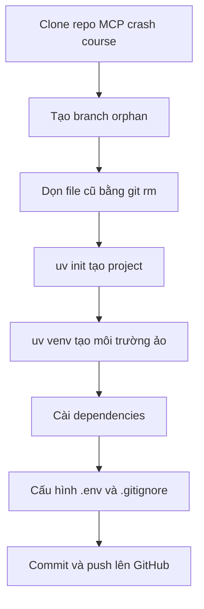

# 🧰 Boilerplate Dự Án MCP: Khởi Tạo, Cấu Hình và Sẵn Sàng Lên Đường

> Nguồn: `131-Boilerplate.txt` · [Udemy](https://ua.udemy.com/course/langchain/learn/lecture/52632233)

Chào các bạn, mình là Eden đây! 👋 Đây là video "dựng sườn" cho dự án của chúng ta — bài học chuẩn bị để mọi thứ sẵn sàng trước khi viết những dòng code MCP đầu tiên.

Trong bài này, chúng ta sẽ **tạo mới một project bằng UV**, **tạo môi trường ảo (virtual environment)**, **cài đặt dependencies**, và **commit lên GitHub**. Nghe thì nhiều bước, nhưng mình sẽ đi nhanh thôi, vì phần thú vị nhất đang chờ ở phía sau.

---

### 🧹 Bắt đầu từ trang giấy trắng

Nếu bạn không muốn tự tay gõ mọi thứ từ đầu, mình đã chuẩn bị sẵn các lệnh cần thiết và sẽ **đính kèm trong phần Resources** của video. Những lệnh đó sẽ:

1. **Clone repository của khóa học**.
2. **Clone đúng branch `project/langchain-mcp-adapters`**.
3. **`cd` vào thư mục LangChain MCP adapters** rồi **checkout đúng commit** mà mình sử dụng — commit này chứa toàn bộ code của video.

Còn nếu bạn muốn bắt đầu từ con số không như mình, đây là những gì mình đã làm:

1. Clone repository của khóa **MCP crash course** về máy (URL nằm trong Resources của video).
2. Tạo một branch mới bằng `git checkout --orphan project/langchain-mcp-adapters` — cách này giúp branch "tách hẳn" khỏi repo gốc và bắt đầu với lịch sử sạch.
3. Dọn sạch file cũ bằng `git rm -rf .` để có một khởi đầu tinh khôi.

Các bước dựng boilerplate đi theo luồng sau:



*Các bạn cứ yên tâm: repo chính của khóa học được tổ chức gọn gàng hơn nhiều, nên đừng bối rối nếu trong video bạn thấy cây thư mục hơi "bừa" nhé!*

| Cách bắt đầu | Các bước chính | Dành cho ai |
|---|---|---|
| Chạy lệnh có sẵn | Clone repo khóa học, checkout branch và commit của giảng viên | Muốn có đúng code như trong video |
| Tự làm từ số 0 | Clone repo MCP crash course, tạo branch orphan, `git rm -rf .`, `uv init`... | Muốn thực hành từng bước |

---

### 📦 Khởi tạo với UV và cài đặt dependencies

Tiếp theo, mình chạy **`uv init`** để khởi tạo project. UV tạo cho chúng ta một vài file boilerplate:

* Một file `README` rỗng.
* File `main.py`.
* File `pyproject.toml`.

Sau đó mình tạo môi trường ảo bằng **`uv venv`** và activate nó — khi thành công, bạn sẽ thấy tên môi trường **MCP Crash Course** hiện trong ngoặc đơn ở thanh bên trái. Một điểm hay ho: nếu bạn thoát Cursor rồi mở lại, môi trường ảo sẽ **tự động được activate**; còn nếu không, bạn chỉ cần kích hoạt thủ công như bình thường.

Về dependencies, mình cài theo đúng hướng dẫn trong repo của **LangChain adapters**:

* **`langchain-mcp-adapters`**.
* **`langgraph`**.
* **`langchain-openai`**.
* **`python-dotenv`** — để load biến môi trường (mình kiểm tra thì thấy nó đã có sẵn trong dependencies).

Một chi tiết rất đáng lưu ý: chúng ta **không cài trực tiếp gói `mcp`**, bởi vì khi cài `langchain-mcp-adapters`, gói `mcp` sẽ **tự động được cài kèm**. Còn file `uv.lock` sẽ lưu phiên bản chính xác của mọi gói trong môi trường — ví dụ ở thời điểm quay video, **`langchain-core` là 0.3.5**. Bạn có thể sẽ có phiên bản mới hơn, *và điều đó hoàn toàn bình thường* — mình sẽ cập nhật video nếu có breaking changes.

---

### ⚙️ Làm quen code async và cấu hình biến môi trường

Mình mở `main.py` và chạy thử bằng `uv run main.py` để **sanity check** — chương trình chạy ngon lành. Sau đó mình chuyển hàm thành **coroutine bằng từ khóa `async`** và chạy bằng **`asyncio.run`**. Vì code MCP client sắp tới là bất đồng bộ, bước này giúp chúng ta làm quen trước. *À, và nhớ import `asyncio` nếu bạn không muốn... quên như mình nhé!* 😄

Kế đến là file **`.env`** để chứa biến môi trường:

* **`OPENAI_API_KEY`** — hoặc API key của bất kỳ LLM nào bạn muốn dùng.
* Các biến phục vụ **LangSmith tracing** (theo dõi luồng chạy), ví dụ `LANGCHAIN_TRACING_V2`.

Về phần LLM, mình đang dùng **OpenAI**, nhưng bạn có thể chọn bất kỳ model nào **hỗ trợ function calling**: **Anthropic Sonnet**, **Gemini** (có cả free tier đấy!), **DeepSeek**... miễn là nó hỗ trợ gọi hàm là được. Còn tracing thì *không bắt buộc* — nếu không dùng, bạn chỉ cần đặt `LANGCHAIN_TRACING_V2=false` là mọi thứ vẫn chạy bình thường.

Cuối cùng, mình tạo file **`.gitignore`** để không commit file `.env` lên GitHub — bạn sẽ thấy file này bị "làm mờ" trong Cursor, dấu hiệu cho biết Git đang bỏ qua nó. Mình cũng thêm hàm **`load_dotenv`** vào `main.py` và in thử API key ra để chắc chắn biến môi trường đã được nạp đúng (nhớ import cả module `os` nữa nhé).

---

### 📤 Commit và push lên GitHub

Mọi thứ đã chạy ổn, mình commit toàn bộ code. Một tính năng mình rất thích ở Cursor là **tự động sinh commit message bằng AI** — chỉ một cú click. Sau đó mình set upstream và push lên GitHub, rồi mở branch `project/langchain-mcp-adapters` trên GitHub để kiểm tra: `main.py`, `uv.lock`, `pyproject.toml`... đều đã ở trên đó.

---

### 💻 Code mẫu đầy đủ — `main.py`

Toàn bộ code của bài nằm trong file `main.py` (tham khảo từ repo chính thức của khóa học, branch `project/langchain-mcp-adapters`; đây là phiên bản `main.py` sau khi MCP client trong dự án đã được hoàn thiện — dòng `import os` còn lại từ bước sanity check ban đầu):

```python
import asyncio
import os

from dotenv import load_dotenv
from langchain_core.messages import HumanMessage
from langchain_mcp_adapters.tools import load_mcp_tools
from langchain_openai import ChatOpenAI
from langgraph.prebuilt import create_react_agent
from mcp import ClientSession, StdioServerParameters
from mcp.client.stdio import stdio_client

load_dotenv()

llm = ChatOpenAI()

stdio_server_params = StdioServerParameters(
    command="python",
    args=["servers/math_server.py"],
)

async def main():
    async with stdio_client(stdio_server_params) as (read,write):    
        async with ClientSession(read_stream=read, write_stream=write) as session:
            await session.initialize()
            print("session initialized")
            tools = await load_mcp_tools(session)


            agent = create_react_agent(llm,tools)

            result = await agent.ainvoke({"messages": [HumanMessage(content="What is 54 + 2 * 3?")]})
            print(result["messages"][-1].content)

if __name__ == "__main__":
    asyncio.run(main())
```

### 🎯 Tự kiểm tra nhanh

**Câu 1:** Vì sao mình dùng `git checkout --orphan` khi tạo branch?

<details>
<summary><b>Xem đáp án</b></summary>

**Đáp án:** Để branch tách hẳn khỏi repo gốc và bắt đầu với lịch sử sạch.

Giải thích: Sau đó còn dọn sạch file cũ bằng `git rm -rf .`.

Tham chiếu: Mục Bắt đầu từ trang giấy trắng.

</details>

**Câu 2:** `uv init` tạo ra những file boilerplate nào?

<details>
<summary><b>Xem đáp án</b></summary>

**Đáp án:** Một file `README` rỗng, `main.py` và `pyproject.toml`.

Giải thích: Đây là bộ khung để bắt đầu làm việc trong Cursor.

Tham chiếu: Mục Khởi tạo với UV.

</details>

**Câu 3:** Vì sao không cài trực tiếp gói `mcp`?

<details>
<summary><b>Xem đáp án</b></summary>

**Đáp án:** Vì khi cài `langchain-mcp-adapters`, gói `mcp` sẽ tự động được cài kèm.

Giải thích: LangChain adapters đã khai báo dependency này.

Tham chiếu: Mục Khởi tạo với UV.

</details>

**Câu 4:** File `uv.lock` có vai trò gì?

<details>
<summary><b>Xem đáp án</b></summary>

**Đáp án:** Lưu phiên bản chính xác của mọi gói trong môi trường — ví dụ `langchain-core` 0.3.5.

Giải thích: Bạn có thể có phiên bản mới hơn và điều đó hoàn toàn bình thường.

Tham chiếu: Mục Khởi tạo với UV.

</details>

**Câu 5:** Vì sao chuyển `main.py` sang coroutine `async` ngay từ đầu?

<details>
<summary><b>Xem đáp án</b></summary>

**Đáp án:** Vì code MCP client sắp tới là bất đồng bộ, cần làm quen trước với `async` và `asyncio.run`.

Giải thích: Đây là bước chuẩn bị cho các bài sau.

Tham chiếu: Mục Làm quen code async.

</details>

Vậy là bộ khung đã hoàn tất! Ở bài tiếp theo, chúng ta sẽ bắt tay vào việc thực sự thú vị: **viết những MCP server đầu tiên** — một server toán học giao tiếp qua STDIO và một server thời tiết giao tiếp qua SSE. Hẹn gặp lại các bạn! 🚀

## Nguồn tham khảo

- [Udemy — Boilerplate](https://ua.udemy.com/course/langchain/learn/lecture/52632233)
- [LangChain MCP Adapters — GitHub](https://github.com/langchain-ai/langchain-mcp-adapters)
- [Docs by LangChain — Model Context Protocol](https://docs.langchain.com/oss/python/langchain/mcp)
