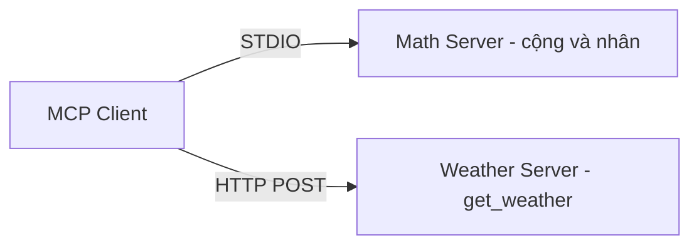

# 🧮 Hai MCP Server Đầu Tiên: Toán Học qua STDIO và Thời Tiết qua SSE

> Nguồn: `132-Servers.txt` · [Udemy](https://ua.udemy.com/course/langchain/learn/lecture/52632155)

Chào các bạn, mình là Eden đây! 👋 Trước khi viết MCP client, chúng ta cần có "đối tác" để nó kết nối tới — nên trong bài này, chúng ta sẽ **viết trước hai MCP server thật đơn giản**. Có server trong tay rồi thì việc thử nghiệm client ở các bài sau sẽ trực quan hơn rất nhiều.

---

### 🧮 Server toán học: cộng và nhân qua STDIO

Mình tạo một package mới tên là **`servers`** (kèm file `__init__.py` rỗng để Python nhận diện đây là package), rồi thêm file **`math_server.py`** — nơi hiện thực một MCP server phơi ra **hai tool**:

1. **Cộng hai số**.
2. **Nhân hai số**.

Ở server này, **transport layer (tầng vận chuyển) là STDIO** — nghĩa là client và server "nói chuyện" trực tiếp qua luồng nhập/xuất chuẩn.

Một câu chuyện nhỏ mình muốn chia sẻ: ban đầu mình đặt tên file là `math.py`, và **nó xung đột với package `math` có sẵn của Python**. Mình loay hoay khá lâu mới tìm ra nguyên nhân, cho tới khi... quăng lỗi vào Cursor thì nó chỉ ra ngay. TLDR: **hãy đặt tên là `math_server.py`**. Bài học ở đây là: đôi khi một cái tên file "vô hại" cũng đủ làm bạn mất cả buổi.

Phần hiện thực mình copy từ repo **LangChain adapters** — vì đây là kiểu MCP server rất đơn giản và chúng ta đã làm những việc tương tự trước đó. Chạy thử bằng **`uv run servers/math_server.py`**, thấy ô vuông nhấp nháy trong terminal là server đã chạy thành công.

---

### ☀️ Server thời tiết: "nóng như thiêu" qua SSE

Server thứ hai là một phiên bản **cực kỳ đơn giản hóa** của server thời tiết: nó luôn trả về đúng một câu — trời nóng "như thiêu". *Có lẽ server này chỉ hữu dụng... ở Dubai thôi!* 😄

Điểm thú vị nằm ở **transport**: thay vì STDIO, server này giao tiếp qua **SSE (Server-Sent Events)** — đây là lần đầu chúng ta làm điều này, nhưng mình bật mí luôn: **nó cực kỳ dễ**.

Cụ thể, với **SSE MCP server**:

* Giao tiếp giữa client và server diễn ra qua **HTTP**, không phải STDIO.
* Client sẽ gửi **HTTP POST request** đến server.
* Chúng ta **không cần tự xử lý** phần giao tiếp này — **MCP SDK** lo hết "out of the box".
* Điều duy nhất cần làm là **truyền một flag chỉ định transport là SSE** khi chạy server.

Hai server trong bài dùng hai kênh giao tiếp khác nhau:



| Tiêu chí | STDIO | SSE |
|---|---|---|
| Kênh giao tiếp | Luồng nhập/xuất chuẩn | HTTP |
| Cách client gửi yêu cầu | Chạy server như tiến trình con | HTTP POST request |
| Ai xử lý giao tiếp | MCP SDK lo out of the box | MCP SDK lo out of the box |
| Ví dụ trong bài | `math_server.py` | `weather_server.py` |
| Cổng chạy | Không cần | localhost port 8000 |

Cách tạo cũng rất nhanh: mình lấy **dummy server** có sẵn trong repo mã nguồn mở của **LangChain MCP**, nó phơi tool **`get_weather`** và luôn trả về một chuỗi tĩnh. Mình chỉ đổi nội dung chuỗi cho vui thôi. File được đặt tên là **`weather_server.py`**.

Chạy thử bằng **`uv run servers/weather_server.py`**, bạn sẽ thấy server chạy ở **localhost port 8000**. Muốn đổi sang port khác thì hoàn toàn được — chỉ cần chỉ định qua **MCP SDK**.

---

### 📤 Lưu lại thành quả

Xong hai server rồi, mình commit phần thay đổi (chỉ có thư mục `servers` là mới) và push lên repository. Lại là tính năng sinh commit message tự động của Cursor giúp mình một tay. Giờ trên repo đã có **hai commit**: một từ bài trước và một từ bài này.

---

### 💻 Code mẫu đầy đủ — `math_server.py` và `weather_server.py`

Toàn bộ code của bài nằm trong hai file `servers/math_server.py` và `servers/weather_server.py` (tham khảo từ repo chính thức của khóa học):

**`math_server.py`**

```python
# math_server.py
from mcp.server.fastmcp import FastMCP

mcp = FastMCP("Math")


@mcp.tool()
def add(a: int, b: int) -> int:
    """Add two numbers"""
    return a + b


@mcp.tool()
def multiply(a: int, b: int) -> int:
    """Multiply two numbers"""
    return a * b


if __name__ == "__main__":
    mcp.run(transport="stdio")
```

**`weather_server.py`**

```python
from typing import List

from mcp.server.fastmcp import FastMCP

mcp = FastMCP("Weather")


@mcp.tool()
async def get_weather(location: str) -> str:
    """Get weather for location."""
    print("This is a log from the SSE Server")
    return "Hot as hell"


if __name__ == "__main__":
    mcp.run(transport="sse")
```

### 🎯 Tự kiểm tra nhanh

**Câu 1:** Hai MCP server trong bài phơi ra tool gì?

<details>
<summary><b>Xem đáp án</b></summary>

**Đáp án:** Math server phơi tool cộng và nhân hai số; weather server phơi tool `get_weather` luôn trả về một chuỗi tĩnh.

Giải thích: Cả hai đều là server rất đơn giản để phục vụ việc thử client.

Tham chiếu: Hai mục đầu bài.

</details>

**Câu 2:** Vì sao không nên đặt tên file là `math.py`?

<details>
<summary><b>Xem đáp án</b></summary>

**Đáp án:** Vì nó xung đột với package `math` có sẵn của Python.

Giải thích: Eden loay hoay khá lâu mới tìm ra; TLDR hãy đặt là `math_server.py`.

Tham chiếu: Mục Server toán học.

</details>

**Câu 3:** SSE server giao tiếp với client qua kênh nào?

<details>
<summary><b>Xem đáp án</b></summary>

**Đáp án:** Qua HTTP — client gửi HTTP POST request đến server, khác với STDIO.

Giải thích: Transport của server thời tiết là SSE.

Tham chiếu: Mục Server thời tiết.

</details>

**Câu 4:** Ai xử lý phần giao tiếp của SSE MCP server?

<details>
<summary><b>Xem đáp án</b></summary>

**Đáp án:** MCP SDK xử lý out of the box; ta chỉ cần truyền một flag chỉ định transport SSE khi chạy server.

Giải thích: Không cần tự xử lý giao tiếp HTTP.

Tham chiếu: Mục Server thời tiết.

</details>

**Câu 5:** Weather server chạy ở đâu và có đổi cổng được không?

<details>
<summary><b>Xem đáp án</b></summary>

**Đáp án:** Chạy ở localhost port 8000; đổi cổng được bằng cách chỉ định qua MCP SDK.

Giải thích: Chỉ cần thêm tham số khi chạy server.

Tham chiếu: Mục Server thời tiết.

</details>

Ở bài tiếp theo, chúng ta sẽ **đào sâu vào SSE MCP server** và quan trọng hơn là bắt đầu **tích hợp nó với LangChain MCP client đa server**. Nghe hấp dẫn rồi đấy chứ? Hẹn gặp lại các bạn! 🚀

## Nguồn tham khảo

- [Udemy — Servers](https://ua.udemy.com/course/langchain/learn/lecture/52632155)
- [MCP Specification — Transports](https://modelcontextprotocol.io/specification/2024-11-05/basic/transports)
- [FastMCP — The FastMCP Server](https://gofastmcp.com/servers/server)
- [LangChain MCP Adapters — GitHub](https://github.com/langchain-ai/langchain-mcp-adapters)
