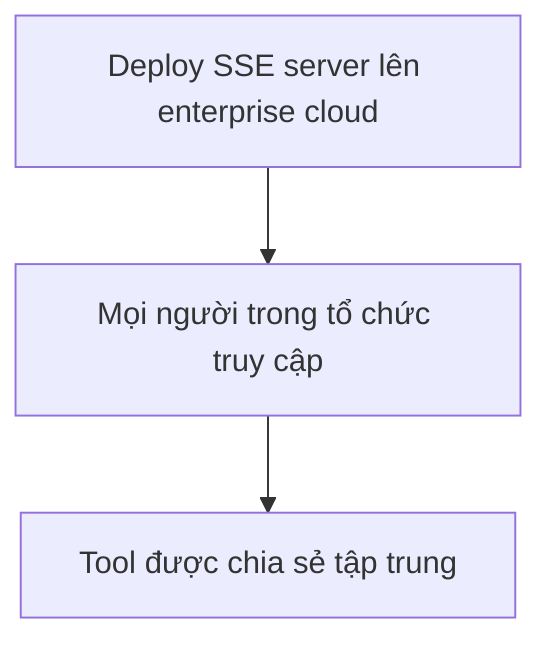

# 🔍 SSE MCP Server: Từ Máy Cá Nhân đến Cloud Doanh Nghiệp

> Nguồn: `133-What-are-we-MCBuilding.txt` · [Udemy](https://ua.udemy.com/course/langchain/learn/lecture/49665623)

Chào các bạn, mình là Eden đây! 👋 Sau khi đã viết xong server thời tiết với transport SSE ở bài trước, bài này chúng ta sẽ **đào sâu hơn vào loại server này** và chuẩn bị tích hợp nó với client mà LangChain đã viết sẵn.

Đây là một video mang tính "định hướng" — các bạn sẽ hiểu vì sao SSE server lại quan trọng trong thực tế, trước khi chúng ta lao vào code.

---

### 🎯 Mục tiêu: Kết nối SSE server với LangChain MCP Client

Ở các video trước, chúng ta đã hiện thực **weather MCP server** với transport là **SSE**. Bây giờ là lúc **tích hợp nó với LangChain multi-MCP server client** — chiếc client mà đội ngũ LangChain đã viết sẵn cho chúng ta.

Điểm "ăn tiền" của client này là nó có thể **kết nối tới nhiều MCP server cùng một lúc**. Thay vì phải tự tay dựng từng client cho từng server, chúng ta có một đầu mối duy nhất quản lý tất cả. *Nghe thì đơn giản, nhưng đây chính là bước giúp ứng dụng của bạn mở rộng quy mô dễ dàng hơn rất nhiều.*

---

### ☁️ Sức mạnh thật sự của SSE: Triển khai ở mọi nơi

Điều hay ho của **SSE servers** là chúng ta có thể **deploy chúng ở bất cứ đâu**. Và mô hình sử dụng phổ biến nhất là **triển khai trên cloud**.

Nếu nâng lên tầm **doanh nghiệp (enterprise)**, câu chuyện còn thú vị hơn:

* Chúng ta deploy server trong **enterprise cloud** của công ty.
* **Mọi người trong tổ chức** đều có thể gọi tới nó.
* Các tool được chia sẻ tập trung, không cần mỗi người dựng một bản riêng.

Mô hình triển khai phổ biến diễn ra như sau:

Đây chính là lý do SSE server trở thành "công dân hạng nhất" trong các kiến trúc MCP thực tế.

---

### 🔐 Còn thiếu gì? Authentication và Authorization

Mình phải thú thật: mình **chưa nói về authentication (xác thực) và authorization (phân quyền)**. Nhưng khi đã deploy lên cloud, chúng ta **không thể cho tất cả mọi người truy cập** một cách tùy tiện.

Điều mình mong muốn là:

* **Giới hạn truy cập** cho những người dùng đã đăng nhập.
* Có **role-based access control (kiểm soát truy cập theo vai trò)** — để kiểm soát ai được dùng tool nào, và ai thì không.

| Khái niệm | Vai trò | Trạng thái trong MCP |
|---|---|---|
| Authentication (xác thực) | Giới hạn truy cập cho người dùng đã đăng nhập | Chưa được hiện thực đầy đủ |
| Authorization (phân quyền) | Role-based access control, ai được dùng tool nào | Chưa được hiện thực đầy đủ |

Hiện tại, phần này **chưa được hiện thực đầy đủ trong giao thức MCP**. Nhưng mình hứa: khi nó được bổ sung, mình sẽ là người đầu tiên đưa nó vào khóa học này để các bạn cập nhật kịp thời.

### 🎯 Tự kiểm tra nhanh

**Câu 1:** Điểm hay ho nhất của SSE server là gì?

<b>Xem đáp án</b>

**Đáp án:** Có thể deploy ở bất cứ đâu, và mô hình dùng phổ biến nhất là triển khai trên cloud.

Giải thích: Đây là lý do SSE server quan trọng trong thực tế.

Tham chiếu: Mục Sức mạnh thật sự của SSE.

**Câu 2:** Ở tầm doanh nghiệp, SSE server được triển khai thế nào?

<b>Xem đáp án</b>

**Đáp án:** Deploy trong enterprise cloud của công ty để mọi người trong tổ chức gọi tới, tool được chia sẻ tập trung.

Giải thích: Không cần mỗi người dựng một bản riêng.

Tham chiếu: Mục Sức mạnh thật sự của SSE.

**Câu 3:** Authentication giải quyết vấn đề gì khi deploy lên cloud?

<b>Xem đáp án</b>

**Đáp án:** Giới hạn truy cập cho những người dùng đã đăng nhập.

Giải thích: Không thể cho tất cả mọi người truy cập tùy tiện.

Tham chiếu: Mục Authentication và Authorization.

**Câu 4:** Role-based access control dùng để làm gì?

<b>Xem đáp án</b>

**Đáp án:** Kiểm soát ai được dùng tool nào và ai thì không.

Giải thích: Đây là phần authorization (phân quyền).

Tham chiếu: Mục Authentication và Authorization.

**Câu 5:** Authentication và authorization đã được hiện thực đầy đủ trong MCP chưa?

<b>Xem đáp án</b>

**Đáp án:** Chưa — Eden hứa sẽ đưa vào khóa học ngay khi giao thức MCP bổ sung.

Giải thích: Đây là phần còn thiếu khi triển khai lên cloud.

Tham chiếu: Mục Authentication và Authorization.

---

Tạm gác chuyện bảo mật sang một bên, ngay bài tiếp theo chúng ta sẽ **viết MCP client mới** kết nối cả SSE server lẫn STDIO server chỉ trong một file duy nhất. Nghe rất đáng mong chờ đúng không? Hẹn gặp lại các bạn! 🚀

## Nguồn tham khảo

- [Udemy — What are we MCBuilding?](https://ua.udemy.com/course/langchain/learn/lecture/49665623)
- [MCP Specification — Transports](https://modelcontextprotocol.io/specification/2024-11-05/basic/transports)
