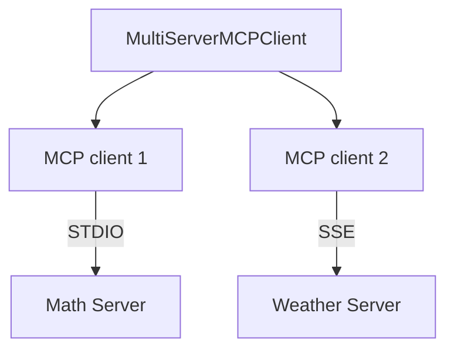

# 🔌 MCP Client Đa Server: Một Client Kết Nối Cả Thế Giới Công Cụ

> Nguồn: `134-Simple-MCP-Server.txt` · [Udemy](https://ua.udemy.com/course/langchain/learn/lecture/49665621)

Chào các bạn, mình là Eden đây! 👋 Sau khi đã có hai MCP server "cây nhà lá vườn" — một chạy qua STDIO và một chạy qua SSE — giờ là lúc viết **client để kết nối tới cả hai cùng lúc**. Đây là bài chúng ta chạm tay vào code thật sự.

---

### ▶️ Bước 1: Khởi động hai server

Đầu tiên, mình chạy server SSE quen thuộc:

* Chạy **`uv run servers/weather_server.py`** → server lắng nghe ở **port 8000**.

Sau đó mở thêm một terminal mới và chạy server STDIO:

* Chạy **`uv run servers/math_server.py`** với các phép toán → server cũng đang chạy.

Có cả hai server "sống" cùng lúc, chúng ta đã sẵn sàng cho phần chính.

---

### 🧩 LangChain MultiServerMCPClient: Trừu tượng hóa thông minh

Mình tạo file mới tên là **`langchain_client.py`** — cái tên đã nói lên tất cả: chúng ta sẽ hiện thực một **LangChain multi-server client**.

Trước đây mình từng nói rằng **giữa client và MCP server là quan hệ một-một (one-to-one)**. Điều đó **vẫn đúng** — nhưng LangChain đã **trừu tượng hóa** giúp chúng ta: bên trong client đa server này sẽ có **nhiều MCP client riêng lẻ**.

Nhờ đó, chúng ta có thể:

* Kết nối tới **nhiều MCP server một cách dễ dàng**.
* **Không cần tự viết client riêng** cho từng server.
* Quản lý mọi kết nối từ một chỗ duy nhất.

Bên trong `MultiServerMCPClient` là các MCP client riêng lẻ, mỗi client phụ trách một server:



| Tiêu chí | MCP client đơn | MultiServerMCPClient |
|---|---|---|
| Quan hệ với server | Một-một | Một-nhiều |
| Client bên trong | Một | Nhiều client riêng lẻ |
| Viết code cho từng server | Phải viết | Không cần |
| Quản lý kết nối | Từng client riêng | Một đầu mối duy nhất |

Đây là client mới do **LangChain viết sẵn**, giúp việc tích hợp MCP vào ứng dụng LangChain trở nên gọn gàng hơn hẳn.

---

### 💻 Bước 2: Viết code khởi tạo client

Đây là những gì mình import cho file client mới:

```python
from langchain_mcp_adapters.client import MultiServerMCPClient
from langgraph.prebuilt import create_react_agent
from langchain_openai import ChatOpenAI
from dotenv import load_dotenv
```

Ngoài ra, mình khởi tạo **LLM** và dùng **`load_dotenv`** như ở các bài trước. Sau đó là một sanity check nhỏ: định nghĩa hàm **`async def main()`** chỉ in ra dòng `"hello langchain mcp"`, và chạy nó bằng **`asyncio`**.

```python
async def main():
    print("hello langchain mcp")
```

Chạy **`uv run langchain_client.py`** — mọi thứ hoạt động đúng như mong đợi. Bộ khung client đã sẵn sàng!

*Các bạn đừng lo nếu file mới chỉ mới "hello" mà chưa làm gì — đây chính là cách mình xây dựng từng bước để mỗi thay đổi đều dễ kiểm soát và dễ gỡ lỗi.*

*(À, nhớ import `asyncio` nếu bạn không muốn quên như mình nhé!)*

---

### 🎯 Tự kiểm tra nhanh

**Câu 1:** Vì sao phải khởi động cả hai server trước khi viết client?

<details>
<summary><b>Xem đáp án</b></summary>

**Đáp án:** Vì client cần server "sống" để kết nối: weather server qua SSE ở port 8000 và math server qua STDIO.

Giải thích: Hai server chạy ở hai terminal khác nhau.

Tham chiếu: Mục Bước 1.

</details>

**Câu 2:** Quan hệ client-server trong MCP vốn là gì, và LangChain trừu tượng hóa ra sao?

<details>
<summary><b>Xem đáp án</b></summary>

**Đáp án:** Vốn là một-một; `MultiServerMCPClient` bọc bên trong nhiều MCP client riêng lẻ để kết nối nhiều server.

Giải thích: Nhờ đó không cần tự viết client cho từng server.

Tham chiếu: Mục LangChain MultiServerMCPClient.

</details>

**Câu 3:** Import nào dùng để tạo client đa server?

<details>
<summary><b>Xem đáp án</b></summary>

**Đáp án:** `MultiServerMCPClient` từ `langchain_mcp_adapters.client`.

Giải thích: Ngoài ra còn import `create_react_agent`, `ChatOpenAI` và `load_dotenv`.

Tham chiếu: Mục Bước 2.

</details>

**Câu 4:** Vì sao mình viết sanity check "hello langchain mcp" trước?

<details>
<summary><b>Xem đáp án</b></summary>

**Đáp án:** Để xây dựng từng bước, mỗi thay đổi đều dễ kiểm soát và dễ gỡ lỗi.

Giải thích: Bộ khung chạy ổn rồi mới nối vào server.

Tham chiếu: Mục Bước 2.

</details>

**Câu 5:** File client mới được đặt tên là gì?

<details>
<summary><b>Xem đáp án</b></summary>

**Đáp án:** `langchain_client.py` — cái tên nói lên việc hiện thực LangChain multi-server client.

Giải thích: File mới nằm cùng thư mục dự án.

Tham chiếu: Mục LangChain MultiServerMCPClient.

</details>

Vậy là chúng ta đã có bộ khung client với **`MultiServerMCPClient`** — thứ sẽ giúp kết nối tới nhiều server cùng lúc. Ở bài tiếp theo, chúng ta sẽ **nối client này với hai server đang chạy** và để LLM thực sự gọi tool qua MCP. Hẹn gặp lại các bạn! 🚀

## Nguồn tham khảo

- [Udemy — Simple MCP Server](https://ua.udemy.com/course/langchain/learn/lecture/49665621)
- [LangChain Reference — MultiServerMCPClient](https://reference.langchain.com/python/langchain-mcp-adapters/client/MultiServerMCPClient)
- [LangChain MCP Adapters — GitHub](https://github.com/langchain-ai/langchain-mcp-adapters)
