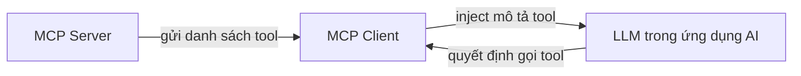

# 🌉 LangChain MCP Adapter: Cầu Nối Giữa Hai Thế Giới Tool

> Nguồn: `135-Bridging-the-Gap-The-LangChain-MCP-Adapter-Explained.txt` · [Udemy](https://ua.udemy.com/course/langchain/learn/lecture/49563259)

Chào các bạn, mình là Eden đây! 👋 Trước khi lao vào code client ở bài sau, chúng ta dành một chút thời gian để hiểu **bản chất**: `tool` trong LangChain và trong MCP giống và khác nhau thế nào, và **LangChain MCP adapter** giải quyết vấn đề gì. Nắm chắc phần này rồi, code sẽ trở nên "dễ thở" hơn rất nhiều.

---

### 🧰 Điểm chung: "Tool" là gì trong cả hai hệ sinh thái?

Cả **LangChain** lẫn **MCP** đều có chung một khái niệm: **tools (công cụ)**.

Vậy tool chính xác là gì?

* Là những **hàm (functions) được viết bên ngoài** hệ thống AI và mô hình LLM.
* Được viết bởi **lập trình viên**, không phải do model tự sinh ra.
* Có **tham số đầu vào (arguments)** và **giá trị trả về (return values)** — ví dụ hàm `multiply` nhận các số rồi trả về tích.

Khi định nghĩa tool — dù trong MCP hay LangChain — chúng ta đều phải chỉ rõ **ba điều**:

1. Hàm nhận những **tham số** gì.
2. **Khi nào nên gọi** hàm này — thông tin này nằm trong phần **description (mô tả)** của hàm.
3. Hàm **trả về** cái gì.

Và này, **description cực kỳ quan trọng**. Lý do là vì nó sẽ được **truyền tới LLM** — thông qua **`bind_tools`** của LangChain hoặc qua **MCP client** — để giúp model quyết định nên gọi tool nào.

Điểm tương đồng thứ hai: trong **LangChain** có khái niệm **toolkit** — một tập hợp các tool dựng sẵn. Còn trong **MCP** có khái niệm **MCP server** — cũng là một tập hợp các tool. Hai khái niệm nhìn rất giống nhau, đúng không?

Tóm gọn lại: dù là **MCP** hay **`bind_tools` của LangChain**, bản chất đều là **bơm vào prompt của LLM** mô tả của tool, thời điểm gọi, tham số nhận vào và đầu ra — nói cách khác, đó là **giao diện để mô hình AI tương tác với các tool bên ngoài**.

---

### 🔍 Điểm khác biệt: Phạm vi và đối tượng

Đây mới là phần thú vị. **MCP lấy ý tưởng này và khái quát hóa nó lên một tầm cao mới.**

**Khác biệt thứ nhất — phạm vi tiếp xúc:** MCP không chỉ phơi ra **tools**, mà còn có thể phơi ra **resources (tài nguyên)**. Chúng ta đã thảo luận trước đó rồi, resources có thể là:

* Tài liệu (documents), file PDF, hình ảnh.
* Các lệnh gọi API.
* Và MCP còn có thể phơi cả **prompts**.

**Khác biệt thứ hai — đối tượng được "bind":** Với LangChain, khi dùng **`bind_tools`**, chúng ta bind tool **trực tiếp vào LLM**. Còn với MCP, chúng ta bind mọi thứ vào **ứng dụng AI** — ví dụ **Cursor, Windsurf, Claude**.

Các ứng dụng này bên dưới cũng có một LLM, nhưng chúng ta **không inject trực tiếp** mô tả tool vào model. Thay vào đó, có **vài lớp trừu tượng ở giữa**:

1. **MCP server** giao tiếp danh sách tool cho **MCP client**.
2. **MCP client** mới là thứ inject vào LLM trong ứng dụng những chỉ dẫn về các tool cần gọi.

Luồng đi của thông tin tool trong kiến trúc MCP:

Sự "trung gian hóa" này khiến kiến trúc MCP linh hoạt hơn, đổi lại là nhiều lớp hơn.

| Tiêu chí | LangChain bind_tools | MCP |
|---|---|---|
| Đối tượng được bind | LLM | Ứng dụng AI như Cursor, Windsurf, Claude |
| Phơi ra những gì | Tools | Tools, resources và prompts |
| Số lớp trung gian | Ít, bind trực tiếp vào model | Server và client ở giữa |
| Khái niệm tập hợp tool | Toolkit | MCP server |

---

### 🌉 LangChain MCP Adapter: Cầu nối chính thức

Sau khi đã hiểu điểm chung và khác biệt, hãy nói về **LangChain MCP adapter**.

Đây là một **dự án mã nguồn mở (open-source)** do **đội ngũ LangChain phát hành**, mang lại giá trị rất lớn nhờ khả năng **tích hợp liền mạch MCP tools với LangChain và LangGraph**.

**Giá trị cốt lõi** nằm ở **tool compatibility (tương thích công cụ)**:

* **Chuyển đổi MCP tools** thành tool tương thích với **agent của LangChain và LangGraph**.
* Nhờ đó, lập trình viên có thể **tận dụng các MCP server có sẵn** do người khác viết mà **không cần chỉnh sửa thủ công**.
* Gói này còn **cung cấp sẵn MCP client** cho phép kết nối tới **nhiều MCP server**, qua đó phơi ra toàn bộ tool của chúng.

Ở video tiếp theo, chúng ta sẽ cùng **demo và sử dụng chính MCP client mà LangChain đã viết** cho chúng ta. *Nếu phần lý thuyết này còn hơi "chữ nghĩa", cứ yên tâm — vài dòng code ở bài sau sẽ làm mọi thứ sáng tỏ!*

---

### 🎯 Tự kiểm tra nhanh

**Câu 1:** Tool trong cả LangChain và MCP được định nghĩa là gì?

<b>Xem đáp án</b>

**Đáp án:** Là những hàm viết bên ngoài hệ thống AI và LLM, do lập trình viên viết, có tham số đầu vào và giá trị trả về.

Giải thích: Ví dụ hàm `multiply` nhận các số rồi trả về tích.

Tham chiếu: Mục Điểm chung.

**Câu 2:** Khi định nghĩa tool, ta phải chỉ rõ ba điều gì?

<b>Xem đáp án</b>

**Đáp án:** Hàm nhận tham số gì, khi nào nên gọi hàm, và hàm trả về cái gì.

Giải thích: "Khi nào nên gọi" nằm trong description của hàm.

Tham chiếu: Mục Điểm chung.

**Câu 3:** Vì sao description của tool cực kỳ quan trọng?

<b>Xem đáp án</b>

**Đáp án:** Vì nó được truyền tới LLM qua `bind_tools` hoặc MCP client, giúp model quyết định nên gọi tool nào.

Giải thích: Description chính là giao diện để model tương tác với tool.

Tham chiếu: Mục Điểm chung.

**Câu 4:** Toolkit của LangChain tương ứng với khái niệm nào bên MCP?

<b>Xem đáp án</b>

**Đáp án:** MCP server — cả hai đều là tập hợp các tool.

Giải thích: Đây là điểm tương đồng thứ hai giữa hai hệ sinh thái.

Tham chiếu: Mục Điểm chung.

**Câu 5:** Khác biệt lớn nhất giữa hai bên nằm ở đối tượng được bind — cụ thể là gì?

<b>Xem đáp án</b>

**Đáp án:** LangChain bind tool trực tiếp vào LLM; MCP bind vào ứng dụng AI như Cursor, Windsurf, Claude với vài lớp trừu tượng ở giữa.

Giải thích: MCP server gửi danh sách tool cho MCP client, client mới inject vào LLM của ứng dụng.

Tham chiếu: Mục Điểm khác biệt.

---

Nắm được bức tranh toàn cảnh này rồi, các bạn sẽ thấy LangChain MCP adapter không chỉ là một thư viện tiện dụng, mà là **cây cầu nối hai hệ sinh thái tool mạnh mẽ nhất hiện nay**. Hãy sẵn sàng cho bài tiếp theo — nơi chúng ta đưa cây cầu này vào vận hành thực tế! 🚀

## Nguồn tham khảo

- [Udemy — Bridging the Gap: The LangChain MCP Adapter Explained](https://ua.udemy.com/course/langchain/learn/lecture/49563259)
- [LangChain MCP Adapters — GitHub](https://github.com/langchain-ai/langchain-mcp-adapters)
- [Docs by LangChain — Model Context Protocol](https://docs.langchain.com/oss/python/langchain/mcp)
