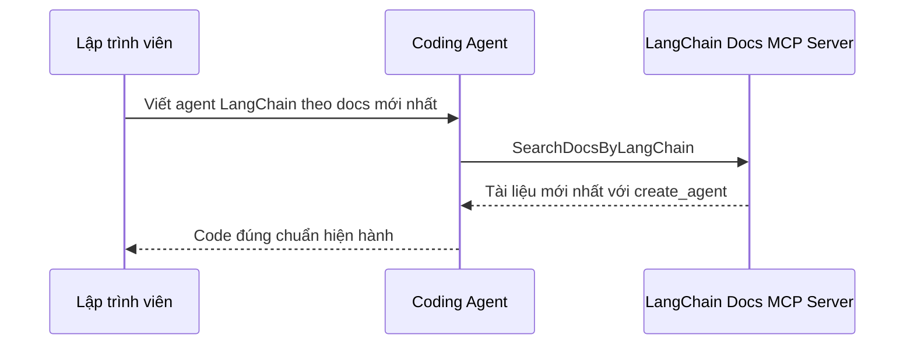

# ⚠️ Đừng Để AI Viết Code "Cũ": LangChain Official MCP Server Cứu Bạn

> Nguồn: `139-New-Important-Stop-Writing-Deprecated-Code-LangChains-Offici.txt` · [Udemy](https://ua.udemy.com/course/langchain/learn/lecture/54083603)

Chào các bạn, mình là Eden đây! 👋 Hôm nay mình muốn chỉ cho các bạn một công cụ **cực kỳ hữu dụng** khi phát triển agent trong hệ sinh thái LangChain — đặc biệt với những ai đang dùng **AI coding editor** để viết code.

Nếu bạn đang dùng **Cursor**, **Claude Code** hay bất kỳ trình soạn thảo AI nào, tin mình đi: hiểu được vấn đề và giải pháp dưới đây sẽ giúp bạn tiết kiệm rất nhiều thời gian.

---

### ⚠️ Vấn đề: Framework thay đổi, nhưng LLM thì "đóng băng"

Các AI coding editor rất tuyệt, nhưng chúng có một nhược điểm khó chịu với những framework **thay đổi liên tục** như **LangChain**.

Vấn đề nằm ở chỗ:

* **LangChain rất năng động** — API liên tục thay đổi, có cái bị **deprecated (ngừng khuyến nghị)**.
* **LLM được huấn luyện tại một thời điểm cố định**, trên phiên bản LangChain đã tồn tại khi dữ liệu huấn luyện được thu thập.
* Chỉ sau vài tháng, hệ sinh thái LangChain có thể **thay đổi chóng mặt**.

Kết quả là khi bạn nhờ coding agent kiểu *"viết cho tôi một agent LangChain làm việc X"*, bạn có thể nhận về **câu trả lời "rác"** — dựa trên phiên bản LangChain cũ, không còn đúng nữa. Mình hiểu rõ nỗi khổ này vì mình cũng phải **cập nhật khóa học liên tục** — theo kịp tốc độ thay đổi quả thật rất khó. *Và đây không chỉ là câu chuyện của LangChain, mà của gần như mọi thứ trong ngành AI.*

---

### 🛡️ Giải pháp: LangChain Docs MCP Server

Đội ngũ LangChain **rất ý thức được vấn đề này**. Trong tài liệu của họ, có một nút rất đáng giá: **Copy page**.

* **Click một cái** là bạn sao chép được toàn bộ trang tài liệu để đem dán vào một LLM trong ứng dụng chat bất kỳ.
* Bên cạnh đó còn có tùy chọn **Copy MCP Server**.

Nếu bạn chọn **Copy MCP Server** (ví dụ trong **Cursor**), điều này sẽ **thêm LangChain docs vào như một MCP server**:

* Đây là một **streamable HTTP server**, trỏ tới **LangChain Docs MCP**.
* Đây là **MCP server công khai** do LangChain tạo — **không cần API key**, không cần gì cả, bạn chỉ việc truy vấn và nhận về tài liệu **mới nhất**.
* Sau khi cài, bạn sẽ thấy nó có **một tool duy nhất** tên là **`SearchDocsByLangChain`**.

Luồng hoạt động khi coding agent viết code LangChain mới:

Tool này nhận đầu vào là một **query** và tự mô tả mình như sau: *tìm kiếm trên toàn bộ knowledge base tài liệu của LangChain để tìm thông tin liên quan, ví dụ code, tham chiếu API và hướng dẫn; dùng khi bạn cần trả lời câu hỏi về Docs By LangChain, tìm tài liệu cụ thể, hiểu cách một tính năng hoạt động, hoặc xác định chi tiết triển khai; kết quả trả về nội dung theo ngữ cảnh kèm tiêu đề và liên kết trực tiếp tới trang tài liệu.*

Một điểm cần lưu ý: trong demo, mình **tắt `context7` đi** — vì `context7` làm điều tương tự nhưng cho **rất nhiều thư viện** khác nhau. Sự khác biệt là **`DocsByLangChain` được thiết kế riêng cho LangChain và hệ sinh thái LangChain**, còn `context7` thì tổng quát hơn. Nếu bạn viết code LangChain bằng coding editor, mình khuyên dùng MCP server này.

| Tiêu chí | DocsByLangChain | context7 |
|---|---|---|
| Phạm vi tài liệu | Riêng LangChain và hệ sinh thái | Nhiều thư viện khác nhau |
| Tool | Một tool `SearchDocsByLangChain` | Bộ tool tìm kiếm tài liệu riêng |
| Cách dùng của Eden | Bật và dùng | Tắt trong demo |

---

### 🔬 Thử nghiệm: Có MCP server và không có MCP server

Đây là phần "mở mang tầm mắt" nhất. Mình thử hỏi agent:

1. **Khi có MCP server:** câu hỏi *"How do I write a LangChain agent according to the latest docs?"* → agent gọi **`SearchDocsByLangChain`**, tự viết lại câu hỏi thành *latest LangChain Python agent creation*, và nhận về câu trả lời chính thức: **dùng hàm `create_agent`**.
2. **Khi tắt hết MCP** (mình cũng tắt luôn **tavily MCP** — thứ có các tool search, extract, crawl) và mở một chat mới với đúng câu hỏi đó: agent chuyển sang dùng **tool tìm kiếm mặc định của Cursor**.

Kết quả thật đáng suy ngẫm:

* Nó tìm thấy **`initialize_agent`** — agent đầu tiên từng được tạo ra, đã **bị deprecated từ rất lâu**.
* Nó **loanh quanh tìm kiếm rất lâu**.
* Và cuối cùng trả về **`create_react_agent`** — cũng đã deprecated.

Nói cách khác: **không có LangChain MCP server, code mà Cursor viết cho bạn có thể là code sai và đã lỗi thời.** Việc LangChain chịu khó hiện thực một **remote MCP server** như vậy để giúp cuộc sống của những người dùng coding agent dễ thở hơn — theo mình là cực kỳ ấn tượng.

Một chi tiết đáng nể nữa: **LangChain là một trong những công ty đầu tiên đưa toàn bộ website tài liệu lên `llms.txt`** (chúng ta đã bàn trong khóa học). Ngoài ra còn có các tích hợp khác như **VS Code MCP** hay dùng với **Claude**.

---

### 💬 Bonus: Chat với trợ lý tài liệu LangChain

Còn một thứ "cool" hơn nữa: truy cập **chat.langchain.com** — nơi bạn có thể **trò chuyện với trợ lý tài liệu chính thức của LangChain**.

Mình dán đúng câu hỏi lúc nãy vào, và nhận được **câu trả lời chính xác với `create_agent`**. Để kiểm chứng, mình bấm **view trace** — và quả nhiên, nó cũng dùng **`SearchDocsByLangChain`**! Nghĩa là **chính MCP server này đang vận hành Chat LangChain chính thức**. Nhìn vào trace của toàn bộ lượt chạy, bạn sẽ thấy:

* Tool được gọi **hai lần**: lần đầu tìm về **agents**, lần sau tìm về **OSS troubleshooting**.
* Trong đó có một lượt tìm cho **`create_agent`**.

Được tận mắt thấy **MCP, LangChain và coding agent** kết nối với nhau như vậy thật sự rất thú vị.

### 🎯 Tự kiểm tra nhanh

**Câu 1:** Vì sao coding agent có thể viết code LangChain lỗi thời?

<b>Xem đáp án</b>

**Đáp án:** Vì LLM được huấn luyện tại một thời điểm cố định, còn LangChain thay đổi liên tục với API mới và deprecated.

Giải thích: Chỉ sau vài tháng, hệ sinh thái có thể thay đổi chóng mặt.

Tham chiếu: Mục Vấn đề.

**Câu 2:** LangChain Docs MCP Server là loại server gì và có cần API key không?

<b>Xem đáp án</b>

**Đáp án:** Là streamable HTTP server trỏ tới LangChain Docs MCP, công khai và không cần API key.

Giải thích: Bạn chỉ việc truy vấn và nhận tài liệu mới nhất.

Tham chiếu: Mục Giải pháp.

**Câu 3:** Tool duy nhất của server này tên là gì?

<b>Xem đáp án</b>

**Đáp án:** `SearchDocsByLangChain`.

Giải thích: Tool nhận đầu vào là một query và trả về nội dung kèm tiêu đề, liên kết tới trang tài liệu.

Tham chiếu: Mục Giải pháp.

**Câu 4:** Khi tắt hết MCP, Cursor trả về những gì cho câu hỏi về agent?

<b>Xem đáp án</b>

**Đáp án:** `initialize_agent` — deprecated từ rất lâu, rồi loanh quanh tìm kiếm và cuối cùng trả về `create_react_agent` — cũng đã deprecated.

Giải thích: Đây là minh chứng cho việc thiếu MCP server thì code dễ sai và lỗi thời.

Tham chiếu: Mục Thử nghiệm.

**Câu 5:** Chat LangChain chính thức dùng gì để trả lời?

<b>Xem đáp án</b>

**Đáp án:** Chính `SearchDocsByLangChain` — gọi hai lần: tìm về agents và OSS troubleshooting.

Giải thích: Xem trace sẽ thấy rõ các lượt gọi tool, có một lượt tìm cho `create_agent`.

Tham chiếu: Mục Bonus.

Vậy nên, lời nhắn cuối cùng của mình dành cho các bạn: **nếu bạn dùng coding agent, hãy dùng LangChain MCP server!** Vài phút cài đặt hôm nay sẽ tiết kiệm cho bạn hàng giờ sửa code lỗi thời về sau. Hẹn gặp lại các bạn ở bài tiếp theo! 🚀

## Nguồn tham khảo

- [Udemy — Stop Writing Deprecated Code: LangChain's Official MCP Server](https://ua.udemy.com/course/langchain/learn/lecture/54083603)
- [Docs by LangChain — Use docs programmatically](https://docs.langchain.com/use-these-docs)
- [LangChain Docs MCP Server](https://docs.langchain.com/mcp)
