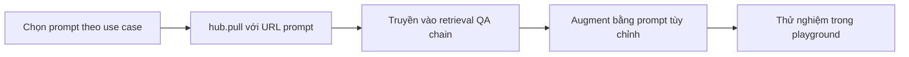

# 🗂️ LangChain Hub: Kho Prompt Cộng Đồng Cho Mọi Use Case

> Nguồn: `140-LangChain-Hub---Downloads-prompt-from-the-community.txt` · [Udemy](https://ua.udemy.com/course/langchain/learn/lecture/40338354)

Chào các bạn, mình là Eden đây! 👋 Hôm nay mình muốn giới thiệu một nơi **cực kỳ hữu ích** mà bất cứ ai làm LLM application cũng nên biết: **LangChain Hub**.

Đôi khi **bí quyết để có kết quả tốt từ LLM** không nằm ở model, mà nằm ở **một prompt chất lượng cao**. Và thay vì mò mẫm từ đầu, tại sao không học hỏi từ những prompt mà cộng đồng đã đúc kết?

---

### 🗂️ LangChain Hub là gì?

**LangChain Hub** được thiết kế như một **"single stop shop"** để chia sẻ **prompts, chains, agents và nhiều thứ khác**. Nói ngắn gọn, nó là **repository dành cho prompt**.

Cụ thể hơn, đây là nơi:

* Tập hợp **những prompt được dùng phổ biến**, do cộng đồng chia sẻ và tải về với nhau.
* Kết nối với các kỹ thuật prompt engineering mà chúng ta đã bàn trong khóa học để khai thác LLM tốt hơn.

Về vị trí, **LangChain Hub là một phần của LangSmith**. Tại thời điểm quay video, **LangSmith đang ở phiên bản beta**, nên bạn cần **đăng ký tham gia beta**. *Mình không rõ tốc độ duyệt nhanh hay chậm, nhưng theo kế hoạch thì phiên bản chính thức sẽ sớm được ra mắt* — nên các bạn cứ yên tâm.

---

### 🗃️ Phân loại theo use case và theo model

Điểm mình thích nhất ở LangChain Hub là mọi thứ được **sắp xếp theo use case**. Bạn có thể tìm prompt cho:

* **Agents** và **autonomous agents**.
* **Classification (phân loại)**.
* **Viết code**.
* **Trích xuất dữ liệu (data extraction)**.
* **Self-checking (tự kiểm tra)**.
* **SQL**.
* Và đủ mọi use case phổ biến khác — bạn cứ thoải mái **filter** theo nhu cầu.

Một yếu tố quan trọng nữa: **prompt cần được tối ưu theo từng model**. Dù là model của **Google**, **Meta** hay **OpenAI**, cùng một prompt viết cho model A **có thể không tối ưu cho model B**. Ví dụ, có những model chấp nhận những từ ngữ mà model khác không chấp nhận. Vì vậy, hãy luôn **tối ưu prompt theo từng nhà cung cấp (vendor)**.

---

### 🧲 Tải và sử dụng prompt như thế nào?

Mình thử với chủ đề **QA over documents (hỏi đáp trên tài liệu)** và mở một prompt cho **retrieval augmentation generation (RAG)**.

Trang chi tiết của prompt cho bạn thấy **cách dùng nó trong code**:

* Đầu tiên là **load tài liệu**, **split** chúng rồi **đưa vào vector store**.
* Sau đó là cách **tải prompt về** bằng phương thức **`hub.pull`** — chỉ cần truyền **URL** của prompt.
* Biến `prompt` sau đó được **truyền vào retrieval QA chain** thông qua **chain type query arguments**.

Quy trình tải và dùng prompt gói gọn như sau:

Một điểm rất đáng chú ý: bạn **có thể thay đổi chính prompt** được gọi tới LLM — tức là **bổ sung (augment) prompt gốc bằng prompt tùy chỉnh của riêng bạn**. Điều này rất quan trọng vì nó cho phép **tùy biến linh hoạt**. Trên trang còn hiển thị **prompt thực tế** cùng **các tham số mà nó nhận**, và ở cuối trang là **một ví dụ sử dụng khác**.

Bên phải trang là **lịch sử commits** — cho thấy prompt đã thay đổi qua thời gian ra sao (còn có một view khác của commits). Bạn cũng có thể **sắp xếp theo độ phổ biến (popularity)** hoặc **top download**, và thấy được **số lượt tải, lượt thích, bình luận**, cùng số người đang **theo dõi** xem prompt có thay đổi hay không.

---

### 🎮 Playground: Thử nghiệm prompt trước khi dùng

Ví dụ với **React Chat** — một **prompt dành cho agent, phục vụ việc chọn tool** — bạn có thể **mở nó ngay trong playground**.

Ở đó, bạn **điền các tham số** và xem **prompt hoạt động ra sao**, nhận kết quả thế nào. Đây là công cụ **dễ dùng và trực quan** khi bạn thử nghiệm prompt mới. Vì **prompt engineering là một phần rất lớn** của việc viết LLM application, bạn có thể:

* Xem prompt phản ứng thế nào với **các vendor khác nhau**.
* Thử với **các tham số khác nhau** như **temperature, độ dài (lengths), penalty**...

*Nếu bạn mới bắt đầu với prompt engineering, đừng ngần ngại "nghịch" thử — playground chính là sân chơi an toàn để thử sai mà không tốn xu nào.*

---

### 🎯 Tự kiểm tra nhanh

**Câu 1:** LangChain Hub là gì và thuộc hệ sinh thái nào?

<b>Xem đáp án</b>

**Đáp án:** Là "single stop shop" chia sẻ prompts, chains, agents — nói ngắn gọn là repository cho prompt, và là một phần của LangSmith.

Giải thích: Prompt chất lượng cao đôi khi quan trọng hơn cả model.

Tham chiếu: Mục LangChain Hub là gì.

**Câu 2:** Vì sao prompt cần được tối ưu theo từng model?

<b>Xem đáp án</b>

**Đáp án:** Vì cùng một prompt viết cho model A có thể không tối ưu cho model B; có model chấp nhận từ ngữ mà model khác không.

Giải thích: Vì vậy hãy tối ưu prompt theo từng vendor.

Tham chiếu: Mục Phân loại theo use case và theo model.

**Câu 3:** Cách tải prompt về dùng trong code là gì?

<b>Xem đáp án</b>

**Đáp án:** Dùng phương thức `hub.pull`, truyền URL của prompt; sau đó prompt được truyền vào retrieval QA chain qua chain type query arguments.

Giải thích: Trước đó cần load tài liệu, split và đưa vào vector store.

Tham chiếu: Mục Tải và sử dụng prompt.

**Câu 4:** Có thể thay đổi chính prompt gọi tới LLM không?

<b>Xem đáp án</b>

**Đáp án:** Có — bạn có thể augment prompt gốc bằng prompt tùy chỉnh của riêng mình.

Giải thích: Điều này cho phép tùy biến linh hoạt.

Tham chiếu: Mục Tải và sử dụng prompt.

**Câu 5:** Playground cho phép thử nghiệm những gì?

<b>Xem đáp án</b>

**Đáp án:** Điền tham số, xem prompt hoạt động ra sao, thử với các vendor khác nhau và các tham số như temperature, độ dài, penalty.

Giải thích: Đây là sân chơi an toàn cho prompt engineering.

Tham chiếu: Mục Playground.

LangChain Hub là minh chứng cho sức mạnh của cộng đồng: thay vì phát minh lại bánh xe, bạn kế thừa những gì người khác đã tối ưu. Hãy thử tải một prompt về và cảm nhận sự khác biệt nhé! Hẹn gặp lại các bạn ở bài tiếp theo! 🚀

## Nguồn tham khảo

- [Udemy — LangChain Hub: Downloads prompt from the community](https://ua.udemy.com/course/langchain/learn/lecture/40338354)
- [LangChain Hub — LangSmith](https://smith.langchain.com/hub)
- [LangChain Blog — Announcing LangChain Hub](https://www.langchain.com/blog/langchain-prompt-hub)
- [Docs by LangChain — Manage prompts programmatically](https://docs.langchain.com/langsmith/manage-prompts-programmatically)
