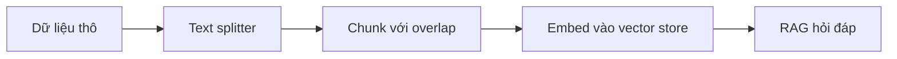

# 🧩 Text Splitter Playground: "Nhìn" Tận Mắt Cách Dữ Liệu Bị Chia Nhỏ

> Nguồn: `141-TextSplitting-Playground.txt` · [Udemy](https://ua.udemy.com/course/langchain/learn/lecture/40338356)

Chào các bạn, mình là Eden đây! 👋 Rất nhiều ứng dụng LLM xoay quanh việc **kết nối LLM với nguồn dữ liệu bên ngoài**. Như chúng ta đã làm trong khóa học: lấy các bài viết trên **Medium**, lấy cả tài liệu LangChain, rồi **hỏi đáp (QA)** trên chúng bằng phương pháp **retrieval augmentation generation (RAG)**.

Nhưng trước khi làm được điều đó, có một bước "âm thầm" mà cực kỳ quan trọng: **chia nhỏ dữ liệu (chunking)**. Bài này mình sẽ giới thiệu công cụ giúp bạn nhìn thấy tận mắt bước đó.

---

### 🧱 Vì sao phải chia nhỏ dữ liệu?

Điều kiện tiên quyết của RAG là **đưa dữ liệu về định dạng mà LLM có thể hiểu** — thường là **ingest vào một vector store** như chúng ta đã trình diễn.

Nhưng trước khi ingest, chúng ta **không thể quăng nguyên khối dữ liệu vào vector store**. Chúng ta phải:

1. **Chia nhỏ (split/chunkify)** dữ liệu thành các **chunk** nhỏ hơn.
2. Đảm bảo các chunk **không vượt qua giới hạn token**.

Vị trí của bước chunking trong pipeline RAG:

Nghe thì đơn giản, nhưng đây là công việc **đầy tinh tế và thường bị bỏ qua**. Khi chia văn bản, chúng ta cần:

* Mỗi chunk phải chứa **thông tin liền mạch (cohesive)** mà cả bạn lẫn LLM đều hiểu được.
* **Không cắt ngang một câu** giữa chừng.
* Chunk **đủ nhỏ** để dễ hiểu, nhưng **không quá lớn** khiến số token phình to.

---

### ❓ Vậy chunk size bao nhiêu là đúng?

Đây là câu hỏi mình nhận được **rất thường xuyên**: chia dữ liệu thế nào, đặt **chunk overlap** ra sao, **chunk size** bao nhiêu là hợp lý, và nên chia ở đâu?

Mình xin trả lời thẳng: **không có đáp án đúng duy nhất**. Mỗi trường hợp cần được **xem xét và xử lý khác nhau**.

| Tham số | Ý nghĩa | Lưu ý khi chỉnh |
|---|---|---|
| Chunk size | Kích thước mỗi chunk | Đủ nhỏ để dễ hiểu, không quá lớn khiến token phình to |
| Chunk overlap | Phần gối nhau giữa các chunk | Dùng playground để nhìn rõ phần gối giữa hai chunk |

*Tuy nhiên, may mắn là LangChain đã tạo ra một công cụ giúp bạn giải quyết nỗi lo này — và đúng như tên gọi của nó, công cụ này để... chơi.*

---

### 🔬 Text Splitter Playground: Nghịch thử để hiểu

Công cụ đó tên là **Text Splitter Playground**. Cách tìm rất đơn giản:

1. **Google** cụm *langchain text splitting playground*.
2. Chọn **kết quả thứ hai** — đây là **repo GitHub**, mã nguồn mở, bạn có thể xem code.
3. Đây là một **Streamlit app** (ứng dụng web Python) được **host trên LangChain** — click vào link là dùng được.

Giao diện cực kỳ trực quan. Ở phần đầu, bạn có thể **nghịch các tham số**:

* **Chunk size** — kích thước mỗi chunk.
* **Chunk overlap** — phần gối nhau giữa các chunk.
* **Cách tính chunk size**.
* Và **chọn text splitter** — mặc định là **recursive character text splitter**, loại phổ biến nhất mà chúng ta đã dùng trong khóa học.

Ở phần dưới, mỗi khi bạn đổi tham số, **đoạn code tương ứng cũng thay đổi theo** — bạn có thể **copy paste thẳng vào workspace** của mình.

---

### 📊 Thực hành: Nhìn chunk "bằng mắt thường"

Mình demo nhanh nhé: vào **blog của LangChain**, chọn một bài, **copy toàn bộ văn bản** rồi **dán vào Text Splitter**.

* Bấm **"Split text"** là bạn thấy **toàn bộ các chunk hiện ra trực quan**.
* Bạn có thể **đánh giá xem chúng có "make sense"** hay không.
* Từ đó **tối ưu chiến lược chunking** và kiểm tra lại bằng mắt.
* Những chunk này chính là thứ sẽ được **embed vào vector store**.

Công cụ còn giúp bạn **kiểm tra chunk overlap**: giữa hai chunk liền nhau, bạn thấy rõ **phần nào bị gối lên nhau** tương ứng với overlap size.

### 🎯 Tự kiểm tra nhanh

**Câu 1:** Vì sao phải chia nhỏ dữ liệu trước khi ingest vào vector store?

<b>Xem đáp án</b>

**Đáp án:** Vì không thể quăng nguyên khối dữ liệu vào vector store; các chunk phải không vượt qua giới hạn token.

Giải thích: Chunking là điều kiện tiên quyết của RAG.

Tham chiếu: Mục Vì sao phải chia nhỏ dữ liệu.

**Câu 2:** Một chunk tốt cần đảm bảo những gì?

<b>Xem đáp án</b>

**Đáp án:** Chứa thông tin liền mạch mà cả người lẫn LLM hiểu được, không cắt ngang câu, đủ nhỏ để dễ hiểu nhưng không quá lớn gây phình token.

Giải thích: Đây là công việc tinh tế và thường bị bỏ qua.

Tham chiếu: Mục Vì sao phải chia nhỏ dữ liệu.

**Câu 3:** Có một chunk size đúng duy nhất cho mọi trường hợp không?

<b>Xem đáp án</b>

**Đáp án:** Không — mỗi trường hợp cần được xem xét và xử lý khác nhau.

Giải thích: Đây là câu hỏi Eden nhận được rất thường xuyên.

Tham chiếu: Mục Vậy chunk size bao nhiêu là đúng.

**Câu 4:** Tìm Text Splitter Playground ở đâu?

<b>Xem đáp án</b>

**Đáp án:** Google cụm "langchain text splitting playground", chọn kết quả thứ hai — repo GitHub mã nguồn mở; app là Streamlit host trên LangChain.

Giải thích: Click vào link là dùng được ngay.

Tham chiếu: Mục Text Splitter Playground.

**Câu 5:** Playground giúp gì khi thực hành chunking?

<b>Xem đáp án</b>

**Đáp án:** Xem toàn bộ chunk trực quan, đánh giá chúng có "make sense" không, tối ưu chiến lược, kiểm tra overlap và lấy code thay đổi theo tham số.

Giải thích: Đây chính là thứ sẽ được embed vào vector store.

Tham chiếu: Mục Thực hành.

Theo mình, đây là một công cụ **tuyệt vời** mỗi khi bạn muốn tối ưu chiến lược chunking và **hình dung xem mỗi chunk đang chứa dữ liệu gì**. Chúc các bạn "chunk" vui vẻ và hẹn gặp lại ở bài tiếp theo! 🚀

## Nguồn tham khảo

- [Udemy — TextSplitting Playground](https://ua.udemy.com/course/langchain/learn/lecture/40338356)
- [langchain-ai/text-split-explorer — GitHub](https://github.com/langchain-ai/text-split-explorer)
- [Text Split Explorer — bản host trên Streamlit](https://langchain-text-splitter.streamlit.app/)
- [Docs by LangChain — Text splitters](https://docs.langchain.com/oss/python/integrations/splitters)
