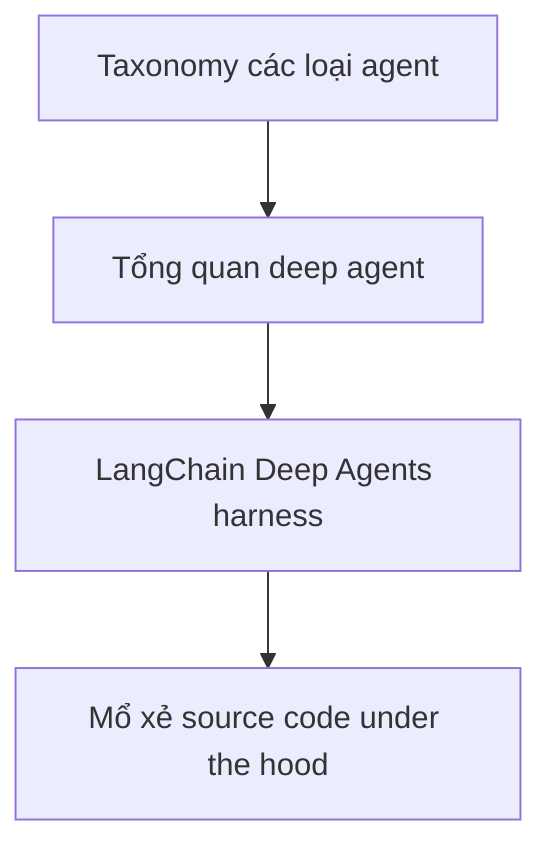

# 🧠 Chào mừng đến với Deep Agents: Khi AI Agent bước vào kỷ nguyên "chạy đường dài"

> Nguồn: `143-Introduction-to-Deep-Agents-Section.txt` · [Udemy](https://ua.udemy.com/course/langchain/learn/lecture/54737161)

Chào mọi người, lại là Eden đây! 👋 Trong section mới này, chúng ta sẽ cùng nhau bước vào một trong những chủ đề thú vị nhất của khóa học: **Deep Agents**.

Đây là những agent có thể xử lý đa dạng tác vụ, nhưng điểm đặc biệt nhất là chúng giải quyết được các **long-horizon tasks (tác vụ dài hơi)** — những bài toán phức tạp, cần nhiều vòng lặp và nhiều thời gian xử lý. Các **coding agent** như **Claude Code**, **Cursor CLI**, hay chính **LangChain Deep Agents** đều thuộc nhóm này.

---

### 🎯 Deep Agents là gì?

Deep Agents là những agent có thể thực thi các tác vụ dài hơi — chính xác hơn là những tác vụ phức tạp đòi hỏi rất nhiều vòng lặp, rất nhiều bước xử lý và thời gian chạy kéo dài.

Chúng hữu dụng ở nhiều loại tác vụ khác nhau, nhưng điểm "ăn tiền" nằm ở khả năng **hành động và hoàn thành những công việc mà agent thông thường bó tay**. Đây cũng là lý do các coding agent như **Claude Code**, **Cursor CLI** hay **LangChain Deep Agents** đang trở thành tâm điểm của ngành.

Nói cách khác, deep agents là lớp agent được thiết kế để **"chạy đường dài"**, thay vì chỉ xử lý vài bước ngắn ngủi rồi dừng lại.

---

### 🗺️ Lộ trình của section này

Trong section này, mình và các bạn sẽ cùng nhau đi qua ba chặng:

1. **Phân loại (taxonomy)** deep agents — chúng là gì và khác gì với những agent khác.
2. **Định nghĩa ở mức tổng quan (high-level overview)** điều gì khiến một agent trở thành deep agent, cùng những đặc điểm nổi bật của chúng.
3. **Đi sâu vào LangChain Deep Agents harness** — bộ khung (harness) mà LangChain đã xây dựng cho deep agents.

---

### ⚙️ Từ người dùng đến tận mã nguồn

Điều thú vị nhất là chúng ta không chỉ dừng ở việc dùng thử Deep Agents như một người dùng bình thường. Sau khi làm quen với harness, mình sẽ cùng các bạn **mổ xẻ và phân tích mã nguồn** để hiểu tường tận cách những deep agent này được xây dựng.

Cụ thể, chúng ta sẽ xem nhóm LangChain đã tiếp cận bài toán như thế nào khi triển khai deep agents, và mọi thứ vận hành, được hiện thực ra sao **under the hood (dưới lớp vỏ)**.

Nếu bạn từng tự hỏi bên trong những bộ khung này có gì, thì đây chính là lúc chúng ta mở nắp capo và soi từng chi tiết.

---

### 🔍 Nhìn trộm "under the hood" của những coding agent đỉnh cao

Section này hứa hẹn sẽ cực kỳ hấp dẫn, bởi vì chúng ta sẽ được "nhìn trộm" vào cách những **state-of-the-art coding agents (coding agent tiên tiến nhất)** như **Claude Code** được triển khai bên dưới lớp vỏ.

Đây là cơ hội để chúng ta hiểu tường tận bên trong những coding agent đang dẫn dắt ngành — những thứ mà nếu chỉ dùng ở mức bề mặt, bạn sẽ mãi không thấy được.

Nếu bạn từng tò mò vì sao các agent này có thể tự viết code, tự chạy test hay tự sửa lỗi xuyên suốt hàng giờ đồng hồ, thì đây chính là section dành cho bạn. Hãy thắt dây an toàn và hẹn gặp lại các bạn ở bài tiếp theo nhé! 🚀

## Nguồn tham khảo

- [Udemy — Introduction to Deep Agents Section](https://ua.udemy.com/course/langchain/learn/lecture/54737161)
- [LangChain Docs — Deep Agents overview](https://docs.langchain.com/oss/python/deepagents/overview)
- [GitHub — langchain-ai/deepagents](https://github.com/langchain-ai/deepagents)
