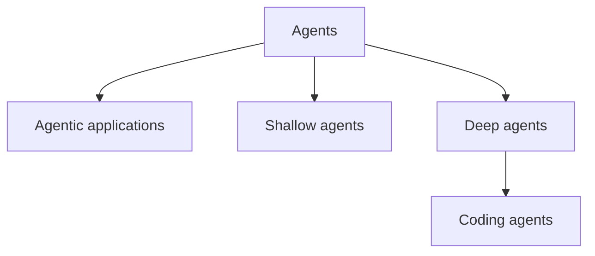

# 🗺️ Bản đồ các loại Agent: Shallow Agents, Deep Agents và Coding Agents

> Nguồn: `144-Deep-Agents-Taxonomy-of-Agents-Shallow-Agents-Deep-Agents-Co.txt` · [Udemy](https://ua.udemy.com/course/langchain/learn/lecture/54097937)

Trước khi đi sâu vào deep agents, mình muốn chúng ta dừng lại một chút để cùng nhau vẽ nên **bức tranh phân loại (taxonomy)** các loại agent đang có trong ngành. Hiểu được mình đang đứng ở đâu trong bức tranh này sẽ giúp các bạn nắm phần còn lại của section dễ dàng hơn rất nhiều.

---

### 🗺️ Thế giới của Agent: Agents và Agentic Applications

Dưới chiếc ô lớn mang tên **agents**, chúng ta có rất nhiều biến thể khác nhau. Có những thứ là agent "thuần", cũng có những **agentic application** — ví dụ như kiến trúc **hybrid RAG**, nơi một LLM đứng ra quyết định bước tiếp theo: có nên tìm kiếm hay không, có nên viết lại câu truy vấn (rephrase the query) trước khi truy xuất (retrieval) hay không.

Trong thế giới đó, **ReAct agent** là hình mẫu quen thuộc nhất: LLM quyết định xem có dùng tool hay không, tool được thực thi, rồi kết quả (observation) được đưa ngược trở lại LLM. Nếu đã đủ thông tin thì agent trả lời người dùng; nếu chưa thì vòng lặp cứ thế tiếp diễn. *Và chính thuật toán ReAct này là khởi nguồn cho toàn bộ kỷ nguyên agent mà chúng ta thấy ngày nay.*

---

### 🧩 Shallow Agents: ReAct và những giới hạn cố hữu

Mình gọi ReAct agent là **shallow agent (agent "nông")** — không phải vì nó kém, mà vì nó không có khả năng đi thật sự sâu. Ví dụ, dù được trang bị **Search tool**, **Wiki tool** hay **Tavily tool**, agent này vẫn không đủ sức để làm một nghiên cứu thật chuyên sâu.

Lý do nằm ở chính thiết kế của nó. Agent dựa trên **function calling**, và mỗi khi phải ra quyết định, thực thi tool, rồi nhồi kết quả vào LLM, chúng ta lại **làm phình context (context bloat)**. Một vài vòng lặp thì còn chấp nhận được, nhưng càng nhiều vòng lặp thì context càng lớn, dẫn đến **context rot** — context bị lẫn lộn, mâu thuẫn, ô nhiễm (context confusion, context contradiction, context pollution)... và cuối cùng là kéo chất lượng LLM đi xuống, khiến agent "đi chệch đường ray".

Và đừng quên bài toán chi phí: mỗi lần gọi LLM sẽ nặng hơn vì chứa nhiều token hơn, nghĩa là **đắt hơn và chậm hơn**. Nói về function calling, bản thân nó không có lỗi gì nghiêm trọng — chỉ có một vài vấn đề nhỏ mà mình đã bàn khi nói về code mode — nhưng giới hạn nằm ở kiến trúc và ở **context window hữu hạn** của LLM hiện đại.

Tuy vậy, mình phải nói rõ: ReAct agent **rất tốt cho các tác vụ nông**, không cần quá nhiều vòng lặp. Mình đã làm việc với rất nhiều khách hàng đang dùng kiến trúc này trong production, và với vô số use case thì thế là quá đủ.

| Tiêu chí | Shallow Agent (ReAct) | Deep Agent |
|---|---|---|
| Tác vụ phù hợp | Ngắn, ít vòng lặp | Long-horizon, phức tạp, nhiều bước |
| Context | Phình dần qua từng vòng, dễ context rot | Quản lý bằng context engineering, subagent, file system |
| Thời gian chạy | Vài vòng lặp rồi dừng | Hàng phút, hàng giờ, thậm chí hàng ngày |
| Điểm mạnh | Đơn giản, đủ dùng cho số đông use case | Lập kế hoạch, ủy quyền, mở rộng quy mô |
| Ví dụ | ReAct agent với Search, Wiki, Tavily tool | Deep research, coding agent như Claude Code |

---

### 🌊 Deep Agents: khi bài toán trở nên "dài hơi"

Deep agents là những agent có thể thực hiện các tác vụ **long-horizon (tầm xa)** — phức tạp, cần rất nhiều vòng lặp và rất nhiều bước xử lý. Chúng là những agent **chạy lâu**, có thể chạy hàng phút, hàng giờ, thậm chí hàng ngày. Chúng có thể nhận input từ người dùng, tạm dừng thực thi rồi tiếp tục sau khi nhận được phản hồi.

Vài ví dụ quen thuộc:

* **Deep research agents:** tính năng deep research của **Perplexity**, **Claude Code** hay **ChatGPT** đều kích hoạt một deep agent đi nghiên cứu. Gần như nhà cung cấp nào hiện nay cũng có dạng agent này, và mỗi bên triển khai một kiểu khác nhau.
* **GPT Researcher:** một trong những dự án mã nguồn mở phổ biến nhất ở thời điểm quay video — mình có review rất kỹ trong khóa LangGraph của mình.
* **Coding agents:** **Claude Code**, **Devin**, **Cursor**, **Gemini CLI**... — đây là một tập con của deep agents được "đo ni đóng giày" cho việc lập trình, và là một trong những ví dụ thuyết phục nhất về sức mạnh của deep agents.

Lấy **Claude Code** làm tâm điểm (vì đây là coding agent dẫn đầu ở thời điểm quay video): nó có thể nhận yêu cầu triển khai một ứng dụng hay một feature, rồi tự viết code, tự chạy test, tự kiểm thử ứng dụng, tự mở trình duyệt, chụp ảnh màn hình — đúng những việc mà một kỹ sư phần mềm bình thường vẫn làm.

---

### 💡 Điều gì thực sự tạo nên một Deep Agent?

Nói thật, chưa có một định nghĩa rõ ràng nào. Theo quan điểm của mình, **một agent có thể hoàn thành tác vụ phức tạp chính là một deep agent**. Và để làm được điều đó, tất cả đều xoay quanh **context engineering** cùng **quản lý context thông minh** — giúp giải bài toán phình context và mở rộng quy mô để agent làm được nhiều việc cùng lúc.

Hầu hết deep agents hiện nay đều triển khai bốn ý tưởng sau:

1. **Planning tool (công cụ lập kế hoạch):** để agent biết mình sắp làm gì.
2. **Subagents (agent con):** tạo ra những "công nhân" chuyên biệt, làm việc trong **context riêng biệt (isolated context)** để agent chính mở rộng quy mô mà không bị phình context.
3. **File system (hệ thống tệp):** nơi ghi lại kết quả trung gian và trạng thái chia sẻ giữa các agent — mọi thứ được ghi xuống đĩa thay vì nhồi hết vào context.
4. **System prompt "khổng lồ":** phần chỉ dẫn đồ sộ mà gần như deep agent nào cũng sở hữu.

Một điểm thú vị trước khi kết bài: LLM ngày nay đang tiến bộ, nhưng tiến bộ **dần dần** chứ không bùng nổ. Thứ tạo nên sự khác biệt hiện tại chính là **application layer (tầng ứng dụng)** — nơi chúng ta, những developer, xây dựng lên trên các LLM. Nếu 5 năm trước mình nói rằng sẽ có công nghệ tạo ra một ứng dụng hoàn chỉnh, đẹp đẽ từ con số 0 mà không cần con người can thiệp, chắc hẳn các bạn sẽ nghĩ mình "khùng". Ấy vậy mà deep agents đang biến điều đó thành hiện thực.

### 🎯 Tự kiểm tra nhanh

**Câu 1:** Vì sao ReAct agent được gọi là **shallow agent**?

<b>Xem đáp án</b>

**Đáp án:** Vì nó không có khả năng đi thật sự sâu.

Giải thích: Càng nhiều vòng lặp, context càng phình và dẫn tới context rot, nên nó không đủ sức làm nghiên cứu chuyên sâu.

Tham chiếu: Mục Shallow Agents.

**Câu 2:** **Context rot** là gì và gây hậu quả gì?

<b>Xem đáp án</b>

**Đáp án:** Context bị lẫn lộn, mâu thuẫn, ô nhiễm khi phình to — khiến chất lượng LLM đi xuống.

Giải thích: Càng nhiều vòng lặp, token càng nhiều nên còn đắt hơn và chậm hơn.

Tham chiếu: Mục Shallow Agents.

**Câu 3:** Bốn ý tưởng mà hầu hết deep agents đều triển khai là gì?

<b>Xem đáp án</b>

**Đáp án:** Planning tool, subagents, file system, system prompt khổng lồ.

Giải thích: Tất cả xoay quanh context engineering và quản lý context thông minh.

Tham chiếu: Mục Điều gì thực sự tạo nên một Deep Agent.

**Câu 4:** Theo Eden, deep agent là gì khi chưa có định nghĩa rõ ràng?

<b>Xem đáp án</b>

**Đáp án:** Là agent có thể hoàn thành tác vụ phức tạp.

Giải thích: Định nghĩa này gắn với long-horizon tasks và context engineering.

Tham chiếu: Mục Điều gì thực sự tạo nên một Deep Agent.

**Câu 5:** Đâu là ví dụ về deep research agent và coding agent?

<b>Xem đáp án</b>

**Đáp án:** Deep research của Perplexity, ChatGPT và GPT Researcher; coding agent gồm Claude Code, Devin, Cursor, Gemini CLI.

Giải thích: Coding agent là một tập con của deep agents, được đo ni đóng giày cho lập trình.

Tham chiếu: Mục Deep Agents.

Hẹn gặp lại các bạn trong bài tiếp theo, nơi mình sẽ mổ xẻ chi tiết từng ý tưởng trên. 🚀

## Nguồn tham khảo

- [Udemy — Deep Agents: Taxonomy of Agents](https://ua.udemy.com/course/langchain/learn/lecture/54097937)
- [LangChain Docs — Deep Agents overview](https://docs.langchain.com/oss/python/deepagents/overview)
- [LangChain Docs — Agents](https://docs.langchain.com/oss/python/langchain/agents)
