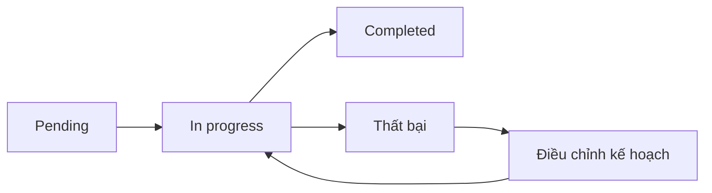

# ✅ Dynamic To-Do Lists: Cách Deep Agents "chia để trị" tác vụ phức tạp

> Nguồn: `145-Deep-Agents-How-Deep-Agents-Use-Dynamic-To-Do-Lists-to-Solve.txt` · [Udemy](https://ua.udemy.com/course/langchain/learn/lecture/54113267)

Chào các bạn, mình là Eden đây! Sau khi đã có bức tranh phân loại về các loại agent, hôm nay chúng ta sẽ cùng xem xét những **đặc điểm (characteristics)** của Deep Agents qua một ví dụ cụ thể, để thấy chúng biểu hiện ra ngoài như thế nào.

Một điều đáng nói trước: **Deep Agents** là một thuật ngữ chung, nhưng mình tin những người đặt ra thuật ngữ này chính là **nhóm LangChain**. Họ đã phân tích rất nhiều cách triển khai deep agent khác nhau, rồi đúc kết và diễn đạt thành một kiến trúc rõ ràng — một công việc cực kỳ xuất sắc.

---

### 🧠 Planning Tool: học thẳng từ Claude Code

Mọi Deep Agent mà các bạn từng thấy đều sẽ có một **planning tool (công cụ lập kế hoạch)**. Ví dụ như **Claude Code**: ở đó ta thấy một danh sách các tác vụ đã hoàn thành, một tác vụ đang được thực thi, và những tác vụ còn nằm chờ phía sau.

Điểm mấu chốt nằm ở chỗ: đây **không phải là planning "ngầm"** thông qua chain-of-thought reasoning như chúng ta vẫn biết ở các LLM. Deep Agents dùng **planning tool tường minh (explicit planning tool)**, và nó thường được triển khai dưới dạng **to-do list viết bằng markdown**.

| Tiêu chí | Planning ngầm (chain-of-thought) | Planning tường minh (to-do list) |
|---|---|---|
| Hình thức | Suy nghĩ thầm trong đầu LLM | Danh sách markdown do planning tool quản lý |
| Trạng thái | Không quan sát được | pending, in progress, completed |
| Người dùng can thiệp | Không | Có |
| Khi tác vụ thất bại | Dễ lặp lại mù quáng | Điều chỉnh hướng đi |

---

### 📝 Một kế hoạch "sống": luôn được cập nhật liên tục

Kế hoạch này **có tính động rất cao**. Trong lúc thực thi, agent sẽ chủ động xem lại và cập nhật kế hoạch, đánh dấu từng tác vụ theo trạng thái **pending (đang chờ)**, **in progress (đang làm)** hoặc **completed (đã xong)**.



Điều đáng chú ý: nếu một tác vụ thất bại, agent **sẽ không mù quáng thử lại** như thuật toán ReAct nguyên bản. Planning tool giúp "lái" agent đi đúng hướng và được cập nhật liên tục — và các bạn, với vai trò người dùng, cũng có thể tác động vào danh sách tác vụ này.

Riêng ở **Claude Code**, planning tool là **nội bộ (internal)** nên chúng ta không truy cập trực tiếp được, nhưng vẫn có thể quan sát nó đang chạy. Trong video, mình có chiếu một bài đăng X của **Boris Cherny** — chính là người tạo ra Claude Code. Ở đó các bạn thấy lệnh **update todo**, tức lời gọi planning tool để cập nhật to-do list. Danh sách ấy sẽ được Deep Agent cập nhật liên tục, và nhờ vậy kết quả nhận về tốt hơn hẳn.

---

### 💡 Vì sao ý tưởng này... quá trực quan?

Nghĩ kỹ thì mọi thứ rất tự nhiên. Khi con người đối mặt với một tác vụ phức tạp, chúng ta thường chia nhỏ nó ra, rồi theo dõi xem mình đã làm được đến đâu.

Việc đánh dấu một tác vụ đã hoàn thành thậm chí mang lại cảm giác "sướng" (dopamine) nho nhỏ, và quan trọng hơn là nó cho ta thấy **tiến độ** của dự án. Deep Agents học đúng cách làm đó của con người — và đó là lý do ý tưởng này vừa đơn giản, vừa mạnh mẽ.

---

### 📌 Tóm tắt nhanh

* **Planning tool là bắt buộc:** mọi Deep Agent đều có một công cụ lập kế hoạch riêng.
* **Kế hoạch là tường minh:** to-do list dạng markdown, không phải suy nghĩ ngầm trong đầu LLM.
* **Kế hoạch luôn động:** agent liên tục review và cập nhật trạng thái pending / in progress / completed.
* **Thất bại không retry mù quáng:** agent điều chỉnh hướng đi thay vì lặp lại y nguyên.
* **Người dùng có tiếng nói:** chúng ta cũng có thể tác động vào danh sách tác vụ.

---

### 💻 Code mẫu đầy đủ — `02_planning_tool.py`

Toàn bộ code của bài nằm trong file `02_planning_tool.py` (tham khảo từ repo chính thức của khóa học; chạy kèm `models.py` cùng repo):

**`models.py`**

```python
"""Model configuration for the Agent Harnesses chapter.

Every example in this project does `from models import model` and hands that
`model` straight to `create_deep_agent(...)`. Keeping the model in one place means
you swap providers or model names here once, and all five examples follow.

Default: OpenAI `gpt-5.6-sol`. Requires `OPENAI_API_KEY` in your `.env` (see
`.env.example`). To use a different model, change the string below — for example
`"openai:gpt-5.6-mini"` for a cheaper run, or an Anthropic model such as
`"anthropic:claude-haiku-4-5"` (set `ANTHROPIC_API_KEY` instead).
"""

from pathlib import Path

from dotenv import load_dotenv

load_dotenv(dotenv_path=Path(__file__).resolve().parent / ".env", override=True)

from langchain.chat_models import init_chat_model

# The single model shared by every example in this project.
# Requires OPENAI_API_KEY in .env.
model = init_chat_model("openai:gpt-5.6-sol", reasoning_effort="none")
```

**`02_planning_tool.py`**

```python
"""02 · The planning tool (write_todos).

The first knob. We add NOTHING to the create_deep_agent call from example 01 —
the planning tool ships by default. What changes is the task: give a deep agent a
job with several dependent deliverables and it stops guessing its way forward and
instead externalizes a plan.

Under the hood the agent calls a built-in `write_todos` tool. Each todo is a
structured item — `content` plus a `status` of pending / in_progress / completed —
and the agent rewrites the whole list between steps as work progresses. A UI would
render that as a checklist; here we read it straight off the message history so you
can see the durable, structured contract the chapter describes.

Needs only OPENAI_API_KEY.
"""

from deepagents import create_deep_agent

from models import model

# Same bare agent as example 01 — the planning tool is already on board.
agent = create_deep_agent(model=model)

# The planning tool is OPTIONAL — the agent decides whether a task is worth
# planning, and for a task it deems simple it may skip write_todos entirely and
# just answer. To make the plan reliably visible, we explicitly ask it to use the
# tool and work through the todos one at a time.
TASK = (
    "Use your write_todos planning tool for this task. FIRST call write_todos to "
    "lay out a plan with one todo per section, then work through them one at a "
    "time, updating each todo's status (in_progress, then completed) as you go.\n\n"
    "Deliverable: a short internal briefing titled 'Should we adopt Deep Agents?' "
    "with exactly three sections: (1) what problem harnesses solve, (2) the four "
    "capabilities that make an agent deep, and (3) a recommendation."
)

result = agent.invoke({"messages": [{"role": "user", "content": TASK}]})


# --- Make the plan visible -------------------------------------------------
# Walk the message history and print every write_todos call. Watching the list
# evolve across calls shows the agent marking tasks pending -> in_progress ->
# completed, rather than holding the plan implicitly in its reasoning.
def print_plans(messages):
    step = 0
    for message in messages:
        for call in getattr(message, "tool_calls", None) or []:
            if call["name"] != "write_todos":
                continue
            step += 1
            print(f"\n--- Plan update #{step} ---")
            for todo in call["args"].get("todos", []):
                mark = {"completed": "[x]", "in_progress": "[~]"}.get(
                    todo.get("status"), "[ ]"
                )
                print(f"  {mark} {todo.get('content')}")
    return step


plan_updates = print_plans(result["messages"])
if plan_updates == 0:
    # The agent chose not to plan (it can, for tasks it deems simple). Nothing
    # went wrong — there is just no plan to show. Try a more complex task.
    print("(The agent answered without calling the planning tool this time.)")

print("\n=== Final briefing ===")
print(result["messages"][-1].content)
```

### 🎯 Tự kiểm tra nhanh

**Câu 1:** Vì sao planning tool là đặc điểm gần như bắt buộc của deep agent?

<details>
<summary><b>Xem đáp án</b></summary>

**Đáp án:** Để agent biết mình sắp làm gì và theo dõi tiến độ.

Giải thích: Mọi deep agent đều có planning tool; ở Claude Code ta thấy danh sách việc đã xong, đang làm và còn chờ.

Tham chiếu: Mục Planning Tool.

</details>

**Câu 2:** Planning của deep agent khác planning ngầm ở điểm nào?

<details>
<summary><b>Xem đáp án</b></summary>

**Đáp án:** Đây là planning tường minh — to-do list markdown, không phải suy nghĩ ngầm trong đầu LLM.

Giải thích: Kế hoạch nhìn thấy được, chỉnh sửa được và cập nhật liên tục.

Tham chiếu: Mục Planning Tool.

</details>

**Câu 3:** Ba trạng thái của một tác vụ trong to-do list là gì?

<details>
<summary><b>Xem đáp án</b></summary>

**Đáp án:** pending, in progress, completed.

Giải thích: Agent đánh dấu trạng thái khi thực thi để thấy tiến độ dự án.

Tham chiếu: Mục Một kế hoạch sống.

</details>

**Câu 4:** Khi một tác vụ thất bại, deep agent hành xử khác ReAct nguyên bản thế nào?

<details>
<summary><b>Xem đáp án</b></summary>

**Đáp án:** Không mù quáng thử lại; planning tool lái agent đi đúng hướng.

Giải thích: Kế hoạch được xem lại và cập nhật liên tục trong lúc thực thi.

Tham chiếu: Mục Một kế hoạch sống.

</details>

**Câu 5:** Người dùng có tác động được vào to-do list của Claude Code không?

<details>
<summary><b>Xem đáp án</b></summary>

**Đáp án:** Planning tool của Claude Code là nội bộ nên không truy cập trực tiếp, nhưng vẫn quan sát được và người dùng có thể tác động vào danh sách tác vụ.

Giải thích: Eden chiếu bài đăng X của Boris Cherny với lệnh update todo.

Tham chiếu: Mục Một kế hoạch sống.

</details>

Ở bài tiếp theo, chúng ta sẽ sang một đặc điểm quan trọng không kém: **Sub Agents (agent con)** và **hierarchical delegation (ủy quyền theo tầng bậc)**. Hẹn gặp lại các bạn! 🚀

## Nguồn tham khảo

- [Udemy — How Deep Agents Use Dynamic To-Do Lists](https://ua.udemy.com/course/langchain/learn/lecture/54113267)
- [LangChain Docs — Deep Agents overview](https://docs.langchain.com/oss/python/deepagents/overview)
