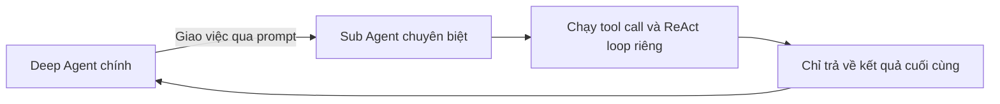

# 🤝 Sub Agents & Hierarchical Delegation: Khi Deep Agent biết "ủy quyền"

> Nguồn: `146-Deep-Agents-Sub-Agents-and-Hierarchical-Delegation.txt` · [Udemy](https://ua.udemy.com/course/langchain/learn/lecture/54113269)

Chào các bạn, mình là Eden đây! Chúng ta vừa nói về Planning Tool, còn hôm nay mình muốn giới thiệu một đặc điểm khác cũng quan trọng không kém: khả năng sử dụng **Sub Agents (agent con)**.

---

### 🧩 Sub Agents & Hierarchical Delegation

Deep Agents sử dụng khái niệm **Sub Agents**, qua đó mang lại thứ được gọi là **hierarchical delegation (ủy quyền theo tầng bậc)**. Nghĩa là bản thân Deep Agent có thể **"sinh" ra những phiên bản mới của chính nó**, nhưng những phiên bản này là các Sub Agent **chuyên biệt hóa cho từng tác vụ tập trung**.

Mỗi Sub Agent sẽ có **system prompt riêng**, **description riêng**, và **bộ tool riêng** mà nó được phép dùng. Mình phải nói ý tưởng này thực sự thiên tài — vì nó giống hệt cách chúng ta vận hành ngoài đời thực.

| Thành phần | Deep Agent chính | Sub Agent |
|---|---|---|
| Vai trò | Điều phối và ủy quyền | Thực thi một tác vụ tập trung |
| System prompt | Của agent chính | Riêng, chuyên biệt |
| Bộ tool | Theo cấu hình của agent chính | Riêng, chỉ gồm tool được phép |
| Context | Chỉ nhận kết quả cuối cùng | Chạy trong context window riêng |
| Khả năng chạy song song | Giao việc cho nhiều sub agent | Độc lập, tách biệt |

Khi muốn giao một việc cho người khác, chúng ta cần đảm bảo người đó có **đúng kỹ năng và đúng công cụ**, và quan trọng không kém: chúng ta phải biết **giải thích cho họ cần làm gì**.

---

### 🏠 Chuyện mái nhà của mình

Mình lấy ví dụ từ chính nhà mình. Mình không phải tay thợ, chẳng có chút khéo léo nào, khoan tường cũng không biết khoan — mình cực kỳ tệ mấy chuyện này.

Nhà mình có một cửa sập (hatch) trên trần tầng trên cùng. Mỗi khi mưa, hạt mưa đập vào tấm cửa sập phủ sợi thủy tinh (fiberglass) ấy và gây ra tiếng động rất to, vang khắp nhà. Để xử lý, mình mua **cỏ nhân tạo (synthetic grass)** phủ lên tấm fiberglass, giúp tiếng mưa rơi nhẹ đi. Nhưng trần nhà khá cao, phải có loại **thang đặc biệt mở chéo** mới leo lên được... và mình thì chịu.

Thế là mình gọi **bố vợ** — người cực giỏi khoản này. Ông mang theo **đồ nghề riêng**: con dao rọc giấy (box cutter) để cắt cỏ nhân tạo cho vừa kích thước, cái thang riêng để leo lên trần, và tự xử lý hết mọi thứ.

Các bạn có thấy giống không? Mình viết một tin nhắn mô tả tác vụ cần giúp — đó chính là **prompt**. Ông đến với đồ nghề riêng và "system prompt" riêng (tức kỹ năng của ông). Ông làm việc đó **khi mình thậm chí không có mặt**, vì ông có chìa khóa nhà. Kết quả cuối cùng: mọi thứ được sửa xong, mưa xuống không còn vang khắp nhà nữa.

---

### ⚙️ Context Isolation: bài học từ câu chuyện

Điểm quan trọng nhất: trong lúc ông làm việc, **mình không hề biết chuyện gì đang diễn ra**. Về mặt context, ông đang làm việc trong **context isolation (cô lập ngữ cảnh)** — mình chỉ nhận được **kết quả cuối cùng**.

Sub Agents hoạt động y hệt như vậy:

* Chúng làm việc **tách biệt**, chạy trong **context window riêng** mà không làm ô nhiễm context của agent chính.
* Chúng **chuyên biệt hóa**: mỗi Sub Agent có system prompt và bộ tool riêng, có thể khác nhau giữa các Sub Agent.
* Chúng chạy **tool calling loop** và **ReAct loop** của riêng mình, rồi chỉ trả về **kết quả cuối cùng**, không kèm các bước trung gian.

Nhờ mẫu ủy quyền này, agent chính giữ được **context isolation**, không bị công việc chuyên biệt làm xao nhãng "attention", đồng thời có thể **chạy song song** nhiều tác vụ. Kết quả là chất lượng, hiệu quả và độ sâu của câu trả lời đều tăng vọt.

Một ví dụ kỹ thuật với **Claude Code**: nó có thể tạo một **exploration agent (agent thăm dò)** để truy tìm các **authentication pattern (mẫu xác thực)**, và agent này chạy song song cùng lúc với agent chính. Điều đó cho thấy Claude Code cũng đang triển khai kiến trúc này, với khả năng hỗ trợ Sub Agents cực kỳ mạnh mẽ và hữu ích.

---

### ⚠️ Đừng lo nếu thấy quá nhiều lý thuyết!

Mình biết mình đang nói khá nhiều lý thuyết, "vung tay" khá nhiều mà chưa đụng đến phần triển khai. *Các bạn đừng lo nhé — phần implementation chắc chắn sẽ đến, và chúng ta sẽ thấy chính xác cách hiện thực hóa những "phép màu" đó.*

### 🎯 Tự kiểm tra nhanh

**Câu 1:** Hierarchical delegation trong deep agents nghĩa là gì?

<b>Xem đáp án</b>

**Đáp án:** Deep Agent có thể sinh ra những phiên bản chuyên biệt của chính nó — các Sub Agent — cho từng tác vụ tập trung.

Giải thích: Đây là ủy quyền theo tầng bậc, giống cách con người giao việc cho người có đúng kỹ năng.

Tham chiếu: Mục Sub Agents & Hierarchical Delegation.

**Câu 2:** Mỗi Sub Agent được trang bị những gì riêng?

<b>Xem đáp án</b>

**Đáp án:** System prompt riêng, description riêng và bộ tool riêng.

Giải thích: Nhờ chuyên biệt hóa, sub agent làm tác vụ của mình tốt hơn.

Tham chiếu: Mục Sub Agents & Hierarchical Delegation.

**Câu 3:** Context isolation của Sub Agent thể hiện thế nào?

<b>Xem đáp án</b>

**Đáp án:** Nó chạy trong context window riêng, không ô nhiễm context của agent chính; agent chính chỉ nhận kết quả cuối cùng.

Giải thích: Như bố vợ sửa mái nhà khi Eden không có mặt — chỉ thấy thành quả.

Tham chiếu: Mục Context Isolation.

**Câu 4:** Vì sao mẫu ủy quyền giúp agent chính hoạt động tốt hơn?

<b>Xem đáp án</b>

**Đáp án:** Giữ context isolation, không bị công việc chuyên biệt làm xao nhãng attention và có thể chạy song song.

Giải thích: Kết quả là chất lượng, hiệu quả và độ sâu câu trả lời đều tăng.

Tham chiếu: Mục Context Isolation.

**Câu 5:** Claude Code minh họa kiến trúc này như thế nào?

<b>Xem đáp án</b>

**Đáp án:** Nó tạo exploration agent truy tìm authentication pattern, chạy song song cùng agent chính.

Giải thích: Cho thấy Claude Code cũng hỗ trợ Sub Agents mạnh mẽ.

Tham chiếu: Mục Context Isolation.

Trước mắt, mình muốn các bạn nắm trọn khái niệm và giao diện, để thấy những khả năng này hiển hiện ra sao trong các công cụ quen thuộc hằng ngày. Ở bài tiếp theo, mình sẽ đi sâu vào **luồng context (context flow)** khi dùng Sub Agents, để các bạn thấy cách chúng giúp tránh phình context và đạt được **context isolation** như thế nào. 🚀

## Nguồn tham khảo

- [Udemy — Sub Agents and Hierarchical Delegation](https://ua.udemy.com/course/langchain/learn/lecture/54113269)
- [LangChain Docs — Deep Agents subagents](https://docs.langchain.com/oss/python/deepagents/subagents)
- [LangChain Docs — Deep Agents overview](https://docs.langchain.com/oss/python/deepagents/overview)
