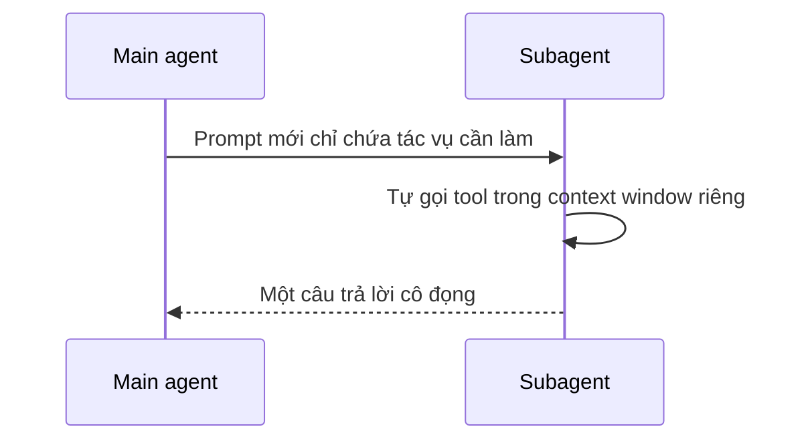

# 🗺️ Subagents Context Flow: Nghệ thuật "nén" context của Deep Agents

> Nguồn: `147-Deep-Agents-Subagents-context-flow.txt` · [Udemy](https://ua.udemy.com/course/langchain/learn/lecture/54113271)

Chào các bạn, mình là Eden đây! Hôm nay chúng ta sẽ đi sâu vào **luồng context (context flow)** khi sử dụng subagent, để hiểu vì sao **sub-agent (agent con)** lại mạnh mẽ và hữu ích đến vậy.

---

### 🔄 Một vào, một ra: luồng context của subagent

Hãy tưởng tượng **main agent thread** là cuộc hội thoại chính của chúng ta. Mọi tin nhắn gửi vào đây đều **làm tăng số token**.

Khi agent chính quyết định dùng một subagent, nó sẽ **tạo ra một prompt hoàn toàn mới** và truyền prompt đó cho subagent. Đây là **toàn bộ context** mà subagent nhìn thấy khi bắt đầu — nó **không hề biết** cuộc hội thoại trước đó đã diễn ra những gì, chỉ biết đúng cái prompt mà agent chính tạo ra.

Điều hay ho: chúng ta **hoàn toàn có thể tác động vào prompt này**, để subagent làm việc dễ dàng hơn và cho ra kết quả tốt hơn. Subagent chỉ giỏi bằng chính cái prompt nó nhận được — vì đó là context duy nhất của nó.

Sau đó, subagent làm việc độc lập: gọi những tool cần thiết, có thể thực hiện vài bước tích hợp, rồi cuối cùng **trả về duy nhất một câu trả lời cô đọng** cho agent chính. Mỗi lần spawn một subagent mới, chúng ta lại bắt đầu với **context hoàn toàn mới**, chỉ có prompt được gửi vào.

Lợi ích rõ ràng: luồng chính được giữ **tinh gọn (lean)**. Thay vì nhồi hết mọi thứ, ta ủy thác phần lớn context cho các subagent làm việc trong cô lập, và chỉ nhận lại **kết quả/artifact** được đưa ngược vào agent chính. Nhờ vậy, hội thoại chính duy trì context tinh gọn, và chúng ta **không cần dùng tới lệnh `slash compact` hay `slash clear`** — vì càng nhiều context thì hiệu năng càng giảm.

Tóm gọn: **main agent đưa một input cho subagent, subagent làm việc rồi trả về một output**. Đây là cách cực kỳ thông minh để **nén context**.



---

### 📈 Vì sao phải giữ context "tinh gọn"?

Hãy nhìn vào cửa sổ context khi cuộc hội thoại với Claude Code ngày càng dài ra. LLM có **giới hạn token**: có thể là **200K**, **1 triệu token**, tương lai có thể là **2 triệu hay 10 triệu** — nhưng con số này **luôn hữu hạn**.

Chúng ta **không hề muốn chạm tới giới hạn đó**, vì:

1. Nếu vượt ngưỡng, request gửi tới LLM sẽ **thất bại**.
2. Kể cả khi không thất bại, câu trả lời cũng **tốn kém hơn** — mỗi token đều có giá của nó.
3. Nó **chậm hơn**, vì độ trễ (latency) tăng theo số token.
4. Quan trọng nhất: khi tới gần giới hạn, gần như chắc chắn sẽ gặp **context pollution (ô nhiễm ngữ cảnh)** — vô số context không liên quan khiến kết quả nhận về không như mong muốn.

Mỗi lượt tương tác, mỗi tin nhắn gửi đi đều tiêu tốn token và cộng dồn vào context window: lượt đầu có thể thêm **10K token**, lượt hai lên **30K**, đến lượt thứ năm thì đã chạm **100K token**. Đến một lúc nào đó, ta buộc phải compact với lệnh `slash compact`, xóa sạch mọi thứ, hoặc mở một phiên Claude Code mới và bắt đầu lại từ đầu. Thế mới thấy: **giới hạn context chính là thứ trói buộc mọi tương tác của chúng ta.**

| Tiêu chí | Main agent thread | Subagent |
|---|---|---|
| Bắt đầu với | Toàn bộ hội thoại | Chỉ prompt do main agent tạo |
| Token tích lũy | Cộng dồn vào context window chính | Không tính vào agent chính |
| Khi kết thúc | Tiếp tục dài thêm | Trả về một kết quả cô đọng |
| Giới hạn | Chạm trần 200K, 1 triệu token... | Context riêng, được giải phóng |

---

### ✨ Subagent: giải pháp "thanh lịch" để mở rộng giới hạn

Với subagent, mọi thứ trở nên **cực kỳ thanh lịch**. Mỗi subagent chạy với **context window riêng**, và mọi token nó dùng **không hề bị tính vào agent chính**.

Khi subagent kết thúc, nó chỉ trả về **một câu trả lời cô đọng** — có thể là **15K hay 20K token** bao gồm phần tóm tắt và đoạn code đã sửa. Nhưng mấu chốt là chúng ta **không tích lũy toàn bộ context đó** trong luồng chính. Thử tưởng tượng sức mạnh của cách này cho công việc **context engineering**!

Thêm một điểm tinh tế: mỗi side chain, mỗi subagent đều chạy với **system prompt riêng được may đo theo đúng nhu cầu**, nên nó giải quyết tác vụ của mình tốt hơn hẳn agent chính. Đó chính là toàn bộ lý do tồn tại của subagent — một ý tưởng vô cùng mạnh mẽ.

---

### 💻 Code mẫu đầy đủ — `03_subagents.py`

Toàn bộ code của bài nằm trong file `03_subagents.py` (tham khảo từ repo chính thức của khóa học; chạy kèm `models.py` cùng repo) — ví dụ cho thấy subagent chạy trong context riêng và chỉ trả về kết quả cuối cùng:

**`models.py`**

```python
"""Model configuration for the Agent Harnesses chapter.

Every example in this project does `from models import model` and hands that
`model` straight to `create_deep_agent(...)`. Keeping the model in one place means
you swap providers or model names here once, and all five examples follow.

Default: OpenAI `gpt-5.6-sol`. Requires `OPENAI_API_KEY` in your `.env` (see
`.env.example`). To use a different model, change the string below — for example
`"openai:gpt-5.6-mini"` for a cheaper run, or an Anthropic model such as
`"anthropic:claude-haiku-4-5"` (set `ANTHROPIC_API_KEY` instead).
"""

from pathlib import Path

from dotenv import load_dotenv

load_dotenv(dotenv_path=Path(__file__).resolve().parent / ".env", override=True)

from langchain.chat_models import init_chat_model

# The single model shared by every example in this project.
# Requires OPENAI_API_KEY in .env.
model = init_chat_model("openai:gpt-5.6-sol", reasoning_effort="none")
```

**`03_subagents.py`**

```python
"""03 · Subagents and hierarchical delegation.

The second knob: `subagents=`. A deep agent can spawn specialized workers, each
with its OWN system prompt and its OWN tools, that run in an isolated context and
return only their final result — not their intermediate reasoning. This is the
delegation pattern from the chapter: the main agent hands off a scoped job, the
subagent does the messy work in its own context window, and the main agent's
context stays clean.

Here a coordinator delegates individual topic lookups to a `fact-researcher`
subagent. The researcher owns the lookup tool; the coordinator does not. It can
only get facts by delegating through the built-in `task` tool. We use a small
in-memory knowledge base so the example runs with no key beyond OPENAI_API_KEY.
"""

from deepagents import create_deep_agent
from langchain_core.tools import tool

from models import model

# --- The subagent's private tool -------------------------------------------
# A stand-in for a real search / database tool. It belongs ONLY to the
# researcher subagent (see `tools=` below), so the coordinator cannot call it.
_KNOWLEDGE_BASE = {
    "planning tool": "Deep agents externalize a structured todo list (write_todos) "
    "with per-item status, updated between steps, instead of planning implicitly.",
    "subagents": "Deep agents spawn specialized workers with their own prompt and "
    "tools that run in an isolated context and return only a final result.",
    "filesystem": "Deep agents write intermediate artifacts to a virtual filesystem "
    "so bulky material stays out of the model's context window.",
    "system prompt": "Deep agents rely on a large, curated system prompt that "
    "encodes identity, scope, a reasoning framework, and heuristics.",
}


@tool
def lookup_fact(topic: str) -> str:
    """Look up a factual summary about a deep-agent topic from the knowledge base.
    Recognizes any topic that contains a known keyword (e.g. 'the filesystem
    capability' matches 'filesystem')."""
    print(f"    >> [researcher] lookup_fact(topic='{topic}')")
    key = topic.lower().strip()
    for name, fact in _KNOWLEDGE_BASE.items():
        if name in key or key in name:
            return fact
    return f"No entry found for '{topic}'."


# --- The specialized subagent ----------------------------------------------
# Note the key is `system_prompt` (its own brain, never inherited) and `tools`
# overrides the inherited set with just the lookup tool.
fact_researcher = {
    "name": "fact-researcher",
    "description": (
        "Look up a factual summary for ONE deep-agent topic and return a single "
        "polished sentence. Delegate one topic per call."
    ),
    "system_prompt": (
        "You research one topic at a time. Call lookup_fact with the given "
        "topic, then return ONE clear sentence based only on what it returns. "
        "Do not add facts of your own."
    ),
    "tools": [lookup_fact],
}


# --- The coordinator (main agent) ------------------------------------------
COORDINATOR_PROMPT = (
    "You are a coordinator. You do NOT look up facts yourself — you have no "
    "lookup tool. For each topic the user asks about, delegate to the "
    "fact-researcher subagent using the task tool (one topic per delegation). "
    "Collect the returned sentences and combine them into a short bulleted "
    "summary. Keep your own context focused on coordination."
)

agent = create_deep_agent(
    model=model,
    system_prompt=COORDINATOR_PROMPT,
    subagents=[fact_researcher],
)

result = agent.invoke(
    {
        "messages": [
            {
                "role": "user",
                "content": "Summarize two deep-agent capabilities: subagents "
                "and the filesystem.",
            }
        ]
    }
)

print("\n=== Coordinator's assembled summary ===")
print(result["messages"][-1].content)
```

### 🎯 Tự kiểm tra nhanh

**Câu 1:** Subagent bắt đầu công việc với context nào?

<details>
<summary><b>Xem đáp án</b></summary>

**Đáp án:** Chỉ với prompt mà agent chính tạo ra — nó không biết hội thoại trước đó.

Giải thích: Mỗi lần spawn subagent là bắt đầu với context hoàn toàn mới.

Tham chiếu: Mục Một vào, một ra.

</details>

**Câu 2:** Vì sao không muốn chạm giới hạn token?

<details>
<summary><b>Xem đáp án</b></summary>

**Đáp án:** Request sẽ thất bại, câu trả lời tốn kém hơn, chậm hơn và gần như chắc chắn gặp context pollution.

Giải thích: Giới hạn có thể là 200K, 1 triệu, thậm chí 10 triệu token nhưng luôn hữu hạn.

Tham chiếu: Mục Vì sao phải giữ context tinh gọn.

</details>

**Câu 3:** Lợi ích cốt lõi của subagent với luồng chính là gì?

<details>
<summary><b>Xem đáp án</b></summary>

**Đáp án:** Giữ luồng chính tinh gọn, nén context và không cần dùng slash compact hay slash clear.

Giải thích: Càng nhiều context thì hiệu năng càng giảm.

Tham chiếu: Mục Một vào, một ra.

</details>

**Câu 4:** Token mà subagent dùng có bị tính vào agent chính không?

<details>
<summary><b>Xem đáp án</b></summary>

**Đáp án:** Không — subagent chạy với context window riêng; chỉ kết quả cô đọng được trả về.

Giải thích: Kết quả có thể là 15K-20K token tóm tắt và code đã sửa, nhưng không tích lũy vào luồng chính.

Tham chiếu: Mục Subagent: giải pháp thanh lịch.

</details>

**Câu 5:** Vì sao subagent có system prompt riêng lại mạnh hơn?

<details>
<summary><b>Xem đáp án</b></summary>

**Đáp án:** Vì nó được may đo theo đúng nhu cầu nên giải quyết tác vụ tốt hơn hẳn agent chính.

Giải thích: Đó chính là toàn bộ lý do tồn tại của subagent.

Tham chiếu: Mục Subagent: giải pháp thanh lịch.

</details>

Hẹn gặp lại các bạn ở bài tiếp theo, nơi chúng ta khám phá mảnh ghép tiếp theo: **file system (hệ thống tệp)**! 🚀

## Nguồn tham khảo

- [Udemy — Subagents context flow](https://ua.udemy.com/course/langchain/learn/lecture/54113271)
- [LangChain Docs — Deep Agents subagents](https://docs.langchain.com/oss/python/deepagents/subagents)
- [LangChain Docs — Deep Agents overview](https://docs.langchain.com/oss/python/deepagents/overview)
