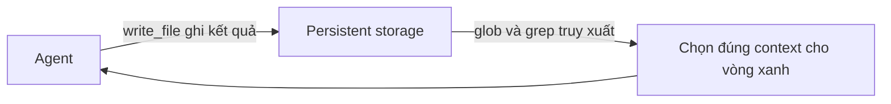

# 📂 File Systems: "Cỗ máy" Context Engineering của Deep Agents

> Nguồn: `148-Deep-Agents-File-Systems.txt` · [Udemy](https://ua.udemy.com/course/langchain/learn/lecture/54737163)

Chào các bạn, mình là Eden đây! Hôm nay chúng ta cùng tìm hiểu một đặc điểm cốt lõi khác của deep agents: **khả năng truy cập file system (hệ thống tệp)**.

---

### 📂 File System Tools: bài học từ Claude Code

Deep Agents có các tool để **tìm kiếm file, đọc file, cập nhật và xóa file**, và nắm toàn quyền kiểm soát một file system — tất cả nhằm giúp chúng ta **quản lý context**.

Ở **Claude Code**, bộ **file operations tools** gồm:

* **read tool:** đọc nội dung file.
* **write tool:** tạo và ghi đè file.
* **edit tool:** thay thế chuỗi chính xác (precise string replacements) trong file.
* **glob và grep tool:** tìm file và tìm nội dung bên trong file.

Nếu mở tài liệu của deep agents, các bạn sẽ thấy chúng phơi ra một **file system interface** rất giống Claude Code: `ls`, `read_file`, `write_file`, `edit_file`, `glob`, và `grep`.

| Chức năng | Claude Code | Deep Agents interface |
|---|---|---|
| Đọc file | read tool | `read_file` |
| Tạo và ghi đè file | write tool | `write_file` |
| Sửa file | edit tool | `edit_file` |
| Tìm file | glob tool | `glob` |
| Tìm nội dung | grep tool | `grep` |

---

### 🔌 Interface mở: muốn backend nào cũng được

Điều quan trọng cần lưu ý: deep agents **chỉ phơi ra interface**, còn cách triển khai thì hoàn toàn tự do. Các bạn có thể dựng file system trên **Firestore của Google Cloud**, trên **DynamoDB của AWS**, hay bất kỳ backend nào mình muốn — mọi thứ đều **linh hoạt tuyệt đối**.

---

### 🧠 Context Engineering: bài toán mang tên "ba vòng tròn"

Như đã bàn, khi hội thoại cứ dài mãi, context cũng phình theo và dẫn đến **context rot** — kết quả là **context contradiction (mâu thuẫn)**, **context confusion (lẫn lộn)**, hoặc đơn giản là quá nhiều **nhiễu (noise)** khiến LLM trả lời kém đi.

Trong một blog của LangChain (mình để link trong phần tài nguyên của video), họ có một hình minh họa rất hay về thách thức của context engineering:

* **Hình chữ nhật màu xanh dương:** toàn bộ context *có sẵn* cho agent — code base, tài liệu, kết quả web search, file, database... Khối lượng này **có thể khổng lồ**.
* **Vòng tròn đỏ/hồng:** phần context mà agent **thực sự chọn** và kéo vào context window (những gì nó quyết định đọc/tìm kiếm).
* **Vòng tròn xanh lá:** phần context agent **thực sự cần** để hoàn thành tác vụ.

Từ đó, chúng ta có các tình huống "dở khóc dở cười":

1. **Under-retrieval:** agent không tìm đủ thông tin cần thiết — vòng đỏ chỉ phủ một phần nhỏ của vòng xanh.
2. **Over-retrieval:** agent kéo vào quá nhiều nhiễu, làm **loãng tín hiệu** — vòng đỏ quá to so với vòng xanh.
3. **Misaligned retrieval:** agent **tìm sai chỗ hoàn toàn** — vòng đỏ không hề chồng lên vòng xanh.
4. **Context window limit:** vòng đỏ là **hữu hạn**, không thể nhét mọi thứ mình muốn vào đó.

Trong context engineering, **điểm ngọt (sweet spot)** là làm sao cho **vòng đỏ nhỏ nhất có thể mà vẫn phủ trọn vòng xanh**. Và nhớ rằng quá trình chọn context này diễn ra **gần như sau mỗi vòng lặp** — nên ta phải liên tục tối ưu cho vòng xanh.

Đó là lý do vì sao trong context engineering, **cách cấu trúc, truy xuất và ưu tiên thông tin cho agent còn quan trọng hơn cả prompt**. Chất lượng của agent bị chặn trên bởi việc nó có đúng thông tin trong context window hay không. Bạn có thể dùng model suy luận tốt nhất, nhưng với context sai thì vẫn nhận câu trả lời sai, không thể trả lời câu hỏi hay hoàn thành tác vụ.

---

### ⚙️ File System: cỗ máy ghi và chọn context

Vậy file system liên quan gì đến tất cả những điều trên? Nó chính là **động cơ** giúp agent chọn đúng context — là cơ chế để agent tiến tới **điểm ngọt của vòng xanh**. Hãy tưởng tượng toàn bộ file system chính là **hình chữ nhật xanh dương** khổng lồ kia.

File system giúp chúng ta hai việc quan trọng:

1. **Ghi context vào bộ lưu trữ bền vững (persistent storage):** file tạm, kết quả tạm, hay thông tin lấy từ internet đều được lưu lại — nhờ đó **không làm ô nhiễm context**, vì mọi thứ nằm ở nơi lưu trữ lâu dài.
2. **Chọn lọc context để truy xuất:** cơ chế chính là **glob tool** (tìm file theo pattern) và **grep tool** (tìm nội dung file bằng biểu thức chính quy — regular expression).



---

### 💻 Code mẫu đầy đủ — `04_filesystem.py`

Toàn bộ code của bài nằm trong file `04_filesystem.py` (tham khảo từ repo chính thức của khóa học; chạy kèm `models.py` cùng repo):

**`models.py`**

```python
"""Model configuration for the Agent Harnesses chapter.

Every example in this project does `from models import model` and hands that
`model` straight to `create_deep_agent(...)`. Keeping the model in one place means
you swap providers or model names here once, and all five examples follow.

Default: OpenAI `gpt-5.6-sol`. Requires `OPENAI_API_KEY` in your `.env` (see
`.env.example`). To use a different model, change the string below — for example
`"openai:gpt-5.6-mini"` for a cheaper run, or an Anthropic model such as
`"anthropic:claude-haiku-4-5"` (set `ANTHROPIC_API_KEY` instead).
"""

from pathlib import Path

from dotenv import load_dotenv

load_dotenv(dotenv_path=Path(__file__).resolve().parent / ".env", override=True)

from langchain.chat_models import init_chat_model

# The single model shared by every example in this project.
# Requires OPENAI_API_KEY in .env.
model = init_chat_model("openai:gpt-5.6-sol", reasoning_effort="none")
```

**`04_filesystem.py`**

```python
"""04 · The filesystem for intermediate state.

The third knob — except you don't even turn it: the file tools ship by default,
just like the planning tool. A deep agent can `write_file`, `read_file`, `ls`,
`edit_file`, `glob`, and `grep`. The point from the chapter is context
engineering: bulky intermediate results get written to files and pulled back only
when needed, instead of accumulating in the model's context window and rotting it.

By default this filesystem is backed by the agent's STATE, not your real disk —
an ephemeral, virtualized directory. Nothing is written to your machine. After the
run we print `result["files"]` to reveal that virtual filesystem: the artifacts
the agent parked there to keep them out of its own context.

In production you'd swap the backend (a sandbox, or a durable store like Firestore
or DynamoDB) and use path-based FilesystemPermission rules to scope access — the
interface stays the same. Needs only OPENAI_API_KEY.
"""

from deepagents import create_deep_agent

from models import model

agent = create_deep_agent(model=model)

TASK = (
    "Do this using your file tools, not your context:\n"
    "1. Write three files under /notes/ — planning.md, subagents.md, "
    "filesystem.md — each with a two-sentence description of that deep-agent "
    "capability.\n"
    "2. Then read the three files back and write a combined /summary.md that "
    "lists all three capabilities.\n"
    "3. Reply with only the contents of /summary.md."
)

result = agent.invoke({"messages": [{"role": "user", "content": TASK}]})

print("=== Final answer (contents of /summary.md) ===")
print(result["messages"][-1].content)

# --- Reveal the virtual filesystem -----------------------------------------
# These files lived in agent state, never on your disk, and never fully in the
# model's context at once. This is the filesystem acting as a context engine.
print("\n=== Files in agent state (result['files']) ===")
files = result.get("files", {})
for path in sorted(files):
    data = files[path]
    # Each entry is a FileData dict ({"content": ..., "encoding": ...}); older
    # backends may store the content as a plain string.
    content = data.get("content", data) if isinstance(data, dict) else data
    print(f"\n----- {path} -----")
    print(content)
```

### 🎯 Tự kiểm tra nhanh

**Câu 1:** Vì sao deep agents cần quyền truy cập file system?

<details>
<summary><b>Xem đáp án</b></summary>

**Đáp án:** Để quản lý context — ghi kết quả trung gian ra ngoài và chọn lọc context cần truy xuất.

Giải thích: File system chính là "động cơ" giúp agent tiến tới điểm ngọt của vòng xanh.

Tham chiếu: Mục File System: cỗ máy ghi và chọn context.

</details>

**Câu 2:** Bộ file operations tools của Claude Code gồm những gì?

<details>
<summary><b>Xem đáp án</b></summary>

**Đáp án:** read tool, write tool, edit tool, glob tool và grep tool.

Giải thích: read đọc file; write tạo và ghi đè; edit thay thế chuỗi chính xác; glob tìm file; grep tìm nội dung.

Tham chiếu: Mục File System Tools.

</details>

**Câu 3:** Deep agents chỉ phơi ra interface hay ràng buộc backend?

<details>
<summary><b>Xem đáp án</b></summary>

**Đáp án:** Chỉ phơi ra interface; backend hoàn toàn tự do — Firestore, DynamoDB hay bất kỳ backend nào.

Giải thích: Mọi thứ linh hoạt tuyệt đối.

Tham chiếu: Mục Interface mở.

</details>

**Câu 4:** Bốn tình huống dở khóc dở cười của context engineering là gì?

<details>
<summary><b>Xem đáp án</b></summary>

**Đáp án:** Under-retrieval, over-retrieval, misaligned retrieval và context window limit.

Giải thích: Điểm ngọt là vòng đỏ nhỏ nhất mà vẫn phủ trọn vòng xanh.

Tham chiếu: Mục Context Engineering.

</details>

**Câu 5:** Vì sao nói "cấu trúc thông tin còn quan trọng hơn cả prompt"?

<details>
<summary><b>Xem đáp án</b></summary>

**Đáp án:** Vì chất lượng agent bị chặn trên bởi việc nó có đúng thông tin trong context window hay không.

Giải thích: Model suy luận tốt nhất vẫn trả lời sai nếu context sai.

Tham chiếu: Mục Context Engineering.

</details>

Nói cách khác, file system đang hiện thực hóa hai phần quan trọng của triết lý context engineering: **ghi context** và **chọn context**. Hẹn gặp lại các bạn ở section tiếp theo nhé! 🚀

## Nguồn tham khảo

- [Udemy — Deep Agents File Systems](https://ua.udemy.com/course/langchain/learn/lecture/54737163)
- [LangChain Docs — Deep Agents overview](https://docs.langchain.com/oss/python/deepagents/overview)
- [LangChain Docs — Deep Agents backends](https://docs.langchain.com/oss/python/deepagents/backends)
