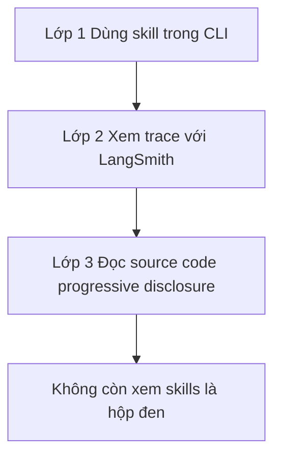

# 🧅 3 Lớp hiểu biết về Agent Skills: Từ cách dùng đến tận mã nguồn

> Nguồn: `149-The-3-Layers-of-AI-Agent-Skills-From-Usage-to-Source-Code.txt` · [Udemy](https://ua.udemy.com/course/langchain/learn/lecture/55461629)

Chào các bạn, mình là Eden đây! Trong section mới này, chúng ta sẽ đi sâu vào **agent skills (kỹ năng của agent)** và tìm hiểu chính xác chúng được triển khai như thế nào **under the hood**.

---

### 🏗️ Vì sao chúng ta dùng LangChain Deep Agents?

Section này chúng ta sẽ làm việc với bản **mã nguồn mở** của **LangChain Deep Agents** — một **agent harness (bộ khung cho agent)** mã nguồn mở, hiện thực hóa rất nhiều ý tưởng tuyệt vời.

Nhắc lại một chút: **Claude Code, Cursor CLI, Gemini CLI, Manus** — tất cả những coding agent tuyệt vời đó đều là **closed source (đóng)**, nên chúng ta không thể biết chúng được triển khai ra sao bên dưới lớp vỏ. Nhưng **LangChain Deep Agents** thì **open source**, nghĩa là chúng ta có thể mở code ra xem chính xác mọi thứ vận hành thế nào. Và đó chính là việc chúng ta sẽ làm trong section này.

Với một chủ đề "hot" như agent skills, việc chỉ biết dùng thôi là chưa đủ. Hiểu được cơ chế bên trong sẽ giúp các bạn tự tin hơn khi thiết kế skill cho agent của chính mình.

---

### 🧅 Ba lớp hiểu biết về Agent Skills

Có **ba lớp (layers)** để hiểu về agent skills, đi từ trừu tượng nhất đến chi tiết nhất:

1. **Lớp 1 — Dùng skill với tư cách người dùng:** lớp trừu tượng nhất. Chúng ta dùng **Deep Agents CLI** để thêm skill và sử dụng chúng như một người dùng bình thường.
2. **Lớp 2 — Xem trace thực thi của agent:** bóc thêm một lớp trừu tượng, chúng ta xem lại **execution trace**, quan sát các **LLM call** được thực hiện, để hiểu sâu hơn luồng chạy khi agent thực thi một skill. Lớp này dùng nền tảng **LangSmith Observability**.
3. **Lớp 3 — Đọc source code:** bóc tiếp lớp cuối, chúng ta đi vào **source code của Deep Agents**, xem đoạn code hiện thực cơ chế skill — tức cơ chế **progressive disclosure (tiết lộ dần dần)**.

| Lớp | Bạn làm gì | Công cụ | Học được gì |
|---|---|---|---|
| 1 | Dùng skill như người dùng | Deep Agents CLI | Cách thêm và sử dụng skill |
| 2 | Xem trace thực thi | LangSmith Observability | Luồng chạy và các LLM call |
| 3 | Đọc source code | Deep Agents repository | Cách hiện thực progressive disclosure |

Đây là hành trình "bóc từng lớp trừu tượng": càng đi sâu, chúng ta càng thấy rõ trách nhiệm nào thuộc về con người, trách nhiệm nào được giao lại cho LLM.

Và một điều thú vị: đôi khi "phép thuật" bên trong các agent chỉ là những bước kỹ thuật rất đời thường, được lắp ghép vô cùng khéo léo mà thôi.

---

### 💎 Sau ba lớp, bạn sẽ nắm được gì?

Sau khi đi qua cả ba lớp trừu tượng này, các bạn sẽ có **hiểu biết sâu nhất có thể** về agent skills, bởi vì các bạn sẽ:

* Biết **cách dùng** skill.
* Hiểu **cách agent vận hành** khi dùng skill.
* Và thậm chí biết **cách tự triển khai** cơ chế này nếu muốn.

Nói cách khác, các bạn sẽ không còn xem agent skills như một "hộp đen" nữa.

### 🎯 Tự kiểm tra nhanh

**Câu 1:** Vì sao section này dùng LangChain Deep Agents để học?

<b>Xem đáp án</b>

**Đáp án:** Vì đây là agent harness mã nguồn mở, có thể mở code ra xem mọi thứ vận hành.

Giải thích: Claude Code, Cursor CLI, Gemini CLI, Manus đều là closed source nên không xem được bên trong.

Tham chiếu: Mục Vì sao chúng ta dùng LangChain Deep Agents.

**Câu 2:** Ba lớp hiểu biết về agent skills là gì?

<b>Xem đáp án</b>

**Đáp án:** Dùng skill với tư cách người dùng, xem trace thực thi, đọc source code.

Giải thích: Đi từ trừu tượng nhất đến chi tiết nhất, bóc dần từng lớp abstraction.

Tham chiếu: Mục Ba lớp hiểu biết.

**Câu 3:** Ở lớp 2, chúng ta dùng nền tảng nào để xem trace?

<b>Xem đáp án</b>

**Đáp án:** LangSmith Observability.

Giải thích: Từ đó quan sát các LLM call và hiểu luồng chạy khi agent thực thi skill.

Tham chiếu: Mục Ba lớp hiểu biết.

**Câu 4:** Lớp 3 đưa chúng ta vào cơ chế nào của source code?

<b>Xem đáp án</b>

**Đáp án:** Cơ chế progressive disclosure — tiết lộ dần dần.

Giải thích: Xem chính xác đoạn code hiện thực cơ chế skill trong Deep Agents.

Tham chiếu: Mục Ba lớp hiểu biết.

**Câu 5:** Sau ba lớp, trách nhiệm nào thuộc về con người và LLM?

<b>Xem đáp án</b>

**Đáp án:** Càng đi sâu càng thấy rõ trách nhiệm nào thuộc về con người, trách nhiệm nào giao cho LLM.

Giải thích: "Phép thuật" bên trong agent thường chỉ là các bước kỹ thuật đời thường được lắp ghép khéo léo.

Tham chiếu: Mục Ba lớp hiểu biết.

Trên hết, các bạn sẽ có nền tảng để đánh giá, gỡ lỗi và tinh chỉnh skill system trong chính dự án thực tế của mình. Hy vọng các bạn sẽ thấy section này thú vị! Hãy cùng mình bắt đầu với lớp đầu tiên ở bài tiếp theo nhé! 🚀

## Nguồn tham khảo

- [Udemy — The 3 Layers of AI Agent Skills](https://ua.udemy.com/course/langchain/learn/lecture/55461629)
- [Anthropic Docs — Agent Skills overview](https://platform.claude.com/docs/en/agents-and-tools/agent-skills/overview)
- [GitHub — langchain-ai/deepagents](https://github.com/langchain-ai/deepagents)
