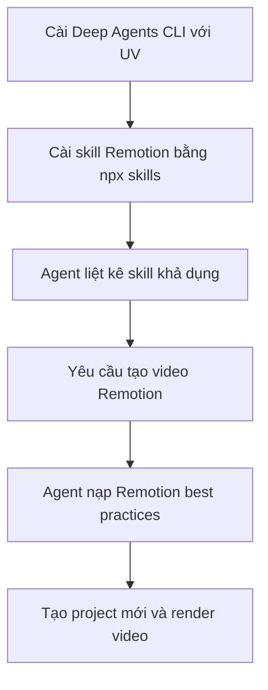

# 🎬 Level 1: Dùng Agent Skills trong Deep Agents CLI (Thực hành cùng Remotion)

> Nguồn: `150-Level-1-Using-Agent-Skills-in-the-Deep-Agents-CLI.txt` · [Udemy](https://ua.udemy.com/course/langchain/learn/lecture/55500067)

Chào các bạn, mình là Eden đây! Hôm nay chúng ta bắt đầu **lớp đầu tiên** trong hành trình hiểu về agent skills: dùng skill với tư cách người dùng, thông qua **agent harness** của LangChain Deep Agents.

Trong ví dụ này, mình sẽ cài một skill cho **Remotion** — một package rất phổ biến giúp **viết video bằng code**: nó tạo video dưới dạng **React code**. Mục tiêu là để agent harness của chúng ta tạo video với Remotion tốt hơn hẳn.

---

### ⚙️ Cài đặt Deep Agents CLI

Mình đang ở trang tài liệu LangChain, phần **Deep Agent**. Cuộn xuống, các bạn sẽ thấy hướng dẫn cài đặt: có thể cài bằng script, nhưng mình chọn cài với **UV**.

Sau khi UV cài xong toàn bộ dependencies của Deep Agents, chúng ta có **hai executable**: `deep agents` và `deep agents CLI`. Mình chạy `deep agents --help` để xem hết các tuỳ chọn, rồi chạy thử nó.

Kết quả: một thông báo cho biết **chưa có credentials** — nghĩa là mình cần khai báo LLM mà Deep Agent sẽ chạy. Mình chọn **Anthropic**: vào console, tạo một **API key** mới trong workspace mặc định, đặt tên là "Deep Agents".

*Đừng lo, key này sẽ bị thu hồi (revoked) trước khi các bạn xem video.*

Sau đó mình set biến môi trường `export ANTHROPIC_API_KEY` và chạy lại Deep Agents. Nó hoạt động! Mình gõ "hello" và nhận được câu trả lời ngay.

---

### 📦 Cài skill Remotion: chọn nơi lưu và... đọc cảnh báo rủi ro

Giờ mình muốn cài một skill để Deep Agents dùng. Mình tìm "Remotion skills" trên Google và chạy lệnh `npx skills` để thêm **Remotion dev skills** vào máy.

Điểm thú vị: công cụ sẽ hỏi bạn muốn cài skill cho **những agent nào**:

* **Cách phổ biến nhất (được khuyến nghị):** lưu skill vào thư mục `.agents/skills` — hầu hết các agent đều hỗ trợ định dạng này.
* Một số agent khác cần vị trí riêng: **Claude Code** đọc từ `.claude/skills`, còn **Open Cloud** đọc từ Skills Directory.

| Nơi lưu skill | Agent hỗ trợ |
|---|---|
| `.agents/skills` | Hầu hết agent, được khuyến nghị |
| `.claude/skills` | Claude Code |
| Skills Directory | Open Cloud |

Mình chọn cách "universal" vì Deep Agent hỗ trợ nó (dù lúc quay video nó chưa được liệt kê trong danh sách này).

Tiếp theo là lựa chọn phạm vi cài: **theo project** (ngay thư mục đang đứng) hay **global** (thư mục home). Mình chọn **global** để skill dùng được cho hầu hết agent trên máy.

Trước khi cài, công cụ hiện **đánh giá rủi ro**: agent báo skill **an toàn**, **Socket** báo **zero alerts**, còn **SNCC** thì báo có rủi ro. Mình vẫn tiến hành cài.

---

### 🎥 Xem skill "ra tay": tạo video về agent skills

Sau khi cài xong, mình mở lại Deep Agents và hỏi: **"Which skills do you have?"**. Agent liệt kê:

* **Skill Creator** — skill mặc định của LangChain Deep Agents.
* **Find Skills** — skill để tìm skill.
* **Remotion best practices** — skill chúng ta vừa cài.

Rồi mình yêu cầu: *"Hi, can you please create a Remotion video on agent skills?"*. Ngay lập tức, agent **đọc file skill** của Remotion best practices, nạp toàn bộ dữ liệu của skill — gồm một loạt file — vào context, rồi bắt đầu tạo video.

Một tình huống nhỏ: agent phát hiện mình đã có **project Remotion cũ** (do mình test trước đó). Mình yêu cầu tạo **project hoàn toàn mới** về agent skills. Agent hỏi có dùng project cũ hay scaffold project mới; mình chọn scaffold mới, chọn **tỷ lệ khung hình portrait**, xem kế hoạch rồi nói "go ahead" và **auto approve** mọi thứ.

Trong lúc agent làm việc, ở góc dưới bên phải màn hình các bạn thấy model đang dùng: **Anthropic Claude Sonnet 4.6**. Từng file lần lượt được ghi ra: các file package, dependencies được cài, rồi file `agent-skills.ts` cùng `root.ts`, và agent bắt đầu **dựng các scene** cho video.

Cuối cùng, agent **tự kiểm tra lại** (verify) rồi mình xem thành phẩm: video về agent skills hiện ra trông rất ổn. Trong video đó, các bạn thấy đúng luồng: người dùng yêu cầu tạo video Remotion về agent skills → agent kiểm tra skill → nạp **Remotion best practices** → tạo video.

---

### 💡 Bài học từ lớp 1

Chúng ta vừa thấy cách dùng agent harness của Deep Agents để **cài một skill** và để agent **tự nạp skill đó khi cần**. Điểm đáng chú ý nhất là **dynamic disclosure**: skill chỉ được nạp đúng lúc cần tạo video, chứ không "ôm" sẵn từ đầu. Và việc cài skill mới cho nhiều agent khác nhau thì đơn giản hơn mình tưởng.

### 🎯 Tự kiểm tra nhanh

**Câu 1:** Sau khi cài Deep Agents bằng UV, ta có hai executable nào?

<b>Xem đáp án</b>

**Đáp án:** `deep agents` và `deep agents CLI`.

Giải thích: Chạy `deep agents --help` để xem toàn bộ tuỳ chọn.

Tham chiếu: Mục Cài đặt Deep Agents CLI.

**Câu 2:** Vì sao thư mục `.agents/skills` được khuyến nghị?

<b>Xem đáp án</b>

**Đáp án:** Vì hầu hết các agent đều hỗ trợ định dạng này.

Giải thích: Đây là cách "universal"; Claude Code cần `.claude/skills`, Open Cloud cần Skills Directory.

Tham chiếu: Mục Cài skill Remotion.

**Câu 3:** Khi được yêu cầu tạo video Remotion, agent làm gì đầu tiên?

<b>Xem đáp án</b>

**Đáp án:** Đọc file skill Remotion best practices và nạp toàn bộ dữ liệu skill vào context.

Giải thích: Skill gồm một loạt file; sau đó agent mới bắt đầu tạo video.

Tham chiếu: Mục Xem skill ra tay.

**Câu 4:** Dynamic disclosure trong bài thể hiện như thế nào?

<b>Xem đáp án</b>

**Đáp án:** Skill chỉ được nạp đúng lúc cần tạo video, không "ôm" sẵn từ đầu.

Giải thích: Đây là bài học đáng chú ý nhất của lớp 1.

Tham chiếu: Mục Bài học từ lớp 1.

**Câu 5:** Agent liệt kê những skill nào khi được hỏi "Which skills do you have?"

<b>Xem đáp án</b>

**Đáp án:** Skill Creator, Find Skills và Remotion best practices.

Giải thích: Skill Creator là mặc định của LangChain Deep Agents; Remotion best practices là skill vừa cài.

Tham chiếu: Mục Xem skill ra tay.

Ở bài tiếp theo, chúng ta sẽ **bật tracing** để hiểu rõ hơn điều gì thực sự được gửi tới LLM. 🚀

## Nguồn tham khảo

- [Udemy — Level 1: Using Agent Skills in the Deep Agents CLI](https://ua.udemy.com/course/langchain/learn/lecture/55500067)
- [Remotion Docs — Agent Skills](https://www.remotion.dev/docs/ai/skills)
- [GitHub — remotion-dev/skills](https://github.com/remotion-dev/skills)
