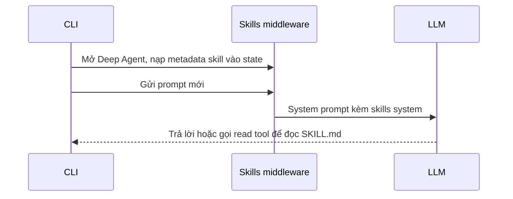

# 🔍 Level 2: Tracing Agent Skills với LangSmith — Chuyện gì thực sự được gửi vào LLM?

> Nguồn: `151-Layer-2-Tracing-AI-Agent-Skills-with-LangSmith.txt` · [Udemy](https://ua.udemy.com/course/langchain/learn/lecture/55532751)

Chào các bạn, mình là Eden đây! Ở **lớp 2** này, chúng ta sẽ **bật tracing** để tận mắt xem bên trong một lần chạy của agent: LLM được gửi những gì, skill được nạp vào lúc nào và bằng cách nào.

---

### 🔧 Bật Tracing: vài biến môi trường và một "lỗi thời" trong tài liệu

Để trace agent harness, chúng ta cần export vài **biến môi trường**: **LangChain tracing**, **LangChain API key** và **deep agents LangSmith project**.

Mình vào **LangSmith** → **Settings** → tạo một **API key** mới đặt tên "deep agents API key", copy lại, rồi quay về tài liệu để copy các biến môi trường. Biến thứ ba là tên project LangSmith, mình đặt là **"my Deep Agent execution"** (các bạn có thể đặt tên tuỳ ý). *Tất nhiên API key này sẽ bị thu hồi trước khi các bạn xem video.*

Sau khi set xong, mình chạy Deep Agents và gõ `/trace`. Kết quả: **một thông báo lỗi** cho biết LangSmith tracing chưa được cấu hình, và cần đặt **LangSmith API key** cùng **LangSmith tracing = true**. Có vẻ tài liệu cần được cập nhật! Thế là mình export thêm `LANGSMITH_TRACING=true` và `LANGSMITH_API_KEY`, mở lại Deep Agents — tracing đã bật.

Mình chào "hello", nhận câu trả lời, rồi vào LangSmith → **Applications** → refresh. Trace hiện ra: input là "hello", output là "hello, what can you do today?".

---

### 🧅 Discovery và Injection: hai middleware, hai nhiệm vụ

Khi xem chi tiết **LLM call** trong trace, các bạn sẽ thấy **danh sách tool** mà deep agent có trong tay, cùng **system prompt** đầy đủ. Đặc biệt, trong context của agent có một mục **"available skills"** — và **Remotion skill đã nằm sẵn ở đó**.

Cơ chế rất tinh tế: khi agent bắt đầu chạy, nó nạp **toàn bộ metadata** của skill — nhưng **không nạp toàn bộ skill**, vì skill gồm rất nhiều file sẽ làm phình context. Metadata chỉ gồm **tên skill**, **khi nào nên dùng**, và **skill nằm ở đâu**.

System prompt cũng nói rõ cho LLM cách dùng skill: skill tuân theo **progressive disclosure pattern** — bạn thấy tên và mô tả ở trên, nhưng chỉ đọc **toàn bộ hướng dẫn khi thật sự cần**. Các bước gồm:

1. **Nhận diện** khi nào một skill phù hợp (chọn skill để chạy).
2. **Đọc** toàn bộ hướng dẫn của skill.
3. **Làm theo** hướng dẫn của skill.
4. **Truy cập** các file hỗ trợ kèm theo.

Việc nạp metadata diễn ra ở **skill middleware before agent** — chạy ngay khi chúng ta mở Deep Agent qua CLI (phần code này mình sẽ xem ở video sau). Kết quả là **agent state** được cập nhật một danh sách metadata skill, gồm:

* **Skill creator** — skill giúp tạo skill mới.
* **Find skills** — skill để tìm skill.
* **Remotion best practices** — skill cài ở bài trước, nằm trong thư mục root tại `.agents/skills`.

Mình còn mở thư mục skill trên máy để xem bên trong: có file **`SKILL.md`** chứa **front matter** và mô tả skill; một thư mục **`rules`** đầy file markdown — ví dụ **`gifs.md`** hướng dẫn cách tạo GIF với Remotion; và thư mục **`assets`** chứa các file TypeScript mà agent có thể chạy hoặc lấy làm nguồn cảm hứng.

Nhắc lại nhanh: khi mình chỉ prompt "hello", **chưa có skill nào được nạp** — system prompt chỉ chứa metadata của skill mà thôi.

---

### 📖 Đọc trace: từ `SKILL.md` đến `rules/` và `assets/`

Rồi mình yêu cầu: *"Can you please create me a GIF on agent skills with Remotion?"*. Agent lập tức nạp **Remotion best practices**, tìm lại project video cũ, mình gõ **auto approve**, và nó render MP4 rồi chuyển thành **GIF** — xem chạy mượt phết!

Giờ hãy cùng mổ xẻ trace:

* **LLM call đầu tiên:** input gồm system prompt + toàn bộ lịch sử (mình hỏi hello, agent đáp, rồi mình hỏi GIF). Trong system prompt, agent harness đã **chỉ sẵn vị trí** file `SKILL.md` của Remotion best practices — kèm tên, mô tả và dòng kiểu *"đọc file này để lấy hướng dẫn"*. Phần này được **inject** vào system prompt ở bước mang tên **skills middleware**.
* **Middleware này nhận gì?** Nó nhận toàn bộ message hiện có, message chúng ta muốn gửi cho LLM, và cả system message của agent harness — từ đó **thêm một mục mô tả toàn bộ skill đang có**. Đây là điểm khác biệt then chốt: **before agent middleware** chỉ làm **discovery**, còn việc **inject thật sự** diễn ra ở **skills middleware** (thông qua `wrap model call`).
* **Sau khi chạy skills middleware:** system prompt xuất hiện thêm phần **"skills system"** mà trước đó không có — liệt kê mọi skill khả dụng, vị trí file, và cách đọc chúng.
* **LLM quyết định:** cần đọc `SKILL.md` của Remotion best practices. Nó dùng **file system**, gọi **read tool**, và nội dung file được đưa vào context.
* **LLM call thứ hai:** system prompt đã có skills system + nội dung file vừa đọc. Lúc này agent quyết định đọc thêm `animations.md`, `compositions.md` và `timings.md`. Thú vị là nó **không đọc `gif.md`** — và việc chọn file nào để đọc **hoàn toàn là trách nhiệm của LLM**.
* Càng đọc thêm, context càng được bổ sung, LLM càng hiểu cách dùng Remotion. Sau đó nó chuyển sang kiểm tra xem đã có project Remotion hay cần tạo mới từ đầu, và đọc thêm vài file về **text animations** và **sequencing rules**.

| Cơ chế | Thời điểm chạy | Nhiệm vụ | Kết quả |
|---|---|---|---|
| Before agent middleware | Khi mở CLI, agent khởi động | Skill discovery | Agent state có danh sách metadata skill |
| Skills middleware wrap model call | Trước mỗi LLM call | Inject skills system vào system prompt | LLM thấy skill để tự quyết định |

Mình xin dừng phần giải thích trace ở đây, vì mục tiêu của bài này là cho các bạn thấy **skill được tiết lộ dần dần (dynamic disclosure)** thế nào, chứ không phải mổ xẻ toàn bộ nội bộ deep agent.

---

### 💡 Tổng kết: Progressive Disclosure được "nạp điện" ra sao?

Có **hai điều** diễn ra mà mình muốn các bạn ghi nhớ:

1. **Khi agent được nạp:** skills middleware thực hiện **skill discovery** — xem những skill nào thật sự khả dụng với agent.
2. **Trước mỗi LLM call:** skills middleware **nạp thông tin về các skill**, để agent có thể quyết định có dùng hay không.

Sản phẩm của quá trình này là **skills system prompt** — một phần của system prompt. Chính **sự kết hợp giữa metadata của skill và system prompt** đã vận hành toàn bộ cơ chế **progressive disclosure**, vì ngay sau đó, **quyền quyết định có nạp skill hay không nằm ở LLM**.

### 🎯 Tự kiểm tra nhanh

**Câu 1:** Để bật tracing cho agent harness, cần set những biến môi trường nào?

<b>Xem đáp án</b>

**Đáp án:** LangChain tracing, LangChain API key và tên project LangSmith; khi gặp lỗi cần thêm `LANGSMITH_TRACING=true` và `LANGSMITH_API_KEY`.

Giải thích: Eden gặp thông báo lỗi vì tài liệu chưa cập nhật, phải export thêm hai biến này.

Tham chiếu: Mục Bật Tracing.

**Câu 2:** Vì sao agent chỉ nạp metadata mà không nạp toàn bộ skill?

<b>Xem đáp án</b>

**Đáp án:** Vì skill gồm rất nhiều file, nạp toàn bộ sẽ làm phình context.

Giải thích: Metadata chỉ gồm tên skill, khi nào nên dùng và skill nằm ở đâu.

Tham chiếu: Mục Discovery và Injection.

**Câu 3:** Bốn bước của progressive disclosure pattern là gì?

<b>Xem đáp án</b>

**Đáp án:** Nhận diện khi nào skill phù hợp, đọc toàn bộ hướng dẫn, làm theo hướng dẫn, truy cập các file hỗ trợ.

Giải thích: LLM chỉ đọc toàn bộ hướng dẫn khi thật sự cần.

Tham chiếu: Mục Discovery và Injection.

**Câu 4:** Việc inject skills system vào system prompt diễn ra ở đâu?

<b>Xem đáp án</b>

**Đáp án:** Ở skills middleware thông qua wrap model call.

Giải thích: Before agent middleware chỉ làm discovery; inject thật sự diễn ra trước mỗi LLM call.

Tham chiếu: Mục Đọc trace.

**Câu 5:** Ai quyết định đọc file nào trong skill?

<b>Xem đáp án</b>

**Đáp án:** LLM — ví dụ nó đọc animations.md, compositions.md, timings.md nhưng không đọc gif.md.

Giải thích: Việc chọn file để đọc hoàn toàn là trách nhiệm của LLM.

Tham chiếu: Mục Đọc trace.

Một quy trình tương tự cũng diễn ra trong **Claude Code**, **Gemini CLI**, **Manus** hay bất kỳ agent nào hỗ trợ skill system. Ở bài tiếp theo, chúng ta sẽ mở **source code** ra xem mọi thứ được viết như thế nào. 🚀

## Nguồn tham khảo

- [Udemy — Layer 2: Tracing AI Agent Skills with LangSmith](https://ua.udemy.com/course/langchain/learn/lecture/55532751)
- [LangChain Docs — Tracing quickstart](https://docs.langchain.com/langsmith/observability-quickstart)
- [LangChain Docs — LangSmith Observability](https://docs.langchain.com/langsmith/observability)
