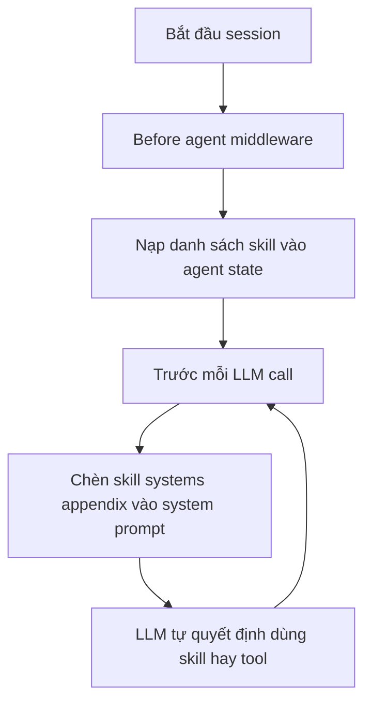

# 🔄 Recap: LangChain Deep Agents triển khai Skill Middleware thế nào?

> Nguồn: `152-RECAP-How-LangChain-Deep-Agents-Implement-Skill-Middleware.txt` · [Udemy](https://ua.udemy.com/course/langchain/learn/lecture/55532755)

Chào các bạn, mình là Eden đây! Trước khi bước vào **lớp sâu nhất** — đọc mã nguồn — chúng ta hãy dành một chút thời gian để **hệ thống hóa** những gì đã quan sát được ở phần trace. Nắm chắc phần này sẽ khiến đoạn code phía trước trở nên dễ hiểu hơn rất nhiều.

---

### 🔁 Nhắc lại "agent loop" quen thuộc

Hãy nhớ lại **agent loop (vòng lặp agent)** mà chúng ta đều đã biết:

1. Bắt đầu bằng một **LLM call** với câu hỏi.
2. LLM **quyết định có gọi tool hay không**.
3. Nếu có, tool được **thực thi**, rồi vòng lặp quay lại bước suy luận.
4. LLM tiếp tục quyết định: **trả lời luôn** hay **gọi thêm tool** khác.

Cứ như vậy cho tới khi có câu trả lời cuối cùng. Đây là nền móng mà mọi agent đều dựa vào.

---

### 🧩 Cơ chế thứ nhất: Before Agent Middleware

Vào **agent harness** của LangChain Deep Agents, nhóm LangChain đã cài đặt một **before agent middleware**. Cơ chế này chạy **khi session bắt đầu nạp và agent chuẩn bị hoạt động**: việc đầu tiên là **nạp toàn bộ skill khả dụng vào bộ nhớ của agent**.

Đây chính là **skill discovery** — xem agent có những skill nào, **tên** là gì và **nằm ở đâu**. Kết quả được lưu vào **agent state (bộ nhớ của agent)**.

---

### 📬 Cơ chế thứ hai: Middleware trước mỗi LLM call

LangChain còn thêm một middleware **chạy trước mỗi LLM call**. Nhiệm vụ của nó là **nối thêm "skill systems appendix" vào system prompt**.

Phần phụ lục này chứa:

* **Toàn bộ skill khả dụng** của agent.
* **Vị trí của chúng**.
* **Vài hướng dẫn về cách progressive disclosure hoạt động**.

Nhờ vậy, ở **mỗi request**, agent luôn có phần này trong system prompt và hành xử dựa trên nó: hoặc **quyết định dùng một skill**, hoặc **quyết định dùng một tool** khác mà nó sở hữu. Đây chính xác là hành vi chúng ta đã quan sát trong các trace ở bài trước.

---

### 🎯 Ghi nhớ gì trước khi mở code?

Tóm gọn lại thành hai bước:

1. **Discovery** — nạp danh sách skill vào state ngay khi bắt đầu session.
2. **Injection** — đưa skill vào system prompt trước mỗi lần gọi LLM, để LLM tự quyết định.

| Cơ chế | Chạy khi nào | Làm gì | Kết quả |
|---|---|---|---|
| Before agent middleware | Session bắt đầu | Skill discovery | State lưu tên và vị trí skill |
| Middleware trước mỗi LLM call | Trước từng request | Nối skill systems appendix | System prompt luôn có danh sách skill |

### 🎯 Tự kiểm tra nhanh

**Câu 1:** Agent loop quen thuộc gồm những bước nào?

<b>Xem đáp án</b>

**Đáp án:** LLM call với câu hỏi, LLM quyết định gọi tool hay không, thực thi tool nếu có, rồi quay lại suy luận.

Giải thích: Cứ như vậy tới khi có câu trả lời cuối cùng — đây là nền móng mọi agent dựa vào.

Tham chiếu: Mục Nhắc lại agent loop.

**Câu 2:** Before agent middleware chạy khi nào và làm gì?

<b>Xem đáp án</b>

**Đáp án:** Chạy khi session bắt đầu nạp và agent chuẩn bị hoạt động; nạp toàn bộ skill khả dụng vào bộ nhớ agent.

Giải thích: Đây chính là skill discovery — xem skill nào, tên gì, nằm ở đâu; kết quả lưu vào agent state.

Tham chiếu: Mục Cơ chế thứ nhất.

**Câu 3:** Middleware trước mỗi LLM call có nhiệm vụ gì?

<b>Xem đáp án</b>

**Đáp án:** Nối thêm "skill systems appendix" vào system prompt.

Giải thích: Nhờ vậy ở mỗi request, agent luôn hành xử dựa trên phần này.

Tham chiếu: Mục Cơ chế thứ hai.

**Câu 4:** Skill systems appendix chứa những gì?

<b>Xem đáp án</b>

**Đáp án:** Toàn bộ skill khả dụng, vị trí của chúng và vài hướng dẫn về cách progressive disclosure hoạt động.

Giải thích: LLM dựa vào đó để quyết định dùng skill hay dùng tool khác.

Tham chiếu: Mục Cơ chế thứ hai.

**Câu 5:** Hai mảnh ghép làm nên toàn bộ cơ chế skill là gì?

<b>Xem đáp án</b>

**Đáp án:** Discovery (nạp vào state khi bắt đầu session) và Injection (đưa vào system prompt trước mỗi LLM call).

Giải thích: Đây là những gì cần ghi nhớ trước khi mở source code.

Tham chiếu: Mục Ghi nhớ gì trước khi mở code.

Đó là hai mảnh ghép làm nên toàn bộ cơ chế skill trong deep agents. Và ở bài tiếp theo, chúng ta sẽ mở **source code** ra xem chúng được viết như thế nào. Hẹn gặp lại các bạn! 🚀

## Nguồn tham khảo

- [Udemy — RECAP: How LangChain Deep Agents Implement Skill Middleware](https://ua.udemy.com/course/langchain/learn/lecture/55532755)
- [LangChain Reference — SkillsMiddleware](https://reference.langchain.com/python/deepagents/middleware/skills)
- [Anthropic Engineering — Equipping agents for the real world with Agent Skills](https://www.anthropic.com/engineering/equipping-agents-for-the-real-world-with-agent-skills)
