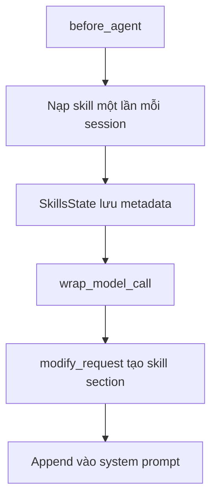

# 🧬 Level 3: Bên trong `skills.py` — Cơ chế Progressive Disclosure

> Nguồn: `153-Layer-3-Inside-skillspy--The-Mechanics-of-Progressive-Disclo.txt` · [Udemy](https://ua.udemy.com/course/langchain/learn/lecture/55545431)

Chào các bạn, mình là Eden đây! Hôm nay chúng ta sẽ chạm tới **tầng sâu nhất** có thể khi nói về agent skills: đọc trực tiếp **mã nguồn** của agent harness trong **LangChain Deep Agents** để xem cơ chế progressive disclosure được viết ra sao.

---

### 📂 Tìm đến "trái tim" của skill mechanism

Mình đang ở **GitHub repository của Deep Agents**. Toàn bộ logic skill nằm ở đường dẫn: `libs` → `deepagents` → `deepagents` → `middleware`, trong file tên là **`skills.py`**.

Và đây là điều thú vị: **toàn bộ logic của cơ chế skill và dynamic disclosure** trong bản triển khai của LangChain chỉ gói gọn trong **khoảng 800 dòng code**. Chúng ta cùng xem nhé.

*Nhắc lại một chút về **agent loop**: mọi thứ bắt đầu từ một LLM call, rồi LLM quyết định có gọi tool hay không, thực thi tool, và tiếp tục suy luận.*



---

### ⚙️ `before_agent`: nạp skill đúng một lần mỗi session

Việc đầu tiên agent harness làm với skill: **khi bắt đầu session, nó nạp skill vào state của agent**. Trong code, mình tìm đến hàm **`before_agent`** — hàm này nhận **agent state** và cập nhật **`SkillsState`**, một vùng đặc biệt trong state lưu toàn bộ dữ liệu về skill.

Vài điểm đáng chú ý trong đoạn code này:

* Skill được nạp **một lần mỗi session**, từ **tất cả các nguồn (sources)** đã cấu hình.
* Nếu metadata của skill **đã tồn tại**, nó sẽ được **bỏ qua** (skip).
* Tài liệu trong code ghi rõ: skill được nạp theo **thứ tự nguồn**, và **nguồn sau sẽ ghi đè nguồn trước** nếu trùng tên skill. Đây là một **lựa chọn implementation (implementation choice)** của nhóm LangChain khi thiết kế harness — tốt hay xấu thì mình không mổ xẻ ở đây, nhưng đáng để biết.

Code cũng có một đối tượng gọi là **`backend`**. Vì harness hỗ trợ **nhiều backend**, hiện tại backend của chúng ta là **file system cục bộ**, nhưng hoàn toàn có thể là **Firestore trên Google Cloud**, **BigTable**, hay bất kỳ backend nào khác. *Điều này cực kỳ linh hoạt nếu bạn muốn có skill "trên mây".*

Rồi hàm gọi tới **`list_skills`** — hàm này quét các thư mục con của skill, tải toàn bộ nội dung, **parse YAML front matter**, và trả về metadata (ví dụ với file `SKILL.md` và vài file helper `.py`). Phần parsing này khá "xấu xí" và chẳng có gì đặc biệt, nên mình không đi sâu.

Sau khi có dữ liệu, code **lặp qua từng skill**, lấy **tên skill** làm key và toàn bộ metadata làm value — tạo thành một **dictionary**, rồi gom các value thành **một list lớn**. Khi xem lại trace LangSmith, các bạn sẽ thấy đúng thứ này: **skills middleware before agent** chạy xong thì cập nhật trường **skill metadata** chứa **ba skill** đã cấu hình, mỗi phần tử là một dictionary metadata đầy đủ. Đây chính là phần đầu tiên trong toàn bộ quá trình thực thi của agent.

---

### 🔍 `wrap_model_call` và `modify_request`: chèn skill vào system prompt

Đây là phần thú vị nhất. **Trước mỗi LLM call**, harness chạy **skill before model middleware** để **cập nhật system prompt theo metadata của skill**. Việc này diễn ra trong **`wrap_model_call`** — nó lấy **request** ta muốn gửi cho LLM, **sửa lại**, rồi gửi **request đã chỉnh sửa**.

Cụ thể, hàm **`modify_request`** thực hiện logic chèn skill:

1. Lấy từ **state** toàn bộ metadata của skill, **tên skill**, và **đường dẫn tới các file `SKILL.md`**.
2. Tạo **skill section** — phần sẽ được **nối (append) vào system prompt**.
3. Điền dữ liệu vào template system prompt mang tên **`SKILLS_SYSTEM_PROMPT`** — một đoạn **boilerplate** chứa đầy đủ **hướng dẫn xử lý skill và progressive disclosure**, cùng hai chỗ trống là **`skill_locations`** và **`skills_list`** mà agent đã có sẵn.

| Hàm | Chạy khi nào | Nhiệm vụ | Kết quả |
|---|---|---|---|
| `before_agent` | Bắt đầu session | Nạp skill từ các nguồn, parse YAML front matter | `SkillsState` chứa metadata |
| `wrap_model_call` | Trước mỗi LLM call | Sửa request, điền template `SKILLS_SYSTEM_PROMPT` | System prompt có skill section |

Và việc này diễn ra **trước mỗi request** gửi tới agent.

---

### 💡 Bài học đẹp nhất của cả đoạn code

Có một điều cực kỳ quan trọng: **khi agent quyết định nạp gì từ skill, quyền quyết định hoàn toàn thuộc về LLM.** Chính vì thế, chúng ta cần viết file `SKILL.md` **như một bảng mục lục (index)** — thật dễ tiếp cận, thật dễ hiểu, để LLM có thể chọn đúng file cần progressive disclosure.

---

### 💻 Trích đoạn code — `SkillsState` và `before_agent` trong `skills.py`

Hai phần cốt lõi của cơ chế skill trong repo **LangChain Deep Agents** (`libs/deepagents/deepagents/middleware/skills.py`). *Lưu ý: bản trên GitHub hiện tại đã dài hơn bản trong video, nhưng logic `before_agent` vẫn đúng như mình phân tích:*

```python
class SkillsState(AgentState):
    """State for the skills middleware."""

    skills_metadata: NotRequired[Annotated[list[SkillMetadata] | None, OmitFromOutput]]
    """List of loaded skill metadata from configured sources."""
    skills_load_errors: NotRequired[Annotated[list[str], PrivateStateAttr]]
    """Skill source loading errors."""


def before_agent(self, state: SkillsState, runtime: Runtime, config: RunnableConfig) -> SkillsStateUpdate | None:
    """Load skills metadata before agent execution (synchronous)."""
    # Skip if skills are already loaded (even if empty); None requests a reload
    if state.get("skills_metadata") is not None:
        return None

    backend = self._backend
    all_skills: dict[str, SkillMetadata] = {}
    skills_load_errors: list[str] = []

    # Load skills from each source in order
    # Later sources override earlier ones (last one wins)
    for source_path in self.sources:
        source_skills, source_error = _list_skills_with_errors(backend, source_path)
        if source_error is not None:
            skills_load_errors.append(source_error)
        for skill in source_skills:
            all_skills[skill["name"]] = skill

    if skills_load_errors:
        logger.warning("Skills load errors: %s", skills_load_errors)
    return SkillsStateUpdate(
        skills_metadata=list(all_skills.values()), skills_load_errors=skills_load_errors
    )
```

---

### 🎯 Tự kiểm tra nhanh

**Câu 1:** `before_agent` làm gì với skill?

<details>
<summary><b>Xem đáp án</b></summary>

**Đáp án:** Nạp skill một lần mỗi session từ tất cả các nguồn đã cấu hình và cập nhật `SkillsState`.

Giải thích: Nếu metadata đã tồn tại thì bị bỏ qua; nguồn sau ghi đè nguồn trước khi trùng tên.

Tham chiếu: Mục before_agent.

</details>

**Câu 2:** Vì sao harness hỗ trợ nhiều backend lại quan trọng?

<details>
<summary><b>Xem đáp án</b></summary>

**Đáp án:** Vì skill có thể nằm trên file system cục bộ, Firestore, BigTable hay bất kỳ backend nào khác.

Giải thích: Điều này cực kỳ linh hoạt nếu muốn có skill "trên mây".

Tham chiếu: Mục before_agent.

</details>

**Câu 3:** `list_skills` trả về gì?

<details>
<summary><b>Xem đáp án</b></summary>

**Đáp án:** Metadata của skill sau khi quét thư mục con, tải nội dung và parse YAML front matter.

Giải thích: Code lặp qua từng skill, lấy tên làm key và metadata làm value, gom thành một list lớn.

Tham chiếu: Mục before_agent.

</details>

**Câu 4:** `modify_request` chèn gì vào system prompt?

<details>
<summary><b>Xem đáp án</b></summary>

**Đáp án:** Skill section được tạo từ metadata, điền vào template `SKILLS_SYSTEM_PROMPT` cùng `skill_locations` và `skills_list`.

Giải thích: Việc này diễn ra trước mỗi request gửi tới agent.

Tham chiếu: Mục wrap_model_call và modify_request.

</details>

**Câu 5:** Ai quyết định nạp file nào từ skill, và điều đó nghĩa là gì khi viết `SKILL.md`?

<details>
<summary><b>Xem đáp án</b></summary>

**Đáp án:** LLM quyết định — vì thế `SKILL.md` cần được viết như một bảng mục lục dễ hiểu.

Giải thích: Harness chỉ chuẩn bị metadata sẵn; trách nhiệm chọn đúng file thuộc về LLM.

Tham chiếu: Mục Bài học đẹp nhất.

</details>

Tóm lại, phần lớn code trong file chỉ là **duyệt file system và parse YAML front matter** — không có gì cao siêu, nhưng là **smart engineering**. Và theo mình, điều đẹp nhất của bản triển khai này là: **trách nhiệm chọn đúng file thuộc về LLM**, còn agent harness — ở đây là LangChain Deep Agents — chỉ **chuẩn bị sẵn metadata** và để LLM tự quyết định.

Hết section rồi! Hy vọng các bạn thấy phần này thú vị và hẹn gặp lại ở những section tiếp theo của khóa học. 🚀

## Nguồn tham khảo

- [Udemy — Layer 3: Inside skills.py](https://ua.udemy.com/course/langchain/learn/lecture/55545431)
- [GitHub — deepagents/libs/deepagents/deepagents/middleware/skills.py](https://github.com/langchain-ai/deepagents/blob/main/libs/deepagents/deepagents/middleware/skills.py)
- [LangChain Reference — SkillsMiddleware](https://reference.langchain.com/python/deepagents/middleware/skills)
