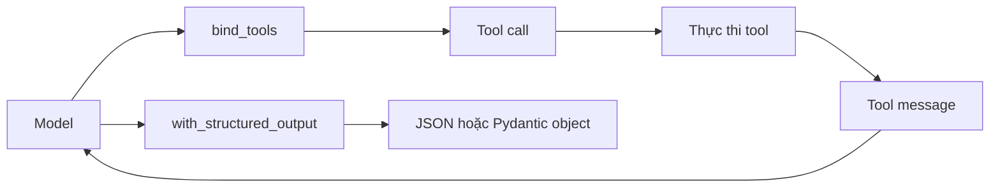

# 🧠 Chat Models: Cánh cổng chuẩn hóa để trò chuyện với mọi LLM

> Nguồn: `157-ChatModels.txt` · [Udemy](https://ua.udemy.com/course/langchain/learn/lecture/51227279)

Chào các bạn, hành trình "phá đảo" kho từ điển LangChain của chúng ta tiếp tục với một khái niệm nền tảng nhất: **chat model object**. Đây sẽ là giao diện chính mà các bạn dùng để tương tác với mọi mô hình ngôn ngữ lớn trong suốt khóa học, nên mình muốn các bạn nắm thật chắc bài này nhé.

### 🎯 Chat Model — giao diện chính để nói chuyện với LLM

Chat model object là **cách chuẩn hóa** mà LangChain cung cấp để chúng ta trò chuyện với các LLM: GPT-4, Claude của Anthropic, Gemini của Google, và cả những mô hình open source như Llama của Facebook (thông qua llama).

Về mặt lịch sử, nhiều LLM chỉ nhận vào **một chuỗi văn bản** và trả về **một chuỗi văn bản**. Nhưng các LLM hiện đại được thiết kế cho hội thoại, nên chúng hoạt động tốt nhất khi ta đưa vào **một danh sách các message** đại diện cho cuộc đối thoại cùng lịch sử trò chuyện — và chúng trả về một message. Đó chính là lõi của **chat model interface**:

* **Đầu vào:** danh sách các message có cấu trúc, ví dụ chỉ thị từ system (system instruction), câu hỏi hay phản hồi của người dùng.
* **Đầu ra:** một **AI message** đại diện cho phản hồi của mô hình.

Mỗi message đều có **role (vai trò)** — system cho chỉ thị, human cho dữ liệu người dùng, assistant cho phản hồi của AI — và **content** có thể là văn bản đơn giản hoặc một danh sách **content block**, nơi dữ liệu đa phương thức như hình ảnh có thể được nhúng vào.

---

### 🔧 Tool calling và structured output — hai siêu năng lực đáng chú ý

**Tool calling** cho phép LLM tương tác với thế giới bên ngoài. Hãy tưởng tượng một phép toán: nếu không có tool calling, LLM hoàn toàn có thể **"bịa" (hallucinate)** ra đáp án; nhưng khi có tool calling, nó sẽ **chọn và thực thi một math tool** để trả về kết quả chính xác. LangChain mang đến cách chuẩn để **bind (gắn) các tool** vào model, từ đó xây dựng những agent có thể hành động theo yêu cầu người dùng: gửi email, lấy dữ liệu từ database, hay tích hợp với bất kỳ external API nào. Chủ đề này sẽ được đào sâu rất kỹ trong khóa học.

Bên cạnh đó, **under the hood**, tool calling còn được dùng để **trích xuất thông tin có cấu trúc từ văn bản phi cấu trúc**, mở ra một khả năng quan trọng khác: **structured output**. Thay vì nhận văn bản tự do, ta có thể yêu cầu model trả về **JSON** hoặc một **Pydantic object** đoán trước được để ứng dụng xử lý tiếp thật dễ dàng. Ví dụ: từ một câu mô tả của người dùng, ta muốn tách ra **tên, email và số điện thoại** thành một object cố định. LangChain đơn giản hóa việc này bằng phương thức **`with_structured_output`**.

Cả hai siêu năng lực này đều xoay quanh một vòng lặp chung giữa model, tool và kết quả trả về:

---

### 🖼️ Multi-modality và lớp trừu tượng đa nhà cung cấp

Văn bản là nền tảng của mọi thứ, nhưng các model ngày nay ngày càng có khả năng xử lý **hình ảnh và video**. Các bạn có thể gửi kèm một bức ảnh trong prompt để yêu cầu model **mô tả nội dung**, **phân tích**, hay thực hiện các tác vụ khác trên đó.

Điểm tuyệt vời là LangChain đóng vai trò **lớp trừu tượng (abstraction layer)** cho tất cả các model này. Thay vì viết code riêng cho OpenAI, rồi code khác cho Anthropic, rồi lại code khác cho Google, ta chỉ cần dùng chung chat model interface của LangChain — **một cách gọi nhất quán, bất kể nhà cung cấp là ai**.

* Các integration có sẵn cho **OpenAI, Anthropic, Google, Azure OpenAI** và rất nhiều provider khác.
* Chúng được tổ chức gọn gàng thành các package như **`langchain-openai`**, **`langchain-llama`**, **`langchain-vertexai`**...

---

### ⚙️ Giao diện model cơ bản và cách khởi tạo

Mọi chat model đều kế thừa từ một interface chung với các phương thức then chốt:

1. **`invoke`** — nhận vào danh sách message, trả về một message phản hồi duy nhất. Đây là phương thức cơ bản nhất.
2. **`stream`** — trả về từng phần kết quả (chunk) ngay khi được sinh ra, cực kỳ hữu ích cho các ứng dụng chat cần phản hồi **theo từng token** trong thời gian thực.
3. **`batch`** — gửi nhiều prompt cùng lúc một cách hiệu quả.
4. **`bind_tools`** — gắn external tool vào model để kích hoạt tool calling.
5. **`with_structured_output`** — wrapper tiện lợi để nhận phản hồi có cấu trúc.

| Phương thức | Đầu vào | Đầu ra | Dùng khi nào |
|---|---|---|---|
| `invoke` | Danh sách message | Một message phản hồi | Gọi model ở dạng cơ bản nhất |
| `stream` | Danh sách message | Từng chunk ngay khi sinh ra | Chat cần phản hồi theo token thời gian thực |
| `batch` | Nhiều prompt | Nhiều kết quả | Chạy số lượng lớn một cách hiệu quả |
| `bind_tools` | Danh sách tool | Model đã được gắn tool | Kích hoạt tool calling |
| `with_structured_output` | Schema mong muốn | JSON hoặc Pydantic object | Trích xuất dữ liệu có cấu trúc |

Ngoài ra, chat model còn hỗ trợ **async operations** (gọi đồng thời nhiều request), **batch processing**, **streaming API** mạnh mẽ, và tích hợp sẵn với **LangSmith** — nền tảng tracing và debugging giúp giám sát ứng dụng của bạn.

Khi khởi tạo một chat model, có vài tham số quan trọng bạn cần nhớ:

* **Model name:** gần như luôn phải chỉ định, ví dụ GPT-4 hay Claude 3 Sonnet.
* **Temperature:** điều khiển độ sáng tạo — **0.0** cho kết quả ổn định, tập trung; **1.0** cho kết quả ngẫu nhiên, bay bổng hơn.
* **Max tokens:** giới hạn độ dài phản hồi, hữu ích để **kiểm soát chi phí** và tối ưu kích thước đầu ra.
* **Stop sequences:** cho model biết khi nào nên dừng sinh văn bản, hữu ích trong các kỹ thuật định dạng đặc thù.
* **Timeout và max retries:** cực kỳ quan trọng cho **độ bền vững (robustness)** khi mạng có vấn đề hoặc provider gặp sự cố tạm thời — chuyện xảy ra rất thường xuyên khi scale.
* **API key** và có thể cả **base URL** nếu bạn dùng dịch vụ cloud.

*Lưu ý nhỏ: LangChain chuẩn hóa rất nhiều tham số chung, nhưng một số model có tham số riêng của nhà cung cấp — hãy luôn kiểm tra tài liệu integration cụ thể. Chúng ta sẽ thấy ví dụ này khi làm việc với Gemini của Google.*

### 🎯 Tự kiểm tra nhanh

**Câu 1:** Chat model nhận đầu vào và trả ra đầu ra như thế nào?

<b>Xem đáp án</b>

**Đáp án:** Nhận vào một danh sách message có cấu trúc và trả về một AI message.

Giải thích: Đây chính là lõi của chat model interface, khác với LLM cũ chỉ nhận và trả chuỗi văn bản.

Tham chiếu: Mục Chat Model — giao diện chính.

**Câu 2:** Vì sao LangChain được gọi là lớp trừu tượng đa nhà cung cấp?

<b>Xem đáp án</b>

**Đáp án:** Vì ta dùng chung một cách gọi nhất quán cho mọi model — OpenAI, Anthropic, Google, Azure...

Giải thích: Các integration được tổ chức thành package riêng như `langchain-openai`, `langchain-llama`, `langchain-vertexai`.

Tham chiếu: Mục Multi-modality và lớp trừu tượng đa nhà cung cấp.

**Câu 3:** `stream` khác `invoke` ở điểm nào?

<b>Xem đáp án</b>

**Đáp án:** `stream` trả về từng phần kết quả (chunk) ngay khi được sinh ra, còn `invoke` trả về một message phản hồi duy nhất.

Giải thích: Streaming rất hữu ích cho ứng dụng chat cần phản hồi theo từng token trong thời gian thực.

Tham chiếu: Mục Giao diện model cơ bản.

**Câu 4:** Tool calling giúp gì cho ví dụ phép toán?

<b>Xem đáp án</b>

**Đáp án:** Model chọn và thực thi một math tool để trả kết quả chính xác thay vì "bịa" (hallucinate) đáp án.

Giải thích: LangChain cung cấp cách chuẩn để bind tool vào model, từ đó xây dựng agent biết hành động.

Tham chiếu: Mục Tool calling và structured output.

**Câu 5:** `with_structured_output` dùng để làm gì?

<b>Xem đáp án</b>

**Đáp án:** Yêu cầu model trả về JSON hoặc Pydantic object thay vì văn bản tự do.

Giải thích: Ví dụ điển hình là tách tên, email và số điện thoại từ câu mô tả của người dùng.

Tham chiếu: Mục Tool calling và structured output.

Vậy là các bạn đã có trong tay "bản đồ" của chat model object — giao diện quan trọng nhất trong toàn bộ khóa học. Hẹn gặp lại ở bài tiếp theo, khi chúng ta mổ xẻ **Messages** — những "viên gạch" tạo nên mọi cuộc hội thoại! 🚀

## Nguồn tham khảo

- [Udemy — ChatModels](https://ua.udemy.com/course/langchain/learn/lecture/51227279)
- [LangChain Docs — Models](https://docs.langchain.com/oss/python/langchain/models)
- [LangChain Docs — Chat model integrations](https://docs.langchain.com/oss/python/integrations/chat)
