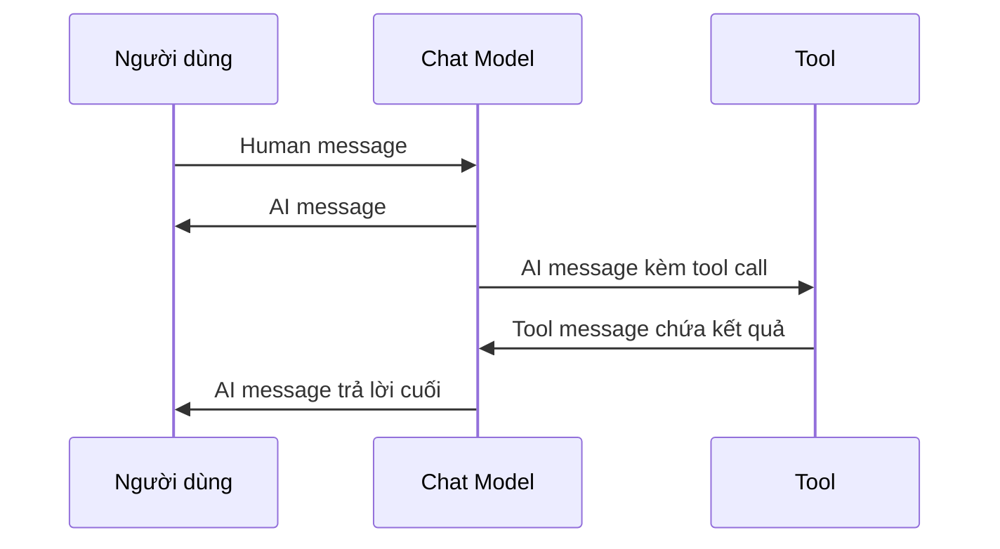

# 💬 Messages: "Viên gạch" nền tảng của mọi cuộc trò chuyện với LLM

> Nguồn: `158-Messages.txt` · [Udemy](https://ua.udemy.com/course/langchain/learn/lecture/51233211)

Chào các bạn, sau khi đã làm quen với **Chat Models**, hôm nay mình và các bạn sẽ tìm hiểu về thứ được gửi qua lại bên trong mọi lời gọi model: **Messages**. Hiểu rõ message object chính là nắm được "ngữ pháp" của mọi cuộc hội thoại với LLM trong LangChain.

### 🧱 Role và Content — hai phần không thể thiếu của một message

Messages là **đơn vị giao tiếp cơ bản nhất** với các LLM. Khi làm việc với chat model trong LangChain, chúng chuyên chở cả **đầu vào** ta gửi cho model lẫn **đầu ra** ta nhận về.

Mỗi message luôn có hai phần cốt lõi:

* **Role (vai trò):** cho model biết ai là người gửi message.
* **Content (nội dung):** thông tin thực sự được truyền đi — thường là văn bản, nhưng cũng có thể là **hình ảnh, video** hoặc dữ liệu khác đối với các model đa phương thức (multimodal).

LangChain chuẩn hóa các message này, giúp ta làm việc với mọi nhà cung cấp chat model theo **một định dạng nhất quán**. Nghĩa là bất kể bạn đang dùng LLM nào, giao diện vẫn y hệt — vô cùng, vô cùng tiện lợi.

---

### 👥 Bốn vai trò bạn sẽ gặp

**1. System message:** dùng để **thiết lập hành vi của AI** hoặc cung cấp ngữ cảnh ban đầu. Ví dụ, bạn có thể yêu cầu model đóng vai "một trợ lý hữu ích", hay tóm tắt các tài liệu phức tạp thật ngắn gọn.

*Tuy nhiên, không phải model nào cũng xử lý system message giống nhau:* có model dùng một tham số riêng, có model tích hợp nó vào lịch sử message, và số ít hoàn toàn không hỗ trợ. LangChain sẽ xử lý những khác biệt này giúp ta và tạo ra một giao diện duy nhất.

**2. User message:** đại diện cho đầu vào từ con người hoặc hệ thống tương tác với model — trong LangChain ta dùng lớp **`HumanMessage`**. Khi gửi văn bản như một câu hỏi hay chỉ thị, ta sẽ "bọc" nội dung đó trong HumanMessage. LangChain còn có **shortcut**: nếu bạn invoke model chỉ với một chuỗi string, nó sẽ **tự động được xem là một human message**.

**3. Assistant message:** là phản hồi của model, được đại diện bởi lớp **`AIMessage`**. Message này chứa nội dung chính do LLM sinh ra, cùng các thông tin khác như **metadata, tool calls, thông tin token usage** và **định danh duy nhất (unique identifier)** phục vụ việc gỡ lỗi.

**4. Tool message:** dùng để thông báo cho AI **kết quả thực thi của tool**. Ví dụ, nếu bạn gọi một tool lấy thời tiết ở đâu đó, câu trả lời sẽ được bọc trong **`ToolMessage`** — đó là cách ta nói với model rằng "đây là kết quả của tool call" để nó đưa ra câu trả lời cuối cùng.

*Đừng lo nếu phần tool message chưa thật sự rõ ràng ngay lúc này — mình sẽ giải thích rất kỹ khi chúng ta bước vào chủ đề agents và function calling.*

Bảng tóm tắt nhanh bốn vai trò để các bạn dễ tra cứu về sau:

| Vai trò | Class trong LangChain | Nội dung chính | Ghi chú |
|---|---|---|---|
| System | SystemMessage | Chỉ thị hành vi, ngữ cảnh ban đầu | Mỗi provider xử lý một kiểu, LangChain chuẩn hóa lại |
| Human | HumanMessage | Đầu vào từ người dùng | Gửi string thuần sẽ tự động thành human message |
| AI | AIMessage | Phản hồi do model sinh ra | Kèm metadata, tool calls, token usage và ID |
| Tool | ToolMessage | Kết quả thực thi tool | Cách báo cho model biết kết quả của tool call |

---

### 🔄 Thứ tự message — nhịp điệu của một cuộc hội thoại mạch lạc

Thứ tự các message rất quan trọng để tạo nên một cuộc trò chuyện liền mạch. Một luồng điển hình sẽ **luân phiên giữa đầu vào của người dùng và phản hồi của trợ lý**:

1. Human message
2. AI message
3. Human message
4. AI message...

Nếu có tool tham gia, luồng sẽ phức tạp hơn một chút: **human message → AI message kèm tool call → tool message chứa kết quả → AI message dùng kết quả đó để trả lời**... và cứ tiếp tục như vậy.

Toàn bộ nhịp điệu đó gói gọn trong sơ đồ sau:

### 🎯 Tự kiểm tra nhanh

**Câu 1:** Hai phần cốt lõi mà mọi message luôn có là gì?

<b>Xem đáp án</b>

**Đáp án:** Role (vai trò) và Content (nội dung).

Giải thích: Role cho model biết ai gửi, content chở thông tin thực sự được truyền đi — có thể là văn bản, hình ảnh, video.

Tham chiếu: Mục Role và Content.

**Câu 2:** `HumanMessage` và `AIMessage` khác nhau thế nào?

<b>Xem đáp án</b>

**Đáp án:** HumanMessage đại diện cho đầu vào của người dùng, AIMessage là phản hồi của model.

Giải thích: AIMessage còn chứa metadata, tool calls, thông tin token usage và định danh phục vụ gỡ lỗi.

Tham chiếu: Mục Bốn vai trò bạn sẽ gặp.

**Câu 3:** Điều gì xảy ra nếu bạn invoke model chỉ với một chuỗi string?

<b>Xem đáp án</b>

**Đáp án:** Chuỗi đó tự động được xem là một human message.

Giải thích: Đây là shortcut của LangChain để thao tác nhanh gọn hơn.

Tham chiếu: Mục Bốn vai trò bạn sẽ gặp.

**Câu 4:** `ToolMessage` dùng để làm gì?

<b>Xem đáp án</b>

**Đáp án:** Thông báo cho AI kết quả thực thi của tool.

Giải thích: Ví dụ gọi tool lấy thời tiết, câu trả lời được bọc trong ToolMessage để model biết đó là kết quả của tool call.

Tham chiếu: Mục Bốn vai trò bạn sẽ gặp.

**Câu 5:** Vì sao thứ tự message quan trọng?

<b>Xem đáp án</b>

**Đáp án:** Để tạo nên một cuộc trò chuyện liền mạch, có nhịp luân phiên giữa người dùng và trợ lý.

Giải thích: Khi có tool, luồng mở rộng thành human → AI kèm tool call → tool → AI trả lời cuối.

Tham chiếu: Mục Thứ tự message.

Tóm lại, message object cho chúng ta một cách nhất quán để xây dựng các cuộc hội thoại, **che giấu đi định dạng message riêng biệt của từng nhà cung cấp**. Nắm chắc "viên gạch" này, các bạn đã sẵn sàng cho những phần thực chiến phía trước. Hẹn gặp lại ở bài tiếp theo! 🚀

## Nguồn tham khảo

- [Udemy — Messages](https://ua.udemy.com/course/langchain/learn/lecture/51233211)
- [LangChain Docs — Messages](https://docs.langchain.com/oss/python/langchain/messages)
