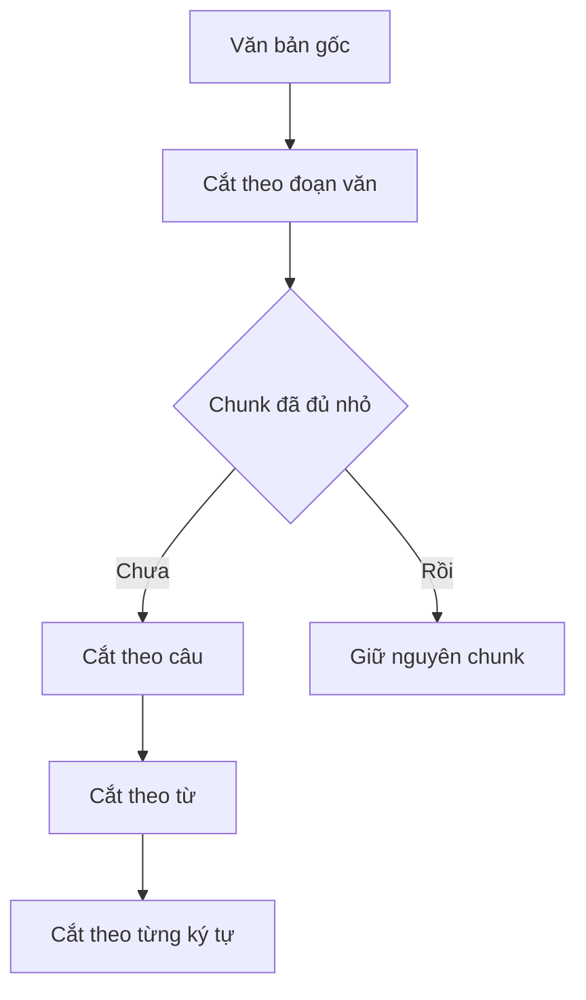

# ✂️ RecursiveCharacterTextSplitter: Chia nhỏ văn bản mà không phá vỡ ngữ nghĩa

> Nguồn: `159-RecursiveCharacterTextSplitter.txt` · [Udemy](https://ua.udemy.com/course/langchain/learn/lecture/51340375)

Chào các bạn, hôm nay mình và các bạn sẽ cùng "mổ xẻ" một utility class có tên nghe khá "xoắn lưỡi": **RecursiveCharacterTextSplitter**. Đúng như cái tên dài dòng của nó, đây là công cụ chuyên giúp chúng ta **chia nhỏ các tài liệu lớn thành những chunk (đoạn) nhỏ hơn** — một bước không thể thiếu trong bất kỳ pipeline RAG nào.

### 🧩 Vấn đề: tài liệu thì dài, prompt thì có hạn

Khi làm việc với LLM, ta không thể "tống" cả một tài liệu dài vào prompt. Giải pháp quen thuộc là chia nó thành các chunk. Nhưng cắt kiểu gì mới là câu hỏi khó?

* Cắt theo **độ dài cố định (fixed length)** thì đơn giản, nhưng rất dễ cắt ngang câu, ngang ý.
* Cắt theo **số ký tự (character)** hay **token** cũng vậy — mảnh ghép có thể rơi vào giữa một cụm từ.

Đó là lý do **RecursiveCharacterTextSplitter** ra đời: một utility class chia văn bản **một cách đệ quy (recursively)** theo ký tự, với mục tiêu tối thượng là **giữ những phần văn bản liên quan về mặt ngữ nghĩa nằm cạnh nhau**.

---

### 🪜 Chiến lược đệ quy: từ đoạn văn, xuống câu, xuống từ, rồi từng ký tự

Tính **"đệ quy"** của splitter này thể hiện ở chiến lược chia văn bản bằng cách **lần lượt thử từng cấp độ dấu phân cách (separator)** theo thứ tự phân cấp, cho đến khi các chunk đủ nhỏ:

1. Bắt đầu với **dấu phân cách lớn** tương ứng với các đơn vị ngữ nghĩa lớn — ví dụ **đoạn văn (paragraph)** sẽ được cắt bởi **hai dấu xuống dòng** `\n\n`.
2. Nếu sau khi cắt mà một chunk vẫn còn quá lớn, nó sẽ **đệ quy xuống các dấu phân cách nhỏ hơn**, chẳng hạn **một dấu xuống dòng** `\n` — đại diện cho **câu**.
3. Vẫn quá lớn? Tiếp tục xuống **dấu cách (space)** — nơi phân tách các **từ**.
4. Cuối cùng, nếu cần, có thể đi xuống tận **từng ký tự đơn lẻ**.

Các bạn có thể hình dung toàn bộ quá trình "hạ cấp" đó trong sơ đồ sau:

Cách tiếp cận đệ quy này cố gắng **giữ văn bản liên quan về nghĩa lại với nhau nhiều nhất có thể**, qua đó bảo toàn dòng chảy tự nhiên và sự mạch lạc của ngôn ngữ bên trong mỗi chunk.

Nói cách khác, splitter luôn **ưu tiên cắt ở cấp độ ngữ nghĩa lớn nhất có thể** — đoạn văn trước, rồi mới đến câu, đến từ — và chỉ "hạ cấp" xuống đơn vị nhỏ hơn khi chunk vẫn chưa đủ nhỏ. Càng đi xuống sâu trong hệ thống phân cấp, tính mạch lạc càng giảm, nhưng đổi lại chunk luôn nằm trong kích thước mong muốn.

---

### ⚖️ Khác gì so với cắt theo độ dài cố định?

Phương pháp này **đối lập với cách chia độ dài cố định** theo ký tự hoặc theo token, bởi nó **tôn trọng cấu trúc vốn có của văn bản** để duy trì tính toàn vẹn ngữ nghĩa trong từng chunk. Đó là một chiến lược hoàn toàn khác, tinh tế hơn nhiều.

| Tiêu chí | Cắt theo độ dài cố định | RecursiveCharacterTextSplitter |
|---|---|---|
| Cơ sở cắt | Số ký tự hoặc số token | Thứ tự ưu tiên separator: đoạn văn, câu, từ, ký tự |
| Nguy cơ chính | Cắt ngang câu, ngang ý | Vẫn có thể chia hơi kỳ cục vì là heuristic |
| Bảo toàn ngữ nghĩa | Thấp hơn | Cố giữ văn bản liên quan về nghĩa nằm cạnh nhau |
| Phù hợp với | Văn bản ít cấu trúc, cần đơn giản | Tài liệu có cấu trúc đoạn và câu rõ ràng |

Cách làm này đặc biệt hữu ích với những tài liệu có **cấu trúc rõ ràng** — nhiều đoạn, nhiều câu — vì nó tận dụng chính cấu trúc đó để quyết định chỗ cắt, thay vì phá vỡ nó bằng một con số độ dài tùy ý.

*Tuy nhiên, nói cho công bằng: đây vẫn chỉ là một **heuristic (phỏng đoán hợp lý)** — nó không đảm bảo lúc nào cũng chia tách một cách mạch lạc hoàn hảo.* Biết trước điều này sẽ giúp các bạn không quá "sốc" khi gặp một chunk bị chia hơi kỳ cục trong thực tế.

Hãy nhớ: mục tiêu không phải là chia ra thật nhiều chunk, mà là chia sao cho mỗi chunk vẫn giữ được trọn vẹn ý nghĩa của nó.

### 🎯 Tự kiểm tra nhanh

**Câu 1:** Mục tiêu tối thượng của RecursiveCharacterTextSplitter là gì?

<b>Xem đáp án</b>

**Đáp án:** Giữ những phần văn bản liên quan về mặt ngữ nghĩa nằm cạnh nhau.

Giải thích: Thay vì cắt theo một con số độ dài tùy ý, nó tôn trọng cấu trúc vốn có của văn bản.

Tham chiếu: Mục Vấn đề — tài liệu thì dài, prompt thì có hạn.

**Câu 2:** Các cấp separator được thử theo thứ tự nào?

<b>Xem đáp án</b>

**Đáp án:** Đoạn văn (hai dấu xuống dòng), rồi câu (một dấu xuống dòng), rồi từ (dấu cách), cuối cùng là từng ký tự.

Giải thích: Càng đi xuống sâu, tính mạch lạc càng giảm nhưng chunk luôn nằm trong kích thước mong muốn.

Tham chiếu: Mục Chiến lược đệ quy.

**Câu 3:** Khi nào splitter mới hạ cấp xuống separator nhỏ hơn?

<b>Xem đáp án</b>

**Đáp án:** Khi chunk sau khi cắt vẫn còn quá lớn.

Giải thích: Đây chính là tính "đệ quy": thử cấp lớn nhất có thể trước, chỉ hạ cấp khi bắt buộc.

Tham chiếu: Mục Chiến lược đệ quy.

**Câu 4:** Vì sao cắt theo độ dài cố định dễ phá vỡ ngữ nghĩa?

<b>Xem đáp án</b>

**Đáp án:** Vì nó có thể cắt ngang câu hoặc ngang cụm từ.

Giải thích: Mảnh ghép có thể rơi vào giữa một cụm từ, làm mất dòng chảy tự nhiên của ngôn ngữ.

Tham chiếu: Mục Vấn đề — tài liệu thì dài, prompt thì có hạn.

**Câu 5:** Hạn chế cần ghi nhớ của splitter này là gì?

<b>Xem đáp án</b>

**Đáp án:** Nó vẫn chỉ là một heuristic (phỏng đoán hợp lý), không đảm bảo lúc nào cũng chia tách mạch lạc hoàn hảo.

Giải thích: Biết trước điều này sẽ giúp các bạn không quá "sốc" khi gặp một chunk bị chia hơi kỳ cục trong thực tế.

Tham chiếu: Mục Khác gì so với cắt theo độ dài cố định.

Vậy là bạn đã hiểu vì sao RecursiveCharacterTextSplitter là "người bạn thân" quen thuộc của mọi pipeline RAG. Ở bài tiếp theo, chúng ta sẽ tìm hiểu về **Document** — chiếc hộp chuẩn để đựng nội dung và ngữ cảnh của những chunk này! 🚀

## Nguồn tham khảo

- [Udemy — RecursiveCharacterTextSplitter](https://ua.udemy.com/course/langchain/learn/lecture/51340375)
- [LangChain Docs — Splitting recursively](https://docs.langchain.com/oss/python/integrations/splitters/recursive_text_splitter)
