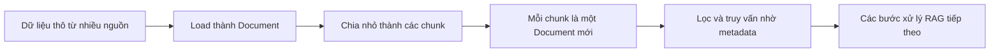

# 📄 Document: "Chiếc hộp" chuẩn chứa văn bản và ngữ cảnh trong LangChain

> Nguồn: `160-Document.txt` · [Udemy](https://ua.udemy.com/course/langchain/learn/lecture/51341215)

Chào các bạn, trong hành trình bóc tách kho từ điển LangChain, có một class nhỏ bé nhưng xuất hiện khắp nơi mà các bạn chắc chắn sẽ gặp lại rất nhiều: **Document**. Hôm nay mình và các bạn sẽ xem vì sao nó được xem là một trong những **core building block** quan trọng nhất của LangChain.

### 📦 Document là gì?

Document class là một trong những **viên gạch nền tảng** của LangChain, đóng vai trò **container chuẩn (standard container)** để xử lý văn bản. Nó được thiết kế để **đóng gói một đoạn văn bản cùng với những thông tin ngữ cảnh đi kèm** — thay vì chỉ là một chuỗi string trần trụi.

Hiểu đơn giản: nếu một chuỗi string thuần túy chỉ trả lời được câu hỏi *"nội dung là gì?"*, thì Document trả lời thêm được cả *"nội dung này đến từ đâu?"* — thông tin mà mọi pipeline nâng cao đều cần.

| Tiêu chí | Chuỗi string thuần | Document |
|---|---|---|
| Nội dung | Chỉ có văn bản | `page_content` cùng `metadata` |
| Ngữ cảnh | Không có | Nguồn gốc, tên file, URL, số trang, custom tag |
| Vai trò trong RAG | Không đủ để lọc và truy vấn | Chuẩn để load, chunk và retrieval |
| Khả năng mở rộng | Hạn chế | Thoải mái thêm tag tùy nhu cầu |

---

### 🧾 Hai thành phần của mọi Document

Mỗi document object gồm đúng hai phần chính:

1. **`page_content`:** phần chứa **văn bản thực sự** — có thể là một đoạn của bài viết, một trang từ file PDF, hay bất kỳ nội dung văn bản nào khác.
2. **`metadata`:** một **dictionary** lưu trữ các chi tiết bổ sung về đoạn văn bản đó, ví dụ:
   * **Nguồn gốc (source)** của văn bản.
   * **Tên file** hoặc **URL**.
   * **Số trang (page number)**.
   * Hoặc bất kỳ **custom tag** nào bạn muốn thêm vào.

Nhờ có hai phần tách bạch này, ta có thể thoải mái xử lý văn bản ở tầng nội dung mà vẫn giữ nguyên "lý lịch" của nó ở tầng metadata.

---

### 🔍 Vì sao cấu trúc này quan trọng với RAG workflow?

Cấu trúc hai phần này **cực kỳ quan trọng với các workflow RAG (Retrieval-Augmented Generation)** trong LangChain:

* Khi ta **load dữ liệu từ nhiều nguồn khác nhau** — LangChain hỗ trợ rất nhiều integration — dữ liệu sẽ được chuyển thành **một danh sách các document object**.
* Sau đó, chúng có thể được **chia nhỏ thành các chunk**, mà bản thân mỗi chunk cũng là một **document instance**.
* Phần **metadata đi kèm trở nên vô cùng hữu ích** khi ta muốn bật các logic **filtering (lọc)** hoặc **retrieval (truy vấn)** về sau — một pipeline thiết yếu cho mọi ứng dụng nâng cao.

Dòng chảy của Document xuyên suốt pipeline RAG diễn ra như sau:

Chuỗi vận hành đó lặp đi lặp lại xuyên suốt pipeline: dữ liệu thô được load thành Document, rồi được cắt thành nhiều Document nhỏ hơn, rồi lại được đưa vào các bước xử lý tiếp theo — mọi mắt xích đều dùng chung một cấu trúc quen thuộc.

Nói cách khác, Document không chỉ chứa "cái gì" (nội dung), mà còn chứa "từ đâu tới" và "ở trang nào" (ngữ cảnh) — vừa đủ để cả pipeline RAG của bạn vận hành thông minh hơn.

### 🎯 Tự kiểm tra nhanh

**Câu 1:** Document class đóng vai trò gì trong LangChain?

<b>Xem đáp án</b>

**Đáp án:** Là container chuẩn để đóng gói một đoạn văn bản cùng những thông tin ngữ cảnh đi kèm.

Giải thích: Nó là một trong những core building block, thay vì chỉ là một chuỗi string trần trụi.

Tham chiếu: Mục Document là gì.

**Câu 2:** Mỗi Document gồm đúng hai thành phần nào?

<b>Xem đáp án</b>

**Đáp án:** `page_content` và `metadata`.

Giải thích: `page_content` chứa văn bản thực sự, `metadata` là dictionary chứa các chi tiết bổ sung.

Tham chiếu: Mục Hai thành phần của mọi Document.

**Câu 3:** Metadata thường chứa những gì?

<b>Xem đáp án</b>

**Đáp án:** Nguồn gốc, tên file hoặc URL, số trang, và bất kỳ custom tag nào bạn muốn thêm.

Giải thích: Nhờ tách bạch với nội dung, ta xử lý văn bản ở tầng nội dung mà vẫn giữ "lý lịch" ở tầng metadata.

Tham chiếu: Mục Hai thành phần của mọi Document.

**Câu 4:** Vì sao cấu trúc hai phần này quan trọng với RAG workflow?

<b>Xem đáp án</b>

**Đáp án:** Vì metadata hữu ích cho filtering và retrieval về sau.

Giải thích: Dữ liệu load từ nhiều nguồn thành danh sách Document, rồi được chia nhỏ thành các chunk cũng là Document.

Tham chiếu: Mục Vì sao cấu trúc này quan trọng với RAG workflow.

**Câu 5:** Dữ liệu thô được load từ nhiều nguồn sẽ trở thành gì?

<b>Xem đáp án</b>

**Đáp án:** Một danh sách các document object.

Giải thích: Sau đó chúng có thể được chia nhỏ thành các chunk, mỗi chunk cũng là một document instance.

Tham chiếu: Mục Vì sao cấu trúc này quan trọng với RAG workflow.

Tuy nhỏ bé và đơn giản, đây lại là cấu trúc dữ liệu bạn sẽ chạm mặt ở hầu hết mọi bước của một ứng dụng RAG. Nắm chắc nó từ bây giờ sẽ giúp mọi thứ phía sau trở nên dễ hiểu hơn rất nhiều. Hẹn gặp lại các bạn ở bài tiếp theo! 🚀

## Nguồn tham khảo

- [Udemy — Document](https://ua.udemy.com/course/langchain/learn/lecture/51341215)
- [LangChain Docs — Semantic search và Document abstraction](https://docs.langchain.com/oss/python/langchain/knowledge-base)
- [LangChain Reference — Document class](https://reference.langchain.com/python/langchain-core/documents/Document)
