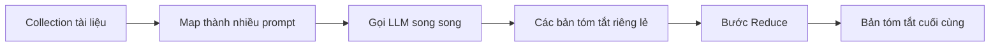

# 🧮 Vượt giới hạn token: Stuffing, Map Reduce và Refine trong LangChain

> Nguồn: `161-LangChain-Token-Limitation-Handeling-Strategies.txt` · [Udemy](https://ua.udemy.com/course/langchain/learn/lecture/37968616)

Chào các bạn, nếu đã từng nhồi quá nhiều tài liệu vào một prompt và nhận về lỗi "too many tokens", các bạn sẽ thấy bài hôm nay cực kỳ thực chiến. Mình và các bạn sẽ cùng tìm hiểu **giới hạn token (token limit)** của LLM và ba chiến lược mà LangChain cung cấp để xử lý nó: **stuffing, map reduce và refine**.

### ⚠️ Giới hạn token — vấn đề không thể tránh khỏi

Bất kể kiến trúc ra sao, mọi LLM đều có **giới hạn token định trước**, quyết định **số token tối đa chúng xử lý được trong một lần tương tác**. Hiện nay, hầu hết LLM có giới hạn khoảng **4K token**, nhưng con số này đang **tăng lên không ngừng**. Một ví dụ điển hình: Anthropic đã ra mắt model có thể "nuốt" tới **100K token** — một bước tiến vượt bậc so với mặt bằng chung.

Tuy vậy, dù con số có tăng mãi, chúng ta vẫn sẽ luôn có một giới hạn để lách qua.

Để cho dễ hình dung, hãy tạm giả định **mỗi token tương đương một từ**. Tổng số token bao gồm **cả prompt đầu vào lẫn phản hồi được sinh ra** — chỉ cần cả hai không vượt ngưỡng (ví dụ 4K) là mọi thứ ổn.

Điều thú vị: LLM **không quan tâm** bạn chia ngân sách token thế nào. Prompt ngắn + phản hồi dài, chia đôi, hay prompt khổng lồ + trả lời ngắn gọn — tất cả đều được, miễn là không vượt giới hạn. Nhưng trong ứng dụng thực tế, việc **vượt ngưỡng là điều chắc chắn sẽ xảy ra**, ví dụ khi ngữ cảnh prompt quá lớn. Lúc đó, LLM sẽ trả về **lỗi** vì bạn đã gửi quá nhiều token.

LangChain hỗ trợ cả ba chiến lược xử lý, và cách dễ nhất để giải thích chúng là qua bài toán **tóm tắt văn bản (summarization)** với hàm **`load_summarize_chain`**.

---

### 📚 Chiến lược 1 — Stuffing: "tống" tất cả vào prompt

Khi khởi tạo chain, ta truyền vào tham số **`chain_type`**. Với **`stuff`**, LangChain sẽ xử lý ngữ cảnh theo chiến lược stuffing. Hãy liên tưởng đến một chú gấu bông được **nhồi (stuffed)** đầy bông và sợi — ta "nhồi" toàn bộ tài liệu vào prompt **nguyên trạng, không sửa đổi gì**.

* **Ưu điểm:** đơn giản, trực quan nhất, chỉ tốn **một API call**.
* **Nhược điểm:** chỉ cần dùng nhiều hơn vài tài liệu là **vỡ giới hạn token**.

Đặc biệt, ngay cả khi giả sử có một model "vô hạn token", ta vẫn đụng một rào cản khác: **kích thước payload tối đa** mà server xử lý request cho phép gửi lên.

---

### 🗺️ Chiến lược 2 — Map Reduce: chia để trị

Với **`chain_type="map_reduce"`**, thay vì tống hết tài liệu vào một prompt, ta làm theo đúng tinh thần **functional programming**:

1. **Mapping:** từ mỗi document, tạo ra một prompt mới gồm **chỉ thị tóm tắt + ngữ cảnh là chính document đó**. Nói cách khác, ta "map" một collection tài liệu thành một collection prompt.
2. **Gọi LLM:** từng prompt được gửi tới LLM để lấy **bản tóm tắt cho mỗi tài liệu**. Điểm hay là bước này **chạy song song (parallel)** được vì các document độc lập, không phụ thuộc nhau — tối ưu hiệu năng đáng kể.
3. **Reducing:** lấy tất cả bản tóm tắt nhỏ, đưa qua một bước "reduce" để tạo ra **bản tóm tắt lớn cuối cùng** — bản tóm tắt của các bản tóm tắt.

Toàn bộ tiến trình map rồi reduce đó trông như sau:

* **Ưu điểm:** scale lên **số lượng tài liệu khổng lồ**, chạy song song và rất nhanh.
* **Nhược điểm:** tạo ra **rất nhiều API call** (tốn chi phí) và có thể **mất mát thông tin** trong bước mapping khi tóm tắt từng tài liệu riêng lẻ.

Điều tuyệt vời là trong LangChain, tất cả chỉ gói gọn trong **một dòng** — chỉ cần chọn `chain_type` là `map_reduce`. Đây là lúc LangChain tỏa sáng khi "gánh" hết phần việc nặng nhọc cho chúng ta.

---

### 🔁 Chiến lược 3 — Refine: tinh chỉnh dần từng tài liệu

Chiến lược cuối cùng là **refine chain**, và để hiểu nó, mình mượn một khái niệm từ functional programming: hàm **`foldl` (fold left)**.

`foldl` là một **higher-order function**, dùng để duyệt qua một danh sách và **tích lũy kết quả** bằng cách áp dụng một **binary function** (hàm nhận hai tham số) cho từng phần tử. Hàm này có ba tham số: **hàm cần áp dụng**, **giá trị khởi tạo**, và **danh sách** cần xử lý.

Ví dụ với phép nhân, giá trị khởi tạo là 1, danh sách [1, 2, 3, 4]:

1. 1 × 1 = **1**
2. 1 × 2 = **2**
3. 2 × 3 = **6**
4. 6 × 4 = **24**

Cả danh sách được "rút gọn" về 24. Giờ hãy tưởng tượng:

* Hàm áp dụng nhận **hai document** rồi kết hợp và tóm tắt chúng.
* Giá trị khởi tạo là một **chuỗi rỗng / document rỗng**.
* Danh sách là các tài liệu cần tóm tắt.

Khi đó, ta tóm tắt document rỗng với tài liệu đầu tiên thành bản tóm tắt thứ nhất; lấy bản tóm tắt đó kết hợp với tài liệu thứ hai, tạo ra bản tinh chỉnh mới; cứ **refine mãi** cho đến khi có bản tóm tắt hoàn chỉnh cho toàn bộ tài liệu. Đó chính là cách **refine chain** vận hành — và LangChain đã làm hết phần việc "hậu trường" cho chúng ta.

Đặt ba chiến lược cạnh nhau, ta có bức tranh đối chiếu nhanh:

| Chiến lược | Cách hoạt động | Ưu điểm | Nhược điểm |
|---|---|---|---|
| `stuff` | Nhồi toàn bộ tài liệu vào một prompt | Đơn giản, chỉ tốn một API call | Vỡ giới hạn token khi dùng nhiều tài liệu |
| `map_reduce` | Tóm tắt từng tài liệu song song rồi gộp lại | Scale lớn, chạy song song, nhanh | Nhiều API call, dễ mất mát thông tin khi map |
| `refine` | Tích lũy và tinh chỉnh bản tóm tắt qua từng tài liệu | Bản tóm tắt hoàn chỉnh dần theo từng bước | Phải xử lý lần lượt theo danh sách tài liệu |

### 🎯 Tự kiểm tra nhanh

**Câu 1:** Tổng số token cần tính gồm những phần nào?

<b>Xem đáp án</b>

**Đáp án:** Cả prompt đầu vào lẫn phản hồi được sinh ra.

Giải thích: Chỉ cần tổng hai phần không vượt ngưỡng (ví dụ 4K) là mọi thứ ổn, và LLM không quan tâm bạn chia ngân sách thế nào.

Tham chiếu: Mục Giới hạn token — vấn đề không thể tránh khỏi.

**Câu 2:** Chiến lược stuffing phù hợp nhất khi nào?

<b>Xem đáp án</b>

**Đáp án:** Khi ít tài liệu và muốn cách làm đơn giản nhất.

Giải thích: Ưu điểm là chỉ tốn một API call, nhưng chỉ cần thêm vài tài liệu là vỡ giới hạn token.

Tham chiếu: Mục Chiến lược 1 — Stuffing.

**Câu 3:** Vì sao map reduce chạy nhanh và scale tốt?

<b>Xem đáp án</b>

**Đáp án:** Vì các document độc lập nên bước map có thể chạy song song.

Giải thích: Tuy nhiên nó tạo ra rất nhiều API call và có thể mất mát thông tin trong bước mapping.

Tham chiếu: Mục Chiến lược 2 — Map Reduce.

**Câu 4:** Rủi ro lớn nhất của map reduce là gì?

<b>Xem đáp án</b>

**Đáp án:** Mất mát thông tin khi tóm tắt từng tài liệu riêng lẻ.

Giải thích: Đây là cái giá phải trả cho việc chia để trị và chạy song song.

Tham chiếu: Mục Chiến lược 2 — Map Reduce.

**Câu 5:** Refine chain lấy cảm hứng từ khái niệm nào và vận hành ra sao?

<b>Xem đáp án</b>

**Đáp án:** Từ hàm `foldl` (fold left) trong functional programming: tích lũy dần bản tóm tắt qua từng tài liệu.

Giải thích: Ta bắt đầu với document rỗng, kết hợp với tài liệu đầu tiên, rồi cứ refine mãi đến khi có bản tóm tắt hoàn chỉnh.

Tham chiếu: Mục Chiến lược 3 — Refine.

Thật lòng mà nói, mình thấy cách framework này thiết kế **vừa thanh lịch vừa thông minh đến kinh ngạc**. Các bạn đã nắm được ba chiến lược then chốt để không bao giờ "chết" vì giới hạn token nữa. Hẹn gặp lại ở bài tiếp theo nhé! 🚀

## Nguồn tham khảo

- [Udemy — LangChain Token Limitation Handeling Strategies](https://ua.udemy.com/course/langchain/learn/lecture/37968616)
- [LangChain Reference — load_summarize_chain](https://reference.langchain.com/python/langchain-classic/chains/summarize/chain/load_summarize_chain)
