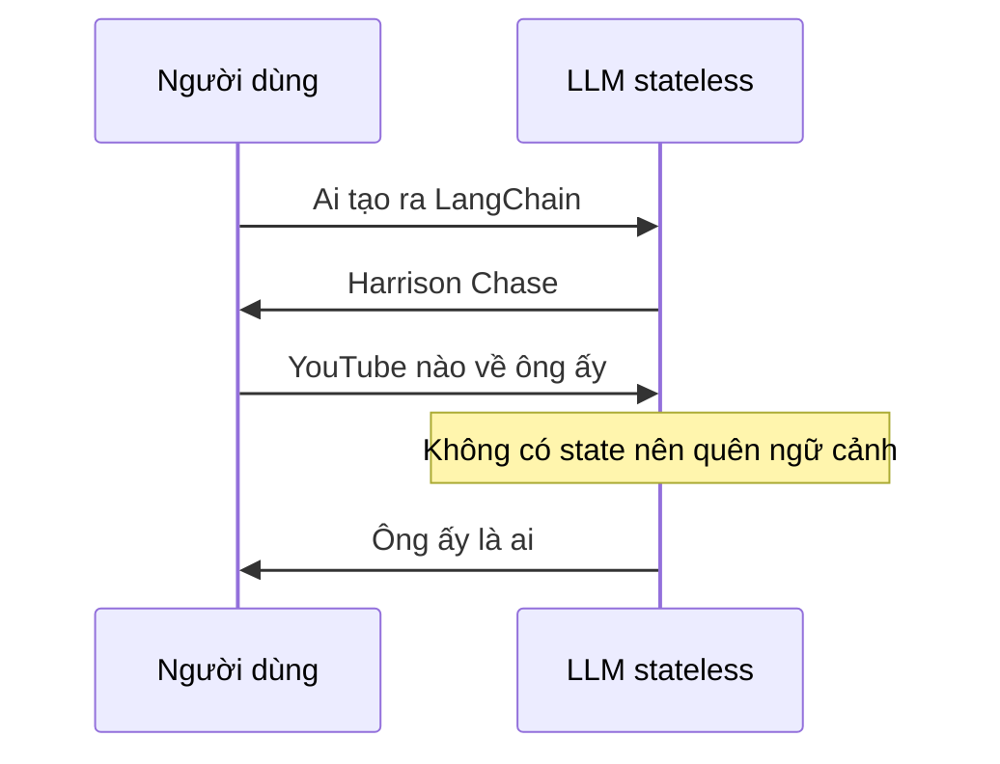

# 🧠 Memory phần 1: Khi LLM "mất trí nhớ" và phép màu mang tên coreference resolution

> Nguồn: `162-LangChain-Memory-Intro--Co-Reference-Resolution.txt` · [Udemy](https://ua.udemy.com/course/langchain/learn/lecture/46176243)

Chào các bạn, hôm nay mình và các bạn sẽ mở màn cho một chủ đề cực kỳ thú vị và cũng đầy "đau đầu" trong thế giới LLM: **memory (bộ nhớ hội thoại)**. Bài này là phần lý thuyết nền tảng, giúp các bạn hiểu vì sao LLM cần memory, trước khi chúng ta đi vào phần implementation ở các bài sau.

### 🔍 LLM là stateless — và đó là lý do nó "quên" bạn ngay lập tức

Trong các tương tác với người dùng, **LLM là stateless (phi trạng thái)** — nghĩa là chúng **không lưu lại bất kỳ thông tin nào** từ những cuộc trò chuyện đã diễn ra trước đó. Mỗi lần bạn gửi câu hỏi mới, model lại bắt đầu từ con số 0.

Hãy xem ví dụ này nhé. Nếu mình hỏi LLM (dựa trên tài liệu LangChain): *"Ai là người tạo ra LangChain?"* — mình sẽ nhận được câu trả lời chính xác: **Harrison Chase**. Nhưng nếu mình hỏi tiếp: *"Bạn có biết video YouTube nào về ông ấy không?"* — câu trả lời nhận được sẽ là:

> *"Tôi xin lỗi, tôi không biết bạn đang nhắc đến ai. Bạn có thể cung cấp thêm ngữ cảnh hoặc làm rõ 'ông ấy' là ai không?"*

Đúng vậy, chỉ sau **một câu hỏi**, model đã quên sạch cuộc trò chuyện.

---

### 💡 Coreference resolution — khi "him" phải được hiểu là Harrison Chase

Hiện tượng trên có một tên gọi chính thức trong học thuật: **coreference resolution (phân giải đại từ)**.

Đây là bài toán **xác định tất cả các biểu đạt, từ hoặc cụm từ trong một văn bản cùng tham chiếu đến một thực thể hay khái niệm**. Nói cách khác, đó là quá trình nhận diện mọi trường hợp mà các từ ngữ khác nhau trong văn bản đang nói về **cùng một thứ**.

Trong ví dụ trên, từ **"him" (ông ấy)** chính là đang tham chiếu đến **Harrison Chase** — nhưng model không làm được phép phân giải này, đơn giản vì nó **không có state (trạng thái)**.

Tin tốt là: nếu model được cung cấp **state và chat history (lịch sử hội thoại)** trong prompt, nó sẽ dễ dàng thực hiện coreference resolution. Và đây chính là **nền tảng cho mọi giải pháp memory** mà LangChain đang hỗ trợ: chúng ta đơn giản là tìm những cách tinh tế để **truyền vào prompt dữ liệu, thông tin cần thiết**, giúp model phân giải được các tham chiếu.

Ví dụ, prompt sẽ có dạng: *"Cho cuộc trò chuyện trước đó, hãy trả lời câu hỏi hiện tại của tôi."* Trong lịch sử, ta có cuộc hội thoại kiểu: *"Tôi thích uống cold brew coffee"*, *"tôi không muốn uống ở Starbucks hay Coffee Bean"*, và câu hỏi cuối: *"Tôi có thể tìm nó ở đâu khác?"* — ở đây **"nó"** đang tham chiếu đến **cold brew coffee**, và model hoàn toàn có thể xử lý, thực hiện phân giải và trả lời đúng.

| Tiêu chí | Không có state | Có state và chat history |
|---|---|---|
| Ngữ cảnh hội thoại | Mất sạch sau mỗi câu hỏi | Được truyền vào prompt |
| Coreference resolution | Thất bại với các đại từ như ông ấy, nó | Phân giải được và trả lời đúng |
| Chất lượng câu trả lời | Lệch mạch, phải hỏi lại ngữ cảnh | Bám đúng mạch hội thoại |
| Rủi ro đi kèm | Không tốn thêm token | Prompt dài dần, dễ vượt giới hạn token |

---

### ⏰ Nút thắt token: hội thoại càng dài, prompt càng "phình"

Mọi chuyện bắt đầu phức tạp khi bạn nhận ra: nếu cuộc hội thoại kéo dài cả **một giờ đồng hồ**, ta sẽ gặp rắc rối — **quá nhiều dữ liệu để nhét vào prompt**. Chúng ta đã biết LLM có **giới hạn token**, và một cuộc trò chuyện rất dài chắc chắn sẽ **vượt qua giới hạn này**.

Vậy LangChain giải quyết ra sao? Đó chính là nội dung của các bài tiếp theo trong chủ đề memory.

*Lưu ý nhé: bài này là bài lý thuyết thuần túy — mình sẽ không demo code trực tiếp. Các class và cách implement sẽ lần lượt xuất hiện trong phần còn lại của khóa học, nên các bạn đừng lo nếu giờ chưa thấy code.*

Nói ngắn gọn: memory không phải phép thuật, mà là bài toán **thiết kế ngữ cảnh thông minh** — chọn lọc và đưa vào prompt đúng những dữ liệu cần thiết cho lượt hội thoại hiện tại.

### 🎯 Tự kiểm tra nhanh

**Câu 1:** LLM là stateless nghĩa là gì?

<b>Xem đáp án</b>

**Đáp án:** Chúng không lưu lại bất kỳ thông tin nào từ những cuộc trò chuyện trước đó.

Giải thích: Mỗi lần bạn gửi câu hỏi mới, model lại bắt đầu từ con số 0.

Tham chiếu: Mục LLM là stateless.

**Câu 2:** Coreference resolution là bài toán gì?

<b>Xem đáp án</b>

**Đáp án:** Xác định tất cả các biểu đạt, từ hoặc cụm từ trong văn bản cùng tham chiếu đến một thực thể hay khái niệm.

Giải thích: Ví dụ "him" phải được hiểu là Harrison Chase dựa trên ngữ cảnh trước đó.

Tham chiếu: Mục Coreference resolution.

**Câu 3:** Vì sao model không phân giải được từ "ông ấy" trong ví dụ đầu bài?

<b>Xem đáp án</b>

**Đáp án:** Vì model không có state, tức không có chat history trong prompt.

Giải thích: Chỉ với một câu hỏi, nó đã quên sạch cuộc trò chuyện.

Tham chiếu: Mục LLM là stateless.

**Câu 4:** Điều kiện để model thực hiện coreference resolution là gì?

<b>Xem đáp án</b>

**Đáp án:** Được cung cấp state và chat history trong prompt.

Giải thích: Đây chính là nền tảng cho mọi giải pháp memory của LangChain: tìm cách truyền dữ liệu cần thiết vào prompt.

Tham chiếu: Mục Coreference resolution.

**Câu 5:** Nút thắt nào xuất hiện khi hội thoại kéo dài?

<b>Xem đáp án</b>

**Đáp án:** Quá nhiều dữ liệu để nhét vào prompt, chắc chắn vượt giới hạn token.

Giải thích: Giải quyết bài toán này chính là nội dung của các bài tiếp theo trong chủ đề memory.

Tham chiếu: Mục Nút thắt token.

Mục tiêu hôm nay là để các bạn nắm được **những chiến lược** được dùng để giải quyết bài toán token trong memory. Nắm vững nền tảng này rồi, các bạn sẽ thấy phần implementation nhẹ nhàng hơn hẳn. Hẹn gặp lại ở bài tiếp theo! 🚀

## Nguồn tham khảo

- [Udemy — LangChain Memory Intro & Co-Reference Resolution](https://ua.udemy.com/course/langchain/learn/lecture/46176243)
- [LangGraph Docs — Add memory](https://docs.langchain.com/oss/python/langgraph/add-memory)
