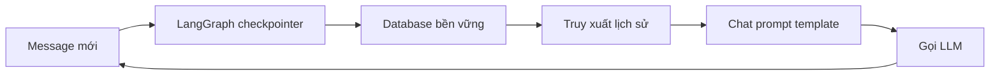

# 🗄️ Memory phần 2: Ba cách lưu ký ức và vai trò "người gác kho" của LangGraph

> Nguồn: `163-LangChain-Memory-Theory-Deepdive-LangGraph.txt` · [Udemy](https://ua.udemy.com/course/langchain/learn/lecture/46177713)

Chào các bạn, tiếp nối chủ đề memory, hôm nay mình và các bạn sẽ đi sâu vào **cách lưu trữ và xử lý ký ức hội thoại** theo best practice mới nhất trong hệ sinh thái LangChain. Đây là bài tổng quan quan trọng, vì memory đã trải qua rất nhiều vòng cải tiến trước khi đạt đến cách làm ngày hôm nay.

### 🧠 Bức tranh tổng thể: memory không chỉ là "tống" hết vào prompt

Về cơ bản, bạn có thể nghĩ memory đơn giản là **nhồi toàn bộ tin nhắn vào lời gọi LLM**. Nhưng cách này có nhiều vấn đề:

* **Vượt giới hạn token** khi cuộc trò chuyện dài ra.
* **Tốn kém chi phí** — mỗi lần gọi đều phải gửi lại tất tần tật.
* **Không cần thiết** — ta không phải lúc nào cũng cần gửi mọi thứ cho LLM.

Ngay cả khi dùng model có **context window khổng lồ** như **Gemini 1.5 Pro với 1 triệu token**, việc gửi thừa vẫn khiến chi phí cao hơn, tốc độ **chậm hơn**, và kết quả có thể **tệ hơn** — vì ta đang gửi một đống "rác" mà model không thực sự cần xử lý. Đúng như câu nói nổi tiếng: **"Garbage in, garbage out"**.

Hiện tại, LangChain có **ba chiến lược chính** để xử lý:

1. **Lờ luôn vấn đề** — cứ nhồi tất cả vào lời gọi LLM. Cách này hữu ích khi cuộc trò chuyện ngắn, và cũng là cách **dễ bắt đầu nhất**.
2. **Cắt bỏ tin nhắn cũ (trim)** — vứt đi những message ở đầu cuộc hội thoại, vì nhiều khả năng chúng không còn liên quan. Đây là một **heuristic**, tất nhiên không phải lúc nào cũng đúng.
3. **Xử lý message** — ví dụ **tóm tắt toàn bộ tin nhắn** và chỉ giữ lại bản tóm tắt cùng **vài message gần nhất**.

| Chiến lược | Cách làm | Đánh đổi |
|---|---|---|
| Lờ luôn vấn đề | Nhồi tất cả message vào lời gọi LLM | Dễ bắt đầu nhất, chỉ ổn với hội thoại ngắn |
| Trim tin nhắn cũ | Cắt bỏ message ở đầu cuộc hội thoại | Tiết kiệm token nhưng là heuristic, có thể mất thông tin |
| Xử lý message | Tóm tắt lịch sử, giữ bản tóm tắt và vài message gần nhất | Ngữ cảnh cô đọng nhưng tốn thêm bước xử lý |

Nhưng còn một câu hỏi chưa được trả lời: **lưu những message đó ở đâu và persist (duy trì) chúng như thế nào?**

---

### 🗄️ Persist bằng LangGraph checkpointer — cách làm mới được ưu tiên

Cách mới trong hệ sinh thái LangChain là dùng **LangGraph** với **checkpointer (hay checkpointing)**. Mỗi vòng lặp, mỗi message người dùng hay AI gửi đi, LangGraph sẽ **tự động lấy thông tin đó và persist vào database**.

Các loại checkpointer tiêu biểu:

* **`MemorySaver`** — lưu trong memory, **không persist** (mất khi chương trình dừng).
* **PostgreSQL, MySQL, Redis, MongoDB saver** — lưu vào các database bền vững.
* Và còn rất nhiều integration khác, với nhiều cái mới đang được bổ sung.

Cách dùng rất đơn giản: chỉ cần **tạo object checkpointer và truyền nó vào LangGraph graph** của bạn. Mình biết nhiều bạn chưa quen với LangGraph graph — mình có khóa học riêng về LangGraph để đào sâu phần này (*nếu muốn nhận coupon, cứ ping mình hoặc đăng bài trong group nhé — mình rất thích chia sẻ coupon với các bạn*). Ở đây, điều quan trọng nhất cần hiểu là: **checkpointer sẽ làm hết phần persist và ghi dữ liệu vào DB cho chúng ta**.

Còn về **cách truyền lịch sử vào prompt**, các bạn có thể dùng **chat prompt template** với hàm **`from_messages`**: khai báo system message (chỉ thị hệ thống) và một **message placeholder** với `variable_name="messages"` — đó là cách nói với LangChain rằng "hãy **tự động inject toàn bộ lịch sử trò chuyện** vào đây". Dữ liệu truyền vào là một **dictionary** chứa danh sách các message: HumanMessage, phản hồi của AI, rồi HumanMessage tiếp theo...

Trong ứng dụng thực tế, ta sẽ dùng **persistent DB** để lưu tất cả message, truy xuất lại và gửi đi. Phần "gửi" thì đơn giản như vậy — còn phần "lưu" đã có checkpointer lo.

---

### ✂️ Trimmer — "dao tỉa" tin nhắn để tiết kiệm token

Để bỏ đi những message cũ không cần thiết (tiết kiệm **token, độ trễ (latency) và chi phí**), LangChain giới thiệu khái niệm **trimmer**: một object tỉa bớt message, được tạo bằng hàm **`trim_messages`**.

* Bạn có thể cung cấp **strategy** — LangChain cung cấp nhiều cách để quyết định **giữ gì, bỏ gì**.
* Có thể **trim theo số token** (ví dụ đặt `max_tokens` cùng token counter), hoặc **trim theo số lượng message**.
* Cách gọi vô cùng quen thuộc: dùng phương thức **`invoke`**, truyền vào toàn bộ message cần xử lý, và nhận về **các message đã được tỉa gọn** để gửi cho LLM.

Bạn có thể tự hỏi: *"Sao không tự viết code lấy cho nhanh?"* — Nhưng đây là một hàm cực kỳ tiện lợi đã được implement sẵn, và LangChain hiểu rõ mọi use case để đưa ra giải pháp. **Đừng phát minh lại bánh xe** — ít nhất đó là quan điểm của mình.

---

### 📝 Tóm tắt và persist — sự kết hợp hoàn hảo

**Summarization (tóm tắt)** là một kỹ thuật khác để tiết kiệm token và gửi cho LLM một ngữ cảnh thật cô đọng. Cách làm:

1. Dùng một **summary prompt** nhận toàn bộ lịch sử và **tóm tắt thành một bản duy nhất**.
2. **Lưu bản tóm tắt đó** vào persistent storage.
3. **Xóa các message gốc** — vì sau khi tóm tắt, ta không cần chúng nữa.

Checkpointer vẫn giữ nguyên, nhưng ta đã **xử lý dữ liệu trước khi checkpoint** nó.

Điều mình muốn các bạn ghi nhớ: bạn **không cần hiểu LangGraph ngay lúc này**. Hãy nắm các khái niệm về những gì ta lưu vào memory — **toàn bộ message gốc, message đã tỉa, hay bản tóm tắt** — và biết rằng bạn hoàn toàn có thể **tự thêm logic xử lý riêng** cho phù hợp với ứng dụng của mình. LangChain cho bạn sự tự do đó, và việc mở rộng rất dễ dàng.

### 🎯 Tự kiểm tra nhanh

**Câu 1:** Ba chiến lược xử lý memory hiện tại của LangChain là gì?

<b>Xem đáp án</b>

**Đáp án:** Lờ luôn vấn đề (nhồi tất cả), cắt bỏ tin nhắn cũ (trim), và xử lý message (ví dụ tóm tắt).

Giải thích: Cách đầu dễ bắt đầu nhất nhưng chỉ hợp với hội thoại ngắn.

Tham chiếu: Mục Bức tranh tổng thể.

**Câu 2:** Vì sao gửi thừa dữ liệu vẫn là vấn đề dù context window rất lớn?

<b>Xem đáp án</b>

**Đáp án:** Vì chi phí cao hơn, tốc độ chậm hơn, và kết quả có thể tệ hơn.

Giải thích: Gửi một đống "rác" model không cần xử lý dẫn đến "Garbage in, garbage out".

Tham chiếu: Mục Bức tranh tổng thể.

**Câu 3:** Checkpointer của LangGraph làm gì?

<b>Xem đáp án</b>

**Đáp án:** Tự động lấy mỗi message và persist vào database.

Giải thích: Chỉ cần tạo object checkpointer và truyền vào graph; nó lo phần ghi dữ liệu vào DB.

Tham chiếu: Mục Persist bằng LangGraph checkpointer.

**Câu 4:** `MemorySaver` khác các DB saver ở điểm nào?

<b>Xem đáp án</b>

**Đáp án:** `MemorySaver` lưu trong memory và không persist — mất khi chương trình dừng; còn PostgreSQL, MySQL, Redis, MongoDB saver lưu bền vững.

Giải thích: Đây là lý do sản phẩm thật cần persistent DB.

Tham chiếu: Mục Persist bằng LangGraph checkpointer.

**Câu 5:** Trimmer và summarization khác nhau thế nào?

<b>Xem đáp án</b>

**Đáp án:** Trimmer tỉa bớt message theo strategy (theo token hoặc số lượng), còn summarization tóm tắt lịch sử thành một bản duy nhất rồi lưu lại, xóa các message gốc.

Giải thích: Cả hai đều nhằm tiết kiệm token, độ trễ và chi phí; checkpointer vẫn giữ nguyên vai trò persist.

Tham chiếu: Mục Trimmer và Mục Tóm tắt và persist.

Còn việc **persist thực sự** thì do **LangGraph checkpointer** đảm nhiệm — object này chỉ đơn giản lấy dữ liệu và thực hiện các **truy vấn DB** để gửi vào database đích, không hơn không kém. Vậy là chúng ta đã đi hết bức tranh memory! Hẹn gặp lại các bạn ở bài tiếp theo. 🚀

## Nguồn tham khảo

- [Udemy — LangChain Memory Theory Deepdive (LangGraph)](https://ua.udemy.com/course/langchain/learn/lecture/46177713)
- [LangGraph Docs — Persistence](https://docs.langchain.com/oss/python/langgraph/persistence)
- [LangGraph Docs — Add memory](https://docs.langchain.com/oss/python/langgraph/add-memory)
