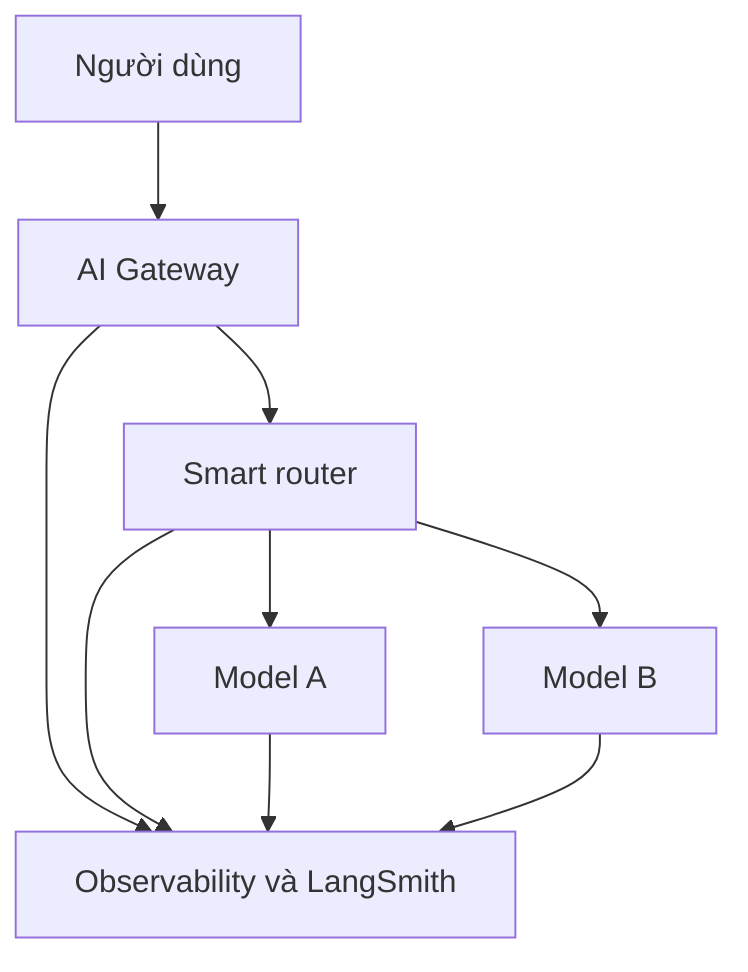

# 🏗️ Kiến trúc AI chuẩn production năm 2026: Observability, AI Gateway và những thứ không thể thiếu

> Nguồn: `164-The-Core-Architecture-of-Production-Grade-AI.txt` · [Udemy](https://ua.udemy.com/course/langchain/learn/lecture/55594823)

Chào các bạn, hôm nay mình có một cuộc trò chuyện cực kỳ giá trị với **Assaf Elovic** — đồng sáng lập **Tavily**, người tạo ra **GPT Researcher** và từng là **Head of AI tại monday.com**. Assaf mang đến rất nhiều kinh nghiệm triển khai hệ thống AI, AI agent và dẫn dắt các tổ chức kỹ thuật.

Bài viết này mở đầu chuỗi Industry Insights: chúng ta sẽ cùng bàn về **kiến trúc AI chuẩn production** hiện nay, với trọng tâm là cách xây dựng hệ thống AI cùng LangChain.

### 👀 Observability — không chỉ là "theo dõi" kiểu truyền thống

Điều đầu tiên và cũng là bắt buộc: bạn **phải có observability (khả năng quan sát hệ thống)**. Assaf nhấn mạnh rằng observability cho **agent và AI rất khác** với observability dùng để giám sát con người trên sản phẩm thông thường.

Lý do? Với agent, bạn cần nhìn được **stack trace** để hiểu:

* Các agent trong production đang cố làm gì và cố đạt được điều gì trong hệ thống?
* Chúng vận hành ra sao **xuyên qua nhiều agent khác nhau**?

Đó là lý do những sản phẩm như **LangSmith** làm rất tốt công việc này.

Một phần quan trọng khác của observability: **người dùng đang cố lấy gì từ agent của bạn?** Rất nhiều lần, điều đó được thể hiện bằng **ngôn ngữ tự nhiên** — khác hẳn với việc con người bấm nút trên UI. Việc **hiểu ngôn ngữ tự nhiên**, hiểu nó phản ánh điều agent sẽ cố làm, và **liệu agent có thành công hay không** — toàn bộ workflow đó đòi hỏi một hệ thống giám sát **rất đặc thù cho AI agent**.

---

### 🚪 AI Gateway — cửa ngõ của guardrails, quyền hạn và model

Thành phần tiếp theo là **AI gateway**. Assaf thừa nhận rất khó tìm một thứ tương tự "trước thời AI", nhưng có thể hiểu AI gateway là **cửa ngõ** nơi bạn định nghĩa:

* **Guardrails (rào chắn an toàn)** và **permissions (quyền hạn)**.
* **Danh sách model và loại model** được dùng.
* **Bảo mật prompt (prompt security)**.
* Đảm bảo **uptime thường trực** cho việc sử dụng model.

Trong quá khứ, model **bị rate limit (giới hạn tốc độ) hoặc "sập"** là chuyện đã từng xảy ra. Vì vậy, việc có một **smart router (bộ định tuyến thông minh)** — biết cách tận dụng nhiều model khác nhau, đồng thời **định tuyến đến các model phù hợp dựa trên quy mô (scale) và use case** — là yếu tố then chốt.

---

### 🧠 Memory, semantic search và phần kiến trúc "may đo"

Sau hai trụ cột trên, phần **kiến trúc AI cụ thể** còn lại mang tính **tùy biến cao**, gắn chặt với từng use case mà doanh nghiệp xây dựng. Tuy nhiên, có vài điểm chắc chắn không thể bỏ qua:

* **Memory là yếu tố then chốt** — bạn cần có khả năng **quan sát và giám sát memory**, cũng như **ngữ cảnh dữ liệu xuyên công ty (cross-company data context)**.
* **Semantic search ranking (xếp hạng tìm kiếm ngữ nghĩa)** cũng cực kỳ quan trọng.
* Thứ từng được gọi là **RAG** đang **thay đổi** — cách tiếp cận đang tiến hóa không ngừng.

| Trụ cột | Vai trò | Thành phần tiêu biểu |
|---|---|---|
| Observability | Nhìn stack trace và hiểu agent đang cố làm gì | LangSmith |
| AI Gateway | Guardrails, quyền hạn, prompt security, uptime | Smart router, danh sách model |
| Memory và semantic search | Giữ ngữ cảnh xuyên công ty và xếp hạng ngữ nghĩa | Quan sát, giám sát memory |

### 🎯 Tự kiểm tra nhanh

**Câu 1:** Vì sao observability cho agent khác observability truyền thống?

<b>Xem đáp án</b>

**Đáp án:** Vì với agent, bạn cần nhìn stack trace để hiểu nó đang cố làm gì và vận hành ra sao xuyên qua nhiều agent khác nhau.

Giải thích: Người dùng thể hiện nhu cầu bằng ngôn ngữ tự nhiên thay vì bấm nút UI, nên cần hệ thống giám sát rất đặc thù cho AI agent.

Tham chiếu: Mục Observability.

**Câu 2:** AI gateway là nơi định nghĩa những gì?

<b>Xem đáp án</b>

**Đáp án:** Guardrails, permissions, danh sách model và loại model, prompt security, cùng việc đảm bảo uptime khi dùng model.

Giải thích: Assaf thừa nhận rất khó tìm thứ tương tự "trước thời AI".

Tham chiếu: Mục AI Gateway.

**Câu 3:** Vì sao smart router là yếu tố then chốt?

<b>Xem đáp án</b>

**Đáp án:** Vì model có thể bị rate limit hoặc "sập", cần định tuyến đến model phù hợp theo scale và use case.

Giải thích: Smart router biết cách tận dụng nhiều model khác nhau thay vì phụ thuộc một nhà cung cấp.

Tham chiếu: Mục AI Gateway.

**Câu 4:** Vì sao memory quan trọng trong kiến trúc production?

<b>Xem đáp án</b>

**Đáp án:** Vì cần quan sát, giám sát memory và ngữ cảnh dữ liệu xuyên công ty (cross-company data context).

Giải thích: Đây là phần kiến trúc mang tính tùy biến cao theo từng use case.

Tham chiếu: Mục Memory, semantic search và phần kiến trúc may đo.

**Câu 5:** Điều gì từng được gọi là RAG đang thay đổi?

<b>Xem đáp án</b>

**Đáp án:** Cách tiếp cận đang tiến hóa không ngừng.

Giải thích: Cùng với đó, semantic search ranking là yếu tố mà Assaf chắc chắn kiểm tra.

Tham chiếu: Mục Memory, semantic search và phần kiến trúc may đo.

Assaf nói vui rằng anh ấy có thể "nói mãi không hết", nhưng đây là những yếu tố **hàng đầu** mà anh ấy chắc chắn sẽ kiểm tra đầu tiên. Chúng ta sẽ còn gặp lại Assaf ở các bài sau với những chủ đề sâu hơn về độ tin cậy và feedback loop. Hẹn gặp lại các bạn! 🚀

## Nguồn tham khảo

- [Udemy — The Core Architecture of Production-Grade AI](https://ua.udemy.com/course/langchain/learn/lecture/55594823)
- [LangSmith Docs — Tracing quickstart](https://docs.langchain.com/langsmith/observability-quickstart)
- [LangChain Docs — LangSmith Observability](https://docs.langchain.com/oss/python/langchain/observability)
