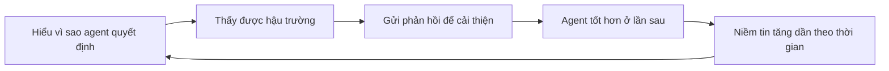

# 🤝 Làm sao để người dùng tin tưởng AI Agent? Bộ tiêu chí FAIR của Assaf Elovic

> Nguồn: `165-How-to-Make-Users-Trust-Your-AI-Agents.txt` · [Udemy](https://ua.udemy.com/course/langchain/learn/lecture/55594859)

Chào các bạn, tiếp nối cuộc trò chuyện với **Assaf Elovic**, hôm nay mình và các bạn sẽ bàn về một câu hỏi tưởng đơn giản nhưng cực kỳ sâu sắc: **điều gì khiến một AI agent trở nên đáng tin cậy?**

Assaf cho rằng "reliability (độ tin cậy)" có thể mang rất nhiều nghĩa. Nên anh đã **reframe** câu hỏi thành: **làm sao để người dùng cảm nhận agent của bạn là đáng tin cậy?** Đây là một góc nhìn rất khác biệt — tài liệu viết về cách xây agent **ổn định về mặt kỹ thuật** thì rất nhiều, nhưng rất ít nói về việc **người dùng cần cảm nhận được điều gì**.

Cùng với **Harrison Chase** — CEO của LangChain — Assaf đã tạo ra một **cơ chế chấm điểm mang tên FAIR**, dùng để đo cách chúng ta nhìn nhận và đặt niềm tin vào các agent.

Điểm thú vị là cơ chế này không nói về sức mạnh kỹ thuật của model, mà về **cách con người cảm nhận và đặt niềm tin** vào agent — một góc nhìn rất đáng để các nhà phát triển sản phẩm ghi nhớ.

### 🔍 Explainability — người dùng phải "hiểu được" agent

Yếu tố đầu tiên là **explainability (khả năng giải thích)**. Khi người dùng sử dụng agent, bạn cần đảm bảo họ **hiểu được cách agent đi đến một nhiệm vụ hay một hành động cụ thể**.

Vì agent vốn là một **"hộp đen" (black box)** — khi nó mắc lỗi, nếu người dùng **không thể hiểu vì sao nó làm vậy**, niềm tin của họ sẽ bị tổn hại nghiêm trọng.

---

### 🪟 Transparency và vòng lặp Feedback — hai yếu tố bị đánh giá thấp

**Transparency (tính minh bạch)** là yếu tố thứ hai: bạn cần thực sự cho người dùng **thấy được những gì đang chạy phía sau hậu trường** để tạo ra các hành động cụ thể đó.

Yếu tố thứ ba là **feedback loops (vòng lặp phản hồi)** — theo Assaf, đây có thể là **một trong những yếu tố quan trọng bị đánh giá thấp nhất**. Ý tưởng rất dễ hiểu:

* Nếu tôi hiểu **vì sao** và **như thế nào** agent đưa ra quyết định...
* Nhưng tôi **không có cách nào phản hồi lại** để nó cải thiện ở lần quyết định tiếp theo...
* Thì làm sao tôi có thể coi nó là đáng tin cậy, hay cảm nhận rằng nó sẽ **ngày càng đáng tin hơn theo thời gian**?

Niềm tin vì thế được xây dựng như một vòng lặp liên tục:

Assaf so sánh điều này với cách chúng ta làm việc với con người — niềm tin được xây dựng qua phản hồi hai chiều.

---

### 🧪 Evals — bài kiểm tra từ phía đội phát triển

Cuối cùng, yếu tố hiển nhiên hơn: **evals (đánh giá)**. Từ phía developer hay doanh nghiệp, bạn cần có **bộ eval của riêng mình** và **liên tục chạy kiểm thử mỗi khi deploy phiên bản mới của agent**.

Mục tiêu là đảm bảo rằng agent vẫn **hoạt động ổn định ở mức tối thiểu** với những **use case cốt lõi, quan trọng nhất** mà bạn đã dự tính. Đây chính là "lưới an toàn" kỹ thuật của bạn.

Bốn yếu tố — **explainability, transparency, feedback loops và evals** — chính là kim chỉ nam cho bất kỳ ai muốn xây dựng agent mà người dùng dám tin tưởng.

| Yếu tố | Câu hỏi trọng tâm | Vì sao quan trọng |
|---|---|---|
| Explainability | Người dùng có hiểu cách agent đi đến hành động đó không | Agent là hộp đen, lỗi mà không hiểu sẽ phá niềm tin |
| Transparency | Những gì chạy phía sau hậu trường có được nhìn thấy không | Người dùng cần thấy cơ chế tạo ra hành động |
| Feedback loops | Người dùng có cách phản hồi để agent cải thiện không | Yếu tố bị đánh giá thấp nhất, quyết định niềm tin dài hạn |
| Evals | Đội phát triển có bộ kiểm thử riêng không | Lưới an toàn khi deploy phiên bản agent mới |

Để rồi mỗi khi agent đưa ra quyết định, người dùng không chỉ thấy **kết quả đúng**, mà còn cảm thấy **yên tâm vì hiểu được lý do đằng sau** — đó mới là nền tảng của niềm tin bền vững.

### 🎯 Tự kiểm tra nhanh

**Câu 1:** Assaf đã "reframe" câu hỏi về reliability thành câu hỏi gì?

<b>Xem đáp án</b>

**Đáp án:** Làm sao để người dùng cảm nhận agent của bạn là đáng tin cậy.

Giải thích: Tài liệu về cách xây agent ổn định kỹ thuật thì nhiều, nhưng rất ít nói về cảm nhận của người dùng.

Tham chiếu: Đoạn mở đầu bài.

**Câu 2:** FAIR là gì và do ai tạo ra?

<b>Xem đáp án</b>

**Đáp án:** Là cơ chế chấm điểm cách chúng ta nhìn nhận và đặt niềm tin vào agent, do Assaf tạo ra cùng Harrison Chase — CEO của LangChain.

Giải thích: Cơ chế này không nói về sức mạnh kỹ thuật của model mà về cách con người cảm nhận.

Tham chiếu: Đoạn mở đầu bài.

**Câu 3:** Explainability yêu cầu điều gì ở người dùng?

<b>Xem đáp án</b>

**Đáp án:** Họ phải hiểu được cách agent đi đến một nhiệm vụ hay một hành động cụ thể.

Giải thích: Khi agent mắc lỗi mà người dùng không hiểu vì sao, niềm tin bị tổn hại nghiêm trọng.

Tham chiếu: Mục Explainability.

**Câu 4:** Transparency khác explainability ở điểm nào?

<b>Xem đáp án</b>

**Đáp án:** Transparency là thực sự cho người dùng thấy những gì đang chạy phía sau hậu trường để tạo ra hành động.

Giải thích: Đây là yếu tố thứ hai trong bốn yếu tố của FAIR.

Tham chiếu: Mục Transparency và vòng lặp Feedback.

**Câu 5:** Vì sao feedback loop là yếu tố bị đánh giá thấp nhất?

<b>Xem đáp án</b>

**Đáp án:** Vì nếu hiểu lý do và cách agent quyết định nhưng không có cách phản hồi, người dùng không thể cảm nhận agent ngày càng đáng tin hơn theo thời gian.

Giải thích: Assaf so sánh với cách làm việc giữa con người — niềm tin được xây qua phản hồi hai chiều.

Tham chiếu: Mục Transparency và vòng lặp Feedback.

Ở bài cuối của chuỗi này, chúng ta sẽ cùng xem **một feedback loop tinh gọn** được hiện thực như thế nào. Hẹn gặp lại các bạn! 🚀

## Nguồn tham khảo

- [Udemy — How to Make Users Trust Your AI Agents](https://ua.udemy.com/course/langchain/learn/lecture/55594859)
- [LangSmith Docs — Evaluation concepts](https://docs.langchain.com/langsmith/evaluation-concepts)
