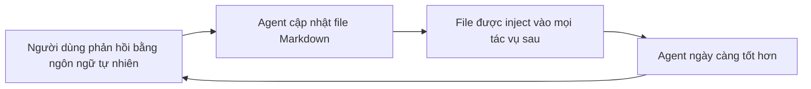

# 🔁 Feedback Loop "lean": Chỉ một file Markdown là đủ để agent tốt lên mỗi ngày

> Nguồn: `166-Tutorial-Building-a-Lean-AI-Feedback-Loop.txt` · [Udemy](https://ua.udemy.com/course/langchain/learn/lecture/55594885)

Chào các bạn, chúng ta đã nói về tầm quan trọng của **feedback loop (vòng lặp phản hồi)** trong việc xây dựng niềm tin với AI agent. Vậy một phiên bản **tinh gọn (lean)** của nó trông như thế nào? Hôm nay, mình và các bạn sẽ cùng nghe **Assaf Elovic** chia sẻ cách làm đơn giản nhất mà lại hiệu quả nhất.

### 🎯 Tùy ngữ cảnh: agent cấp sản phẩm, cấp người dùng hay cấp công ty?

Trước khi bắt tay vào làm, Assaf lưu ý rằng cách tiếp cận **phụ thuộc vào việc agent của bạn ở cấp độ nào**:

* Một số agent mang tính **cá nhân hóa cao (personalized)**.
* Một số sản phẩm deploy agent cần **hoạt động khác nhau với từng người dùng**.
* Một số khác mang tính **company-level (cấp công ty)**.

Việc xác định đúng "cấp độ" của agent sẽ quyết định bạn cần thiết kế feedback loop ra sao.

| Cấp độ agent | Đặc điểm |
|---|---|
| Cá nhân hóa cao | Một số agent mang tính personalized, phục vụ nhu cầu riêng |
| Cấp người dùng | Sản phẩm deploy agent cần hoạt động khác nhau với từng người dùng |
| Cấp công ty | Một số agent mang tính company-level, dùng chung ở cấp tổ chức |

---

### 📝 Cách làm lean nhất: giữ một file Markdown và để agent tự cập nhật

Ý tưởng của Assaf đơn giản đến bất ngờ: bạn **giữ một file Markdown** cho agent.

1. Ban đầu, file có thể **trống** khi người dùng lần đầu tương tác.
2. Mỗi khi người dùng đưa ra phản hồi — **chỉ bằng ngôn ngữ tự nhiên đơn giản** — bạn **cập nhật file đó**.
3. File này sẽ được **inject vào agent trong mọi tác vụ tiếp theo**.

Vòng lặp tinh gọn đó khép kín như sau:

Và đó là toàn bộ feedback loop! Nghe khó tin, nhưng Assaf khẳng định nó có thể chỉ tốn **một ngày công** để làm và đã thực sự hoạt động.

**Chi tiết quan trọng nhất:** chính **agent là bên cập nhật file**, **không phải người dùng**. Con người tương tác qua ngôn ngữ tự nhiên; còn agent có trách nhiệm **quản lý và liên tục cập nhật file đó**. Đây là "thắng lợi nhanh nhất" mà họ đã kiểm chứng.

---

### 🛠️ Góc nhìn của mình: hiện thực hóa bằng LangChain middleware

Khi nghe Assaf chia sẻ, mình thấy ngay một cách để triển khai trong LangChain: dùng **middleware**.

Bạn có thể **thêm một bước (step)** — chẳng hạn **trước khi gọi tool** hoặc **trước khi thực hiện một LLM call** — và viết **custom code** tại đó. Đoạn code này có thể:

* **Đọc file Markdown** đã nói ở trên.
* **Cập nhật nội dung** file.
* Hoặc **lấy nội dung file và bổ sung vào context** trước khi gọi model.

### 🎯 Tự kiểm tra nhanh

**Câu 1:** Cách làm lean nhất của feedback loop là giữ thứ gì cho agent?

<b>Xem đáp án</b>

**Đáp án:** Một file Markdown.

Giải thích: File được inject vào agent trong mọi tác vụ tiếp theo.

Tham chiếu: Mục Cách làm lean nhất.

**Câu 2:** Trạng thái ban đầu của file Markdown là gì?

<b>Xem đáp án</b>

**Đáp án:** Có thể trống khi người dùng lần đầu tương tác.

Giải thích: Sau đó file được cập nhật dần mỗi khi có phản hồi mới.

Tham chiếu: Mục Cách làm lean nhất.

**Câu 3:** Ai là bên chịu trách nhiệm cập nhật file?

<b>Xem đáp án</b>

**Đáp án:** Chính agent, không phải người dùng.

Giải thích: Đây là chi tiết quan trọng nhất — người dùng chỉ tương tác qua ngôn ngữ tự nhiên, còn agent quản lý và liên tục cập nhật file.

Tham chiếu: Mục Cách làm lean nhất.

**Câu 4:** Feedback loop này tốn bao nhiêu công để triển khai?

<b>Xem đáp án</b>

**Đáp án:** Có thể chỉ tốn một ngày công.

Giải thích: Assaf khẳng định đây là "thắng lợi nhanh nhất" mà họ đã kiểm chứng và nó thực sự hoạt động.

Tham chiếu: Mục Cách làm lean nhất.

**Câu 5:** Trong LangChain, mình đề xuất hiện thực hóa feedback loop này bằng gì?

<b>Xem đáp án</b>

**Đáp án:** Dùng middleware — thêm một step trước khi gọi tool hoặc trước LLM call, rồi viết custom code tại đó.

Giải thích: Custom code có thể đọc file Markdown, cập nhật nội dung, hoặc lấy nội dung bổ sung vào context trước khi gọi model.

Tham chiếu: Mục Góc nhìn của mình.

Thật tuyệt khi một ý tưởng đơn giản như vậy lại có thể triển khai gọn gàng trong cùng hệ sinh thái mà chúng ta đang học. Hãy thử áp dụng cho agent của bạn xem sao — biết đâu đó lại chính là yếu tố thay đổi cuộc chơi! Hẹn gặp lại các bạn ở những bài tiếp theo. 🚀

## Nguồn tham khảo

- [Udemy — Tutorial: Building a Lean AI Feedback Loop](https://ua.udemy.com/course/langchain/learn/lecture/55594885)
- [LangChain Docs — Middleware overview](https://docs.langchain.com/oss/python/langchain/middleware/overview)
