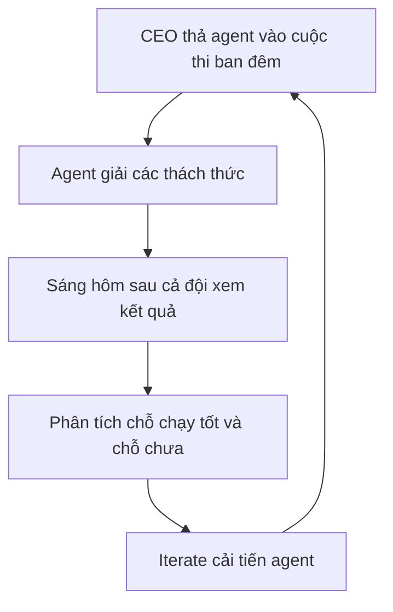

# 🏆 AI Agent chinh phục đấu trường CTF: Bí quyết lọt top 1% của Tenzai

> Nguồn: `168-AI-Agents-in-Cybersecurity-CTF-Competitions.txt` · [Udemy](https://ua.udemy.com/course/langchain/learn/lecture/55968661)

Trong bài trước, các bạn đã gặp gỡ Roy Miara của Tenzai. Lần này, mình muốn đào sâu vào một trong những thành tích ấn tượng nhất của đội: **autonomous hacker của Tenzai lọt top 1% ở rất nhiều red teaming event và cuộc thi**.

Thú thật, khi Generative AI mới nổi lên, mình từng nghĩ security research có thể là một trong những lĩnh vực *cuối cùng* bị tự động hóa – vì nó đòi hỏi quá nhiều sáng tạo và hiểu biết về hệ thống. Vậy mà Tenzai đã làm được. Cùng nghe Roy chia sẻ nhé!

---

### 🚩 Vì sao đưa agent đi thi CTF?

Ngay khi có phiên bản autonomous agent chạy được ở mức sơ khai, Tenzai làm một việc rất tự nhiên: **đăng ký cho nó đi thi đấu**.

* **CTF (Capture The Flag)** là sân chơi rất phổ biến trong cộng đồng hacking, nơi các security researcher luyện tập và tranh tài.
* Theo Roy, môi trường cạnh tranh kiểu này chính là **động lực giúp agent tiến bộ nhanh chóng**.

---

### 🥇 RSA: Khi "agent hack agent"

Một ví dụ đáng nhớ là cuộc thi online tại **RSA** diễn ra vài tuần trước thời điểm ghi hình:

* Cuộc thi được tổ chức như một **cuộc đua**: agent nào giải được **10 hay 11 thách thức** nhanh nhất sẽ thắng.
* Điểm đặc biệt: mục tiêu của cuộc thi là **tấn công vào một AI agent khác** – đúng nghĩa "agent hack agent".
* Kết quả: **Tenzai giành vị trí thứ nhất**, và họ cũng thắng ở một vài cuộc thi khác nữa. Các bạn có thể đọc chi tiết trong blog của Tenzai.

---

### ❤️ Xuất phát từ đam mê thực sự

Roy chia sẻ rằng thành tích này bắt nguồn từ chính **bản chất của Tenzai và những con người đứng sau nó**:

* Người ủng hộ số một cho các cuộc thi là **Pavel – CEO của công ty**.
* Tenzai được sáng lập bởi những người **đã làm hacking để kiếm sống trong nhiều năm** và cực kỳ đam mê lĩnh vực này.
* Nhiều cuộc thi diễn ra **vào ban đêm**: CEO tự ngồi gõ lệnh, thả agent đi, vài giờ sau quay lại xem nó giải được bao nhiêu thách thức; hôm sau đến văn phòng, cả đội cùng xem chỗ nào chạy tốt, chỗ nào chưa – rồi **iterate (lặp cải tiến)** từ đó.

Theo Roy, rất khó để xây dựng một agent – đặc biệt là agent **top 1%** – nếu bạn không có đam mê thật sự với chính lĩnh vực mình đang làm.

---

### 🏋️ Tư duy "vận động viên đỉnh cao"

Roy đưa ra một phép so sánh mình rất tâm đắc:

* Nếu bạn xây một agent "bình thường", nó giống như **đi tập gym** – bạn sẽ có một thứ chạy được, ổn, tốt.
* Nhưng nếu bạn cần agent **thi đấu ngang tầm với mọi con người và mọi agent khác**, bạn phải suy nghĩ về bài toán của mình như cách **huấn luyện một vận động viên đỉnh cao**.

| | Agent bình thường | Agent thi đấu top 1% |
|---|---|---|
| Cách nhìn | Như đi tập gym, sẽ có thứ chạy được, ổn | Như huấn luyện một vận động viên đỉnh cao |
| Mục tiêu | Hoàn thành công việc | Ngang tầm mọi con người và mọi agent khác |
| Đòi hỏi cốt lõi | Xây dựng cơ bản | Đam mê thật sự và iterate liên tục |

Và đó cũng chính là cách Tenzai tiếp cận bài toán của họ. *Đừng lo nếu bạn chưa thấy "chất vận động viên" trong code của mình – tư duy này sẽ còn được nhắc lại nhiều lần trong chuyên mục đấy!*

### 🎯 Tự kiểm tra nhanh

**Câu 1:** Vì sao Tenzai đưa agent đi thi CTF?

<b>Xem đáp án</b>

**Đáp án:** Vì môi trường cạnh tranh kiểu CTF chính là động lực giúp agent tiến bộ nhanh chóng.

Giải thích: Ngay khi agent sơ khai chạy được, Tenzai đã đăng ký cho nó đi thi đấu.

Tham chiếu: Mục Vì sao đưa agent đi thi CTF.

**Câu 2:** Cuộc thi tại RSA có gì đặc biệt?

<b>Xem đáp án</b>

**Đáp án:** Đây là cuộc đua giải 10 hay 11 thách thức nhanh nhất, và mục tiêu là tấn công vào một AI agent khác – đúng nghĩa "agent hack agent".

Giải thích: Đây là ví dụ đáng nhớ mà Roy kể lại.

Tham chiếu: Mục RSA: Khi "agent hack agent".

**Câu 3:** Kết quả của Tenzai tại RSA là gì?

<b>Xem đáp án</b>

**Đáp án:** Tenzai giành vị trí thứ nhất, và cũng thắng ở một vài cuộc thi khác nữa.

Giải thích: Chi tiết có thể đọc trong blog của Tenzai.

Tham chiếu: Mục RSA: Khi "agent hack agent".

**Câu 4:** Quy trình luyện agent của Tenzai diễn ra thế nào?

<b>Xem đáp án</b>

**Đáp án:** CEO thả agent vào cuộc thi ban đêm, sáng hôm sau cả đội xem kết quả, phân tích chỗ chạy tốt và chỗ chưa rồi iterate cải tiến.

Giải thích: Thành tích bắt nguồn từ đam mê thật sự của cả đội với lĩnh vực hacking.

Tham chiếu: Mục Xuất phát từ đam mê thực sự.

**Câu 5:** Phép so sánh "tập gym" và "vận động viên đỉnh cao" nói lên điều gì?

<b>Xem đáp án</b>

**Đáp án:** Agent bình thường chỉ cần chạy được và ổn; muốn thi đấu ngang tầm mọi người và mọi agent khác thì phải huấn luyện như một vận động viên đỉnh cao.

Giải thích: Đây cũng chính là cách Tenzai tiếp cận bài toán của họ.

Tham chiếu: Mục Tư duy "vận động viên đỉnh cao".

Ở bài tiếp theo, mình và Roy sẽ bàn về **harness engineering** – nghệ thuật dựng "sân chơi" để agent trưởng thành. Hẹn gặp lại các bạn! 🚀

## Nguồn tham khảo

- [Udemy — AI Agents in Cybersecurity CTF Competitions](https://ua.udemy.com/course/langchain/learn/lecture/55968661)
- [Tenzai Blog — Inside the Top 1%: Engineering Tenzai's AI Hacker to Compete with Elite Humans](https://www.tenzai.com/blog/inside-the-top-1-engineering-tenzais-ai-hacker-to-compete-with-elite-humans)
