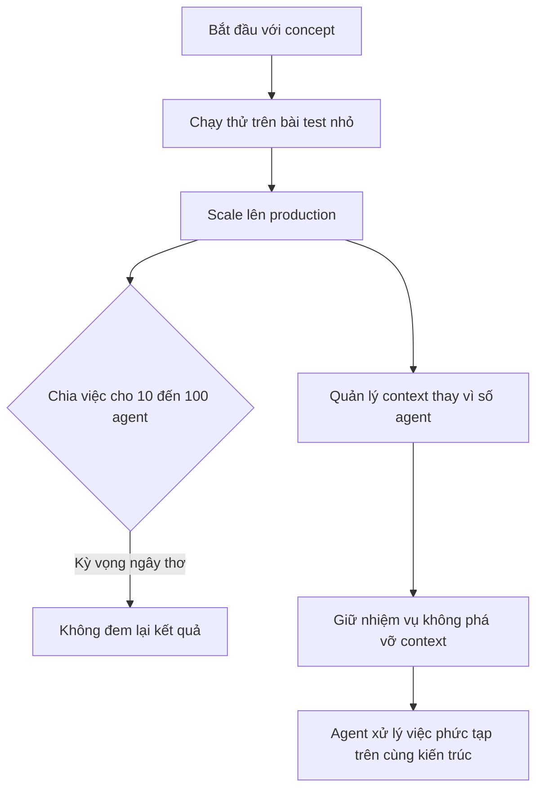

# 🛠️ Harness Engineering: Vì sao không thể "chia việc cho 100 agent" là xong?

> Nguồn: `169-Harness-Engineering.txt` · [Udemy](https://ua.udemy.com/course/langchain/learn/lecture/55968663)

Trong cuộc trò chuyện với Roy Miara, có một chủ đề khiến mình trăn trở mãi: **harness engineering** – cách dựng môi trường vận hành ổn định để agent làm được những việc ngày càng phức tạp. Hóa ra, con đường từ bản POC (proof of concept) đến production không hề bằng phẳng như vẻ ngoài của những sản phẩm "ra mắt nhanh".

Cùng mình nghe lại những bài học xương máu mà Tenzai đã trải qua nhé!

---

### 🔁 Hành trình nhiều lần lặp kiến trúc

Tenzai không đi từ ý tưởng đến kiến trúc hoàn chỉnh trong một bước. Roy kể rằng họ đã trải qua **nhiều iteration (vòng lặp cải tiến) của agent**:

* Ban đầu, đội bắt đầu với một concept trong đầu.
* Đến một lúc nào đó, họ nhận ra phải **liên tục vá (patch)** hệ thống để mở rộng quy mô.
* Với một kỹ sư đủ kinh nghiệm, bạn sẽ **cảm nhận được** khi mình đang vá mọi thứ theo cách kém hiệu quả, rằng **kiến trúc hiện tại không còn đủ sức nâng đỡ đà tiến bộ**.

Roy cũng lưu ý: mọi người thường nghĩ quá trình này diễn ra rất nhanh vì Tenzai ra thị trường sớm – nhưng thực tế **mất nhiều thời gian hơn người ngoài tưởng**. Đổi lại, họ có một quy trình thử nhiều hướng tiếp cận và chọn ra kiến trúc ngày hôm nay.

---

### 🧠 "Tâm trí agent" và ảo giác về quy mô

Khi kiến trúc đầu tiên đã nằm trong tay, Tenzai chạy thử trên các **bài test nhỏ** (như CTF) và mọi thứ có vẻ ổn. Nhưng scale lên production lại là – và vẫn đang là – **một quá trình**, bởi Roy nhận ra một điều mà anh không lường trước:

* Trong **"agent state of mind" (trạng thái tâm trí của agent)**, agent không hề biết rằng hệ thống đang lớn dần, rằng **có nhiều agent đang chạy song song**.
* Vì vậy, bạn phải giữ nhiệm vụ ở mức **không phá vỡ context quá nhiều**, bởi việc cắt đứt context của agent có **tác động tiêu cực** rất rõ.
* Và niềm tin ngây thơ rằng "cứ chia việc cho 10 agent hay 100 agent là mọi chuyện tự giải quyết" **không hoạt động trong thực tế**.

Roy lấy ví dụ: với một ứng dụng đơn giản chỉ có một trang, vài trăm hoặc vài nghìn dòng code, agent giải quyết rất tốt. Nhưng với bài toán lớn hơn **10 lần hay 100 lần** – một ứng dụng đồ sộ với rất nhiều bề mặt tấn công và rất nhiều code – thì chia việc máy móc cho hàng chục, hàng trăm agent **không đem lại kết quả**.

---

### 🎯 Điều bạn thực sự quản lý là context

Bài học lớn nhất của Tenzai: **tạo ra một môi trường ổn định cho chính agent**, để agent có thể làm những nhiệm vụ phức tạp hơn **trên cùng một kiến trúc**.

Nói cách khác, thứ bạn cần quản lý không phải số lượng agent, mà là **context và tính hiệu quả của context**:

1. Khi nào thì **an toàn để phá vỡ (break) hoặc xóa (clear) context**?
2. Khi nào bạn vẫn cần **giữ nguyên sự tập trung** của agent?
3. **Phần nào của bài toán có thể giao phó (delegatable)**, phần nào thì không?

| | Chia việc máy móc cho nhiều agent | Quản lý context |
|---|---|---|
| Giả định | Càng nhiều agent càng xử lý được bài toán lớn | Agent cần môi trường ổn định và context liền mạch |
| Kết quả thực tế | Không hoạt động với bài toán lớn gấp 10 đến 100 lần | Giữ context hiệu quả, phá context đúng lúc |
| Câu hỏi cốt lõi | Cần bao nhiêu agent | Khi nào an toàn để break hoặc clear context |

Đây là những câu hỏi thực sự khó, và Tenzai mất khá nhiều thời gian để hiểu rõ rồi mới chốt được kiến trúc phù hợp.

---

### 🌱 Nền móng đến từ đúng người

Roy không nói họ "may mắn", bởi hành trình đó ngốn của họ không ít lần lặp. Nhưng anh thừa nhận Tenzai **gặp thời** khi có đủ:

* Những chuyên gia đúng hướng.
* Những kỹ sư phù hợp.
* Những nhà nghiên cứu tài năng.

Tất cả cùng nhau tạo nên **một nền móng vững chắc** để từ đó xây tiếp. *Nếu bạn đang ở giai đoạn "vá víu" đầu tiên của dự án mình – đừng nản, đó là phần không thể thiếu của hành trình.*

### 🎯 Tự kiểm tra nhanh

**Câu 1:** Vì sao Tenzai phải trải qua nhiều iteration của kiến trúc agent?

<b>Xem đáp án</b>

**Đáp án:** Vì họ bắt đầu từ concept, rồi liên tục vá hệ thống để mở rộng quy mô; đến lúc kỹ sư nhận ra kiến trúc hiện tại không còn đủ sức nâng đỡ đà tiến bộ.

Giải thích: Quá trình này mất nhiều thời gian hơn người ngoài tưởng dù Tenzai ra thị trường sớm.

Tham chiếu: Mục Hành trình nhiều lần lặp kiến trúc.

**Câu 2:** "Ảo giác về quy mô" mà Roy nói tới là gì?

<b>Xem đáp án</b>

**Đáp án:** Niềm tin ngây thơ rằng cứ chia việc cho 10 hay 100 agent là mọi chuyện tự giải quyết – điều này không hoạt động trong thực tế.

Giải thích: Với bài toán lớn gấp 10 đến 100 lần, chia việc máy móc không đem lại kết quả.

Tham chiếu: Mục "Tâm trí agent" và ảo giác về quy mô.

**Câu 3:** Vì sao "agent state of mind" quan trọng khi scale?

<b>Xem đáp án</b>

**Đáp án:** Agent không hề biết hệ thống đang lớn dần hay có nhiều agent chạy song song, nên phải giữ nhiệm vụ ở mức không phá vỡ context quá nhiều.

Giải thích: Cắt đứt context của agent có tác động tiêu cực rất rõ.

Tham chiếu: Mục "Tâm trí agent" và ảo giác về quy mô.

**Câu 4:** Thứ bạn thực sự cần quản lý là gì?

<b>Xem đáp án</b>

**Đáp án:** Context và tính hiệu quả của context, không phải số lượng agent.

Giải thích: Mục tiêu là tạo môi trường ổn định để agent làm việc phức tạp hơn trên cùng một kiến trúc.

Tham chiếu: Mục Điều bạn thực sự quản lý là context.

**Câu 5:** Ba câu hỏi cốt lõi khi quản lý context là gì?

<b>Xem đáp án</b>

**Đáp án:** Khi nào an toàn để break hoặc clear context; khi nào cần giữ nguyên sự tập trung của agent; phần nào của bài toán có thể giao phó.

Giải thích: Tenzai mất khá nhiều thời gian để trả lời những câu hỏi này trước khi chốt kiến trúc.

Tham chiếu: Mục Điều bạn thực sự quản lý là context.

Còn một bài toán hóc búa nữa mà mình rất muốn chia sẻ: **variance và hallucination trong production agent**. Hẹn gặp các bạn ở bài tiếp theo! 🚀

## Nguồn tham khảo

- [Udemy — Harness Engineering](https://ua.udemy.com/course/langchain/learn/lecture/55968663)
- [Anthropic Engineering — Effective harnesses for long-running agents](https://www.anthropic.com/engineering/effective-harnesses-for-long-running-agents)
- [Anthropic Engineering — Building effective agents](https://www.anthropic.com/engineering/building-effective-agents)
