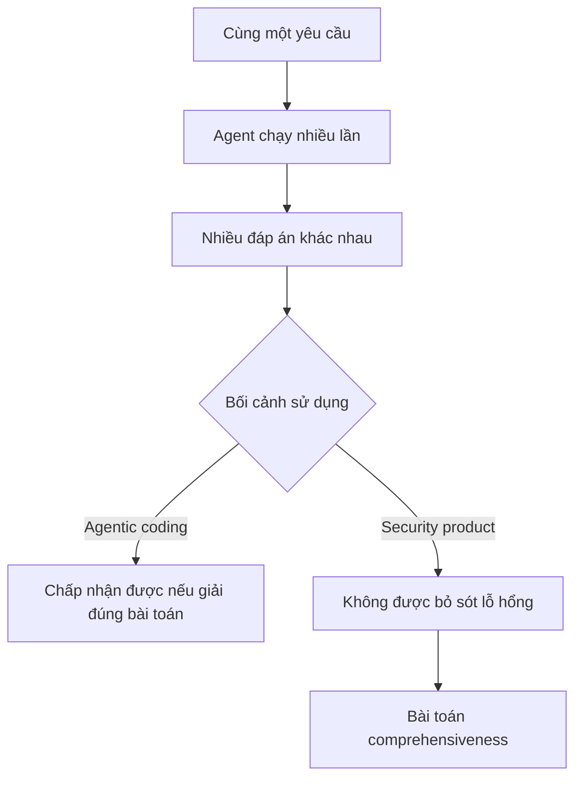

# 🎛️ Variance & Hallucination: Bài toán "không được phép sai" của Production Agent

> Nguồn: `170-Managing-Variance-and-Hallucinations-in-Production-Agents.txt` · [Udemy](https://ua.udemy.com/course/langchain/learn/lecture/55968665)

Nếu bạn từng chạy cùng một coding agent nhiều lần và nhận về nhiều kết quả khác nhau, bạn đã chạm tới chủ đề của bài hôm nay. Trong cuộc trò chuyện với Roy Miara, chúng mình bàn về **variance (độ biến thiên kết quả), hallucination và bài toán comprehensiveness (tính bao quát)** – những thứ quyết định sống còn với một production agent.

Đây là phần mà mình tin bất kỳ ai xây agent nghiêm túc đều nên nghe qua. Cùng bắt đầu nhé!

---

### 🧭 Hiểu rõ "ai đang giữ context nào"

Một thách thức nền tảng khi vận hành nhiều agent: **biết được agent nào hiểu phần nào của nhiệm vụ, và agent nào đang giữ phần context nào tại từng thời điểm**. Roy nhấn mạnh việc hiểu tường tận sự phân chia này là cực kỳ quan trọng khi hệ thống lớn dần.

---

### 🎲 Cùng một bài toán, nhiều đáp án

Một điểm rất quen thuộc với những ai dùng agentic coding:

* Bạn yêu cầu agent **xây một feature hoặc sửa một bug**, chạy nhiều lần, và **khả năng cao bạn nhận về nhiều đáp án khác nhau**.
* Với agentic coding, điều này **có thể chấp nhận được** – suy cho cùng bạn chỉ cần giải quyết bài toán, và có nhiều lời giải đều hợp lệ.

Nhưng với **autonomous hacker – về bản chất là một security product**, câu chuyện hoàn toàn khác:

* Bạn **không thể cho phép mình bỏ sót một lỗ hổng đang tồn tại**.
* Điều này dẫn tới bài toán **comprehensiveness (tính bao quát)** – theo Roy, đây là một bài toán **cực kỳ phức tạp** khi xây agent.

| | Agentic coding | Autonomous hacker |
|---|---|---|
| Tính chất | Công cụ hỗ trợ viết code | Về bản chất là một security product |
| Nhiều đáp án | Chấp nhận được, miễn giải quyết được bài toán | Không được phép bỏ sót lỗ hổng đang tồn tại |
| Bài toán khó nhất | Chất lượng lời giải | Comprehensiveness toàn diện |

---

### 🌡️ Cân bằng giữa sáng tạo và bao quát

Nghịch lý nằm ở chỗ:

* Một mặt, bạn **muốn agent chạy ở "high temperature" (nhiệt độ cao)** để phát huy **tính sáng tạo**.
* Nhưng sáng tạo cao đồng nghĩa **variance cao**, và để có một kết quả thực sự bao quát, bạn phải **rất vất vả tìm điểm cân bằng giữa creativeness (sáng tạo) và exhaustiveness (toàn diện)**.

Roy quan sát thấy nhiều sản phẩm khác trên thị trường chọn cách **"bake in" (cài cứng) tính bao quát** – tức là ép hệ thống toàn diện theo một cách định sẵn. Nhưng khi đưa vào thế giới thực, cách tiếp cận đó khiến agent **không thực sự khám phá được những vùng phức tạp của bài toán**.

---

### ⚖️ Lập trình cứng hay trao quyền tự quyết?

Roy kể một cuộc trò chuyện rất đáng suy ngẫm với một security researcher cực kỳ giỏi của đội:

* Researcher muốn **đẩy agent làm mọi thứ theo một cách nhất định** – theo kiểu best practices, giống như cách bạn huấn luyện một con người.
* Roy – xuất thân từ bảo mật – phản biện lại: **khi bạn bấm nút và agent đang hành động, agent hiểu về hệ thống hơn bạn đấy**.

Từ đó nảy sinh **sự căng thẳng (tension) kinh điển**:

1. Mình muốn **lập trình cho agent làm theo một cách cụ thể**, hay
2. Mình muốn **trao cho agent quyền tự quyết** về cách làm tốt nhất?

Theo Roy, đây chính là trạng thái mà đội ngũ đang sống cùng mỗi ngày. *Nếu bạn thấy mình cũng đang kẹt giữa hai thái cực ấy – các bạn không cô đơn đâu, đội đang làm top 1% cũng vậy!*

### 🎯 Tự kiểm tra nhanh

**Câu 1:** Vì sao phải hiểu rõ "ai đang giữ context nào"?

<b>Xem đáp án</b>

**Đáp án:** Để biết agent nào hiểu phần nào của nhiệm vụ tại từng thời điểm, giúp hệ thống lớn dần mà không rối.

Giải thích: Roy nhấn mạnh việc hiểu tường tận sự phân chia này là cực kỳ quan trọng khi scale.

Tham chiếu: Mục Hiểu rõ "ai đang giữ context nào".

**Câu 2:** Vì sao agentic coding chấp nhận được nhiều đáp án khác nhau?

<b>Xem đáp án</b>

**Đáp án:** Vì suy cho cùng bạn chỉ cần giải quyết bài toán, và có nhiều lời giải đều hợp lệ.

Giải thích: Đây là điều rất quen thuộc với người dùng agentic coding.

Tham chiếu: Mục Cùng một bài toán, nhiều đáp án.

**Câu 3:** Vì sao autonomous hacker không được phép variance?

<b>Xem đáp án</b>

**Đáp án:** Vì nó là một security product: không thể cho phép bỏ sót một lỗ hổng đang tồn tại.

Giải thích: Điều này dẫn tới bài toán comprehensiveness cực kỳ phức tạp.

Tham chiếu: Mục Cùng một bài toán, nhiều đáp án.

**Câu 4:** Nghịch lý của "high temperature" là gì?

<b>Xem đáp án</b>

**Đáp án:** Muốn agent sáng tạo cao, nhưng sáng tạo cao đồng nghĩa variance cao; phải tìm điểm cân bằng giữa creativeness và exhaustiveness.

Giải thích: Đây là bài toán cân bằng khó khi xây agent bảo mật.

Tham chiếu: Mục Cân bằng giữa sáng tạo và bao quát.

**Câu 5:** Vì sao cách "bake in" tính bao quát có nhược điểm?

<b>Xem đáp án</b>

**Đáp án:** Vì ép hệ thống toàn diện theo cách định sẵn khiến khi vào thế giới thực, agent không thực sự khám phá được những vùng phức tạp của bài toán.

Giải thích: Đây là quan sát của Roy về nhiều sản phẩm khác trên thị trường.

Tham chiếu: Mục Cân bằng giữa sáng tạo và bao quát.

Mình hy vọng những chia sẻ này giúp các bạn nhìn production agent bằng con mắt thực tế hơn. Ở các bài tiếp theo, chúng ta sẽ quay trở lại với các kỹ thuật cụ thể – đừng bỏ lỡ nhé! 🚀

## Nguồn tham khảo

- [Udemy — Managing Variance and Hallucinations in Production Agents](https://ua.udemy.com/course/langchain/learn/lecture/55968665)
