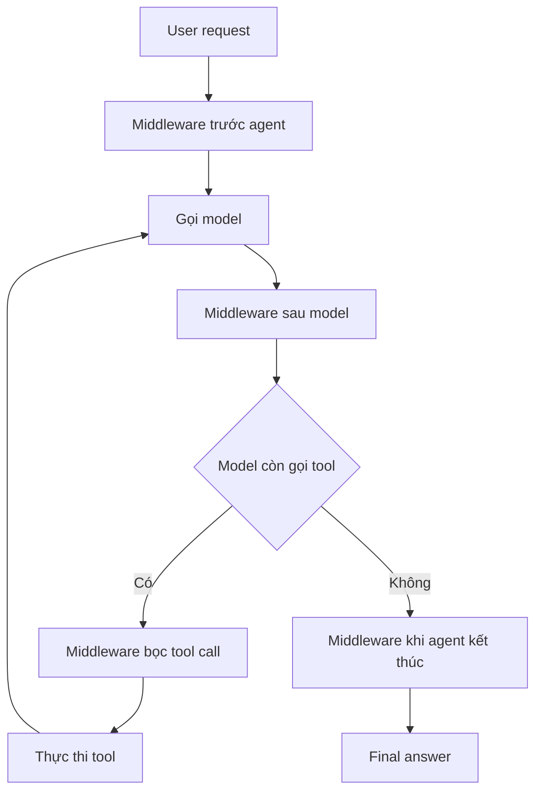

# 🔌 Agent Middleware là gì? Từ FastAPI đến vòng lặp của AI Agent

> Nguồn: `155-What-is-Agent-Middleware.txt` · [Udemy](https://ua.udemy.com/course/langchain/learn/lecture/57763549)

Nếu các bạn từng làm việc với FastAPI hay Express, chắc hẳn đã nghe qua khái niệm **middleware (lớp trung gian)**. Bài hôm nay, mình sẽ nối tiếp trực giác đó để giải thích **agent middleware trong LangChain** – và chỉ ra điểm khác biệt căn bản khiến nó thú vị hơn hẳn.

Cùng bắt đầu từ ví dụ web quen thuộc nhé!

---

### 🧭 Middleware trong thế giới web

Middleware cho phép chúng ta định nghĩa **logic chạy xuyên suốt nhiều request** cùng lúc. Ví dụ:

* **Log (ghi log) mọi request** đi vào hệ thống.
* **Xác thực (authenticate) mọi người dùng**.
* **Rate limit (giới hạn tần suất)** để một người dùng không gửi quá nhiều request.

Bạn hoàn toàn có thể **nhét logic này vào từng endpoint**, nhưng cách đó sẽ tạo ra **rất nhiều code trùng lặp**, gây rắc rối về sau – và dĩ nhiên **không phải best practice**.

Giải pháp đúng là dùng **middleware**: mọi request đều **đi xuyên qua middleware trước khi tới ứng dụng**. Tại đây, middleware có thể:

* **Kiểm tra (inspect)** request.
* **Sửa (modify)** request.
* **Từ chối (reject)** hoặc **cho phép đi tiếp (allow)**.
* Và khi ứng dụng tạo ra response, response cũng **đi ngược qua middleware** trước khi được trả về client.

---

### 🚦 Một luồng request điển hình

Trong một web application, dòng chảy có thể diễn ra như sau:

1. Request đến và đi qua **authentication middleware** để kiểm tra người dùng đã đăng nhập, đã xác thực chưa.
2. Tiếp theo là **rate-limiting middleware** – kiểm tra xem người dùng có gửi quá nhiều request không; nếu có thì **chặn lại**.
3. Sau đó request đi qua **logging middleware** để ghi log.
4. Cuối cùng, sau khi vượt qua tất cả các middleware, request mới **chạm tới endpoint**.

Điểm cốt lõi: middleware xử lý những **concern (mối quan tâm) áp dụng cho toàn bộ ứng dụng**, chứ không phải logic riêng lẻ của một endpoint nào đó.

---

### 🔄 Nhưng AI agent không đi theo đường thẳng

Đây là chỗ agent middleware khác biệt. Với web request, đường đi rất đơn giản: **request vào → endpoint chạy → response ra**. Nhưng AI agent vận hành trong một **agent loop (vòng lặp agent)**:

* Người dùng gửi request.
* Agent gọi **LLM**.
* LLM quyết định **gọi tool nào**.
* Agent **thực thi tool** đó.
* Kết quả được đưa **trở lại cho model**.
* Model xem xét có cần chọn tool khác không, và **vòng lặp cứ thế tiếp diễn** cho đến khi model tạo ra câu trả lời cuối cùng.

Hệ quả: **một request duy nhất của người dùng có thể sinh ra rất nhiều model call và tool call**.

| Tiêu chí | Web middleware | Agent middleware |
|---|---|---|
| Luồng xử lý | Request vào, endpoint chạy, response ra | Vòng lặp model và tool tiếp diễn nhiều lần |
| Số lần can thiệp | Một lần cho mỗi request | Nhiều checkpoint trong một request |
| Điểm can thiệp | Trước và sau endpoint | Trước và sau agent, trước và sau model, bọc tool call, khi kết thúc |

---

### 🎯 Vì thế agent middleware cần nhiều checkpoint hơn

Bởi agent loop phức tạp như vậy, agent middleware phải có **nhiều điểm can thiệp** chứ không chỉ một:

* Chạy **trước khi toàn bộ agent bắt đầu**.
* Chạy **trước mỗi lần gọi model**.
* Chạy **sau mỗi phản hồi của model**.
* **Bọc (wrap) mỗi tool call**, thêm logic **trước hoặc sau** khi gọi tool.
* Chạy một lần nữa **khi agent kết thúc**.

LangChain mang đến cho chúng ta chính sự linh hoạt này. Cá nhân mình thích nhìn middleware như **một cơ chế cho phép đặt những hành vi phải chạy nhất quán mà không cần nhúng chúng vào business logic cốt lõi của agent**.

### 🎯 Tự kiểm tra nhanh

**Câu 1:** Middleware trong thế giới web giải quyết vấn đề gì?

<b>Xem đáp án</b>

**Đáp án:** Chạy logic xuyên suốt nhiều request như log, xác thực, rate limit mà không lặp code ở từng endpoint.

Giải thích: Nhét logic vào từng endpoint gây trùng lặp code và không phải best practice.

Tham chiếu: Mục Middleware trong thế giới web.

**Câu 2:** Vì sao agent middleware cần nhiều checkpoint hơn web middleware?

<b>Xem đáp án</b>

**Đáp án:** Vì agent chạy trong vòng lặp: một request có thể sinh ra rất nhiều model call và tool call.

Giải thích: Web request chỉ đi thẳng vào endpoint rồi ra, còn agent lặp liên tục cho tới khi có câu trả lời.

Tham chiếu: Mục Nhưng AI agent không đi theo đường thẳng.

**Câu 3:** Kể tên các checkpoint chính của agent middleware.

<b>Xem đáp án</b>

**Đáp án:** Trước khi agent bắt đầu, trước mỗi lần gọi model, sau mỗi phản hồi của model, bọc mỗi tool call và khi agent kết thúc.

Giải thích: Đây là những nơi middleware có thể chèn logic trong vòng chạy.

Tham chiếu: Mục Vì thế agent middleware cần nhiều checkpoint hơn.

**Câu 4:** Middleware can thiệp vào response như thế nào?

<b>Xem đáp án</b>

**Đáp án:** Khi ứng dụng tạo response, response đi ngược qua middleware trước khi trả về client.

Giải thích: Middleware có thể inspect, modify, reject hoặc allow cả request lẫn response.

Tham chiếu: Mục Middleware trong thế giới web.

**Câu 5:** Vì sao middleware giúp tránh nhúng logic vào business logic cốt lõi?

<b>Xem đáp án</b>

**Đáp án:** Vì nó cho phép đặt những hành vi phải chạy nhất quán vào đúng checkpoint, tách khỏi logic nghiệp vụ của agent.

Giải thích: Đây là cách nhìn của tác giả về giá trị cốt lõi của middleware.

Tham chiếu: Mục Vì thế agent middleware cần nhiều checkpoint hơn.

*Và đây mới chỉ là phần khái niệm – các ví dụ và use case cụ thể đang chờ các bạn ở bài tiếp theo!*

Hẹn gặp lại các bạn ngay sau đây! 🚀

## Nguồn tham khảo

- [Udemy — What is Agent Middleware](https://ua.udemy.com/course/langchain/learn/lecture/57763549)
- [LangChain Docs — Middleware overview](https://docs.langchain.com/oss/python/langchain/middleware/overview)
