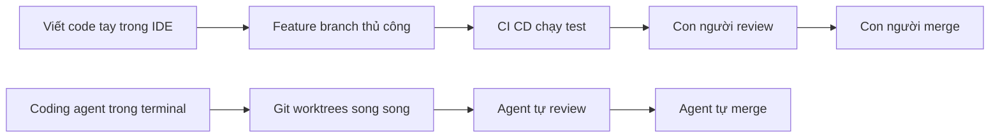

# 🏗️ Kỹ thuật phần mềm năm 2026 đã thay đổi ra sao? (Và vì sao bảo mật trở thành câu chuyện nóng)

> Nguồn: `171-2026-Software-Engineering.txt` · [Udemy](https://ua.udemy.com/course/langchain/learn/lecture/57115459)

Chào các bạn, trong bài này mình muốn cùng các bạn nhìn lại một sự thật đang diễn ra ngay trước mắt: **cách chúng ta viết phần mềm đã thay đổi một cách chóng mặt**. Và chính sự thay đổi đó là nền tảng cho toàn bộ những lo lắng về bảo mật mà mình sẽ chia sẻ trong chuỗi bài này.

Cách mình viết code khi mới vào nghề khác hoàn toàn với cách một bạn trẻ mới bắt đầu hôm nay. Rất nhiều kỹ năng của kỹ sư ngày xưa vẫn còn giá trị — thậm chí giá trị hơn cả trước — nhưng cũng có không ít kỹ năng đã trở nên không còn cần thiết.

| Khía cạnh | Trước năm 2024 | Năm 2026 |
|---|---|---|
| Nơi viết code | IDE, gõ code bằng tay | Coding agent qua terminal, agent manager interface |
| Làm nhiều feature | Feature branch chuyển qua lại bằng tay, tuần tự | Git worktrees, nhiều agent chạy song song |
| Review code | Con người review, có accountability | Agent tự review, có thể dùng KUDO, Greptile, Buzz |
| Người merge | Lập trình viên bấm nút merge | Agent làm việc đó thay ta |

---

### 🕰️ Ngày xưa: IDE là "mặt trận" chính

Trước năm 2024, muốn phát triển phần mềm, chúng ta dùng **IDE** — có thể là **PyCharm** hoặc **VS Code** — và viết code bằng tay. Thời đó, viết code là một việc **rất, rất tốn kém**.

Còn ngày nay, chúng ta hầu như ít chạm vào IDE hơn hẳn:

* IDE chủ yếu để tra cứu, tìm kiếm code.
* Phần lớn việc viết code do **coding agent** đảm nhiệm, thông qua **terminal**.
* Hoặc thông qua một **agent manager interface** như trong **Codex**.

Có thể nói vai trò của IDE đã chuyển từ "trạm làm việc chính" của lập trình viên thành một công cụ ít khi dùng đến.

---

### 🌿 Từ feature branch thủ công đến Git worktrees song song

Ngày xưa, muốn làm nhiều feature cùng lúc, chúng ta tạo **feature branch** rồi... chuyển qua lại bằng tay. Mỗi thời điểm làm một task; có thể có vài task trong backlog để "tung hứng", nhưng mỗi task vẫn tiến triển **tuần tự**. Không có chuyện nhiều task chạy song song, đơn giản vì mọi công việc đều do con người gánh.

Ngày nay thì khác:

* Coding agent dùng **Git worktrees**.
* Chúng có thể **tự nhân bản ra nhiều instance** của chính mình.
* Nhiều agent làm việc đồng thời và triển khai **nhiều feature song song**.
* Hệ quả: lượng code được viết ra tăng vọt, và tốc độ này thực sự **scale** số lượng code của cả ngành.

---

### 🔍 PR, code review và bàn tay "vô hình" của AI

Ngày xưa, sau khi feature hoàn thành, test được viết, đưa vào **CI/CD** và mọi thứ chạy ổn, chính **lập trình viên** là người mở **pull request (PR)**. Còn hôm nay, agent tự đánh giá mình đã xong việc hay chưa và **tự mở PR**.

Chuyện code review cũng đổi thay. Mình nhớ mãi một kỷ niệm thời còn làm kỹ sư ở công ty an ninh mạng xây dựng nền tảng **cloud security**: có một anh kỹ sư trong team mà mình **cầu trời** cho code review đừng rơi vào tay anh ấy. Anh rất giỏi, nhưng cực kỳ khó tính — soi từng dòng code và luôn có comment, mà theo mình phần lớn là **nitpicking (bới lông tìm vết)**, không tập trung vào giá trị của feature. Mỗi lần mở PR cho anh, mình mất **vài ngày** với bao vòng lặp comment - sửa - tranh luận, có lần còn trễ deadline.

Ngày nay, **coding agent tự review code mà nó viết**, có thể dùng agent khác hoặc các dịch vụ AI bên ngoài như **KUDO, Greptile, Buzz**. Việc này scale rất tốt, nhưng đi kèm mặt trái:

* Khi con người review và mở PR, luôn có người **chịu trách nhiệm (accountable)**.
* Nếu code làm sập production, ta biết chính xác gọi ai, và người đó sẽ thấy có lỗi.
* Với agent, ta vẫn truy được ai merge PR, nhưng **AI không có cảm xúc và không có trách nhiệm**. Chúng sẽ không tự thức dậy lúc 3 giờ sáng để sửa sự cố production — dù ta hoàn toàn có thể chạy chúng vào 3 giờ sáng và chạy liên tục.

Đó là lý do **yếu tố con người và tinh thần sở hữu (ownership)** vẫn cực kỳ quan trọng.

---

### ✅ Bước cuối cùng: cú click merge

Sau khi toàn bộ pipeline PR, testing và mọi thứ chạy xong, ngày xưa chính chúng ta là người bấm nút **merge**. Hôm nay, agent làm việc đó thay ta.

### 🎯 Tự kiểm tra nhanh

**Câu 1:** Vai trò của IDE đã thay đổi như thế nào?

<b>Xem đáp án</b>

**Đáp án:** Từ "trạm làm việc chính" thành công cụ ít khi dùng đến, chủ yếu để tra cứu và tìm kiếm code.

Giải thích: Phần lớn việc viết code giờ do coding agent đảm nhiệm qua terminal hoặc agent manager interface.

Tham chiếu: Mục Ngày xưa: IDE là "mặt trận" chính.

**Câu 2:** Git worktrees thay đổi cách làm nhiều feature ra sao?

<b>Xem đáp án</b>

**Đáp án:** Coding agent tự nhân bản nhiều instance, làm việc đồng thời và triển khai nhiều feature song song thay vì tuần tự.

Giải thích: Nhờ đó lượng code viết ra tăng vọt và scale số lượng code của cả ngành.

Tham chiếu: Mục Từ feature branch thủ công đến Git worktrees song song.

**Câu 3:** Khi con người review và merge, điều gì luôn tồn tại mà agent không có?

<b>Xem đáp án</b>

**Đáp án:** Accountability – người chịu trách nhiệm; nếu code làm sập production, ta biết chính xác gọi ai và người đó thấy có lỗi.

Giải thích: Với agent, ta vẫn truy được ai merge PR, nhưng AI không có cảm xúc và không có trách nhiệm.

Tham chiếu: Mục PR, code review và bàn tay "vô hình" của AI.

**Câu 4:** Ngày nay ai là người tự đánh giá và mở pull request?

<b>Xem đáp án</b>

**Đáp án:** Chính coding agent – nó tự đánh giá đã xong việc hay chưa và tự mở PR.

Giải thích: Trước đây chính lập trình viên là người mở PR sau khi test và CI/CD chạy ổn.

Tham chiếu: Mục PR, code review và bàn tay "vô hình" của AI.

**Câu 5:** Vì sao tinh thần sở hữu (ownership) vẫn cực kỳ quan trọng?

<b>Xem đáp án</b>

**Đáp án:** Vì AI không có cảm xúc và trách nhiệm, không tự thức dậy lúc 3 giờ sáng để sửa sự cố production; con người vẫn là bên chịu trách nhiệm giải trình.

Giải thích: Đây là lý do yếu tố con người vẫn không thể thay thế trong quy trình.

Tham chiếu: Mục PR, code review và bàn tay "vô hình" của AI.

*Đừng hiểu lầm nhé, mình là người ủng hộ nhiệt thành của agentic coding.* Nhưng khi nói đến bảo mật, có rất nhiều thứ có thể sai — và đó chính là những gì mình sẽ cùng các bạn mổ xẻ trong chuỗi bài tiếp theo. Hẹn gặp lại các bạn! 🚀

## Nguồn tham khảo

- [Udemy — 2026 Software Engineering](https://ua.udemy.com/course/langchain/learn/lecture/57115459)
- [Claude Code Docs — Overview](https://docs.anthropic.com/en/docs/claude-code/overview)
