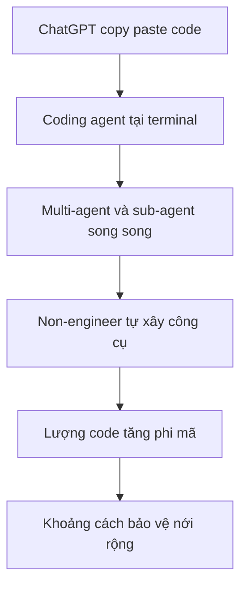

# 📈 Vì sao khoảng cách giữa "code được viết" và "code được bảo vệ" ngày càng lớn?

> Nguồn: `172-Securing-AI-Generated-Code-in-a-Multi-Agent-World.txt` · [Udemy](https://ua.udemy.com/course/langchain/learn/lecture/57115463)

Trong bài này, mình muốn nói về một khoảng cách đang ngày một rộng ra: **lượng code được viết ra** và **lượng code chúng ta có khả năng bảo vệ**. Đây không phải câu chuyện lý thuyết — nó đang là bài toán nhức đầu thật sự của cả ngành.

---

### 📊 Biểu đồ ai cũng nên nhìn một lần

Hãy tưởng tượng một biểu đồ với **trục tung là lượng code** và **trục ngang là thời gian**. Đường trên cùng là lượng code được viết; đường dưới là lượng code chúng ta có thể bảo vệ. Giữa hai đường luôn tồn tại một **khoảng cách (gap)** — đó chính là cuộc rượt đuổi (goose chase) mà các đội security luôn phải cố bắt kịp tốc độ ra feature của đội engineering.

Khi **ChatGPT** xuất hiện, khoảng cách này nới rộng hơn, vì mọi người bắt đầu nhờ ChatGPT viết code rồi **copy - paste vào IDE**, chẳng khác gì thói quen copy từ **Stack Overflow** trước đây.

---

### 🚀 Từ ChatGPT đến kỷ nguyên multi-agent

Rồi **coding agent** ra đời: **Cursor**, **Claude Code**, **Gemini CLI**, **Antigravity**... kéo theo sự dịch chuyển từ IDE sang **terminal**. Mọi người dùng agent ngay tại terminal, hoặc AI được nhúng thẳng vào IDE như Cursor tiên phong. Lượng code vì thế tăng phi mã.

Chưa dừng lại, mọi người phát hiện ra có thể:

1. Mở **nhiều instance terminal** cùng lúc.
2. Dùng **sub-agent** làm việc song song.
3. Phối hợp nhiều agent với nhau — có thể là **Codex**, **Claude Code**, **Cursor** hoặc trộn lẫn.

Không còn một coding agent đơn độc nữa, mà là **đội quân multi-agent** với vô số instance. Nói cách khác: **lập trình viên đã tự scale chính mình**.

---

### 👥 "Ai cũng là engineer" — đòn bẩy nhân lên gấp bội

Thêm một tầng nữa: bạn **không cần là kỹ sư phần mềm** để viết code. Cả ngành đang chứng kiến sự dịch chuyển này:

* **Product management**, **HR**, **operations**... đều bắt đầu tự xây công cụ nội bộ.
* Họ dùng **Claude Code, Lovable, Cursor** và ship sản phẩm, đóng góp thêm từng dòng code.

| Làn sóng | Đặc điểm | Tác động tới khoảng cách bảo mật |
|---|---|---|
| ChatGPT | Copy paste code vào IDE | Gap nới rộng hơn |
| Coding agent | Cursor, Claude Code, Gemini CLI, Antigravity | Terminal thay IDE, lượng code tăng phi mã |
| Multi-agent | Nhiều instance terminal, sub-agent chạy song song | Lập trình viên tự scale chính mình |
| Builder mới | PM, HR, operations dùng Claude Code, Lovable, Cursor | Force multiplier, gap tiếp tục tăng |

Đây là một **force multiplier (đòn bẩy khuếch đại lực lượng)** thực sự cho số dòng code được sinh ra mỗi ngày. Và khoảng cách giữa code được viết với kiến trúc bảo mật mà chúng ta có để bảo vệ nó cứ thế tăng lên không ngừng.

---

### ⚠️ Sự thật khó nghe: shipping được đặt lên trên hết

*Nói thẳng một chút nhé:* trong ngành, kỹ sư phần mềm quan tâm đến **ship sản phẩm**, chứ không thực sự quan tâm đến testing, và càng không quan tâm đến security. Trong thế giới lý tưởng, ai cũng muốn làm nghiêm túc, nhưng áp lực từ management khiến thời gian dành cho testing và security ít hơn hẳn thời gian viết code.

Nhiều kỹ sư thậm chí không biết gì về bảo mật: người chỉ làm front-end, người chỉ viết **REST API** truy vấn database, rất ít người hiểu security một cách sâu sắc. Mình may mắn khi cả sự nghiệp gắn với các công ty cybersecurity, nhưng đó không phải là số đông.

Và đội ngũ "builder mới" — ops, HR, product manager — thì còn chưa biết security là gì. Họ không biết **role-based access control**, **authorization**, **authentication**, **DDoS**, **lateral movement**, **privilege escalation**... Họ không xuất thân từ thế giới này, nên đương nhiên họ không xử lý bảo mật.

### 🎯 Tự kiểm tra nhanh

**Câu 1:** Khoảng cách trong biểu đồ mà tác giả nói tới là gì?

<b>Xem đáp án</b>

**Đáp án:** Khoảng cách giữa lượng code được viết ra và lượng code chúng ta có khả năng bảo vệ.

Giải thích: Đội security luôn phải chạy đua bắt kịp tốc độ ra feature của đội engineering.

Tham chiếu: Mục Biểu đồ ai cũng nên nhìn một lần.

**Câu 2:** ChatGPT đã tác động thế nào tới khoảng cách này?

<b>Xem đáp án</b>

**Đáp án:** Khoảng cách nới rộng hơn, vì mọi người nhờ ChatGPT viết code rồi copy - paste vào IDE, chẳng khác gì thói quen copy từ Stack Overflow trước đây.

Giải thích: Đây là làn sóng đầu tiên được tác giả nhắc tới.

Tham chiếu: Mục Biểu đồ ai cũng nên nhìn một lần.

**Câu 3:** Kỷ nguyên multi-agent đã thay đổi cách viết code ra sao?

<b>Xem đáp án</b>

**Đáp án:** Mọi người mở nhiều instance terminal, dùng sub-agent song song, phối hợp Codex, Claude Code, Cursor hoặc trộn lẫn – lập trình viên tự scale chính mình.

Giải thích: Không còn một coding agent đơn độc mà là cả đội quân multi-agent.

Tham chiếu: Mục Từ ChatGPT đến kỷ nguyên multi-agent.

**Câu 4:** Vì sao "ai cũng là engineer" được gọi là force multiplier?

<b>Xem đáp án</b>

**Đáp án:** Vì product management, HR, operations... đều dùng Claude Code, Lovable, Cursor để tự xây công cụ và ship sản phẩm, đóng góp thêm từng dòng code mỗi ngày.

Giải thích: Đây là đòn bẩy khuếch đại lượng code được sinh ra.

Tham chiếu: Mục "Ai cũng là engineer".

**Câu 5:** Vì sao testing và security thường bị đặt sau shipping?

<b>Xem đáp án</b>

**Đáp án:** Vì kỹ sư phần mềm quan tâm đến ship sản phẩm, còn áp lực từ management khiến thời gian cho testing và security ít hơn hẳn thời gian viết code.

Giải thích: Đây là sự thật khó nghe mà tác giả muốn nói thẳng.

Tham chiếu: Mục Sự thật khó nghe: shipping được đặt lên trên hết.

Kết quả: khoảng cách giữa code được viết và code có thể bảo vệ **ngày càng tăng**, và ngành chúng ta đang thật sự không theo kịp. Mục tiêu của mình trong khóa học này là giúp các bạn **thu hẹp khoảng cách đó** và viết phần mềm bảo mật hơn ngay cùng với các coding agent. Hãy cùng đi tiếp nhé! 🚀

## Nguồn tham khảo

- [Udemy — Securing AI Generated Code in a Multi Agent World](https://ua.udemy.com/course/langchain/learn/lecture/57115463)
- [OWASP GenAI — LLM Top 10 2026](https://genai.owasp.org/resource/owasp-genai-llm-top-10-2026)
