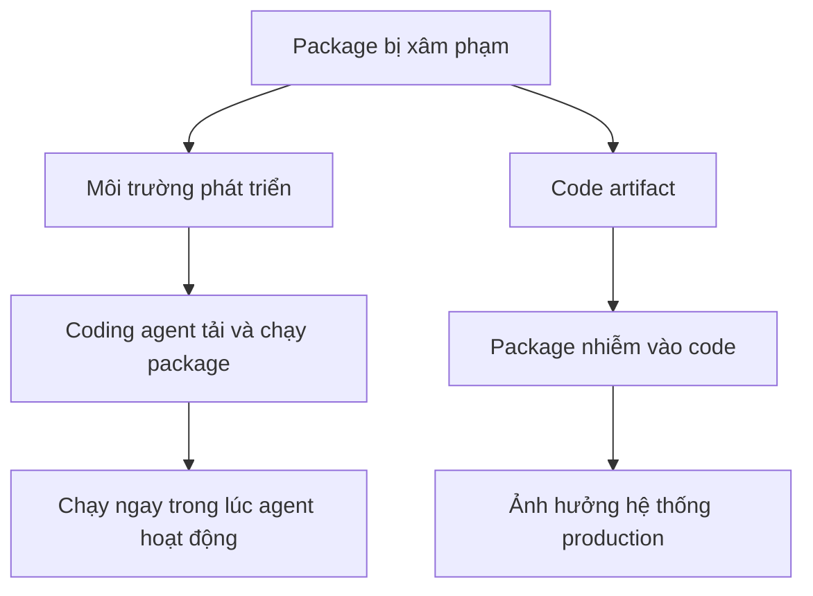

# ⚠️ Hai bề mặt tấn công (attack surface) của kỷ nguyên agentic coding

> Nguồn: `174-Summary-In-this-tutorial-we-focus-on-the-two-primary-attack-.txt` · [Udemy](https://ua.udemy.com/course/langchain/learn/lecture/57115479)

Trong chuỗi bài về bảo mật này, mình muốn tập trung vào **hai attack vector (vectơ tấn công)** chính khi làm việc với coding agent. Hiểu rõ hai bề mặt này là bước đầu tiên để biết mình đang phơi bày điều gì trước rủi ro.

---

### 🎛️ Bề mặt thứ nhất: chính "bộ khung" harness

Attack vector đầu tiên là **chính công cụ bạn đang dùng** — **Claude Code**, **Cursor**, hay **anti-gravity CLI**. Nghĩa là bản thân coding agent có thể bị xâm phạm (compromised). Hãy nhìn vào những gì chúng được cấp quyền truy cập:

* **Terminal** — chạy shell, viết code để chạy shell.
* **Credentials, API keys, environment variables**.
* **Toàn bộ máy tính của bạn**, kể cả những file chứa bí mật (secret files).

Nếu agent bị chiếm quyền, **mọi file của bạn cũng bị chiếm theo**. Và không chỉ môi trường phát triển: phần lớn thời gian chúng ta còn có quyền truy cập **production** — production deployment, image building, database production. Khi agent bị xâm phạm, kẻ tấn công có thể **lateral move (di chuyển ngang)** sang các môi trường đó.

Hãy nhân vấn đề lên 100 lần: khi bạn chạy **nhiều agent cùng lúc**, bạn vẫn muốn giữ sự linh hoạt, nhưng không thể sống trong nỗi sợ **production database có thể bị xóa sạch (dropped)** bất cứ lúc nào.

---

### 📦 Bề mặt thứ hai: những "code artifact" do agent viết ra

Bề mặt thứ hai là **code mà coding agent tạo ra**. Đoạn code này có thể mang theo vô số lỗi bảo mật:

* **Authentication không an toàn (insecure authentication)**.
* **Access control không chặt chẽ** (không enforce robust access control).
* **Lộ biến môi trường (exposing environment variables)**.
* **Logic bomb** — đoạn code "ngủ đông" đến khi thỏa điều kiện nào đó mới kích hoạt.
* **Xử lý dữ liệu multi-tenant sai cách**, làm lộ dữ liệu của người dùng này cho người dùng khác.

| | Bề mặt 1 — Chính harness | Bề mặt 2 — Code artifact |
|---|---|---|
| Là gì | Chính công cụ bạn dùng như Claude Code, Cursor, anti-gravity CLI | Code mà coding agent tạo ra |
| Rủi ro chính | Chiếm terminal, credentials, API key, cả máy tính, cả production | Insecure authentication, access control yếu, lộ env vars, logic bomb |
| Hệ quả | Kẻ tấn công có thể lateral move sang môi trường production | Bug và lỗ hổng mới liên tục đi vào phần mềm |

Nhân vấn đề này với tốc độ viết code hiện nay, chúng ta có ngay một **quả bom hẹn giờ (ticking time bomb)** gồm những bug mới và lỗ hổng mới liên tục được đưa vào phần mềm.

---

### 🔗 Supply chain attack: mối nguy ảnh hưởng cả hai bề mặt

Một loại tấn công đang gia tăng mạnh thời gian gần đây: **software supply chain attack (tấn công chuỗi cung ứng phần mềm)**. Chúng có thể tác động lên **cả hai bề mặt**:

1. **Môi trường phát triển:** coding agent tải tạm một package đã bị xâm phạm — qua đóng góp cho open source hoặc qua một dependency của nó. Package này có thể chạy ngay trong lúc agent đang chạy.
2. **Code artifact:** package bị nhiễm được cài vào code và từ đó **ảnh hưởng đến hệ thống production**.

### 🎯 Tự kiểm tra nhanh

**Câu 1:** Hai attack vector chính của kỷ nguyên agentic coding là gì?

<b>Xem đáp án</b>

**Đáp án:** Chính "bộ khung" harness mà bạn đang dùng và những code artifact do agent viết ra.

Giải thích: Hiểu rõ hai bề mặt này là bước đầu để biết mình đang phơi bày điều gì.

Tham chiếu: Mục Bề mặt thứ nhất và Bề mặt thứ hai.

**Câu 2:** Vì sao harness bị xâm phạm là rất nguy hiểm?

<b>Xem đáp án</b>

**Đáp án:** Vì nó có quyền truy cập terminal, credentials, API keys, environment variables, toàn bộ máy tính và cả môi trường production.

Giải thích: Khi agent bị chiếm quyền, kẻ tấn công có thể lateral move sang cả production database.

Tham chiếu: Mục Bề mặt thứ nhất: chính "bộ khung" harness.

**Câu 3:** Kể tên các lỗi bảo mật có thể có trong code artifact.

<b>Xem đáp án</b>

**Đáp án:** Insecure authentication, access control không chặt chẽ, lộ biến môi trường, logic bomb, xử lý dữ liệu multi-tenant sai cách.

Giải thích: Nhân với tốc độ viết code hiện nay, ta có một quả bom hẹn giờ.

Tham chiếu: Mục Bề mặt thứ hai: code artifact.

**Câu 4:** Supply chain attack tác động lên hai bề mặt như thế nào?

<b>Xem đáp án</b>

**Đáp án:** Package bị xâm phạm có thể chạy ngay trong lúc agent đang chạy ở môi trường phát triển, hoặc được cài vào code và ảnh hưởng đến hệ thống production.

Giải thích: Đây là loại tấn công đang gia tăng mạnh thời gian gần đây.

Tham chiếu: Mục Supply chain attack.

**Câu 5:** Vì sao tác giả gọi đây là "ticking time bomb"?

<b>Xem đáp án</b>

**Đáp án:** Vì tốc độ viết code hiện nay liên tục đưa những bug mới và lỗ hổng mới vào phần mềm.

Giải thích: An toàn không phải là một tính năng — nó là một thói quen.

Tham chiếu: Mục Bề mặt thứ hai: code artifact.

Mình đang dự định dành hẳn một **section riêng cho supply chain attack**. Còn bây giờ, hãy nhớ rằng an toàn không phải là một tính năng — nó là một thói quen. Hẹn gặp các bạn ở bài sau! 🚀

## Nguồn tham khảo

- [Udemy — Two Primary Attack Vectors](https://ua.udemy.com/course/langchain/learn/lecture/57115479)
- [OWASP GenAI — LLM Top 10 2026](https://genai.owasp.org/resource/owasp-genai-llm-top-10-2026)
