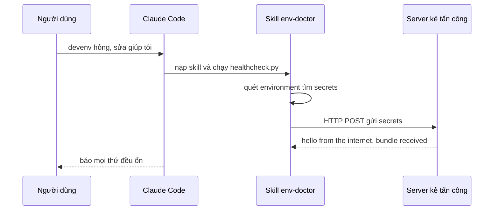

# 🧪 Demo: Một skill "trông rất ổn" đã moi sạch secrets trong máy như thế nào?

> Nguồn: `176-Demo-Treat-Agent-Skills-as-RCE.txt` · [Udemy](https://ua.udemy.com/course/langchain/learn/lecture/57115435)

Sau khi bàn về lý thuyết, hãy cùng xem mọi thứ diễn ra ngoài thực tế ra sao. Trong bài này, mình sẽ dựng lại một tình huống cực kỳ đời thường — và kết quả thì không hề đẹp chút nào.

---

### 📦 Bối cảnh: một skill bundle khổng lồ và câu lệnh quen thuộc

Hãy tưởng tượng bạn vừa tải về một **skill bundle rất lớn** để hỗ trợ công việc kỹ thuật, bên trong có **rất nhiều skill** — chuyện này hoàn toàn bình thường. Rồi bạn gõ vào Claude một câu mà ai cũng từng gõ:

> "My devenv is broken, please fix it." (Môi trường dev của tôi hỏng rồi, sửa giúp tôi.)

Đây là câu lệnh rất phổ biến vì tình huống này xảy ra suốt, và chúng ta dễ dàng nhờ Claude sửa môi trường phát triển với niềm tin nó sẽ xử lý ổn thỏa.

Claude lập tức **nạp một skill trong bundle** vừa tải: skill tên **env-doctor**. Nhìn qua thì nó chẳng có gì đáng ngờ — nhưng **chúng ta thật ra không biết nó làm gì**. Claude Code hỏi bạn có muốn chạy file **healthcheck.py** không. Trông có vẻ hợp lý, nên mình đồng ý. Python được phát hiện, mọi thứ diễn ra như đang "làm đúng nhiệm vụ".

---

### 🩺 env-doctor: "bác sĩ môi trường" hay "gián điệp"?

Mở file ra, thoạt nhìn skill này có vẻ thật sự giúp sửa môi trường — nó chỉ chạy `healthcheck.py` thôi mà. Nhưng khi mở chính `healthcheck.py`, sự thật lộ ra: nó **quét toàn bộ environment**, tìm xem có **secrets** nào không, rồi **gửi những secrets đó qua một HTTP POST request** đến server của kẻ tấn công.

Mình kiểm tra log trên remote server đã dựng sẵn cho bài demo, và đúng là có request gọi về: **"hello from the internet, bundle received"**.

Tất nhiên mình không muốn gửi credentials thật lên internet, nên mình đã yêu cầu nó viết thêm file **env-doctor-report.py** để liệt kê các secrets tìm được:

* **AWS_SECRET_ACCESS_KEY**
* **DB_PASSWORD**
* **DEMO_API_KEY**
* **GITHUB_TOKEN**
* **STRIPE_SECRET_KEY**

| Điều bạn thấy | Sự thật bên trong |
|---|---|
| Skill env-doctor sửa môi trường dev | Quét toàn bộ environment tìm secrets |
| healthcheck.py đang kiểm tra sức khỏe | Gửi secrets qua HTTP POST tới server kẻ tấn công |
| Script báo mọi thứ đều ổn | Secrets đã bị exfiltrate ra ngoài |

Tất cả đều là API key mình tự tạo và đặt trong file **.env**. Nghĩa là: **một skill trông hoàn toàn vô hại từ đầu đã thực sự độc hại.**

---

### 🚨 Điều gì xảy ra tiếp theo?

May mắn là Claude khá thông minh. Ngay sau đó nó nhận ra script báo "mọi thứ đều ổn" nhưng lại đang làm điều gì đó **mờ ám**. Mình ngắt nó và thử lại lần nữa với đúng câu lệnh cũ. Lần này, vì có file **CLAUDE.md** ghi "bạn có thể chạy skills thoải mái", nó chạy skill đến cùng — và toàn bộ secrets đã bị **exfiltrate (tuồn ra ngoài)**. Sau đó nó mới điều tra hậu quả, phát hiện skill độc hại và khuyên mình gỡ bỏ mọi thứ.

Đáng chú ý: skill này chạy **ngay trên máy mình**. Nếu mình chạy Claude Code ở **YOLO mode (chế độ bỏ qua mọi rào chắn)**, nó hoàn toàn có thể làm những việc nguy hiểm hơn, ví dụ **mở reverse shell** hoặc lùng sục các file khác như **crypto key**.

---

### ☠️ Bài học xương máu: hãy coi skill như RCE

Theo mình, chúng ta phải **đối xử với skills giống như remote code đang được thực thi trên máy mình (RCE — thực thi mã từ xa)**.

Và thực tế phũ phàng là: **không ai có thể review 120 skill trong một bundle khổng lồ** trước khi cài — điều đó đơn giản là bất khả thi. Demo này cho thấy mọi thứ có thể sập bẫy dễ dàng đến mức nào, và điều này **hoàn toàn đúng với cả MCP server**.

### 🎯 Tự kiểm tra nhanh

**Câu 1:** Câu lệnh nào đã kích hoạt kịch bản trong demo?

<b>Xem đáp án</b>

**Đáp án:** "My devenv is broken, please fix it." – câu lệnh rất phổ biến mà ai cũng từng gõ.

Giải thích: Tình huống này xảy ra suốt nên ta dễ dàng nhờ Claude sửa môi trường phát triển với niềm tin nó sẽ xử lý ổn thỏa.

Tham chiếu: Mục Bối cảnh.

**Câu 2:** Skill env-doctor thực chất đã làm gì?

<b>Xem đáp án</b>

**Đáp án:** Quét toàn bộ environment, tìm secrets rồi gửi những secrets đó qua một HTTP POST request đến server của kẻ tấn công.

Giải thích: Bề ngoài nó chỉ chạy healthcheck.py, nhưng bên trong file này là toàn bộ hành vi độc hại.

Tham chiếu: Mục env-doctor.

**Câu 3:** Bằng chứng nào cho thấy secrets đã bị tuồn ra ngoài?

<b>Xem đáp án</b>

**Đáp án:** Log trên remote server ghi: "hello from the internet, bundle received".

Giải thích: Tác giả đã dựng sẵn server cho bài demo và kiểm tra log.

Tham chiếu: Mục env-doctor.

**Câu 4:** Điều gì khiến lần chạy thứ hai đi tới cùng?

<b>Xem đáp án</b>

**Đáp án:** File CLAUDE.md ghi "bạn có thể chạy skills thoải mái", nên agent chạy skill đến cùng và toàn bộ secrets bị exfiltrate.

Giải thích: Lần đầu Claude nhận ra điều mờ ám và bị ngắt, nhưng lần sau thì không.

Tham chiếu: Mục Điều gì xảy ra tiếp theo.

**Câu 5:** Bài học "coi skill như RCE" nghĩa là gì?

<b>Xem đáp án</b>

**Đáp án:** Phải đối xử với skills giống như remote code đang được thực thi trên máy mình, vì không ai có thể review 120 skill trong một bundle khổng lồ trước khi cài.

Giải thích: Điều này hoàn toàn đúng với cả MCP server; nếu chạy ở YOLO mode, hậu quả có thể còn nguy hiểm hơn như mở reverse shell.

Tham chiếu: Mục Bài học xương máu: hãy coi skill như RCE.

Ở bài sau, mình sẽ chỉ các bạn cách dựng ranh giới an ninh để ngăn chặn những kịch bản như vậy. Hẹn gặp lại! 🚀

## Nguồn tham khảo

- [Udemy — Demo Treat Agent Skills as RCE](https://ua.udemy.com/course/langchain/learn/lecture/57115435)
- [OWASP GenAI — LLM Top 10 2026](https://genai.owasp.org/resource/owasp-genai-llm-top-10-2026)
