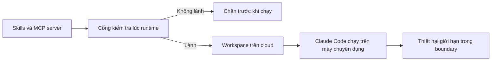

# 🛡️ Dựng ranh giới an ninh (security boundaries) để chặn đứng skill độc hại

> Nguồn: `177-Solution-Establishing-Security-Boundaries.txt` · [Udemy](https://ua.udemy.com/course/langchain/learn/lecture/57115445)

Sau khi đã thấy một skill "ngây thơ" có thể moi secrets ghê gớm thế nào, câu hỏi tiếp theo là: **làm sao để ngăn chặn?** Trong bài này, mình sẽ chia sẻ các nguyên tắc thiết lập ranh giới an ninh cho máy của bạn.

---

### ☁️ Nguyên tắc 1: Đừng chạy Claude Code trên máy của bạn

Mình biết việc chạy Claude Code ngay trên máy mình **rất hấp dẫn và cực kỳ tiện** — mình cũng từng như vậy. Nhưng chúng ta có lựa chọn tốt hơn: chạy nó trên một **máy từ xa (remote machine)**, trong một **workspace environment trên cloud**.

Điểm hay là bạn **vẫn tận hưởng đầy đủ sức mạnh của Claude Code**, không mất đi tính năng nào.

Và kể cả khi bạn muốn chạy ở **YOLO mode** — nếu bạn thật sự can đảm — thì khi nó làm sập thứ gì đó hoặc rò rỉ dữ liệu, thiệt hại cũng chỉ đến từ một **máy phát triển chuyên dụng trên cloud**, nơi đã có sẵn các **security boundary (ranh giới an ninh)**.

Thay vì mất trắng toàn bộ máy tính cá nhân, bạn chỉ "mất" một môi trường được thiết kế để có thể mất. Đó chính là ranh giới an ninh đầu tiên và quan trọng nhất.

---

### 🔍 Nguyên tắc 2: Kiểm tra nội dung trước khi thực thi

Cách tiếp cận thứ hai là **soi xét và kiểm tra nội dung file trước khi chạy** — và có thể để chính Claude hoặc một công cụ bảo mật khác làm việc này.

Nếu sắp chạy một **file Python**, một **shell script** hay bất kỳ **executable** nào, ta có thể tận dụng **AI, LLM, coding agent** để kiểm tra nội dung và đảm bảo nó không nguy hiểm. Điều này áp dụng cả với **skills**:

* Trước khi chạy một skill, dùng công cụ kiểm tra xem skill có "lành" không.
* Phân tích **từ mô tả skill đến từng script** mà nó sẽ thực thi.
* Quan trọng nhất: việc kiểm tra diễn ra **lúc runtime, không phải lúc tải về (download time)**.

Bạn có thể làm điều này nhờ **hạ tầng hooks mà Claude cung cấp**.

*Điều này sẽ làm thời gian chạy tăng lên một chút*, nhưng đổi lại bạn có **độ tự tin cao hơn hẳn** và không còn phải sợ skills làm những trò "mờ ám" trên máy mình hoặc cả trên máy cloud.

---

### 🏢 Nguyên tắc 3: Dành cho tổ chức — kiểm soát từ gốc

Hai cách trên phù hợp cho **nhà phát triển độc lập (solo developer)** lẫn tổ chức. Nhưng nếu bạn ở trong một tổ chức, còn có cách tốt hơn:

1. Dùng các file **.settings của Claude** với **cấu hình đặt trước**, chỉ cho phép một số **skill và MCP đã được admin thẩm định (vetted)**.
2. Xây dựng **quy trình vet skill hoàn chỉnh**: skill nào được dùng, skill nào không.
3. Thậm chí có thể lấy chính **hooks** đã viết và **enforce cho toàn bộ developer** đang dùng Claude Code thông qua các **cơ chế enterprise**.

| Nguyên tắc | Dành cho | Cách làm | Kết quả |
|---|---|---|---|
| 1. Không chạy trên máy cá nhân | Mọi người | Remote machine, workspace environment trên cloud | Chỉ "mất" môi trường được thiết kế để có thể mất |
| 2. Kiểm tra trước khi thực thi | Mọi người | Dùng AI và LLM soi file, script, skill lúc runtime | Tự tin hơn hẳn, chạy chậm hơn một chút |
| 3. Kiểm soát từ gốc | Tổ chức | .settings cấu hình đặt trước, quy trình vet skill, enforce hooks | Cả công ty aligned theo cùng chuẩn bảo mật |

Nhờ vậy, chúng ta nắm **quyền kiểm soát** thay vì để mọi người tải thoải mái mọi skill rồi làm gì thì làm trên môi trường phát triển của công ty.

Và khi hooks đã được enforce ở cấp tổ chức, **cả công ty sẽ được căn chỉnh (aligned) theo cùng một chuẩn bảo mật** — không còn chuyện mỗi người một kiểu.

### 🎯 Tự kiểm tra nhanh

**Câu 1:** Vì sao không nên chạy Claude Code trên máy của bạn?

<b>Xem đáp án</b>

**Đáp án:** Vì nếu skill độc hại làm sập thứ gì đó hoặc rò rỉ dữ liệu, thiệt hại sẽ đến toàn bộ máy tính cá nhân của bạn.

Giải thích: Chạy trên remote machine hoặc workspace cloud giới hạn thiệt hại trong một môi trường được thiết kế để có thể mất.

Tham chiếu: Mục Nguyên tắc 1.

**Câu 2:** Lợi ích của workspace cloud khi chạy YOLO mode là gì?

<b>Xem đáp án</b>

**Đáp án:** Khi agent làm sập thứ gì đó hoặc rò rỉ dữ liệu, thiệt hại chỉ đến từ một máy phát triển chuyên dụng trên cloud đã có sẵn security boundary.

Giải thích: Bạn vẫn tận hưởng đầy đủ sức mạnh của Claude Code mà không mất trắng máy tính cá nhân.

Tham chiếu: Mục Nguyên tắc 1.

**Câu 3:** Nguyên tắc 2 khuyên kiểm tra những gì trước khi thực thi?

<b>Xem đáp án</b>

**Đáp án:** Soi xét nội dung file Python, shell script, executable hoặc skill trước khi chạy để đảm bảo nó không nguy hiểm.

Giải thích: Có thể để chính Claude hoặc một công cụ bảo mật khác làm việc này, phân tích từ mô tả skill đến từng script.

Tham chiếu: Mục Nguyên tắc 2.

**Câu 4:** Việc kiểm tra nên diễn ra lúc nào và nhờ vào đâu?

<b>Xem đáp án</b>

**Đáp án:** Lúc runtime, không phải lúc tải về; nhờ AI, LLM, coding agent và hạ tầng hooks mà Claude cung cấp.

Giải thích: Đây là điểm quan trọng nhất khi kiểm tra nội dung trước khi thực thi.

Tham chiếu: Mục Nguyên tắc 2.

**Câu 5:** Ở cấp tổ chức, làm sao để kiểm soát skill và MCP?

<b>Xem đáp án</b>

**Đáp án:** Dùng .settings của Claude với cấu hình đặt trước chỉ cho phép skill và MCP đã được admin thẩm định, xây quy trình vet skill hoàn chỉnh, và enforce hooks cho toàn bộ developer qua cơ chế enterprise.

Giải thích: Nhờ vậy cả công ty được căn chỉnh theo cùng một chuẩn bảo mật thay vì mỗi người một kiểu.

Tham chiếu: Mục Nguyên tắc 3.

Trong video tiếp theo, mình sẽ demo cách giải pháp này vận hành. Hẹn gặp các bạn! 🚀

## Nguồn tham khảo

- [Udemy — Establishing Security Boundaries](https://ua.udemy.com/course/langchain/learn/lecture/57115445)
- [Claude Code Docs — Hooks reference](https://code.claude.com/docs/en/hooks)
