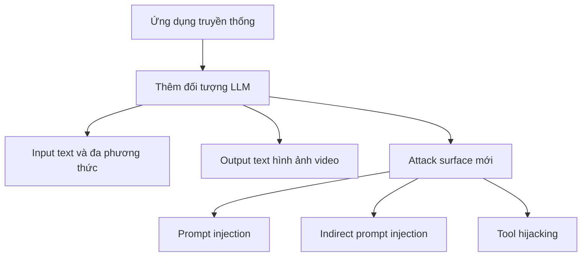

# 🧱 LLM App Sec là gì? Toàn cảnh bảo mật cho ứng dụng GenAI

> Nguồn: `178-What-is-LLM-App-Sec.txt` · [Udemy](https://ua.udemy.com/course/langchain/learn/lecture/54621885)

Chào các bạn! Trong phần này, chúng ta sẽ dành trọn thời lượng cho **bảo mật — cụ thể là bảo mật ứng dụng GenAI (GenAI application security)**.

Mình muốn nói về những khía cạnh bảo mật khi phát triển ứng dụng LLM: có thể là **agent**, có thể là **RAG**, hoặc cả hai. Và có một mối lo bảo mật nghiêm trọng mà chúng ta bắt buộc phải xử lý trong quá trình phát triển.

---

### 🧩 Ứng dụng LLM vẫn là "ứng dụng" — nhưng có thêm một "vật thể" mới

Điều đầu tiên cần nhớ: **ứng dụng LLM vẫn là ứng dụng**. Mọi kiến thức từ thế giới **application security** đều chuyển hóa được sang ứng dụng dựa trên LLM. Tuy nhiên, ta có thêm một **đối tượng mới (new object)**: **mô hình ngôn ngữ lớn (LLM)**.

Vật thể mới này:

* Nhận **input dạng text**, có thể cả các **modality khác** như waveform, hình ảnh, video.
* Trả về **text**, có thể là hình ảnh, có thể là video.

Và chỉ bằng việc đưa LLM vào, chúng ta vừa tạo ra một **attack surface (bề mặt tấn công) mới**. Đây chính là "cửa mở" mời gọi kẻ tấn công xâm nhập và làm những điều không mong muốn với hệ thống của bạn. Vì vậy, phần này sẽ đi sâu vào bảo mật của các ứng dụng dựa trên LLM.

---

### 🤖 Hai loại ứng dụng LLM bạn sẽ gặp

1. **Ứng dụng agentic / AI agent:** LLM đóng vai trò **người ra quyết định**, là **reasoning agent** chọn xem điều gì sẽ được thực thi tiếp theo. Agent có nhiều loại: **agent tự chủ hoàn toàn (fully autonomous)** như **Claude Code**, và cũng có loại hạn chế hơn — mình thường gọi là **agentic application** — nơi **người dùng định nghĩa luồng (flow)**, còn LLM được tự do chọn đường đi trong luồng đó.
2. **Ứng dụng RAG**, hoặc ứng dụng kết hợp cả hai.

| Loại ứng dụng | Ai quyết định luồng | Ví dụ |
|---|---|---|
| Agent tự chủ hoàn toàn | LLM là reasoning agent quyết định điều gì thực thi tiếp theo | Claude Code |
| Agentic application | Người dùng định nghĩa flow, LLM tự do chọn đường đi trong flow đó | Ứng dụng có luồng hạn chế |
| Ứng dụng RAG | Truy xuất tài liệu để trả lời, có thể kết hợp agent | Ứng dụng hỏi đáp trên tài liệu |

---

### 💥 Những lỗ hổng "mới" chỉ có ở thế giới LLM

Đây là phần khiến công việc bảo mật trở nên thú vị — và cũng đáng lo:

* **Prompt injection** (tiêm nhiễm prompt).
* **Indirect prompt injection** (tiêm nhiễm prompt gián tiếp).
* **Tool hijacking** (chiếm quyền điều khiển công cụ).
* Và **nhiều lỗ hổng khác** tác động lên ứng dụng dựa trên LLM.

Song song đó, mình sẽ chỉ các bạn **best practices** để phát triển ứng dụng an toàn, giữ vững **application security hygiene (vệ sinh bảo mật ứng dụng)** — một bộ quy tắc và kiến trúc nghiêm ngặt giúp ứng dụng LLM của bạn **an toàn ngay từ mặc định (secure by default)**.

---

### 🎯 Mục tiêu: giữ "blast radius" nhỏ nhất có thể

Mình xuất thân từ **cybersecurity**, gắn bó với các công ty bảo mật cloud, nên bảo mật gần như nằm trong máu. Nhưng mình biết với đa số kỹ sư thì không như vậy — *và điều đó hoàn toàn bình thường*, vì ai cũng đang bận ship ứng dụng lên production và ra feature thật nhanh.

Mục tiêu của phần này gồm hai việc:

1. Cho bạn thấy **các lỗ hổng và hậu quả** khi ta không phát triển ứng dụng LLM một cách an toàn.
2. Chỉ ra **best practices** cần làm để giữ **blast radius (bán kính ảnh hưởng)** ở mức tối thiểu.

Nếu bạn chưa biết, **blast radius** là: khi kẻ tấn công xâm nhập hệ thống, chúng có thể làm được gì? Đọc được file người dùng? Chạy mã độc? Có vô vàn khả năng. Mục tiêu của chúng ta là khiến blast radius **càng nhỏ càng tốt**.

### 🎯 Tự kiểm tra nhanh

**Câu 1:** Vì sao nói ứng dụng LLM vẫn là "ứng dụng"?

<b>Xem đáp án</b>

**Đáp án:** Vì mọi kiến thức từ thế giới application security đều chuyển hóa được sang ứng dụng dựa trên LLM.

Giải thích: Điểm khác biệt là ta có thêm một đối tượng mới: mô hình ngôn ngữ lớn.

Tham chiếu: Mục Ứng dụng LLM vẫn là "ứng dụng".

**Câu 2:** Việc đưa LLM vào ứng dụng tạo ra điều gì?

<b>Xem đáp án</b>

**Đáp án:** Một attack surface mới – "cửa mở" mời gọi kẻ tấn công xâm nhập và làm những điều không mong muốn với hệ thống.

Giải thích: LLM nhận input text và các modality khác, trả về text, hình ảnh hoặc video.

Tham chiếu: Mục Ứng dụng LLM vẫn là "ứng dụng".

**Câu 3:** Agent tự chủ hoàn toàn khác agentic application ở điểm nào?

<b>Xem đáp án</b>

**Đáp án:** Agent tự chủ hoàn toàn để LLM quyết định như Claude Code; agentic application do người dùng định nghĩa flow, còn LLM tự do chọn đường đi trong flow đó.

Giải thích: Cả hai đều thuộc nhóm ứng dụng agentic mà tác giả sẽ phân tích.

Tham chiếu: Mục Hai loại ứng dụng LLM.

**Câu 4:** Những lỗ hổng "mới" chỉ có ở thế giới LLM là gì?

<b>Xem đáp án</b>

**Đáp án:** Prompt injection, indirect prompt injection, tool hijacking và nhiều lỗ hổng khác tác động lên ứng dụng dựa trên LLM.

Giải thích: Đây là phần khiến công việc bảo mật trở nên thú vị và cũng đáng lo.

Tham chiếu: Mục Những lỗ hổng "mới" chỉ có ở thế giới LLM.

**Câu 5:** Blast radius là gì và mục tiêu của khóa học liên quan tới nó?

<b>Xem đáp án</b>

**Đáp án:** Blast radius là khi kẻ tấn công xâm nhập hệ thống, chúng có thể làm được gì; mục tiêu là giữ blast radius càng nhỏ càng tốt.

Giải thích: Tác giả muốn chỉ ra lỗ hổng, hậu quả và best practices để ứng dụng LLM secure by default.

Tham chiếu: Mục Mục tiêu: giữ "blast radius" nhỏ nhất có thể.

Sẽ có rất nhiều thuật ngữ mới trong thế giới bảo mật, và mình sẽ giải thích tất cả. Mục tiêu cuối cùng rất rõ ràng: khi bạn xây dựng ứng dụng dựa trên LLM, hãy làm điều đó **một cách an toàn**. Hẹn gặp lại các bạn ở bài tiếp theo! 🚀

## Nguồn tham khảo

- [Udemy — What is LLM App Sec](https://ua.udemy.com/course/langchain/learn/lecture/54621885)
- [OWASP GenAI — LLM Top 10 2026](https://genai.owasp.org/resource/owasp-genai-llm-top-10-2026)
