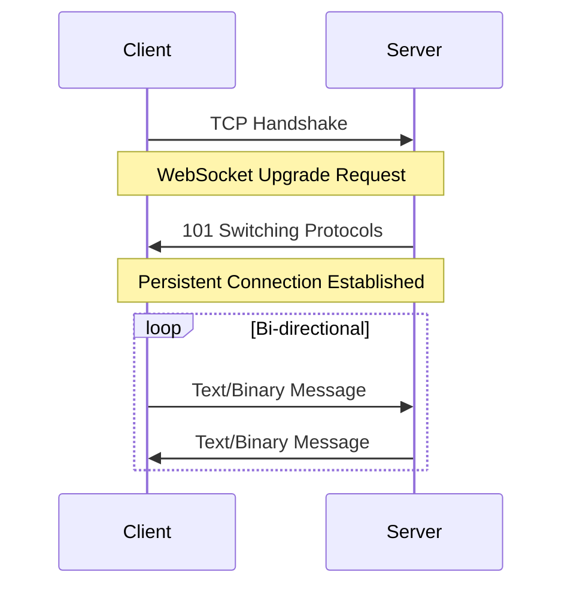
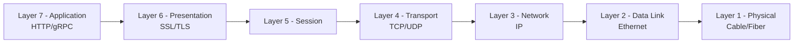
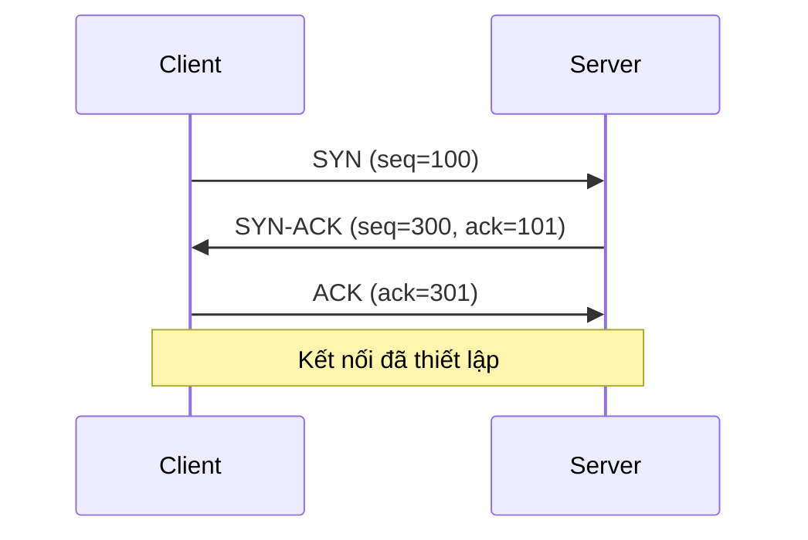
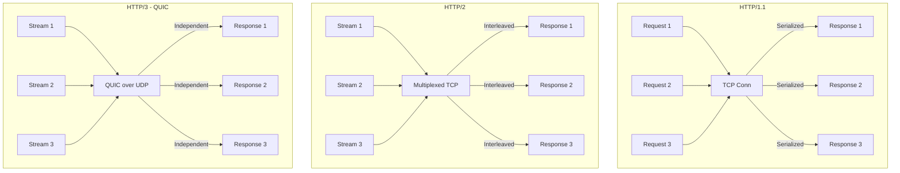
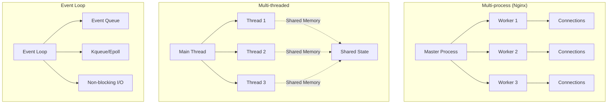
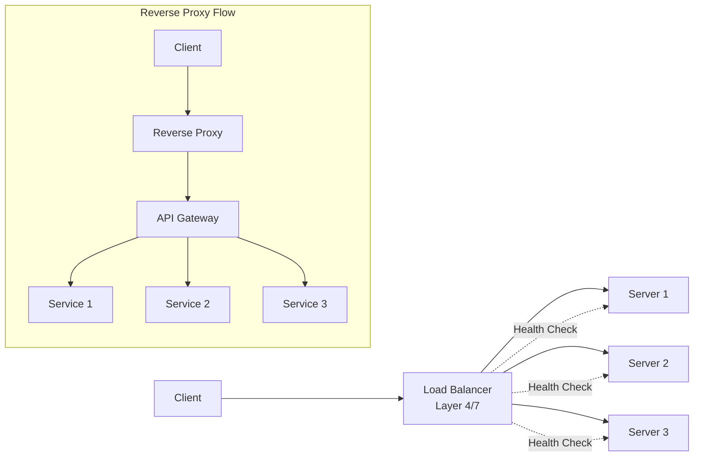

Khóa học này sẽ đi sâu vào các khía cạnh quan trọng của kỹ thuật Backend, từ các mẫu thiết kế giao tiếp đến các giao thức cụ thể, mô hình thực thi và quản lý lưu lượng. Sau khi hoàn thành phần giới thiệu, bạn có thể tải xuống tất cả các slide, mã nguồn và tài liệu liên quan để theo dõi khóa học.

## 1. Các mẫu thiết kế giao tiếp Backend (Backend Communication Design Patterns)

Phần này tập trung vào các cách thức mà client giao tiếp với backend, bao gồm một số mẫu thiết kế chính:

### 1.1. Các mô hình giao tiếp cơ bản

- **Request-Response (Yêu cầu-Phản hồi)**: Mô hình đơn giản, trực tiếp, client gửi yêu cầu và đợi phản hồi. Đây là mô hình cơ bản nhất của HTTP, REST API, gRPC (unary calls). Phù hợp cho các thao tác đồng bộ nhưng không phù hợp cho ứng dụng thời gian thực như chat hay notification.

- **Publish-Subscribe (Xuất bản-Đăng ký)**: Client (subscriber) đăng ký nhận thông báo từ một chủ đề (topic) và server (publisher) gửi thông báo tới các client đã đăng ký mà không cần biết trực tiếp về chúng. Giảm coupling giữa các bên tham gia. Các hệ thống message broker như Kafka, RabbitMQ, Redis Pub/Sub sử dụng mô hình này.

- **WebSocket**: Giao thức cung cấp kênh giao tiếp hai chiều, liên tục giữa client và server qua một kết nối TCP duy nhất. Server có thể đẩy dữ liệu (push) tới client bất kỳ lúc nào. Rất phù hợp cho ứng dụng thời gian thực như chat, game, notification, collaborative editing. WebSocket hoạt động trên Layer 7 (Application Layer) và có hỗ trợ proxy/ngưỡng tường lửng (tường lửa/NAT traversal) tốt hơn so với các kỹ thuật long polling.

### 1.2. Xử lý và giao tiếp

- **Asynchronous (Bất đồng bộ) vs. Synchronous (Đồng bộ)**: Hiểu rõ sự khác biệt giữa xử lý đồng bộ (chờ đợi hoàn thành) và bất đồng bộ (không chờ đợi, tiếp tục thực hiện tác vụ khác). Hai khái niệm này rất quan trọng và sẽ được nhắc đến thường xuyên.
- **Stateful (Có trạng thái) vs. Stateless (Không trạng thái)**:
  - **Stateful**: Giao thức hoặc ứng dụng duy trì thông tin về các phiên giao tiếp trước đó.
  - **Stateless**: Mỗi yêu cầu được xử lý độc lập, không dựa vào thông tin của các yêu cầu trước.
  - Phân tích ưu nhược điểm và khi nào nên ưu tiên sử dụng mô hình nào.

### 1.3. Các mẫu thiết kế khác

- **Poll Model (Mô hình thăm dò - Short Polling)**: Client liên tục gửi yêu cầu đến server để kiểm tra dữ liệu mới. Server luôn trả lời ngay lập tức (có dữ liệu hoặc không). Cách tiếp cận đơn giản nhưng tiêu tốn băng thông và tài nguyên server do các kết nối TCP được mở/đóng liên tục. Theo RFC 6202, short polling có thể gây tắc nghẽn mạng khi số lượng client tăng.

- **Push Model (Mô hình đẩy)**: Server chủ động gửi dữ liệu đến client khi có thông tin mới (real-time push). Khi được thực hiện qua WebSocket, Server-Sent Events (SSE), hoặc HTTP/2 Server Push. Phù hợp cho notification, live updates. Tuy nhiên client phải online để nhận được dữ liệu.

- **Long Poll Model (Mô hình thăm dò dài)**: Client gửi yêu cầu và server giữ kết nối mở cho đến khi có dữ liệu mới hoặc hết thời gian chờ (timeout). Khi nhận được phản hồi, client ngay lập tục gửi yêu cầu mới. Theo RFC 6202, long polling giảm độ trễ so với short polling nhưng vẫn tốn tài nguyên server do phải duy trì kết nối. Kafka sử dụng kỹ thuật này cho consumer polling.

- **Server-Sent Events (Sự kiện do Server gửi)**: Server gửi các luồng sự kiện một chiều đến client qua một kết nối HTTP duy trì (text/event-stream). Theo chuẩn W3C, SSE cho phép server đẩy dữ liệu theo thời gian thực sự trong khi vẫn sử dụng giao thức HTTP chuẩn. Khác với WebSocket, SSE chỉ hỗ trợ một chiều (server→client) nhưng được hỗ trợ native bởi hầu hết các trình duyệt hiện đại.

### 1.4. Mẫu Sidecar (Sidecar Pattern)

- Một mẫu thiết kế độc đáo phát sinh từ kiến trúc Microservices và Service Mesh.
- Hoạt động như một proxy đơn giản nhưng rất thú vị, được gán kèm với mỗi service.

### 1.5. Multiplexing và Demultiplexing

- **Multiplexing**: Quá trình ghép nhiều luồng dữ liệu thành một kênh truyền duy nhất. Ví dụ: HTTP/2 cho phép nhiều request/response đồng thời qua một kết nối TCP duy nhất.
- **Demultiplexing**: Quá trình tách các luồng dữ liệu từ một kênh truyền. Tại layer 4 (Transport), TCP/UDP sử dụng bộ 4-tuple (source IP, source port, dest IP, dest port) để phân biệt các kết nối.
- Ứng dụng trong hệ thống thực tế: HTTP/2, HTTP/3, gRPC (HTTP/2), browser quản lý nhiều kết nối HTTP/1.1, cơ sở dữ liệu (connection pooling).

## 2. Các giao thức cụ thể (Concrete Protocols)

Phần này đi sâu vào định nghĩa, thuộc tính của các giao thức và cách chúng hoạt động.

### 2.1. Mô hình OSI (OSI Model)

- **7 Layer chuẩn**: Layer 1 (Vật lý), Layer 2 (Liên kết dữ liệu), Layer 3 (Mạng - IP), Layer 4 (Giao vận - TCP/UDP), Layer 5 (Phiên - không dùng nhiều), Layer 6 (Trình bày - SSL/TLS), Layer 7 (Ứng dụng - HTTP/gRPC).
- **Layer 3 (Network)**: Quản lý định tuyến IP, xử lý địa chỉ logic. Layer 4 proxy (IP hash-based load balancing) vận hành ở đây.
- **Layer 4 (Transport)**: TCP/UDP cung cấp giao tiếp end-to-end. TCP đảm bảo độ tin cậy, UDP cho tốc độ cao. Các proxy L4 chuyển tiếp gói tin dựa trên IP:port.
- **Layer 7 (Application)**: HTTP, gRPC, WebSocket hoạt động ở đây. Reverse proxy L7 có thể đọc và chỉnh sửa nội dung HTTP headers, thực hiện SSL termination, path-based routing.

### 2.2. Các giao thức mạng cơ bản

- **UDP (User Datagram Protocol)**:
  
  - Cấu trúc: Header 8 byte (source port, dest port, length, checksum) + data.
  - Đặc điểm: không đáng tin cậy (không đảm bảo giao hàng), không kết nối, không có thứ tự.
  - Ứ dụng: DNS, video streaming, VoIP, game online, QUIC (HTTP/3).

- **TCP (Transmission Control Protocol)**:
  
  - Quy trình bắt tay ba bước (three-way handshake): SYN → SYN-ACK → ACK để thiết lập kết nối.
  - **Flow Control**: Sử dụng sliding window để đảm bảo người gửi không làm tràn bộ đệm receiver (RFC 793).
  - **Congestion Control**: Thuật toán như Reno, CUBIC, BBR điều chỉnh tốc độ gửi dựa trên mức độ tắc nghẽn mạng.
  - Đặc điểm: đáng tin cậy, có thứ tự, kiểm soát lưu lượng, phù hợp cho HTTP, FTP, email.

### 2.3. Các giao thức ứng dụng phổ biến

- **HTTP/1.1**: Request-response chuẩn web, connection pooling để tối ưu. Head-of-line blocking với nhiều request đồng thời qua cùng một kết nối.

- **HTTP/2**: Giải quyết vấn đề multiplexing qua khung nhị phân (frame-based). Nhiều stream đồng thời trên một kết nối TCP, giảm latency. Tuy nhiên vẫn còn HOL blocking ở mức TCP (mất một gói → tất cả stream bị chặn).

- **HTTP/3 (QUIC)**: Chạy trên UDP, tích hợp TLS 1.3. Đánh bại HOL blocking của HTTP/2 vì từng stream độc lập. Hỗ trợ 0-RTT connection establishment (tiết kiệm 1 round-trip), connection migration qua các mạng khác nhau.

- **gRPC**: RPC framework dùng HTTP/2 làm transport, Protobuf làm serialization. Hỗ trợ 4 kiểu communication: unary, server streaming, client streaming, bidirectional streaming.

- **WebRTC**: Giao thức P2P cho video/audio calling, data channel. Sử dụng ICE/STUN/TURN để traversal NAT.

## 3. Tìm hiểu sâu về HTTP/S (HTTP/S Deep Dive)

HTTP/S là giao thức xương sống của web, phần này sẽ có một phần riêng biệt để khám phá các cấu hình liên quan đến bảo mật và hiệu suất.

### 3.1. Các cấu hình TLS/SSL

- **TLS 1.2 vs. TLS 1.3 qua TCP**: TLS 1.3 giảm từ 2-RTT xuống 1-RTT cho kết nối mới, loại bỏ các cipher suite yếu (RSA key exchange, CBC mode). TLS 1.3 bắt buộc sử dụng forward secrecy (ECDHE).

- **DTLS qua QUIC**: Datagram TLS - phiên bản TLS cho UDP. QUIC tích hợp TLS 1.3 trực tiếp vào protocol, cho phép 0-RTT resumption.

- **HTTP qua QUIC với Zero Round Trip (0-RTT)**: Client có thể gửi dữ liệu ngay từ lần đầu tiên nếu đã có session ticket trước đó. Lưu ý: 0-RTT có thể bị replay attack, chỉ nên dùng cho idempotent requests.

## 4. Các mẫu thực thi Backend (Backend Execution Patterns)

Đây là một trong những phần quan trọng nhất, giải thích những gì thực sự xảy ra bên trong ứng dụng backend sau khi nhận được yêu cầu.

### 4.1. Khái niệm cơ bản

- **Process (Tiến trình)**: Đơn vị tài nguyên độc lập, chứa một hoặc nhiều luồng.
- **Thread (Luồng)**: Đơn vị thực thi nhỏ nhất trong một tiến trình.
- **Shared Memory Model (Mô hình bộ nhớ chia sẻ)**: Cách các luồng/tiến trình chia sẻ và truy cập dữ liệu trong bộ nhớ.
- So sánh sự khác biệt giữa tiến trình và luồng.

### 4.2. Kiến trúc Backend thực tế

- Ví dụ từ các hệ thống nổi tiếng:
  
  - **Nginx**: Event-driven, single-threaded worker process (master/worker model). Sử dụng epoll/kqueue cho I/O multiplexing. Mỗi worker xử lý hàng nghìn kết nối đồng thời.
  - **Memcached**: Shared memory pool, slab allocation để giảm fragmentation. Connection-oriented, không hỗ trợ persistence.
  - **RamCloud**: In-memory key-value store với consistency. Mỗi machine chạy một shard, hỗ trợ linearizable reads/writes.

- Mỗi kiến trúc backend có thiết kế riêng, ảnh hưởng đến hiệu suất và hành vi.

### 4.3. Vai trò của Kernel

- **Kernel offloading**: Kernel xử lý phần lớn công việc I/O thông qua system calls (send/recv, epoll, io_uring). Kernel cũng quản lý connection tracking (conntrack), TCP state machine.

- **Hạn chế của Kernel/OS**: Context switching giữa user-space và kernel-space tốn chi phí (microsecond mỗi lần). File descriptor limit (ulimit -n), connection tracking table size hạn chế số kết nối đồng thời. NUMA (Non-Uniform Memory Access) topology ảnh hưởng đến hiệu suất bộ nhớ.

- **Giải quyết vấn đề**: Hiểu các metrics như load average, context switches, interrupts giúp chẩn đoán bottleneck. Techniques như IRQ affinity, CPU pinning, huge pages có thể tối ưu hiệu suất.

- **Khuyến khích**: Đóng góp vào kernel space (BPF programs, io_uring) đang là xu hướng để tối ưu hệ thống.

### 4.4. Các lựa chọn thiết kế thực thi

- **Single Listener vs. Multiple Listeners**: Single listener (Linux SO_REUSEPORT từ kernel 3.9) cho phép nhiều process lắng nghe cùng port, kernel phân phối kết nối. Multiple listeners (master/worker) có process cha quản lý các worker.

- **Multiple Threads vs. Single Process**: Multiple threads chia sẻ bộ nhớ process, giao tiếp nhanh nhưng cần đồng bộ (mutex). Single process (event loop) tránh context switching nhưng phải xử lý non-blocking I/O.

- **Multiple Processes vs. Single Process**: Multiple processes (fork-based) có bộ nhớ độc lập, tránh vấn đề thread safety nhưng tiêu tốn memory hơn. Single process (Node.js, Go runtime) nhẹ nhàng nhưng cần cẩn thận với blocking operations.

## 5. Proxies và Bộ cân bằng tải (Proxies and Load Balancers)

Đây là phần cuối cùng và rất quan trọng, tập trung vào các thành phần cốt lõi của kỹ thuật backend hiện đại.

### 5.1. Khái niệm Proxy

- **Proxy**: Máy chủ trung gian nhận request từ client và chuyển đến server. Client và server không giao tiếp trực tiếp.

- **Forward Proxy (Proxy xuôi)**: Client cấu hình proxy để truy cập internet, proxy ẩn danh client.

- **Reverse Proxy (Proxy ngược)**: Đặt trước backend server, nhận request từ client và phân phối tới các server. Thực hiện load balancing, SSL termination, caching, compression.

- **Layer 4 Proxy (Proxy lớp 4 - Transport)**: Hoạt động ở Layer 4, chuyển tiếp gói tin dựa trên IP và port. Không đọc được nội dung application layer. Ví dụ: AWS NLB, HAProxy trong mode TCP.

- **Layer 7 Proxy (Proxy lớp 7 - Application)**: Đọc và chỉnh sửa HTTP request (headers, URL path). Thực hiện path-based routing, host-based routing, rate limiting, authentication. Ví dụ: Nginx, Envoy, AWS ALB.

### 5.2. Vai trò và ứng dụng

- **API Gateways**: Là reverse proxy phức tạp với các tính năng: authentication, rate limiting, request/response transformation, service discovery, circuit breaking. Ví dụ: Kong, Apigee, AWS API Gateway.

- **CDNs (Content Delivery Networks)**: Phân phối nội dung tĩnh (images, CSS, JS) đến edge location gần người dùng nhất. Giảm latency và tải cho origin server.

### 5.3. Kỹ thuật cân bằng tải (Load Balancing Techniques)

- **Round Robin**: Phân phối tuần tự các request tới các server. Đơn giản nhưng không cân nhắc tải thực tế.

- **Weighted Round Robin**: Gán trọng số cho mỗi server dựa trên khả năng xử lý.

- **Least Connections**: Gửi request tới server có ít kết nối đang hoạt động nhất.

- **IP Hash**: Dựa vào IP client để quyết định server, đảm bảo consistency cho session.

- **Consistent Hashing**: Dùng trong distributed cache (Redis Cluster, DynamoDB). Khi thêm/xóa node, chỉ một phần nhỏ dữ liệu cần di chuyển.

- **Health Checks**: Passive (dựa vào response) và Active (gửi health check endpoint) để loại bỏ server lỗi.

---

Khóa học sẽ được cập nhật liên tục với các nội dung và phần mới.
