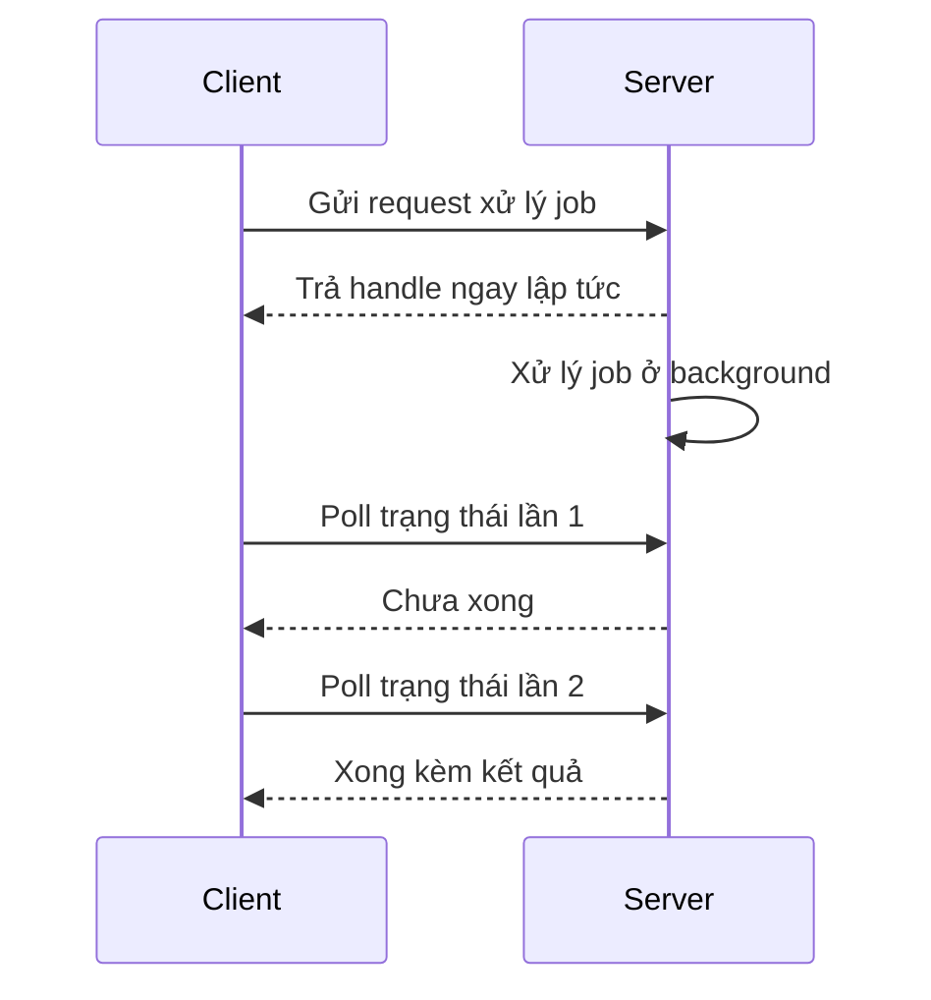

# 📊 Polling (hỏi vòng): Pattern giao tiếp đơn giản nhất mà backend nào cũng dùng

> Nguồn: `009-Polling.txt` · [Udemy](https://ua.udemy.com/course/fundamentals-of-backend-communications-and-protocols/learn/lecture/34629816)

Sau khi đã nắm synchronous (đồng bộ) vs asynchronous (bất đồng bộ), chúng ta bước sang một pattern giao tiếp khác: **polling (hỏi vòng)** — hay khi mọi người nói polling thì thường ý là **short polling (hỏi vòng ngắn)**. Đây là một trong những pattern rất phổ biến, dễ implement nhất, và mình sẽ chỉ các bạn cách nó vận hành, giá phải trả, cùng một demo chạy thật.

### 🎯 Vì sao gọi là "short polling"?

Chữ **"short"** nằm ở chỗ: mỗi lần poll diễn ra **cực nhanh**, chỉ để trả lời một câu hỏi duy nhất — *"việc này xong chưa?"*. Pattern này thường đi kèm với **asynchronous backend processing** mà mình đã nói ở bài trước: request chạy lâu được đẩy sang xử lý nền, backend trả về một **handle** (điểm neo) kiểu **future, job ID hay task ID**, rồi client dùng handle đó để hỏi thăm trạng thái.

Khi nào **request-response thuần** không còn hợp lý? Khi request mất rất nhiều thời gian:

* **Upload video lên YouTube**: mình dám chắc các bạn từng để ý — vừa upload là tiến trình chạy tiếp, bạn nhận được **upload ID**. Bạn không ngồi chờ cả video upload xong mới có phản hồi; ID đó cho phép kiểm tra tiến độ và tiếp tục xử lý. Rất elegant.
* **Backend cần thông báo một event**: kiểu user vừa đăng nhập, có sự kiện xảy ra... Push hoặc pull đều xử lý được, nhưng request-response thuần thì không.

---

### ⚙️ Cơ chế hoạt động: một handle, nhiều lần hỏi

Luồng đi của short polling rất rõ ràng:

1. **Client gửi request** xử lý một job nào đó.
2. **Server trả lời ngay lập tức** bằng một **handle** — thường là unique identifier (định danh duy nhất) tương ứng với request đó.
3. **Backend tự do xử lý theo cách của nó**: xếp vào queue, persist xuống disk, giữ trong memory rồi chạy sau — request **không được thực thi ngay**.
4. **Client dùng handle để poll trạng thái**: "xong chưa?" — "chưa" — "xong chưa?" — "chưa" — ... tới khi job hoàn tất, lần poll kế tiếp nhận luôn response.

Nhìn hẹp thì **mỗi lần poll chính là một request-response**. Nhưng toàn bộ hệ thống là asynchronous: ta đã **chia nhỏ một request-response lớn thành nhiều request-response nhỏ**, và chúng hiện ra trước mắt chúng ta dưới dạng các lần poll.

Điểm hay nữa: client có thể **lưu ID xuống disk rồi disconnect**. Hôm sau mở lại, nó đọc danh sách pending jobs và lặp: "cái này xong chưa? cái kia xong chưa?". Ngược lại, với request-response thuần, nếu client disconnect giữa chừng thì server cứ gửi response vào khoảng không — **mất một response đẹp**, vì server không giữ nó lại.

---

### ✅ Ưu điểm

* **Cực dễ implement**: client rất đơn giản để build, backend cũng tương đối đơn giản.
* **Hợp với long-running request**: thay vì bắt client chờ đồng bộ, hãy biến nó thành hệ thống poll — backend trả handle, client hỏi thăm dần.
* **Client disconnect an toàn**: vừa nhận job ID/task ID/request ID là lưu xuống disk được, respawn lên thì đọc lại và hỏi tiếp.
* **Linh hoạt phía backend**: giữ một job đã hoàn thành bao lâu trước khi dọn — hoàn toàn do **backend engineer** các bạn cấu hình, miễn backend hỗ trợ việc lưu job.

---

### ⚠️ Nhược điểm: quá "chatty"

Điểm chết người của short polling là nó **quá chatty (nói nhiều)**. Hãy tưởng tượng các bạn scale hệ thống lên:

* Backend deploy sau **HAProxy hoặc Nginx**, nhân bản thành nhiều fleet; client đã đóng gói và phát hành tới **hàng nghìn, hàng nghìn người dùng**.
* Mỗi app lại thực hiện **10, 20, 30, 40 lần poll**, tần suất poll do phía client cấu hình — **các con số này cộng dồn lại**.
* Mọi request rồi cũng biến thành **TCP connection** (hoặc **UDP** nếu bạn dùng QUIC) rồi ùa hết về hạ tầng backend.
* Khoảng **99% trong số đó là vô ích**: phần lớn chỉ trả về "false" vì job chưa xong — job xong là trường hợp hiếm so với job chưa xong.

Hệ quả: **nghẽn mạng và đốt sạch network bandwidth** — mà bandwidth lại là tài nguyên cực kỳ quý ở backend, nhất là khi bạn đẩy mọi thứ lên cloud và bị tính tiền theo lưu lượng. Chưa hết, mỗi lần nhận một poll request, backend phải **kiểm tra trạng thái** — thao tác đó tốn thời gian hữu hạn, thời gian lẽ ra dành để phục vụ các request thật sự có ích. Các bạn có thể giảm tần suất poll, nhưng bản chất "chatty" vẫn còn đó.

---

### 🧪 Demo: submit job rồi poll trong Node.js

Mình dựng một app đơn giản bằng **Express** (chọn Node.js vì nó phổ biến, nhưng các bạn làm bằng ngôn ngữ nào cũng được):

* Một **dictionary jobs** rỗng, key là **job ID**, value là **tiến độ** — mình làm xịn hơn kiểu "xong/chưa xong" một chút.
* Khi user **submit job**: tạo job ID (demo lấy theo timestamp — *bad idea thật đấy, hai người chạy cùng một millisecond là trùng ID, nhưng demo thì bỏ qua*), đặt tiến độ = 0 rồi gọi `updateJob`.
* `updateJob` chẳng làm gì ngoài chờ timer: **mỗi 5 giây cộng 10%** cho tới 100%.
* Endpoint **check status** nhận job ID qua query param của GET request và trả về trạng thái job.

Chạy thử bằng curl: POST vào `localhost:8080/submit` để nhận job ID, rồi GET `check status` và nhìn tiến độ nhảy **40%, 50%, 90%, 100%**. Cứ mỗi 5 giây poll một lần — đúng như một browser có timer đang hỏi vòng. Submit thêm job thứ hai thì có **hai job chạy song song**, và mình kiểm tra từng job độc lập. Toàn bộ code mình sẽ chia sẻ cho các bạn.

### 🎯 Tự kiểm tra nhanh

**Câu 1:** Vì sao pattern này được gọi là "short" polling?

<b>Xem đáp án</b>

**Đáp án:** Vì mỗi lần poll diễn ra cực nhanh, chỉ để trả lời một câu hỏi duy nhất: "việc này xong chưa?".

Giải thích: Short ở đây nói về độ ngắn của từng lượt hỏi, không phải thời gian sống của job.

Tham chiếu: Mục Vì sao gọi là short polling.

**Câu 2:** Short polling thường đi kèm pattern nào, và "handle" là gì?

<b>Xem đáp án</b>

**Đáp án:** Đi kèm asynchronous backend processing; handle là future, job ID hay task ID mà server trả về ngay.

Giải thích: Request chạy lâu được đẩy sang xử lý nền, client dùng handle để hỏi thăm trạng thái dần.

Tham chiếu: Mục Vì sao gọi là short polling.

**Câu 3:** Vì sao nói client disconnect an toàn với short polling?

<b>Xem đáp án</b>

**Đáp án:** Vì client lưu được ID xuống disk, respawn lên thì đọc lại danh sách pending jobs và poll tiếp.

Giải thích: Với request-response thuần, client disconnect giữa chừng là mất luôn một response đẹp.

Tham chiếu: Mục Cơ chế hoạt động.

**Câu 4:** Vì sao short polling bị coi là quá "chatty"?

<b>Xem đáp án</b>

**Đáp án:** Vì mỗi app có thể poll 10–40 lần, khoảng 99% request vô ích do job chưa xong.

Giải thích: Các con số cộng dồn khi scale, gây nghẽn mạng và đốt bandwidth — tài nguyên quý ở backend.

Tham chiếu: Mục Nhược điểm.

**Câu 5:** Trong demo, vì sao lấy timestamp làm job ID bị gọi là "bad idea"?

<b>Xem đáp án</b>

**Đáp án:** Vì hai người chạy cùng một millisecond sẽ sinh ra ID trùng nhau.

Giải thích: Demo bỏ qua vấn đề này, nhưng production thì ID phải thật sự unique.

Tham chiếu: Mục Demo.

Short polling **rất đơn giản, rất elegant** — nhưng nhớ cho: *cái giá của nó là chi phí mạng*. Ở bài sau, mình sẽ giới thiệu cách tiếp cận tốt hơn mà **Kafka** đang dùng: **Long Polling (hỏi vòng kéo dài)**. Hẹn gặp lại! 🚀

## Nguồn tham khảo

- [Udemy — Polling](https://ua.udemy.com/course/fundamentals-of-backend-communications-and-protocols/learn/lecture/34629816)
- [Node.js — Overview of Blocking vs Non-Blocking](https://nodejs.org/learn/asynchronous-work/overview-of-blocking-vs-non-blocking)
