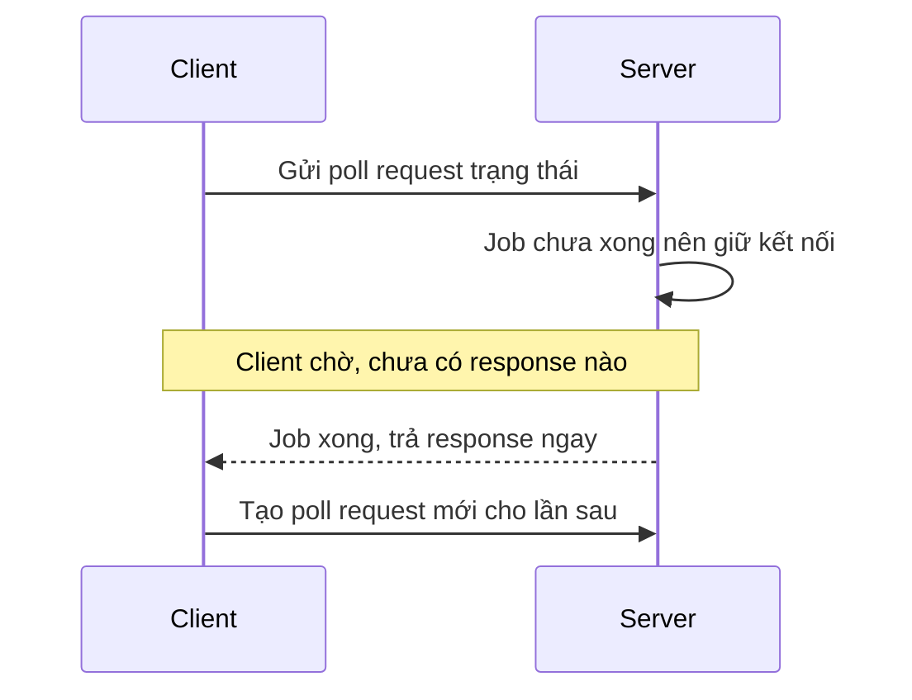

# 🔁 Long Polling (hỏi vòng kéo dài): Bí quyết Kafka dùng để không "làm phiền" backend

> Nguồn: `010-Long-Polling.txt` · [Udemy](https://ua.udemy.com/course/fundamentals-of-backend-communications-and-protocols/learn/lecture/34629820)

Lần đầu mình nghe về **long polling (hỏi vòng kéo dài)** là khi bắt đầu tìm hiểu Kafka, và đọc được câu kiểu: "bọn mình không dùng push model nữa, chuyển sang long polling". Mình đã tự hỏi "polling là gì vậy?", rồi nhận ra đây là một **trick (chiêu) rất gọn** ở backend để né sự "chatty" của short polling (hỏi vòng ngắn). Nếu các bạn đã chán cảnh client hỏi liên tục "xong chưa? xong chưa?", bài này dành cho các bạn.

### 🎯 Ý tưởng cốt lõi: "Chỉ nói với tôi khi mọi thứ sẵn sàng"

Với short polling, request chạy lâu thì client cứ hỏi thăm liên tục. Long polling đảo ngược câu chuyện: *"Request này mất thời gian xử lý à? Vậy tôi để đó, **chỉ nói cho tôi biết khi nó sẵn sàng**."*

Cách làm:

* Client vẫn gửi **một poll request** như thường.
* Nhưng lần này **server không trả lời ngay**, **không ghi gì vào socket** cả.
* Thay vì đáp "chưa xong — false" rồi đóng, server **cứ đứng đó chờ**.
* Client thì đang bất đồng bộ làm việc riêng — các client hiện đại đều async cả; và server cũng biết job chưa xong nên tự làm việc của mình, lát quay lại.

Request đầu tiên đã trả về job ID. Các request long polling tiếp theo sẽ **"block" một cách hiệu dụng** — server chỉ im lặng và giữ đó.

---

### ⚙️ Cơ chế hoạt động: server giữ im lặng tới khi có kết quả

Nhịp đi giống hệt short polling ở đoạn đầu: client gửi request, server **trả handle ngay**, server cứ xử lý tiếp, client dùng handle để kiểm tra trạng thái. Khác biệt nằm ở chỗ: khi client hỏi trạng thái, **server chỉ trả lời khi response thật sự sẵn sàng** — có thể là video đã xử lý xong, có thể là event vừa xảy ra.

* Nếu coi nó là một **request-response kéo dài thật lâu** cũng không sai.
* Nhưng điểm ăn tiền so với request-response thuần: **client vẫn có thể disconnect** giữa chừng.
* Và tất nhiên vẫn phải có **timeout (giới hạn thời gian)**: timeout phía client, timeout phía server — bạn không thể chờ mãi mãi, nên các biến thể đều cho phép cắt vòng chờ sau một khoảng nhất định.

---

### 🌐 Kafka và cuộc chiến push vs pull

Kafka dùng long polling để **consumer đọc dữ liệu từ topic**. Luồng diễn ra như sau:

1. Consumer **subscribe (đăng ký)** một topic bằng long polling request: "topic này có entry/message nào chưa?".
2. Nếu **chưa có message** cho partition đó, Kafka **block — không bao giờ reply**, và client cứ thế chờ.
3. Vì không phải gửi hàng loạt poll request, **không hề lãng phí bandwidth**.
4. **Khoảnh khắc Kafka nhận được message**, nó ghi ngay vào response đang chờ sẵn của client.

Kafka từng thử **push model** và nó không hợp: consumer kết nối vào topic, mỗi khi topic có dữ liệu là dữ liệu bị **đẩy thẳng vào "cổ họng"** client. Có những lúc consumer **không xử lý nổi khối lượng message** đó. Long polling đảo lại quyền chủ động: *để client tự pull theo nhịp của họ* — **client kiểm soát dòng dữ liệu**.

---

### ✅ Ưu và nhược điểm

**Ưu điểm:**

* **Ít chatty hơn hẳn** short polling — gần như không còn hỏi thăm vô ích.
* **Backend friendly**: backend vốn không thích bị hỏi dồn dập.
* **Client có thể disconnect** bất cứ lúc nào.

**Nhược điểm:**

* **Không thật sự real-time**: nếu một message đến ngay sau thời điểm response trước kết thúc, client vẫn phải tạo **poll request mới** để kiểm tra. Trong khoảng trống đó, message mới có thể đã tới mà bạn chưa nhận được.
* Nếu client bị trễ nhịp, nó sẽ **không nhận được message kịp thời** — đây là **tradeoff** các bạn phải cân theo bài toán.

| Tiêu chí | Short polling | Long polling |
|---|---|---|
| Server trả lời | Ngay lập tức dù job chưa xong | Chỉ khi có kết quả hoặc chạm timeout |
| Mức độ chatty | Rất chatty, phần lớn request vô ích | Gần như không hỏi thăm vô ích |
| Real-time | Phụ thuộc nhịp poll | Gần real-time, vẫn có khe hở giữa hai lần poll |
| Bandwidth | Tốn nhiều | Tiết kiệm hơn hẳn |
| Client disconnect | An toàn | An toàn |

---

### 🧪 Demo: một giây "thở" cho event loop và bài học

Demo lần này giống hệt ví dụ short polling, chỉ thêm một hàm phía backend tên `checkJobComplete`, viết theo kiểu **promise-based**: nhận job ID, tự gọi lại chính nó. Nếu job chưa xong, nó trả về `false` — **nhưng đợi 1000 mili giây** trước đã. Vì sao phải đợi? Vì nếu không, **event loop (vòng lặp sự kiện)** sẽ bị block chỉ để kiểm tra liên tục. Khi job xong, nó trả về `true`.

Đây là cái **nuance (sắc thái)** quan trọng: nếu các bạn viết một `while` loop kiểu đồng bộ, hỏi dồn dập không nghỉ, **Node.js sẽ đứng im** — nó chẳng bao giờ chuyển sang việc khác, event loop bị chặn cứng. **Một giây "thở"** giữa các lần kiểm tra cho hệ thống thời gian để luân chuyển.

Chạy demo: submit một job, nhận job ID, và lần này **không có response nào trả về** — client ngồi chờ. Ở backend, tiến độ cứ in ra: **50%, 60%, 70%, 80%**... Rồi khi job hoàn tất, client nhận kết quả. *Đó chính là long polling.* Và mình nói thật: nó **không hề đơn giản** — có khá nhiều chi tiết phải xử lý.

Điều thú vị: về bản chất, ta đã **chuyển việc polling từ phía client sang phía server** — thành kiểu "local polling", nhưng *hey, nó chạy được*. Trong môi trường production, bạn có thể may mắn hơn với sẵn cơ chế **readiness** hoặc **publish-subscribe**, cho phép nhận push notification ngay lập tức và phản hồi liền — còn timeout chỉ là một biến thể trong nhiều cách.

### 🎯 Tự kiểm tra nhanh

**Câu 1:** Long polling đảo ngược short polling ở điểm cốt lõi nào?

<b>Xem đáp án</b>

**Đáp án:** Thay vì trả lời ngay "chưa xong", server giữ im lặng và chỉ trả lời khi kết quả thật sự sẵn sàng.

Giải thích: Client nói "chỉ nói cho tôi biết khi nó sẵn sàng" — request long polling block một cách hiệu dụng.

Tham chiếu: Mục Ý tưởng cốt lõi.

**Câu 2:** Vì sao Kafka chuyển từ push sang long polling?

<b>Xem đáp án</b>

**Đáp án:** Vì push đẩy thẳng dữ liệu vào "cổ họng" consumer, có lúc họ không xử lý nổi khối lượng message.

Giải thích: Long polling trả quyền chủ động về cho client — client tự pull theo nhịp của mình.

Tham chiếu: Mục Kafka và cuộc chiến push vs pull.

**Câu 3:** Vì sao long polling bắt buộc phải có timeout?

<b>Xem đáp án</b>

**Đáp án:** Vì không thể chờ mãi mãi — cần cắt vòng chờ sau một khoảng nhất định, ở cả phía client lẫn server.

Giải thích: Các biến thể long polling đều cho phép kết thúc vòng chờ để tránh treo kết nối vô hạn.

Tham chiếu: Mục Cơ chế hoạt động.

**Câu 4:** Vì sao `checkJobComplete` trong demo phải đợi 1000 mili giây?

<b>Xem đáp án</b>

**Đáp án:** Để event loop không bị block vì kiểm tra liên tục.

Giải thích: Nếu viết while loop hỏi dồn dập, Node.js sẽ đứng im; một giây "thở" cho hệ thống thời gian luân chuyển.

Tham chiếu: Mục Demo.

**Câu 5:** Nhược điểm "không thật sự real-time" của long polling là gì?

<b>Xem đáp án</b>

**Đáp án:** Message đến ngay sau khi response trước kết thúc vẫn phải chờ poll request mới; client trễ nhịp sẽ nhận không kịp thời.

Giải thích: Đây là tradeoff phải cân theo bài toán — long polling không đảm bảo nhận ngay tức khắc như push.

Tham chiếu: Mục Ưu và nhược điểm.

Kafka dùng long polling và nó **rất hiệu quả** — hãy cân nhắc dùng nó trong backend của các bạn. Còn ở bài tiếp theo, chúng ta sẽ bước sang một pattern mới để tiếp tục mở rộng bộ công cụ giao tiếp. Hẹn gặp lại! 🚀

## Nguồn tham khảo

- [Udemy — Long Polling](https://ua.udemy.com/course/fundamentals-of-backend-communications-and-protocols/learn/lecture/34629820)
- [Kafka — KafkaConsumer API, poll và long poll](https://kafka.apache.org/40/javadoc/org/apache/kafka/clients/consumer/KafkaConsumer.html)
