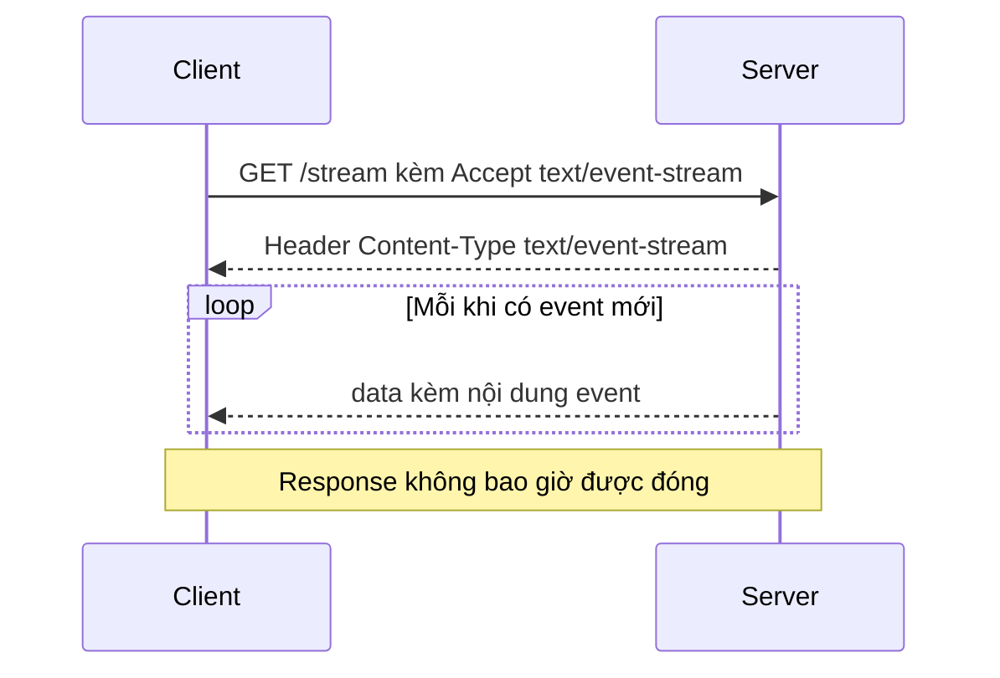

# 📡 Server-Sent Events: Một Request, Nhưng Phản Hồi Không Bao Giờ Kết Thúc

> Nguồn: `011-Server-Sent-Events.txt` · [Udemy](https://ua.udemy.com/course/fundamentals-of-backend-communications-and-protocols/learn/lecture/34629822)

Đây là một trong những pattern mình yêu thích nhất, đến mức mình từng lưỡng lự không biết có nên xếp nó vào phần design pattern hay không. Khi lần đầu hiểu ra **server-sent events (sự kiện đẩy từ server)**, mình chỉ nghĩ: "Ai thiết kế ra thứ này đúng là thiên tài". Hôm nay mình sẽ mổ xẻ cái trick cực kỳ đơn giản nhưng cực kỳ thanh lịch phía sau nó, kèm theo một cạm bẫy mà các bạn sẽ gặp ngay khi dùng nó trong thực tế.

### 🎯 Cái trick: một request, một response không có điểm kết thúc

Ý tưởng nền tảng vẫn là request/response, nhưng bị "bẻ" theo một cách rất thông minh:

* Client gửi **một request duy nhất**.
* Server trả về **một response rất, rất dài** — về mặt kỹ thuật nó **không bao giờ kết thúc**, vì server không ghi hai dòng cuối để đóng response lại.
* Thay vì trả một cục dữ liệu hoàn chỉnh, server liên tục ghi vào response những **mini message (message nhỏ)**.
* Client đủ thông minh để **parse từng chunk** và tách ra các message/event riêng biệt nằm giữa dòng dữ liệu đó.

Điểm mấu chốt: HTTP vẫn là giao thức có khởi đầu và kết thúc, nhưng server-sent events biến nó thành **streaming model một chiều từ server xuống client**. Client cứ lắng nghe dòng chảy đó và "nhặt" ra từng sự kiện.

Đây là thứ thuần HTTP. Nó không chạy trên các giao thức khác, nhưng bù lại nó chạy trên **mọi TCP server thông thường** — các bạn không cần dựng một WebSocket server mới dùng được nó.

---

### 📬 Vì sao lại cần nó: bài toán notification thời gian thực

Request/response thuần không lý tưởng cho notification. Client muốn biết ngay lập tức khi: có người vừa đăng nhập, có tin nhắn mới vừa tới...

Các bạn có thể dùng **WebSocket** — server chủ động đẩy message bất ngờ xuống client. Cách đó hoạt động, nhưng khá **hạn chế** vì client phải nói chuyện bằng một giao thức hoàn toàn khác.

Server-sent events thì khác: nó vẫn là request/response, vẫn là HTTP. Cụ thể hơn:

1. Client gửi request đặc biệt với **content type đặc biệt**.
2. Server set header `Content-Type: text/event-stream`.
3. Từ đó trở đi, mọi thứ server ghi thêm vào body đều được client hiểu là **các event riêng lẻ**.
4. Mỗi event bắt đầu bằng chữ `data:` và kết thúc bằng **hai dòng xuống dòng** — đó chính là ranh giới xác định event.

Nghe hơi "hacky" một chút, nhưng nó hoạt động. Server không bao giờ viết dấu kết thúc response, mà chỉ ghi thêm các mini event có thể tạm dừng (pause) ở giữa.

---

### ⚙️ Demo: EventSource trong browser và một request "không bao giờ xong"

Trong demo của mình:

* Server là một app Express chạy ở cổng 8888. Route gốc trả về chữ "hello" để tránh chuyện CORS.
* Route `/stream` set một header duy nhất rồi chạy hàm `send()`, mỗi giây ghi thêm một event kèm số đếm.
* Phía client, browser cung cấp sẵn object **`EventSource`** — có mặt trong mọi browser — chuyên xử lý kiểu stream này.

Mình mở console, tạo một `EventSource` trỏ thẳng vào `/stream`. Và điều thú vị xảy ra:

* Network tab cho thấy request đã gửi, response đã nhận, dữ liệu đang về... nhưng console **không in gì cả**.
* Lý do: mình chưa "nối dây" cho event. Phải gắn `onmessage` rồi `console.log` thì mỗi mini message mới được đẩy vào một **MessageEvent object** đầy đủ.
* Nhìn vào Network tab, request ghi rõ là **chưa kết thúc**. Một request không có điểm dừng — đó chính là server-sent events.

Vậy là xong. Một request, dữ liệu cứ thế chảy về mãi, client tự tách event. Thanh lịch và đơn giản đến mức khó tin.

---

### ⚠️ Cạm bẫy: sáu kết nối và bài toán connection pooling

Cho tới lúc này mọi thứ đều đẹp. Nhưng đây là chỗ các bạn phải cực kỳ cẩn thận, và nó liên quan trực tiếp đến HTTP/1.1:

1. Trình duyệt Chrome giới hạn **tối đa 6 TCP connection tới một domain**. Nhiều browser khác cũng theo quy tắc này.
2. Ở HTTP/1.1, mỗi connection chỉ chạy **một request tại một thời điểm**; vừa gửi request là connection bị đánh dấu **busy** và không dùng được nữa cho tới khi xong. Cơ chế pipeline có tồn tại nhưng đầy vấn đề nên gần như không ai dùng.
3. Vì vậy browser mở sẵn tối đa 6 connection để phục vụ mọi thứ: CSS, JavaScript, các file khác...
4. Nhưng server-sent events là **request không bao giờ kết thúc**. Nếu cả 6 connection đều là SSE request thì cả 6 đều busy vĩnh viễn.
5. Kết quả: mọi request khác trên cùng domain **bị đói tài nguyên** — đến một file JavaScript cũng không tải nổi.

Đó là lý do HTTP/2 hợp lý hơn hẳn: các bạn có thể có **vô số stream trên cùng một connection**, mỗi connection chứa nhiều stream (giới hạn khoảng 200 và có thể cấu hình). Một connection, nhiều dòng dữ liệu song song — không còn cảnh 6 connection bị chiếm sạch.

*Nhớ nhé: đừng học thuộc những con số này. Hiểu cách mọi thứ vận hành thì tự khắc các mảnh ghép sẽ khớp vào nhau khi bạn gặp vấn đề thật.*

---

### 💡 Ưu, nhược điểm và chỗ đứng của pattern này

Server-sent events có **ưu điểm** rõ rệt: real time thực sự, tương thích với cả request/response lẫn mô hình HTTP, và server chỉ cần là web server bình thường (tối thiểu HTTP/1.1 — HTTP/1.0 không hỗ trợ streaming nên không chạy được).

Nhưng nó cũng có **nhược điểm**:

* Client **phải luôn online** để nhận các mini response.
* Client có thể không theo kịp đống message server đẩy xuống — cùng vấn đề như push: client có thể ngắt kết nối, còn server thì phải gánh trạng thái và tài nguyên để giữ kết nối đó, tạo áp lực lên backend.
* Nếu client quá nhẹ, không đủ "thông minh" để xử lý stream, **polling (dài hoặc ngắn)** lại là lựa chọn hợp lý hơn.

| Tiêu chí | Polling | Long polling | Server-Sent Events |
|---|---|---|---|
| Cơ chế | Hỏi vòng liên tục | Server giữ request tới khi có kết quả | Một request, response không bao giờ kết thúc |
| Giao thức | HTTP | HTTP | HTTP với `text/event-stream` |
| Real-time | Thấp | Gần real-time | Real-time thực sự |
| Điểm yếu | Chatty, tốn bandwidth | Có khoảng trễ giữa hai lần poll | Client phải online, tốn connection giữ stream |

### 🎯 Tự kiểm tra nhanh

**Câu 1:** Trick cốt lõi của server-sent events là gì?

<b>Xem đáp án</b>

**Đáp án:** Client gửi một request duy nhất, server trả về một response rất dài và không bao giờ kết thúc.

Giải thích: Server liên tục ghi các mini message vào response, client parse từng chunk để tách ra từng event.

Tham chiếu: Mục Cái trick.

**Câu 2:** Vì sao nói SSE vẫn là "thuần HTTP"?

<b>Xem đáp án</b>

**Đáp án:** Vì nó dùng chính request/response với header `Content-Type: text/event-stream`, chạy trên mọi TCP server thông thường.

Giải thích: Bạn không cần dựng một WebSocket server mới để dùng SSE.

Tham chiếu: Mục Cái trick.

**Câu 3:** SSE khác WebSocket ở điểm hạn chế nào?

<b>Xem đáp án</b>

**Đáp án:** WebSocket cho server đẩy message bất ngờ nhưng client phải nói chuyện bằng giao thức hoàn toàn khác; SSE giữ nguyên HTTP và chỉ streaming một chiều từ server.

Giải thích: Đó là lý do SSE tương thích hơn với hạ tầng web sẵn có.

Tham chiếu: Mục Vì sao lại cần nó.

**Câu 4:** Cạm bẫy "sáu kết nối" nguy hiểm thế nào?

<b>Xem đáp án</b>

**Đáp án:** Chrome giới hạn 6 TCP connection tới một domain; HTTP/1.1 khiến mỗi connection chạy một request — 6 SSE request giữ cả 6 connection busy vĩnh viễn.

Giải thích: Mọi request khác trên cùng domain bị đói tài nguyên, đến file JavaScript cũng không tải nổi.

Tham chiếu: Mục Cạm bẫy.

**Câu 5:** HTTP/2 giải quyết cạm bẫy đó ra sao?

<b>Xem đáp án</b>

**Đáp án:** Cho phép vô số stream trên cùng một connection — khoảng 200 stream và có thể cấu hình.

Giải thích: Một connection, nhiều dòng dữ liệu song song, không còn cảnh 6 connection bị chiếm sạch.

Tham chiếu: Mục Cạm bẫy.

Hiểu được những đánh đổi đó, các bạn mới chọn đúng pattern cho đúng bài toán. Còn bây giờ, mình sẽ dẫn các bạn sang một pattern cũng thuộc hàng "ruột" của mình: **publish-subscribe (phát-thu)** — cách để các service nói chuyện với nhau mà không cần biết mặt nhau. 🚀

## Nguồn tham khảo

- [Udemy — Server Sent Events](https://ua.udemy.com/course/fundamentals-of-backend-communications-and-protocols/learn/lecture/34629822)
- [MDN — EventSource](https://developer.mozilla.org/en-US/docs/Web/API/EventSource)
- [MDN — Using server-sent events](https://developer.mozilla.org/en-US/docs/Web/API/Server-sent_events/Using_server-sent_events)
