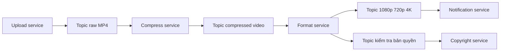

# 📬 Publish-Subscribe: Upload Xong Là Xong, Phần Còn Lại Giao Cho Broker

> Nguồn: `012-Publish-Subscribe-PubSub.txt` · [Udemy](https://ua.udemy.com/course/fundamentals-of-backend-communications-and-protocols/learn/lecture/34629824)

**publish-subscribe (phát-thu)** — hay gọi tắt là **pub/sub** — lại là một trong những pattern mình yêu thích nhất. Nó sinh ra để giải một bài toán rất thật: khi hàng loạt service cần nói chuyện với nhau, làm sao để chúng không phải kết nối chằng chịt thành một cái lưới. Trong bài này, mình sẽ kể các bạn nghe ví dụ YouTube, chỉ rõ chỗ request/response gãy, rồi cùng dựng thử một queue bằng RabbitMQ trên cloud để xem chuyện acknowledge message khó nhằn tới mức nào.

### 🎯 Vấn đề: kiến trúc mesh — ai cũng muốn nói chuyện với tất cả mọi người

Hãy tưởng tượng service A có dữ liệu cần gửi cho các service B, C, D, E, F, G. Nếu làm theo cách truyền thống:

* Service A phải **thiết lập kết nối với từng service một**.
* Mỗi service mới tham gia lại làm mạng lưới thêm rối.
* Ai cũng phải biết địa chỉ, giao thức, cách nói chuyện của những người còn lại.

Pub/sub đảo ngược hoàn toàn: **tất cả cứ publish nội dung lên server rồi đi làm việc khác**, để ai muốn tiêu thụ thì tự tiêu thụ. Một publisher — nhiều reader, thậm chí nhiều publisher cũng được luôn.

---

### 🎬 Ví dụ YouTube: request/response gãy ở đâu?

Cùng nhìn một luồng nghiệp vụ thật: upload video lên YouTube. Phía sau, video phải được **nén**, rồi đưa qua format service để encode thành nhiều độ phân giải: 1080p, 720p, 4K... Sau đó còn phải gọi **notification service** để báo cho người dùng và **copyright service** để kiểm tra bản quyền. Đúng kiểu kiến trúc microservices.

Nếu nối tất cả bằng request/response thuần:

1. Upload service nhận file và chuyển cho compress server — **client vẫn ngồi chờ**.
2. Compress server xử lý xong, gửi request sang format service.
3. Format service xử lý xong, gọi notification service.
4. Notification service thành công, trả về "xong rồi", rồi cứ thế **mở khoá (unblock) ngược lên từng tầng**: xong, xong, xong...

Chỉ cần **một mắt xích gãy là toàn bộ workflow gãy**. Và khi bạn muốn thêm copyright service — tức là có hai nhánh phụ thuộc — mọi thứ càng rối. Đó là lý do request/response có **high coupling (phụ thuộc chặt)**: client và server phải chạy song song, phải làm chaining, circuit breaking... rồi người ta mới sinh ra service mesh và sidecar proxy (container phụ trợ) để xử lý đống phức tạp đó.

---

### 🧩 Lời giải pub/sub: topic, broker và chuyện "publish xong là xong"

Với pub/sub, luồng đổi hẳn:

* Client upload xong là **kết thúc trách nhiệm**, nhận về một ID rồi đi làm việc khác. Video cứ xử lý tiếp ở background. **YouTube ngày nay chính xác làm như vậy.**
* Upload server quay sang ghi raw MP4 vào một **topic** — ví dụ "raw MP4 videos".
* Các **broker** (server trung tâm ở giữa) giữ **queue và topic**; topic hiểu đơn giản là một nhóm mà consumer có thể subscribe vào.
* Compress service tự consume video từ topic, **không hề coupling** với upload service. Nhân tố duy nhất hai bên phải bận tâm là: broker phải luôn online.
* Xử lý xong, compress service lại **publish** sang topic khác: "compressed video".
* Format service consume, encode ra các bản 1080p, 720p, 4K rồi ghi vào các topic tương ứng. Notification service chỉ consume đúng topic nó cần — ví dụ "bản 4K đã sẵn sàng thì báo người dùng". Hoặc bạn có thể chọn thông báo ngay khi bản nhanh nhất xong, tuỳ bạn muốn điều khiển trải nghiệm người dùng thế nào.

Cách thức **giao hàng** cũng do implementation quyết định: có thể là **push**, cũng có thể là **long polling**. Đây chính là khác biệt kinh điển giữa RabbitMQ và Kafka:

* **RabbitMQ** đẩy (push) message cho consumer.
* **Kafka** để client tự **pull hoặc long pull** những gì đã sẵn sàng.

| Tiêu chí | RabbitMQ | Kafka |
|---|---|---|
| Cách giao message | Push tới consumer | Client pull hoặc long pull |
| Quyền chủ động | Broker đẩy ngay khi có message | Consumer tự kiểm soát nhịp đọc |
| Rủi ro chính | Consumer không kham nổi tải | Consumer trễ nhịp đọc |
| Mức đảm bảo | At-least-once | At-least-once |

Với pub/sub, vai trò rất linh hoạt: có service chỉ publish (upload), có service vừa consume vừa publish (compress, format), có service chỉ consume (notification). Không có đúng sai — chỉ có phù hợp với bài toán của bạn hay không.

---

### 🐰 Demo: RabbitMQ trên CloudAMQP và bi kịch acknowledge

Mình dựng thử một instance RabbitMQ trên **CloudAMQP** — bản cloud, plan **free là quá đủ**, chọn region gần mình nhất. RabbitMQ nói giao thức **AMQP (advanced message queue protocol — giao thức hàng đợi message nâng cao)**, thứ được rất nhiều hệ thống messaging sử dụng.

Trong giao diện quản trị: chưa có exchange, channel hay connection nào cả. Mình vào phần dịch vụ, copy **AMQP URL** rồi viết hai app Node.js:

* **Publisher:** kết nối tới RabbitMQ server, tạo một **channel** (đơn vị giống như "stream level" của HTTP; mỗi server mặc định cho khoảng 200 channel, bản free là dư dùng), `assert` một queue tên **Jobs** — chưa có thì tạo — rồi publish một con số dạng JSON và **đóng cả channel lẫn connection**.
* **Consumer:** cũng kết nối, tạo channel, assert queue, rồi bắt đầu consume và in ra con số nhận được.

Chạy `node publisher.js 107`: kết nối thành công, job được gửi vào queue, connection đóng lại. Nhìn dashboard: queue **Jobs** xuất hiện với **1 message ready**, không còn connection hay channel nào (vì mình đóng hết), và có sẵn 7 exchange mặc định mà mình không hề tạo.

Rồi mình chạy `node consumer.js` — nó in ra "Received job with input 107" và... vẫn để connection mở. Đây là chỗ hay:

* Mình **không acknowledge** message. RabbitMQ coi job 107 là "đang được xử lý" nên **không giao cho ai khác**.
* Mở thêm một consumer thứ hai: nó **không nhận được gì cả**.
* Mình kill consumer đầu tiên. Ngay lập tức, consumer thứ hai nhận được job 107 — bởi vì consumer đầu **đã chết mà chưa acknowledge**.

Acknowledge message là chuyện rất, rất tricky — và nó dẫn thẳng tới phần ưu nhược điểm.

---

### ⚖️ Ưu điểm, nhược điểm và bài toán giao nhận message

**Ưu điểm của pub/sub:**

* Scale tốt với nhiều receiver — tuyệt vời cho microservices.
* **Coupling thấp**: các service không nối chặt vào nhau, nên thay đổi phía này không kéo đổ phía kia.
* Client không cần chạy liên tục: publish xong là thoát, consumer cứ tiêu thụ theo nhịp của nó.

**Nhược điểm:**

* **Bài toán giao nhận message** kinh điển: làm sao biết subscriber thực sự nhận được message? Đây là bài toán hai vị tướng (two generals problem) — cực kỳ khó.
* Message có thể bị **consume hai lần**.
* Kafka và RabbitMQ chỉ đảm bảo mức **at-least-once (ít nhất một lần)**.
* Muốn scale tốt hơn phải thêm broker, thêm partition — kéo theo **độ phức tạp tăng vọt**.
* Nếu dùng polling, nhiều client cùng poll có thể gây **nghẽn mạng (network congestion)** giữa client và broker.

### 🎯 Tự kiểm tra nhanh

**Câu 1:** Pub/sub giải bài toán gì so với kiến trúc mesh?

<b>Xem đáp án</b>

**Đáp án:** Thay vì service A phải nối tới từng service B, C, D..., mọi người cứ publish lên server trung tâm rồi ai muốn tiêu thụ thì tiêu thụ.

Giải thích: Một publisher — nhiều reader, thậm chí nhiều publisher, không ai phải biết địa chỉ hay giao thức của nhau.

Tham chiếu: Mục Vấn đề: kiến trúc mesh.

**Câu 2:** Vì sao request/response gãy trong luồng upload YouTube?

<b>Xem đáp án</b>

**Đáp án:** Vì high coupling — chỉ cần một mắt xích gãy là toàn bộ workflow gãy, và thêm một nhánh như copyright service thì mọi thứ càng rối.

Giải thích: Client phải chạy song song, chaining, circuit breaking... rồi người ta mới sinh ra service mesh và sidecar proxy.

Tham chiếu: Mục Ví dụ YouTube.

**Câu 3:** Broker và topic đóng vai trò gì trong pub/sub?

<b>Xem đáp án</b>

**Đáp án:** Broker là server trung tâm giữ queue và topic; topic là một nhóm mà consumer có thể subscribe vào.

Giải thích: Producer và consumer không coupling với nhau — nhân tố duy nhất hai bên bận tâm là broker phải luôn online.

Tham chiếu: Mục Lời giải pub/sub.

**Câu 4:** Vì sao consumer thứ hai không nhận được job 107 trong demo?

<b>Xem đáp án</b>

**Đáp án:** Vì consumer đầu chưa acknowledge nên RabbitMQ coi job đang được xử lý và không giao cho ai khác.

Giải thích: Khi kill consumer đầu, job 107 ngay lập tức được giao lại cho consumer thứ hai.

Tham chiếu: Mục Demo: RabbitMQ trên CloudAMQP.

**Câu 5:** Nhược điểm lớn nhất của pub/sub là gì?

<b>Xem đáp án</b>

**Đáp án:** Bài toán giao nhận message — làm sao biết subscriber thực sự nhận được message (two generals problem).

Giải thích: Message có thể bị consume hai lần; Kafka và RabbitMQ chỉ đảm bảo at-least-once; scale tốt hơn phải thêm broker, partition — độ phức tạp tăng vọt.

Tham chiếu: Mục Ưu điểm, nhược điểm.

Pub/sub cho bạn khả năng scale và tách rời cực tốt, nhưng đổi lại bạn phải đối mặt với bài toán giao nhận message — thứ mà mình tin là một trong những bài toán khó nhất của backend. Ở bài tiếp theo, mình sẽ nói về **multiplexing (ghép kênh) vs demultiplexing (tách kênh)** — và các bạn sẽ thấy nó len lỏi khắp nơi, từ HTTP/2 tới connection pooling. 🚀

## Nguồn tham khảo

- [Udemy — Publish Subscribe (Pub/Sub)](https://ua.udemy.com/course/fundamentals-of-backend-communications-and-protocols/learn/lecture/34629824)
- [RabbitMQ — AMQP 0-9-1 Model Explained](https://www.rabbitmq.com/tutorials/amqp-concepts)
- [Kafka — KafkaConsumer API](https://kafka.apache.org/40/javadoc/org/apache/kafka/clients/consumer/KafkaConsumer.html)
