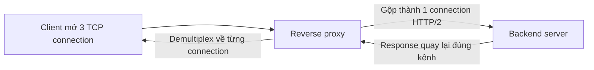

# 🔀 Multiplexing vs Demultiplexing: Gộp Kênh, Tách Kênh và Nghệ Thuật Connection Pooling

> Nguồn: `013-Multiplexing-vs-Demultiplexing-h2-proxying-vs-Connection-Poo.txt` · [Udemy](https://ua.udemy.com/course/fundamentals-of-backend-communications-and-protocols/learn/lecture/34629826)

Đây là chủ đề thuần về networking, nhưng mình thấy nó khớp một cách hoàn hảo khi bàn về backend communication. **Multiplexing (ghép kênh)** và **demultiplexing (tách kênh)** xuất hiện khắp nơi: trong HTTP, trong QUIC, trong **connection pooling (gộp kết nối)**, và cả trong giao thức mới mang tên multipath TCP. Hiểu hai khái niệm này, các bạn sẽ nhìn ra bản chất của rất nhiều vấn đề hiệu năng mình gặp hằng ngày.

### 🎯 Định nghĩa: gộp nhiều thành một, tách một thành nhiều

Cứ nhìn bằng hình ảnh cho dễ:

* **Multiplexing** = nhiều đường tín hiệu **gộp vào một đường duy nhất**. Ví dụ: ba TCP connection được gộp thành một TCP connection; ba request của người dùng được gộp vào một connection đi tới backend.
* **Demultiplexing** = ngược lại: một đường **tách ra thành nhiều đích khác nhau**. Ví dụ: một connection mang ba request, được tách ra và đưa tới ba client/ba đích tương ứng.

Nghe đơn giản, nhưng tính ứng dụng cực kỳ rộng. Ví dụ **multipath TCP**: nhiều đường mạng vật lý được "trình diện" với người dùng như **một đường duy nhất**, một TCP connection — đúng tinh thần multiplexing.

---

### 🌐 Nó xuất hiện ở đâu: HTTP/1.1, HTTP/2 và reverse proxy

**Với HTTP/1.1:** người dùng gửi ba request (qua fetch, Axios hay XHR) từ web app. Chrome sẽ **tự mở nhiều TCP connection** ra server, và các request được pipeline lần lượt trên từng connection.

**Với HTTP/2:** chỉ còn **một connection duy nhất**, và ba request được **multiplex thành ba stream** trên cùng một đường ống đi tới server. Đây là lời giải cho giới hạn sáu connection mà mình đã nhắc ở bài server-sent events.

**Ở tầng backend**, câu chuyện còn thú vị hơn với reverse proxy:

* Front-end của proxy (ví dụ Envoy hay Nginx) nói **HTTP/1.1**; back-end của nó nói **HTTP/2**.
* Client mở ba TCP connection song song tới proxy.
* Proxy thiết lập **một connection HTTP/2 duy nhất** (trên TCP) và multiplex cả ba request vào đó.

Lợi ích: số connection giảm mạnh. Nhưng có giá của nó: HTTP/2 khiến **CPU server phải làm việc nhiều hơn** vì phải parse nhiều request đến từ cùng một connection. Bạn có **throughput cao hơn, nhưng đổi bằng tài nguyên**.

| Tiêu chí | HTTP/1.1 | HTTP/2 |
|---|---|---|
| Số connection | Nhiều connection song song, giới hạn 6 mỗi domain | Một connection duy nhất |
| Cách request đi | Pipeline lần lượt trên từng connection | Multiplex thành nhiều stream trên một đường ống |
| Chi phí | Tốn tài nguyên mở connection | CPU server parse nhiều request hơn |
| Lợi ích | Đơn giản, dễ vận hành | Throughput cao hơn, giảm số connection |

---

### 🧮 Connection pooling: "multiplexing phiên bản bóng bẩy"

**Connection pooling (gộp kết nối)** là một trong những thứ mình thích nhất, và cực kỳ phổ biến. Ý tưởng: thay vì mở connection mới cho mỗi request, bạn mở sẵn một **pool** connection — ví dụ bốn connection tới database — và **giữ chúng luôn "nóng"**.

Luồng hoạt động:

1. Request đến backend.
2. Backend chọn một connection **đang rảnh** trong pool và gửi query đi.
3. Request khác đến — nhảy sang connection rảnh tiếp theo.
4. Khi cả bốn connection đều bận, request mới **vẫn vào được backend nhưng bị chặn (blocked)** vì không còn connection nào để phục vụ.
5. Một request xong, connection được giải phóng — request đang chờ mới được gửi đi trên connection vừa rảnh đó.

Về bản chất, connection pooling chính là **multiplexing dưới một cái tên hoành tráng hơn**: một "đường ống" phía client, nhưng được tách ra nhiều connection ở phía backend. Có những backend không làm điều này — ví dụ Django bên Python dùng đúng **một connection cho mỗi thread**, khá hạn chế, và bạn phụ thuộc hoàn toàn vào kiến trúc threading của mình.

---

### 🗄️ Vì sao không nhồi nhiều SQL query lên cùng một connection?

Một câu hỏi rất hay: "Tại sao không gửi nhiều câu SQL trên cùng một connection cho nhanh?" Câu trả lời nằm ở chỗ bạn không thể biết response nào ứng với query nào:

1. Bạn gửi ba query SQL trên cùng một connection.
2. Query 1 mất 7 giây, query 3 xong trước.
3. Server trả response về — nhưng response nào? Không có gì bảo đảm thứ tự.
4. Bạn đang nói chuyện với một **hộp đen** (Postgres) và phụ thuộc vào cách nó xử lý.

Bạn có thể tự xây dựng cơ chế: gắn ID cho từng query và đảm bảo ID quay về — nhưng tự làm thì khá cực. PostgreSQL 14 (nếu mình nhớ không lầm) mới bắt đầu hỗ trợ **pipeline** — gửi nhiều query trên cùng connection và nhận response **đúng thứ tự**.

---

### 🌊 Demo: sáu connection chặn cả hệ thống

Mình dùng lại ví dụ long polling: submit job rồi liên tục hỏi trạng thái. Vì là long polling, mỗi request sẽ **giữ connection rất lâu**.

Kết quả trong browser:

* Mình submit vài job, rồi poll trạng thái — các connection lần lượt bị **chiếm**.
* Đến khi **sáu connection đều bận**, mình không thể submit thêm job nào nữa: submit job lẽ ra phải trả lời ngay lập tức, nhưng giờ **nó bị chặn đứng**.
* Nhìn waterfall của request: các request bị **stall hơn 1,2 phút**, và stall này xảy ra ở phía client. Browser thậm chí không buồn mở connection mới vì không còn tài nguyên.
* Ngay khi các poll trả về, connection được giải phóng và loạt request đang chờ mới được gửi đi.

Nhìn vào ID connection, các bạn sẽ thấy đúng **sáu connection** — không hơn. Chrome đôi khi còn bắt bạn chờ thay vì mở thêm. Vì vậy khả năng **tái sử dụng connection** cực kỳ quan trọng để không vượt qua con số sáu. Và tất nhiên, giới hạn này là **trên mỗi domain** — có nhiều domain thì mở được nhiều connection hơn.

Đảo ngược lại, đây cũng là lúc **demultiplexing** thể hiện giá trị: client nói HTTP/2 với proxy phía trước, rồi proxy **tách (demultiplex)** từng request ra thành connection riêng tới server — mỗi request có **flow control và congestion control riêng**, không ảnh hưởng lẫn nhau. Còn khi dùng chung một TCP connection, tất cả phải tuân theo cùng một bộ luật. *Tuy nhiên, với QUIC thì điều này không còn đúng nữa* — và đó là lý do mình muốn các bạn nắm chắc hai khái niệm này trước khi bước vào phần giao thức.

### 🎯 Tự kiểm tra nhanh

**Câu 1:** Multiplexing và demultiplexing khác nhau thế nào?

<b>Xem đáp án</b>

**Đáp án:** Multiplexing là gộp nhiều đường tín hiệu vào một đường duy nhất; demultiplexing là tách một đường ra nhiều đích khác nhau.

Giải thích: Ví dụ multiplexing: ba TCP connection gộp thành một; demultiplexing: một connection mang ba request tách ra ba đích.

Tham chiếu: Mục Định nghĩa.

**Câu 2:** Vì sao không thể nhồi nhiều SQL query lên cùng một connection?

<b>Xem đáp án</b>

**Đáp án:** Vì bạn không biết response nào ứng với query nào — không có gì bảo đảm thứ tự.

Giải thích: Query 1 mất 7 giây, query 3 xong trước; PostgreSQL 14 mới bắt đầu hỗ trợ pipeline nhận response đúng thứ tự.

Tham chiếu: Mục Vì sao không nhồi nhiều SQL query.

**Câu 3:** Connection pooling thực chất là gì?

<b>Xem đáp án</b>

**Đáp án:** Multiplexing dưới một cái tên hoành tráng hơn — giữ sẵn pool connection "nóng" và chọn connection rảnh cho từng request.

Giải thích: Khi cả pool đều bận, request mới vào được backend nhưng bị block cho tới khi có connection được giải phóng.

Tham chiếu: Mục Connection pooling.

**Câu 4:** Demo sáu connection cho thấy điều gì?

<b>Xem đáp án</b>

**Đáp án:** Khi 6 connection đều bận vì long polling, submit job — việc lẽ ra trả lời ngay — cũng bị chặn đứng; request stall hơn 1,2 phút.

Giải thích: Stall xảy ra ở phía client; browser không mở thêm connection vì hết tài nguyên, nên tái sử dụng connection cực kỳ quan trọng.

Tham chiếu: Mục Demo: sáu connection chặn cả hệ thống.

**Câu 5:** Demultiplexing ở proxy mang lại lợi ích gì?

<b>Xem đáp án</b>

**Đáp án:** Mỗi request được tách ra thành connection riêng tới server, có flow control và congestion control riêng, không ảnh hưởng lẫn nhau.

Giải thích: Dùng chung một TCP connection thì tất cả phải tuân theo cùng một bộ luật — tuy nhiên với QUIC thì điều này không còn đúng nữa.

Tham chiếu: Mục Demo: sáu connection chặn cả hệ thống.

Hiểu được khi nào nên gộp kênh, khi nào nên tách kênh, các bạn sẽ tự trả lời được rất nhiều câu hỏi hiệu năng trong công việc. Hẹn gặp các bạn ở bài tiếp theo: **stateful (lưu trạng thái) vs stateless (không lưu trạng thái)**. 🚀

## Nguồn tham khảo

- [Udemy — Multiplexing vs Demultiplexing (h2 proxying vs Connection Pooling)](https://ua.udemy.com/course/fundamentals-of-backend-communications-and-protocols/learn/lecture/34629826)
- [MDN — HTTP/2](https://developer.mozilla.org/en-US/docs/Glossary/HTTP_2)
- [MDN — Overview of HTTP](https://developer.mozilla.org/en-US/docs/Web/HTTP/Guides/Overview)
