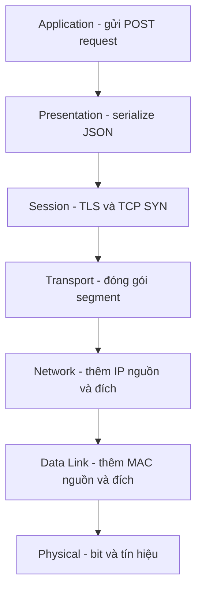

# 🪆 OSI Model: Bảy tầng của mọi kết nối — tấm bản đồ bạn phải đọc được

> Nguồn: `018-OSI-Model.txt` · [Udemy](https://ua.udemy.com/course/fundamentals-of-backend-communications-and-protocols/learn/lecture/34629836)

Chào các bạn, mình là Hussein đây! Cách đây 20 năm, khi còn ngồi trên giảng đường đại học, mình đã học **OSI model (mô hình 7 tầng, Open Systems Interconnection)** — và mình thú thật: *mình chẳng hiểu gì cả*. Hồi đó mình chỉ mê viết C, C++, làm giao diện ứng dụng, nên mình học vẹt, thi qua môn rồi quên hết — dù thầy dạy rất tốt. Giờ nhìn lại mình rất hối hận, và mình viết bài này để các bạn không lặp lại sai lầm đó: **bất kỳ software engineer nào muốn chạm vào networking đều phải hiểu OSI model** — không cần hiểu mọi thứ, chỉ cần hiểu 7 tầng và trả lời được: *ứng dụng của bạn sống ở tầng nào?*

Vì sao câu hỏi đó quan trọng? Vì nếu ứng dụng của bạn là cầu nối giữa hai ứng dụng khác, bạn phải biết mình đang nhìn thấy gì: MAC address hay IP packet (gói tin IP)? Segment (đoạn dữ liệu)? Port (cổng)? TCP options? Hay bạn đang giải mã, đọc JSON, đối chiếu chứng chỉ (certificate)? Mỗi tầng có ý nghĩa riêng, và mọi reverse proxy, load balancer (bộ cân bằng tải), API gateway đều phải "sống" ở một hoặc nhiều tầng trong số đó.

### 🎓 Vì sao chúng ta cần một communication model?

Mình luôn bắt đầu bằng câu hỏi "Vì sao?" — mình không thích học một thứ mà không biết nó tồn tại để làm gì. Mục tiêu của OSI model rất rõ: **xây dựng được những ứng dụng không phụ thuộc hạ tầng (agnostic application)**.

Hãy tưởng tượng thế giới không có chuẩn chung:

* Server sẽ không biết nói chuyện với client của bạn như thế nào — bit được chuyển thành tín hiệu số rồi tương tự ra sao, đầu bên kia đọc chúng thế nào...
* Ứng dụng của bạn buộc phải **hiểu tường tận môi trường truyền dẫn bên dưới**: một phiên bản cho WiFi, một logic khác cho Ethernet, một phiên bản cho LTE, một phiên bản nữa cho cáp quang — *đó sẽ là một thảm họa*.

Chúng ta đang hưởng thành quả của những người đi trước mà thường không để ý: một ứng dụng Node.js hôm nay chạy được trên mọi CPU, và khi gửi request, chuyện nó đi qua **vệ tinh, sóng WiFi, tín hiệu điện Ethernet, sóng radio LTE hay ánh sáng cáp quang** không hề quan trọng. Chuẩn mở này có mặt trên toàn cầu — thậm chí vươn tới cả không gian. Nghe thì hiển nhiên, nhưng nó không hề hiển nhiên chút nào.

Chuẩn chung còn giúp **quản lý và nâng cấp thiết bị mạng**: không có chuẩn, router này không nói chuyện được với router kia. Khi có chuẩn, hạ tầng tách rời (decoupled) khỏi môi trường truyền dẫn, và **đổi mới diễn ra độc lập ở từng tầng** — tầng vật lý nâng cấp mà tầng trên không cần hay biết, miễn giữ đúng giao diện (interface). Nếu ai đó làm ra một môi trường truyền dẫn hiệu quả hơn cáp quang (*chắc không có gì nhanh hơn ánh sáng, nhưng các bạn hiểu ý mình*), ta chỉ cần xây interface cho nó rồi hỗ trợ nó — tầng 2 chẳng cần biết gì về chuyện đó.

Cuối cùng, một khái niệm cực kỳ quan trọng mà mình sẽ dành hẳn một bài riêng: **protocol ossification (sự hóa thạch giao thức)**. Các giao thức và các router ở giữa đường truyền đọc gói tin theo một cách cố định; bạn thay đổi định dạng là chúng "dựng tóc gáy".

---

### 🧱 Bảy tầng OSI — và ứng dụng của bạn sống ở đâu?

Mình không mong các bạn thuộc lòng mọi chi tiết — chỉ cần nắm 7 tầng và vị trí của ứng dụng mình. Đây là bảy tầng, nhìn từ trên xuống:

**1. Layer 7 — Application (tầng ứng dụng).** Cùng một tầng nhưng mỗi người nhìn thấy một thứ khác nhau: network engineer nhìn vào chỉ thấy "một đống dữ liệu", còn backend engineer thấy thư viện mình đang dùng — đang lắng nghe, đang gửi packet, có thể là gRPC chạy trên HTTP/2. Với chúng ta, mọi thứ như HTTP, FTP... chính là application.

**2. Layer 6 — Presentation (tầng trình bày).** Encode và serialization (tuần tự hóa): khi bạn gửi JSON qua fetch hay Axios, object JSON phải được serialize từ object trong JavaScript/Python thành chuỗi byte phẳng, chẳng hạn encode UTF-8 — object chỉ có ý nghĩa trong ngôn ngữ của bạn, còn trên đường truyền nó chỉ là byte. Và bạn nên biết ơn: việc này đã được làm sẵn cho bạn. *Nhiều người chỉ trích OSI ở chỗ chia tầng quá nhỏ — đặc biệt là presentation và session — mình sẽ nói về chuyện này ở cuối bài, vì quan điểm của mình đã thay đổi.*

**3. Layer 5 — Session (tầng phiên).** Nơi diễn ra TLS, thiết lập kết nối (connection establishment), lưu **state (trạng thái)**: client giữ state, server giữ state. Đây là gốc rễ của **stateful (lưu trạng thái)** và **stateless (không lưu trạng thái)**: HTTP không có session layer vì nó stateless; còn TCP là stateful — server và client quản lý một session, và nếu session bị phá hủy thì kết nối phải khởi động lại hoặc bị vô hiệu hóa. Nhiều proxy như **Linkerd** (và Envoy) chỉ xây logic ở riêng tầng này — can thiệp đúng lúc thiết lập kết nối, giữ kết nối và gộp kết nối (**connection pooling**) — đó chính là một "layer 5 app".

**4. Layer 4 — Transport (tầng vận chuyển).** Mình nói thẳng: đây là một trong hai tầng quan trọng nhất, và **dân backend sống ở đây cùng layer 7**; chỉ khi làm thêm DevOps bạn mới để ý nhiều hơn tới layer 3 và layer 2 (RPC sessions, keep-alive...). Đơn vị ở tầng này không gọi là packet: với TCP gọi là **segment**, với UDP gọi là **datagram** (đôi khi người ta vẫn gọi chung là segment — đừng quá căng thẳng về chuyện này). Giao thức gồm **TCP, UDP** và một cái tên mới hơn là **QUIC** — về cơ bản chỉ có vậy, và mọi thứ khác đều xây trên chúng: HTTP/1.1 và HTTP/2 chạy trên TCP, HTTP/3 chạy trên QUIC, mà QUIC lại chạy trên UDP. Ở đây bạn có khái niệm **port (cổng)** — 80, 443, 8080 — thứ mà layer 3 hoàn toàn không biết.

**5. Layer 3 — Network (tầng mạng).** Đây là thế giới của **IP (Internet Protocol)** với **packet (gói tin)** và hai khái niệm đẹp đẽ: **địa chỉ IP** và **routing (định tuyến)**. Bạn có thể xây ứng dụng trực tiếp trên IP: không có khái niệm transport, không ai đảm bảo gói tới nơi hay không — "mình sẽ cố hết sức, hỏng thì báo cho bạn, còn lại tùy bạn". Tầng này không có port, chỉ có địa chỉ.

**6. Layer 2 — Data Link (tầng liên kết dữ liệu).** Nơi ta làm việc với địa chỉ vật lý **MAC (Media Access Control)**: "WiFi này có MAC kia, mình muốn gửi một **frame** tới nó". Tầng này không biết gì về địa chỉ IP — chỉ biết MAC. Giao thức: Ethernet, WiFi (802.11)... *Mình sẽ lặp lại điều này triệu lần trong khóa học: gửi **frame** ở layer 2, gửi **packet** ở layer 3, gửi **segment** ở layer 4 với TCP và **datagram** với UDP.*

**7. Layer 1 — Physical (tầng vật lý).** Tín hiệu điện (Ethernet), ánh sáng (cáp quang), sóng radio (WiFi/LTE). Frame được chuyển thành chuỗi bit 101010... rồi thành tín hiệu. Và ở đầu nhận, ai đó phải chuyển tín hiệu ngược trở lại: tín hiệu → bit → frame → IP packet → TCP segment → session → giải mã → gửi lên application để phục vụ request HTTP của bạn.

Bảng tra nhanh 7 tầng — đơn vị dữ liệu và ví dụ:

| Tầng | Tên | Đơn vị dữ liệu | Ví dụ |
|---|---|---|---|
| 7 | Application | Dữ liệu | HTTP, FTP, gRPC |
| 6 | Presentation | Dữ liệu | JSON, UTF-8 |
| 5 | Session | Session | TLS, connection |
| 4 | Transport | Segment hoặc datagram | TCP, UDP, QUIC |
| 3 | Network | Packet | IP |
| 2 | Data Link | Frame | Ethernet, WiFi |
| 1 | Physical | Bit | Cáp quang, sóng radio |

*Lưu ý: mọi thứ không hề rạch ròi như vậy. Các tầng có thể "kế thừa" lẫn nhau, và con người đã xây nên mô hình này chứ nó không tự nhiên sinh ra — đừng biến nó thành giáo điều cứng nhắc.*

---

### 🚚 Một POST request JSON đi hết 7 tầng

Ví dụ: ứng dụng của bạn gửi một **POST request** (có body JSON) tới một trang HTTPS. Vì là HTTPS nên có TLS. Phía người gửi, từng tầng làm việc như sau:

1. **Application**: bạn dùng Axios, fetch hay thư viện requests của Python để gửi POST kèm cục JSON.
2. **Presentation**: object JSON được serialize thành chuỗi byte phẳng — vì như đã nói, object chỉ có nghĩa trong ngôn ngữ của bạn.
3. **Session**: có cần thiết lập kết nối TCP không? Có. TLS có bật không? Có. Ta gửi **SYN** tới port 443 — port mặc định của HTTPS. *Cục JSON chưa đi đâu cả, vì chưa có kết nối thì gửi cho ai?*
4. **Transport**: hiểu port là gì, đóng SYN thành segment.
5. **Network**: đóng xuống IP packet, thêm IP nguồn/đích — muốn có IP đích thì phải **DNS resolve** tên miền.
6. **Data Link**: mỗi packet vào một frame, thêm MAC nguồn/đích — muốn có MAC thì cần **ARP**.
7. **Physical**: frame thành chuỗi bit, thành sóng radio, tín hiệu điện hay ánh sáng — tùy môi trường.

Toàn bộ hành trình đi xuống của request gói gọn như sau:

Phía nhận làm ngược lại từ dưới lên: nhận tín hiệu vật lý trước (thú vị chưa — server nối bằng cáp quang vẫn nhận được dữ liệu gửi từ WiFi!), chuyển thành bit → frame → IP packet. "Gói này gửi cho mình đúng không?" — mỗi router cũng tự hỏi câu đó. Rồi tới TCP segment: xử lý flow control, congestion control, truyền lại, phân biệt gói SYN với gói cũ, sắp xếp thứ tự. Nếu segment là SYN, ta *không cần đi lên trên* — chỉ cần tới session để thiết lập kết nối. Khi đã có kết nối, request JSON tiếp theo đi hết lên trên: session → presentation (chuỗi JSON được deserialize ngược thành object — có thể serialize từ JavaScript rồi deserialize ở Python, từ C# sang Go, không quan trọng) → application, nơi handler của route POST trong Express được kích hoạt: đi database, xử lý, rồi trả response về client.

**Không phải lúc nào cũng đi hết các tầng.** Ví dụ khi cần mở kết nối mới: session tự nhủ "chưa có session, để mình tạo đã", gửi SYN đi xuống tận physical; gói SYN đi xuống mà *không cần đi lên trên* vì chưa có application nào; bắt tay xong (SYN → SYN/ACK → ACK) thì session "mở khóa" cho request JSON đang tạm dừng tiếp tục hành trình.

Và đây là cách mình hình dung **encapsulation (đóng gói)**: như những con **búp bê Nga matryoshka** lồng trong nhau. Nội dung ứng dụng nằm trong TCP segment (thêm port nguồn/đích), segment nằm trong IP packet (thêm IP nguồn/đích), packet nằm trọn trong một frame (thêm MAC nguồn/đích). Frame phải vừa với **MTU (maximum transmission unit)** — muốn đóng IP packet vào nhiều frame thì phải **fragment**, chủ đề này ta sẽ bàn sau. Ở đầu nhận, mỗi lần "mở búp bê" để lấy phần dữ liệu tốn một lượng thời gian hữu hạn — nano giây — và những nano giây đó cực kỳ quan trọng. Cứ mở dần: frame chứa MAC → lấy phần dữ liệu thành IP packet → kiểm tra IP đích → lấy segment → nhìn port đích để biết đưa cho **process** nào (thông thường mỗi port gắn với một process nhất định).

---

### 🛣️ Giữa đường truyền có gì? Switch, router, firewall, proxy, VPN, CDN

Client không kết nối thẳng tới server. Ở giữa có switch, router, proxy, CDN, reverse proxy, load balancer... *Chúng làm gì ở đó?* Chúng "nghía" vào nội dung gói tin, và mỗi lần nghía là một lần tốn thời gian — vì mọi quyết định của chúng đều dựa trên việc nghía đó.

* **Switch — thiết bị layer 2**: nối các subnet với nhau, đọc **MAC address** trong frame để chỉ gửi dữ liệu tới đúng port, thay vì phát (broadcast) tới mọi port như hub và lãng phí băng thông. Nó chỉ cần lên tới data link, nhìn MAC đích rồi chuyển tiếp, không cần IP.
* **Router — thiết bị layer 3**: cần địa chỉ IP để **định tuyến**, nên nó phải đi lên tận layer 3 rồi đi xuống. Cùng subnet thì đôi khi router cư xử như switch, nhưng bản chất router cần IP. Một gói tin có thể đi qua nhiều router — lên layer 3, xuống, lặp lại — cho tới đích. Có khi chỉ lên tới session layer vì đó là lúc kết nối đang được thiết lập; cũng có khi gói bị chặn ngay tại đó: "bạn chưa có kết nối, sao lại gửi dữ liệu cho tôi?" — còn UDP thì không có khái niệm session như vậy, vì UDP stateless.
* **Firewall**: chặn các ứng dụng/gói tin không mong muốn ra vào mạng; để làm vậy nó cần đọc địa chỉ IP và port. Vì thế IP và port là thông tin **công khai** (phải công khai thì mới định tuyến được) — đó là lý do ISP về mặt kỹ thuật có thể chặn bạn truy cập một website nào đó. Muốn "lên" tới application, firewall phải giải mã — phải dừng session, phải phục vụ chứng chỉ của server mà nó không sở hữu... trừ vài ngoại lệ hiếm hoi trên thế giới kiểu Kazakhstan, nơi từng ép cài chứng chỉ vào máy người dân để tin cậy. Còn lại, firewall/proxy "transparent" chỉ có thể chặn theo địa chỉ IP — đơn giản là không chuyển dữ liệu đi, vì dữ liệu buộc phải đi qua nó.
* **Layer 4 proxy**: ví dụ cân bằng tải theo port — "ai vào port 8080 thì mình viết lại packet và gửi tới địa chỉ kia". Ai đi qua đường truyền cũng có thể làm điều đó, kể cả **ISP** — vì ISP là nơi những gói tin đầu tiên của bạn đi qua. Đó là lý do nhiều người dùng **VPN**. Và VPN đơn giản là một **layer 3 protocol**: nó lấy IP packet bỏ vào trong một IP packet khác — không cần biết bên trong là gì, IP của ai, gRPC hay database gì cũng mặc kệ.
* **Layer 7 proxy / CDN**: load balancer tầng 7 cân bằng theo **path** (ví dụ `/pictures` đi server này, `/images` đi server khác) — nhưng path là khái niệm của application và thường bị mã hóa, nên muốn đọc được nó phải giải mã, nhìn, cache rồi gửi lại — chậm hơn router hay firewall nhiều. Nghĩa là kết nối giữa client↔proxy và proxy↔backend là **hai session khác hẳn nhau**. *Mọi CDN (như Fastly) bản chất đều là layer 7 reverse proxy* — cái tên "content delivery network" nghe kêu hơn thôi, nhưng để lưu nội dung thì nó buộc phải truy cập được nội dung.

Đây là chỗ **reverse proxy** xuất hiện: với client, nó là đích cuối; nhưng đích thật là một backend server mà client không hề hay biết — **Google vận hành đúng như vậy**, bạn không hề chạm tới server thật, phía sau họ quay sang gọi một server khác mà bạn không có chút thông tin. Khác với proxy thường (forward proxy) — bạn biết đích cuối của mình, chỉ là proxy gửi request thay bạn mà thôi.

---

### ⚖️ OSI có gì đáng chê? Và mình chọn góc nhìn nào

* Chỉ trích quen thuộc: **quá nhiều tầng, khó hiểu**. Ba năm trước mình từng nghĩ vậy — session với presentation gộp lại có phải hơn không? *Nhưng đây là điều mình muốn nhấn mạnh: càng làm backend, càng đọc và càng hiểu, mình càng thấy đôi khi ta thực sự cần độ chi tiết đó.* Mình đã đổi ý.
* **Khó nói tầng nào làm đúng việc gì**: mọi người đến giờ vẫn tranh luận (ví dụ presentation layer có nên làm nhiệm vụ decode?). Cuối cùng nó thành ý kiến cá nhân, vì trong máy tính không hề có "layer 5" — đó là thứ ta bàn với nhau để kỹ sư hiểu nhau, chứ không phải thứ bạn đọc được ở đâu đó.
* **TCP/IP model** gộp 5, 6, 7 thành một application layer — đơn giản hơn nhiều, nhưng mình có cảm xúc lẫn lộn về chuyện này, tùy các bạn quyết. Nếu dùng TCP/IP model thì **đừng đánh số tầng**: layer 3, layer 4 trùng với OSI, còn "layer 5" của TCP/IP là application, trong khi "layer 5" của OSI là session — rất dễ lẫn. Và hãy nhớ bản thân TCP/IP về cơ bản là TCP + IP + data link (MAC address).
* Điểm mấu chốt nhất khi viết ứng dụng mạng: **biết ứng dụng của mình nằm ở đâu**. Nếu dữ liệu chảy qua ứng dụng của bạn, hãy biết nó đang nhìn thấy gì — MAC, IP packet, segment, port, TCP options, JSON hay cả chứng chỉ — để biết mình có thể tối ưu gì, có quyền truy cập vào đâu, cải thiện được gì. Tầng 5 có ca sử dụng thật (Linkerd, Envoy — tự quản lý session/kết nối, và nhắc lại cho vui: Linkerd là một proxy), còn layer 6 thì gần như chẳng ai nhắc tới. Mỗi thiết bị không nhất thiết map cứng với cả 7 tầng — ranh giới vốn mờ, hãy dùng mô hình như một ngôn ngữ để tư duy, đừng dùng như kinh thánh.

---

### 🎯 Tự kiểm tra nhanh

**Câu 1:** Mục tiêu lớn nhất của OSI model là gì?

<b>Xem đáp án</b>

**Đáp án:** Xây dựng được những ứng dụng không phụ thuộc hạ tầng (agnostic application) — tách rời ứng dụng khỏi môi trường truyền dẫn để đổi mới diễn ra độc lập ở từng tầng.

Giải thích: Nhờ chuẩn chung, ứng dụng chạy được trên mọi môi trường từ WiFi, Ethernet, LTE tới cáp quang.

Tham chiếu: Mục Vì sao chúng ta cần một communication model?

**Câu 2:** Dân backend "sống" ở những tầng nào?

<b>Xem đáp án</b>

**Đáp án:** Layer 4 (Transport) và layer 7 (Application) — chỉ khi làm thêm DevOps mới để ý nhiều hơn tới layer 3 và layer 2.

Giải thích: Ứng dụng của bạn cần biết mình đang nhìn thấy gì ở tầng đó để tối ưu và debug.

Tham chiếu: Mục Bảy tầng OSI.

**Câu 3:** Đơn vị dữ liệu ở layer 2, layer 3 và layer 4 được gọi là gì?

<b>Xem đáp án</b>

**Đáp án:** Layer 2 gửi frame, layer 3 gửi packet, layer 4 gửi segment với TCP và datagram với UDP.

Giải thích: Đây là câu mình sẽ lặp lại triệu lần trong khóa học — gọi đúng tên đơn vị dữ liệu từng tầng.

Tham chiếu: Mục Bảy tầng OSI.

**Câu 4:** Encapsulation được mình ví như thế nào?

<b>Xem đáp án</b>

**Đáp án:** Như những con búp bê Nga matryoshka lồng trong nhau — nội dung nằm trong TCP segment, segment nằm trong IP packet, packet nằm trọn trong frame.

Giải thích: Mỗi lần "mở búp bê" tốn nano giây, và những nano giây đó cực kỳ quan trọng.

Tham chiếu: Mục Một POST request JSON đi hết 7 tầng.

**Câu 5:** Reverse proxy khác forward proxy ở điểm nào, và Google là ví dụ gì?

<b>Xem đáp án</b>

**Đáp án:** Với reverse proxy, client tưởng nó là đích cuối nhưng đích thật là backend server phía sau — Google vận hành đúng như vậy. Với forward proxy, bạn biết đích cuối của mình, proxy chỉ gửi request thay bạn.

Giải thích: Kết nối client↔proxy và proxy↔backend là hai session khác hẳn nhau.

Tham chiếu: Mục Giữa đường truyền có gì?

Còn rất nhiều thứ đẹp đẽ phía trước: các tầng đã có, giờ đến lượt tầng 3 với nhân vật chính **Internet Protocol (IP)** — nơi địa chỉ và định tuyến trở thành tâm điểm. Nhớ rằng mình thích độ chi tiết của OSI hơn, nhưng dù bạn chọn OSI hay TCP/IP, *điều duy nhất không thể thương lượng là: hiểu bên dưới đường truyền, đừng bao giờ chấp nhận hộp đen.* Hẹn gặp các bạn ở bài tiếp theo! 🚀

## Nguồn tham khảo

- [Udemy — OSI Model](https://ua.udemy.com/course/fundamentals-of-backend-communications-and-protocols/learn/lecture/34629836)
- [ISO/IEC 7498-1:1994 — OSI Basic Reference Model](https://www.iso.org/standard/20269.html)
