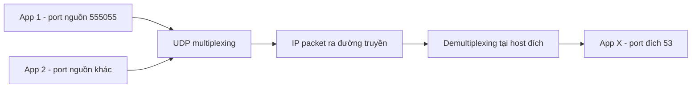

# 📬 UDP: Giao Thức Datagram Siêu Gọn — Gửi Xong, Không Cần Biết Đã Tới Hay Chưa

> Nguồn: `020-UDP.txt` · [Udemy](https://ua.udemy.com/course/fundamentals-of-backend-communications-and-protocols/learn/lecture/34629838)

Chào các bạn! Trong bài trước chúng ta đã có "chiếc xe" Internet Protocol (giao thức Internet) chở mọi loại dữ liệu. Bài này mình nói về một hành khách đặc biệt đơn giản: **UDP (User Datagram Protocol — giao thức datagram không kết nối)**. Mình chọn dạy UDP trước TCP chỉ vì một lý do: nó ngắn, gọn và dễ hiểu hơn hẳn — *và mình tin rằng chúng ta thích sự đơn giản trong backend engineering.*

### 📨 UDP là gì? Datagram của "user" — gửi đi, đến thì đến, không đến thì thôi

UDP là giao thức **layer 4**, nằm ngay trên layer 3 (IP). Tên gọi "user datagram" xuất phát từ chính đặc điểm của nó: **message do user định nghĩa** sẽ vừa khít vào một **datagram (gói dữ liệu)** — segment của UDP — rồi nằm gọn trong một IP packet để được giao đi.

Sự khác biệt cốt lõi với TCP nằm ở đây:

* **TCP là một vòi byte (hose of bytes).** Không có điểm bắt đầu hay kết thúc của message. Kernel tự quyết định cắt dòng byte thành các **TCP segment**, và luôn viết lại chúng — bạn không thể tin vào ranh giới segment của TCP.
* **UDP là message-based.** Bạn đặt một message, nó đến thì đến, mất thì thôi. *Không có chuyện TCP "xịn hơn" UDP — chúng phục vụ hai nhu cầu khác nhau.*

Điểm quan trọng thứ hai: **UDP là stateless**. Không lưu gì trên server, không lưu gì trên client, giống hệt cách IP packet đi qua router mà không để lại dấu vết. Hệ quả trực tiếp: **không cần prior communication** — bạn không cần thỏa thuận trước với ai cả, cứ gửi thôi. Đó là con dao hai lưỡi mà mình sẽ mổ xẻ ở phần ưu nhược điểm.

Và dù rất gọn, UDP vẫn có header: IP packet đã tốn **20 byte** header, UDP đeo thêm **8 byte** header của nó nữa. Nghe có vẻ lãng phí, nhưng mọi giao thức đều cần header để định tuyến tới đúng ứng dụng.

---

### 🔌 Port và multiplexing: lần đầu tiên "nói chuyện" được với từng process

Nếu IP chỉ cho bạn địa chỉ của host, thì UDP là giao thức đầu tiên cho phép bạn **đánh địa chỉ tới từng process bên trong host bằng port (cổng)**. Cùng một IP, nhiều ứng dụng cùng chạy — mỗi ứng dụng một port, và ta phân biệt được chúng.

Đây là ý tưởng **multiplexing (ghép kênh)**: nhiều input (nhiều ứng dụng, nhiều port) được dồn vào một output (một dây mạng, một loạt IP packet); phía nhận lại tách ngược (demultiplexing) để trả dữ liệu về đúng ứng dụng đích.

Vậy tại sao lại cần **source port (cổng nguồn)**? Câu hỏi này mình nhận được rất nhiều lần. Trả lời đơn giản: **để biết đường gửi trả về cho đúng ứng dụng nào**. Bạn biết IP nguồn, nhưng IP nguồn không nói được packet do app nào gửi. Mỗi datagram được định danh duy nhất bởi bộ bốn thứ:

1. Source port
2. Source IP
3. Destination IP
4. Destination port

Ví dụ: App 1 ở `10.0.0.1` với port `555055` gửi tới App X ở `10.0.0.2` port `53` (spoiler: **53 là port của DNS server**). Khi App X trả lời, nó chỉ việc đảo vị trí: đích là `10.0.0.1` và port `555055`, nguồn là port `53`. Hết sức đơn giản. Và tin vui: **hiểu khái niệm này là bạn hiểu luôn TCP**, vì TCP dùng đúng bộ bốn đó.

Một bài toán đếm mà mình rất thích: port dài **16 bit**, tức 0 đến 65.535 (một số đã được reserved). Giả sử bạn cố định destination IP, destination port và source IP — thì từ một host chỉ có tối đa khoảng **65.000 process** gửi tới cùng đích đó. Nếu bạn viết một app liên tục spin process và gửi request song song, bạn sẽ chết sau khoảng 65.000 request vì cạn port. Trên thực tế gần như không bao giờ rơi vào tình huống đó, nhưng biết được "trần" của hệ thống là tư duy của người viết backend nghiêm túc.

---

### 🎬 UDP xuất hiện ở đâu: video, VPN, DNS, WebRTC và game online

**Video streaming** là ví dụ kinh điển: một vài frame video bị mất thì hình chỉ hơi méo, không đáng để bắt cả luồng phải chậm lại và gửi lại — nên UDP là lựa chọn đúng. UDP không đảm bảo giao hàng, và với video thì đó lại là điểm cộng.

**VPN** gần như phải dùng UDP, bởi vì chạy VPN trên TCP là một ý tồi — bạn gặp hiện tượng **TCP meltdown**: bạn vốn đã giao tiếp với server bằng TCP, VPN lại bọc thêm một lớp TCP nữa, nên retransmission của lớp này chồng lên retransmission của lớp kia, cực kỳ khó chịu. Vì vậy mình hay nói các VPN thường dùng IP trực tiếp — **IP in IP**: IP packet gốc của bạn được đặt vào trong một IP packet khác và mã hóa, gửi tới VPN server. ISP chỉ thấy một loạt IP packet ào về cùng một server và hoàn toàn không biết bên trong là gì; VPN server mở gói, thấy IP packet thật và chuyển tiếp tới đích. Với các VPN dùng UDP (OpenVPN chẳng hạn), câu chuyện cũng tương tự.

**DNS (Domain Name System)** đổi hostname thành IP address — vì con người chỉ nhớ `google.com` chứ không nhớ IP, còn IP packet thì không thể gửi tới một chuỗi tên. Nhưng hãy nhớ quy tắc bất di bất dịch của giới bảo mật mà mình hay nhắc: **đâu có mapping, đó có poisoning**. Có ARP poisoning khi ARP đổi IP thành MAC, thì cũng có **DNS poisoning**: kẻ tấn công chặn UDP packet trả lời của DNS và thay IP của server thật bằng IP của server chúng. Nạn nhân gõ `google.com` và được đưa thẳng tới máy của attacker. *Rất, rất đáng sợ.*

**WebRTC** — giao thức cho phép hai peer nói chuyện trực tiếp — cũng chạy trên UDP. Các bạn để ý: browser **không hề expose raw UDP socket** vì lý do bảo mật. Bạn muốn giao tiếp trong browser thì dùng WebSocket (chạy trên TCP, trên HTTP) hoặc WebRTC (chạy trên UDP, peer-to-peer).

Và tất nhiên không thể thiếu **game online**: các game multiplayer thường dùng UDP vì không muốn gánh overhead của TCP, và các studio chuyên nghiệp tự xây dựng cơ chế riêng của họ trên nền UDP. *Cảm ơn trời đất vì chúng ta có một giao thức đơn giản như UDP để làm nền cho những thứ như vậy.*

---

### 📦 Giải phẫu UDP datagram: đúng 8 byte header

Datagram của UDP là một ví dụ hoàn hảo của "layer 4 chui vào layer 3 như dữ liệu": toàn bộ header UDP cộng với data của bạn (ví dụ một DNS request) trở thành phần data của IP packet. IP packet hoàn toàn không cần quan tâm bên trong là gì — dù header của nó có trường protocol ghi rõ "đây là UDP".

Header UDP chỉ có 4 trường, mỗi trường 16 bit:

* **Source port:** định danh process gửi. Mỗi process có một port duy nhất.
* **Destination port:** định danh process nhận.
* **Length:** độ dài của datagram.
* **Checksum (mã kiểm tra):** dùng để xác minh dữ liệu có bị hỏng trên đường truyền hay không.

Phần checksum đáng để nói vài câu: các packet khi ra đường truyền sẽ gặp suy giảm tín hiệu điện, ánh sáng và đủ loại tác động của "tự nhiên", nên **một bit hoàn toàn có thể bị lật**. Một bit lật là dữ liệu biến thành thứ khác. Checksum giúp bạn phát hiện packet hỏng — xác suất bit bị lật mà checksum lại... lật theo đúng chiều để khớp trở lại là cực kỳ thấp. Vậy nên checksum là công cụ kiểm tra tính toàn vẹn dữ liệu, không phải bảo mật.

---

### ⚖️ Ưu và nhược điểm — và tự tay dựng UDP server bằng Node.js lẫn C

Nhìn nhanh UDP cạnh TCP để thấy mình đang chọn gì:

| Tiêu chí | UDP | TCP |
|---|---|---|
| Kiểu truyền | Message-based | Stream byte |
| Kết nối | Không cần kết nối | Có connection và handshake |
| State | Stateless | Stateful |
| Độ tin cậy | Không ACK, không đảm bảo | Có retransmission, đảm bảo thứ tự |
| Flow và congestion control | Không có | Có đầy đủ |
| Header | 8 byte | 20 byte, tối đa 60 byte |

**Điểm mạnh của UDP:**

* Cực kỳ đơn giản, đúng thứ nhiều developer cần.
* Header nhỏ, datagram nhỏ, tiết kiệm băng thông.
* **Stateless** nên không chiếm memory trên backend — scale rất tốt. TCP tiêu tốn memory cho mỗi kết nối, và cộng dồn nhiều kết nối thì tài nguyên cũng cạn.
* **Low latency:** không handshake, không sequence number, không phải chờ packet đến đúng thứ tự. Gửi đi và nó tới nơi ngay. *Trong nhiều ứng dụng, latency quan trọng hơn cả correctness* — đó là quyết định của người làm backend và frontend, giống như bạn chọn giữa eventual consistency và strong consistency trong database.

**Điểm yếu của UDP — và chúng cũng là hệ quả trực tiếp của những điểm mạnh:**

* **Không acknowledgement, không guaranteed delivery:** gửi xong bạn chẳng biết message có tới hay không, server có cập nhật state hay không. Vì lý do này, ứng dụng database gần như không thể dùng UDP — bạn sẽ làm hỏng dữ liệu ngay lập tức.
* **Connectionless:** mọi người có thể gửi cho mọi người, không có gì gọi là xác thực. Đây là lý do UDP bị lạm dụng để tấn công: **DNS flooding** — flood server bằng datagram, server vẫn phải bóc từng gói ra xử lý vì nó không có khái niệm "bạn đã nói chuyện với tôi chưa"; hoặc tệ hơn là giả mạo source IP thành IP của nạn nhân rồi dùng hàng nghìn DNS resolver trả hàng loạt reply về nạn nhân — nạn nhân gục vì phải xử lý lượng dữ liệu không ai yêu cầu. **Denial of service** từ đó mà ra. TCP không dễ bị vậy: muốn nói chuyện thì phải bắt tay trước, không thì bị đuổi thẳng.
* **Không flow control:** bạn không biết server chịu được bao nhiêu datagram, vì bạn không biết buffer của đối phương. Bạn muốn gửi 7 packet hay 800 packet một lượt đều được — nhưng hậu quả bạn tự chịu. Tất nhiên bạn có thể **tự xây flow control ở application layer**, ví dụ để server trả về UDP packet nói "tôi xử lý được ngần này byte" — và đó chính là điều các studio game đỉnh cao làm.
* **Không congestion control:** bạn không biết router có đang nghẽn hay không. Dù vậy router vẫn được bảo vệ bằng buffer riêng, không thể để một kẻ "ăn hết" mạng.
* **Không đảm bảo thứ tự packet:** packet có thể đến lệch thứ tự và UDP không quan tâm.

Để các bạn thấy tận mắt, mình có demo dựng UDP server ở hai cấp độ:

* **Node.js (cấp cao):** dùng module `dgram`, tạo socket kiểu `udp4`, rồi `bind` vào port `5500` trên loopback `127.0.0.1`. Cảnh báo quan trọng: đừng bao giờ bind mà bỏ trống địa chỉ — **hệ điều hành sẽ listen trên mọi network interface**, nghĩa là API nội bộ của bạn có thể lộ ra Internet. Máy bạn có loopback, có IP Wi-Fi, IP Ethernet, có thể có cả IP public; hãy chỉ định rõ ràng. Sau đó mình gắn handler cho event message, nhận về `address`, `family`, `port`, `size` của client. Test bằng **netcat**: `nc -u 127.0.0.1 5500`; gõ "hi" thì server nhận **3 byte** (`h`, `i` và ký tự carriage return), còn source port là một port ngẫu nhiên như `53618`. Node.js đã lo hết phần buffer, file descriptor và vòng lặp cho chúng ta.
* **C (cấp thấp, gần assembly nhất có thể):** bạn phải tự tay tạo **socket file descriptor** — một con số nguyên được OS dùng để tra bảng socket khi datagram tới, mặc định có giới hạn (khoảng 10.000, và có thể tăng), nên "trần kết nối" là có thật. Bạn cấp phát buffer 1024 byte để nhận dữ liệu, tạo struct địa chỉ cho mình và cho đối phương, gọi `socket` với `AF_INET` và `SOCK_DGRAM`, rồi `bind` vào port `5501` tại `127.0.0.1`. Một chi tiết thú vị: chương trình demo **không có vòng lặp** — nó nhận datagram đầu tiên, in ra, rồi thoát ngay. *Đúng tinh thần C: máy làm chính xác những gì bạn bảo, không hơn một bước.* Muốn phục vụ tiếp thì tự thêm loop. Và tất nhiên, code C phải **compile** trước khi chạy — thời sinh viên của mình, lần cuối viết C là năm 2001, nhưng cảm giác tự tay quản lý từng byte vẫn rất đáng để trải nghiệm một lần.

---

### 🎯 Tự kiểm tra nhanh

**Câu 1:** Vì sao giao thức này được gọi là "user datagram"?

<b>Xem đáp án</b>

**Đáp án:** Vì message do user định nghĩa sẽ vừa khít vào một datagram — segment của UDP — rồi nằm gọn trong một IP packet để giao đi.

Giải thích: Đây là điểm khác cốt lõi với TCP, vốn chỉ là một vòi byte không có ranh giới message.

Tham chiếu: Mục UDP là gì?

**Câu 2:** Bộ bốn thứ định danh duy nhất một datagram gồm những gì?

<b>Xem đáp án</b>

**Đáp án:** Source port, source IP, destination IP và destination port.

Giải thích: Hiểu bộ bốn này là hiểu luôn TCP, vì TCP dùng đúng bộ bốn đó cho connection.

Tham chiếu: Mục Port và multiplexing.

**Câu 3:** Vì sao cần source port khi đã biết IP nguồn?

<b>Xem đáp án</b>

**Đáp án:** Để biết đường gửi trả về cho đúng ứng dụng — IP nguồn không nói được packet do app nào gửi.

Giải thích: Cùng một IP có thể có nhiều ứng dụng chạy trên các port khác nhau.

Tham chiếu: Mục Port và multiplexing.

**Câu 4:** Vì sao chạy VPN trên TCP là một ý tồi?

<b>Xem đáp án</b>

**Đáp án:** Vì gặp hiện tượng TCP meltdown — retransmission của lớp TCP bên trong chồng lên retransmission của lớp TCP bên ngoài, cực kỳ khó chịu.

Giải thích: Các VPN thường dùng IP in IP hoặc UDP (ví dụ OpenVPN).

Tham chiếu: Mục UDP xuất hiện ở đâu.

**Câu 5:** Vì sao ứng dụng database gần như không thể dùng UDP?

<b>Xem đáp án</b>

**Đáp án:** Vì UDP không acknowledgement, không guaranteed delivery, không đảm bảo thứ tự — bạn sẽ làm hỏng dữ liệu ngay lập tức.

Giải thích: Những gì là điểm mạnh với video/game (low latency, không chờ) lại là điểm yếu chí mạng với database.

Tham chiếu: Mục Ưu và nhược điểm.

---

Tóm lại, UDP là giao thức layer 4 gọn gàng nhất: có source port, destination port, một chút dữ liệu — hết. Nó không state, không kết nối, không ràng buộc, và chính vì thế nó là nền tảng cho video streaming, VPN, DNS, WebRTC và game online — những nơi mà **tốc độ thắng sự hoàn hảo**. Đổi lại, bạn phải tự lo phần reliability, ordering và chống lạm dụng ở tầng ứng dụng.

Đó là toàn bộ câu chuyện về UDP. Ở bài tiếp theo, chúng ta sẽ gặp người anh em đối trọng: **TCP** — nơi mọi thứ trở nên "nặng ký" hơn với handshake, sequence number, acknowledgement, flow control và congestion control. Chuẩn bị tinh thần nhé, vì TCP là giao thức mà backend engineer gặp mỗi ngày. 🚀

## Nguồn tham khảo

- [Udemy — UDP](https://ua.udemy.com/course/fundamentals-of-backend-communications-and-protocols/learn/lecture/34629838)
- [RFC 768 — User Datagram Protocol](https://www.rfc-editor.org/rfc/rfc768.html)
