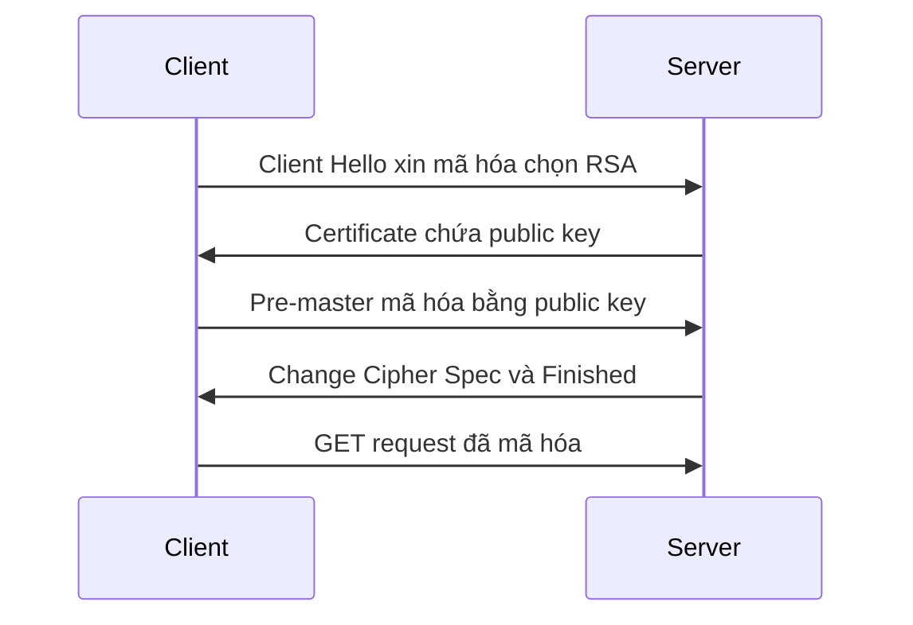

# 🔐 TLS — Bảo mật tầng vận chuyển: Từ HTTP "trần trụi" tới bắt tay mã hóa một roundtrip

> Nguồn: `022-TLS.txt` · [Udemy](https://ua.udemy.com/course/fundamentals-of-backend-communications-and-protocols/learn/lecture/34629846)

Chào các bạn! Gửi dữ liệu qua Internet mà không mã hóa thì khác nào viết thư mật lên bưu thiếp — mọi router và ISP trên đường đi đều đọc được. **TLS (bảo mật tầng vận chuyển)** ra đời để giải quyết đúng bài toán đó: một tiêu chuẩn **encryption (mã hóa)** cho mọi giao tiếp giữa hai bên. Trong bài này mình đi từ HTTP thường, HTTPS, handshake TLS 1.2, lỗ hổng forward secrecy của RSA, cho tới vì sao TLS 1.3 với Diffie-Hellman lại nhanh hơn hẳn.

### 🌐 HTTP "trần trụi" — ai đi ngang cũng đọc được

Hãy bắt đầu với phiên bản chưa mã hóa. Server lắng nghe trên port 80, client mở một **TCP connection** — đúng cái TCP handshake (bắt tay) mà chúng ta đã nói ở bài trước. Sau khi connection được thiết lập, client gửi request trông như thế này:

* Dòng đầu là `GET / HTTP/1.1` kèm phiên bản giao thức, tiếp theo là các header, rồi tới body nếu có — *request GET thường không có body*.
* Request biến thành một hoặc nhiều TCP segment tùy theo MTU, rồi đi xuống stack và nằm trong IP packet.

Ở phía server, request được hiểu ở tầng ứng dụng, và server trả về header cùng phần nội dung như `index.html`. Nội dung này cũng bị cắt thành một hay nhiều segment, và việc gửi tất cả cùng lúc hay lần lượt phụ thuộc vào congestion control — *lúc mới bắt đầu thường chậm, đó là lý do chúng ta có slow start*. Xong việc thì connection được đóng lại.

Vấn đề nằm ở chỗ: toàn bộ những gì vừa diễn ra đều **không được mã hóa**. Bất kỳ ai đứng giữa — một router, một ISP nơi mọi IP packet đi qua — đều đọc được request của bạn. Không ổn chút nào, nên ta cần mã hóa. Và tin vui là bạn có thể gắn TLS lên **bất kỳ giao thức nào**, từ layer 7 trở xuống đều mã hóa được. HTTPS, nói cho gọn, chính là HTTP chạy trên TLS.

Vậy TLS thuộc layer nào? Nếu buộc phải nhét vào mô hình OSI thì **layer 5** là hợp lý nhất, vì TLS là giao thức **stateful**: nó có session hai đầu, gắn với file descriptor của TCP handshake. TCP là layer 4, còn biến session và window size thuộc về layer 5. *Tất nhiên đây là góc nhìn trí tuệ cho vui, không phải điều gì khắc lên đá.*

---

### 🔑 Handshake TLS: mục tiêu là "chung một chìa khóa"

Cách làm cũng tương tự HTTP: mở connection trước, nhưng lần này có thêm một **handshake TLS (bắt tay TLS)**. Mục tiêu của nó rất rõ ràng: **chia sẻ một symmetric key (khóa đối xứng)** — cùng một chìa khóa nằm ở cả client lẫn server — để mã hóa dữ liệu. Sau đó request `GET` sẽ được mã hóa bằng chìa khóa này, kẻ đứng giữa nhìn vào chỉ thấy một mớ vô nghĩa, còn server giải mã bằng chìa khóa của mình và trả lời.

Vì sao lại là khóa đối xứng? Vì có hai loại thuật toán mã hóa:

* **Symmetric (đối xứng):** cùng một key dùng để mã hóa và giải mã, thường dùng phép XOR trên từng block dữ liệu — cực kỳ nhanh.
* **Asymmetric (bất đối xứng):** một key để mã hóa, một key khác để giải mã — không thể dùng lẫn. Rất phổ biến nhưng **chậm**, vì luôn dựa trên các phép lũy thừa, tốn nhiều CPU, xử lý và năng lượng.

Vậy nên nội dung thì luôn mã hóa bằng khóa đối xứng. Nhưng bài toán hóc búa là: **làm sao trao đổi chìa khóa đó mà không bị chặn giữa đường?** Bạn không thể cứ thế gửi thẳng chìa khóa đi. Song song đó, handshake còn phải **xác thực server** — đảm bảo đối phương đúng là người họ nhận. Server làm điều này bằng **certificate (chứng chỉ)**, dựa trên **PKI (hạ tầng khóa công khai)**: bạn kiểm tra chữ ký của certificate, truy vết ngược lên certificate authority và tới tận root. *Đây là cả một chủ đề dài, mình chỉ điểm qua phần xác thực trong bài này.*

Trong **Client Hello** — gói đầu tiên của handshake — còn có nhiều extension đáng chú ý: **SNI (Server Name Indication)** để chỉ ra tên miền muốn kết nối, và **pre-shared key (khóa chia sẻ trước)**. Nếu hai bên đã từng giao tiếp, pre-shared key cho phép mã hóa ngay từ bước đầu, không cần qua lại gì cả — gọi là **zero RTT (không tốn vòng khứ hồi nào)**.

---

### 🕰️ TLS 1.2 và bài học nhớ đời về forward secrecy

*Các phiên bản TLS 1.0 và 1.1 đã không còn an toàn và không còn được khuyến nghị — nên mình chỉ nói về thứ đang được dùng thật.* TLS 1.2 đôi khi vẫn xuất hiện vì lý do tương thích ngược, và luồng của nó đi như sau:

1. Sau khi có TCP connection, client gửi **Client Hello**: xin mã hóa, chọn **RSA** làm thuật toán trao đổi khóa và một thuật toán đối xứng (ví dụ AES hoặc ChaCha).
2. Server trả lời kèm **certificate chứa public key (khóa công khai)** của mình.
3. Client sinh ra **pre-master** — nguyên liệu để tạo symmetric key — rồi mã hóa nó bằng public key của server và gửi đi. Ai chặn được cũng chỉ thấy một khối mã hóa.
4. Server dùng **private key (khóa bí mật)** để giải mã, hai bên có chung symmetric key, trao đổi `Change Cipher Spec` và `Finished`, thế là xong.

Đây là **hai roundtrip**, vì vòng đầu tiên chỉ để thỏa thuận xem hai bên dùng thuật toán gì. Có một điều đáng chú ý: ta hoàn toàn có thể dùng public/private key để mã hóa mọi nội dung, nhưng **quá chậm** — ví dụ gửi một file JavaScript 16 KB sẽ cực kỳ chậm, nên cách đó chỉ hợp với dữ liệu nhỏ hay các câu lệnh điều khiển.

Và đây là vấn đề lớn nhất của RSA key exchange: **forward secrecy (bí mật về sau)**. Giả sử kẻ tấn công là một ISP — nơi mọi IP packet đều đi qua — hắn ghi lại toàn bộ traffic mã hóa của cả năm, hàng terabyte dữ liệu. Nhìn thì chẳng thấy gì, nhưng **nếu hắn lấy được private key của server thì sao?** Chuyện này đã từng xảy ra: lỗ hổng **Heartbleed** trong thư viện OpenSSL — thư viện ai cũng dùng để làm TLS và mã hóa — cho phép đọc lén một phần memory của server. Phần memory đó toàn rác, nhưng trong rác có vàng: **private key**.

Có private key trong tay, kẻ tấn công chạy một vòng lặp: với mỗi `Change Cipher Spec` trong bản ghi cũ, giải mã để lấy symmetric key, rồi đọc toàn bộ nội dung. *Symmetric key của mỗi session có khác nhau cũng vô ích — private key chỉ có một.* Vì thế người ta tránh dùng RSA để trao đổi khóa, và cố gắng rút ngắn vòng đời certificate: khoảng 3 tháng, có nơi như Cloudflare chỉ cấp **2 tuần** — để dù có bị hack thì thiệt hại cũng ít hơn.

---

### 🧮 Diffie-Hellman & TLS 1.3 — trao đổi khóa mà không gửi chìa khóa đi đâu cả

**Diffie-Hellman** là thuật toán trao đổi khóa tốt hơn hẳn. Ý tưởng: cần **hai private number** (máy tính vốn chỉ làm việc với các con số) và **một số public**. Một bên giữ X, bên kia giữ Y, cả hai đều giữ bí mật; còn số public thì thoải mái chia sẻ. Ghép cả ba thứ lại, bạn được "chìa khóa vàng".

Cụ thể hơn:

1. Client giữ private key X, server giữ private key Y.
2. Client tính `g^X mod n` và gửi đi (g là số nguyên tố, n cũng là số nguyên tố và phải đủ lớn). Nhìn vào kết quả này, không ai tách ngược được X ra — bạn không thể làm phép log sau khi đã modulo. Phép kết hợp private với public là thứ **không thể bẻ gãy**.
3. Server nhận `g^X mod n`, nâng nó lên lũy thừa Y của mình — thu được symmetric key.
4. Server gửi `g^Y mod n` cho client, client nâng nó lên lũy thừa X — thu được đúng chìa khóa đó, vì `(g^X)^Y = g^(XY) = (g^Y)^X`.

Thế là cả hai có chung chìa khóa và không ai ở giữa moi được gì. TLS 1.2 có hỗ trợ Diffie-Hellman, thậm chí có **elliptic curve Diffie-Hellman** còn tốt hơn. Còn **TLS 1.3** thì bỏ luôn bước đàm phán: nó gửi thẳng các tham số Diffie-Hellman ngay trong handshake đầu tiên. Kết quả là chỉ còn **một roundtrip** thay vì hai, hoặc thậm chí **zero RTT** nếu hai bên đã có pre-shared key thỏa thuận từ trước. *TLS 1.3 nhanh hơn 1.2 rõ rệt, nhất là khi mỗi roundtrip còn phải chồng lên lớp TCP bên dưới.*

Nhìn nhanh hai thế hệ trao đổi khóa:

| Tiêu chí | TLS 1.2 với RSA | TLS 1.3 với Diffie-Hellman |
|---|---|---|
| Trao đổi khóa | Pre-master mã hóa bằng public key | Hai bên ghép private number với số public |
| Forward secrecy | Không có — lộ private key là mở được quá khứ | Có |
| Số roundtrip | 2 | 1, hoặc 0 nếu có pre-shared key |
| Rủi ro điển hình | Heartbleed đọc lén private key trong memory | Thấp hơn |

Một chi tiết nhỏ cuối cùng: certificate server gửi về khá lớn, nó bị chia thành rất nhiều segment — dù hình vẽ chỉ có một mũi tên. Người ta đã có RFC đề xuất nén certificate, nhưng hiện tại nó vẫn chưa được nén.

---

### 🎯 Tự kiểm tra nhanh

**Câu 1:** TLS nằm ở layer nào trong OSI, và HTTPS thực chất là gì?

<b>Xem đáp án</b>

**Đáp án:** TLS hợp lý nhất ở layer 5 vì nó stateful, có session gắn với file descriptor của TCP handshake. HTTPS chính là HTTP chạy trên TLS.

Giải thích: Bạn có thể gắn TLS lên bất kỳ giao thức nào, từ layer 7 trở xuống đều mã hóa được.

Tham chiếu: Mục HTTP "trần trụi".

**Câu 2:** Mục tiêu của handshake TLS là gì?

<b>Xem đáp án</b>

**Đáp án:** Chia sẻ một symmetric key — cùng một chìa khóa nằm ở cả client lẫn server — để mã hóa dữ liệu, đồng thời xác thực server qua certificate dựa trên PKI.

Giải thích: Nội dung luôn mã hóa bằng khóa đối xứng vì nó nhanh; bài toán khó là trao đổi chìa khóa sao cho không bị chặn giữa đường.

Tham chiếu: Mục Handshake TLS.

**Câu 3:** Vì sao không dùng asymmetric key để mã hóa toàn bộ nội dung?

<b>Xem đáp án</b>

**Đáp án:** Vì asymmetric rất chậm — luôn dựa trên các phép lũy thừa, tốn nhiều CPU, xử lý và năng lượng. Ví dụ gửi file JavaScript 16 KB bằng public/private key sẽ cực kỳ chậm.

Giải thích: Symmetric dùng cùng một key với phép XOR trên từng block nên nhanh hơn hẳn.

Tham chiếu: Mục Handshake TLS.

**Câu 4:** Vấn đề lớn nhất của RSA key exchange là gì, và Heartbleed liên quan thế nào?

<b>Xem đáp án</b>

**Đáp án:** RSA thiếu forward secrecy — kẻ tấn công ghi lại traffic cả năm, nếu lấy được private key của server là giải mã được toàn bộ quá khứ. Heartbleed trong OpenSSL cho phép đọc lén memory server, nơi có thể chứa private key.

Giải thích: Vì thế người ta tránh RSA để trao đổi khóa và rút ngắn vòng đời certificate, có nơi như Cloudflare chỉ cấp 2 tuần.

Tham chiếu: Mục TLS 1.2 và bài học về forward secrecy.

**Câu 5:** Vì sao TLS 1.3 chỉ còn một roundtrip?

<b>Xem đáp án</b>

**Đáp án:** Vì TLS 1.3 bỏ bước đàm phán — nó gửi thẳng các tham số Diffie-Hellman ngay trong handshake đầu tiên; nếu hai bên đã có pre-shared key thì thậm chí zero RTT.

Giải thích: Mỗi roundtrip tiết kiệm được còn phải tính chồng lên lớp TCP bên dưới, nên TLS 1.3 nhanh hơn 1.2 rõ rệt.

Tham chiếu: Mục Diffie-Hellman & TLS 1.3.

---

Tóm lại, TLS là câu chuyện về niềm tin được xây dựng bằng toán học: một handshake để hai bên có chung symmetric key, xác thực server qua certificate, và một lịch sử tiến hóa từ RSA (thiếu forward secrecy) sang Diffie-Hellman, rồi TLS 1.3. Nhớ con số quan trọng: **TLS 1.2 tốn 2 roundtrip, TLS 1.3 chỉ còn 1** — và mọi roundtrip đều tính bằng thời gian thật của người dùng.

Hiểu được TLS là bạn hiểu lớp bảo vệ của gần như mọi kết nối web ngày nay, từ API cho tới trang bạn đang đọc. Còn rất nhiều thứ phía trước như certificate, keys và cơ chế xác thực chi tiết — hẹn gặp các bạn ở bài tiếp theo! 🚀

## Nguồn tham khảo

- [Udemy — TLS](https://ua.udemy.com/course/fundamentals-of-backend-communications-and-protocols/learn/lecture/34629846)
- [RFC 8446 — TLS 1.3](https://www.rfc-editor.org/info/rfc8446)
- [MDN — Transport Layer Security (TLS)](https://developer.mozilla.org/en-US/docs/Web/Security/Defenses/Transport_Layer_Security)
