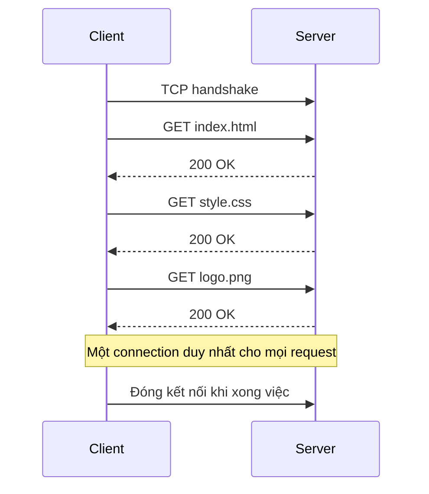

# 🌐 HTTP/1.1: Giao thức "đơn giản đến mức khó thay thế" đã sống qua bao thế hệ

> Nguồn: `023-HTTP11.txt` · [Udemy](https://ua.udemy.com/course/fundamentals-of-backend-communications-and-protocols/learn/lecture/34630270)

Chào các bạn! Hôm nay chúng ta sẽ nói về **HTTP/1.1** — một giao thức đơn giản nhưng đã sống qua bao thập kỷ và đến giờ vẫn chạy khắp Internet. Mình sẽ kể cho các bạn vì sao nó đẹp đến vậy, vì sao nhiều người vẫn từ chối nâng cấp lên HTTP/2, và cả những cạm bẫy như **HTTP smuggling** hay chuyện **pipelining (gửi nối tiếp)** không ai dám bật.

### 🧩 Giải phẫu một request HTTP từ đầu đến cuối

Kiến trúc **client-server (máy khách – máy chủ)**: trình duyệt, app Python hay JavaScript khi gửi request đều là HTTP client; phía sau là HTTP server — IIS, Apache, Tomcat, Node.js, Python Tornado... rất nhiều implementation khác nhau.

Một request HTTP gồm:
1. **Method**: GET, PUT, DELETE, POST, HEAD... Nhưng trên web, các bạn gần như chỉ dùng **GET** và **POST**. PUT sinh ra để update, nhưng người ta cứ dùng POST; GET dùng để đọc dữ liệu.
2. **Path**: mọi thứ sau dấu slash đầu tiên. Vào `husseinnasser.com/about` thì path là `/about`; vào trang chủ thì path chỉ là `/`.
3. **Protocol version**: HTTP/1.0, HTTP/1.1, HTTP/2 hay HTTP/3.
4. **Headers**: tập key-value như `content-type: application/json`, `content-length: 700 bytes`, `cookie`, `authority`... Trong đó **Host** là một trong những header quan trọng nhất và giờ đã bắt buộc.
5. **Body**: với GET thì rỗng — GET không có body. Muốn truyền dữ liệu thì nhét **query parameters** vào path qua dấu `?` và `&`.

*Có một chi tiết mình muốn các bạn ghi nhớ:* URL **có giới hạn độ dài**, và mỗi server quy định một kiểu — có server nói 2000 bytes, có server nói 2000 ký tự, có server cho 8000 ký tự. GET với URL quá dài có thể bị từ chối. Ngược lại, body của POST về mặt kỹ thuật không có giới hạn — header `content-length` quyết định body dài bao nhiêu (có thể là số nguyên 64-bit, tùy implementation server).

---

### 📬 Vì sao header Host lại quan trọng đến vậy?

Khi mình chạy `curl -v`, request gửi đi có dạng `GET /about HTTP/1.1` kèm header `Host: husseinnasser.com`. Nhiều bạn sẽ hỏi: IP đã đủ nhận diện server rồi, sao còn lặp lại domain? **Không hề.** Một địa chỉ IP có thể host hàng trăm website cùng lúc.

Ngày xưa là "một IP = một website": DNS resolve ra IP và bạn tới đúng site đó. Rồi người ta nhận ra có thể trỏ cả chục domain về cùng một IP. Ở tầng TCP, tất cả request đều chạy đến cùng một máy — chính header **Host** giúp backend biết "à, request này muốn website nào" và trỏ vào đúng folder tương ứng. *Đó là "trick" đứng sau multi-homed hosting (host nhiều website trên cùng một IP).*

Phía response thì ngược lại:
1. Protocol version + **status code**: 200 OK, 304 Not Modified, 404, 500...
2. Phần mô tả bằng chữ đi kèm code — vốn **thừa thãi** vì 200 luôn là OK.
3. Headers (ví dụ `Location` dùng cho redirect) và body chứa nội dung thật.

HTTP/2 đã **xóa phần mô tả lặp lại** đó. Chuyện dở khóc dở cười: mình báo team Chrome một bug từ ba năm trước — trong DevTools, hover chuột lên status code chỉ thấy mô tả nếu là HTTP/1.1, còn HTTP/2 trở lên thì trắng trơn. Lý do: DevTools dựa vào chính response để hiển thị mô tả, mà HTTP/2 bỏ nó rồi. Team Chrome định build một dictionary các mã code để ship kèm trình duyệt... đến giờ vẫn chưa ai sửa bug của mình. Các bạn cũng có thể tự kiểm chứng bằng live demo `curl -v http://nginx.org` — response HTTP/1.1 trả về kèm dòng `301 Moved Permanently` rõ ràng.

---

### 🔌 HTTP/1.0: mỗi request một kết nối, mở rồi đóng liên tục

HTTP được xây dựng **trên nền TCP**: client và server bắt tay ba bước, gửi request, nhận response, rồi... **đóng kết nối**. Muốn bảo mật thì sau TCP phải làm thêm **TLS handshake (bắt tay bảo mật)**. Vì mã hóa đối xứng nhanh hơn nhiều so với bất đối xứng, hai bên thống nhất một **symmetric key (khóa đối xứng)**, trao đổi nó bằng Diffie-Hellman hoặc RSA, rồi mới mã hóa request/response.

Ở thời HTTP/1.0, "giao kèo" là vậy: xong một response là **đóng kết nối ngay**, vì HTTP là **stateless (không lưu trạng thái)**. Lý do thời 1990 rất thực tế: giữ một kết nối TCP sống tốn CPU và cả file descriptor trong bộ nhớ, mà tài nguyên máy hồi đó cực kỳ hạn chế.

Nhưng cái giá thì đắt:
* Trang HTML nhiều ảnh, CSS, JavaScript → **mở/đóng kết nối liên tục**, chậm thấy rõ.
* Server bị "tra tấn" bởi hàng loạt connection request.
* Mỗi lần mở kết nối tốn thêm **latency** vì chi phí setup TCP rất cao.
* Không có **buffering** hay `transfer-encoding` — không chunked response, không server-sent event, không long polling. Phải biết trước `content-length` và gửi nguyên một cục.
* Header **Host là tùy chọn**, nên đừng mơ chuyện nhiều website trên một IP.

---

### ⚙️ HTTP/1.1: keep-alive, smuggling và pipelining

**1. keep-alive (giữ kết nối)** — linh hồn của HTTP/1.1. Client nói với server "giữ kết nối này sống nhé, tôi còn gửi nhiều request nữa": lấy HTML, rồi ảnh 1, ảnh 2, CSS, JavaScript... tất cả trên **một TCP connection** duy nhất. Latency giảm vì không phải nhảy điệu bắt tay mỗi lần; CPU thấp vì server chỉ cần đọc stream, tìm điểm bắt đầu request (method + path + protocol) và điểm kết thúc (theo `content-length`).

Toàn cảnh một phiên keep-alive trên một TCP connection:

**2. Transfer-Encoding: chunked** — giờ có thể **chia response thành nhiều chunk**, gửi được cả nội dung không biết trước độ dài.

**3. HTTP smuggling (buôn lậu request)** — nghe lạ mà nguy hiểm. Khi server bối rối không biết đâu là điểm kết thúc request, hacker lợi dụng bằng cách gửi **hai header content-length**, hoặc vừa `content-length` vừa `transfer-encoding`. Ví dụ Nginx lấy content-length đầu tiên, còn backend Node.js lấy cái thứ hai → hai bên parse ra hai request khác nhau → kẻ tấn công **giấu một request admin lén sau proxy**. Spec không định nghĩa tình huống này, mà khi spec bỏ trống thì mỗi bên tự chế — hậu quả là vậy.

**4. pipelining (gửi nối tiếp)** — nghe hay nhưng **mặc định bị tắt**. Ý tưởng mượn từ CPU pipelining, giống như giặt đồ: bỏ một mẻ vào máy giặt, chuyển sang máy sấy thì máy giặt đang rảnh — vậy bỏ mẻ mới vào máy giặt và đi gấp đồ mẻ cũ. Với HTTP/1.1, client gửi cả ba request cùng lúc, server xử lý 1→3 rồi trả lời theo thứ tự. Vấn đề: HTML nặng còn ảnh nhẹ, server **buộc phải chờ HTML xong** mới trả lời, vì trả ảnh trước thì client tưởng đó là response cho request đầu tiên → vỡ hết. Chặn cứng như vậy thì *lợi bất cập hại*. Tệ hơn, không ai đảm bảo được thứ tự khi có **proxy đứng giữa**. *Ý tưởng bắt mọi thứ theo thứ tự đã từng làm gãy Internet.* Muốn giải ở tầng protocol thì cần **request ID** — thứ HTTP không có, nhưng các bạn hoàn toàn có thể tự xây ở tầng application (DNS có query ID đấy!).

---

### 🚀 Nhìn trước HTTP/2 và HTTP/3

HTTP/2 do Google khởi xướng với tên ban đầu là **SPDY**, bổ sung **nén cả header lẫn body** (HTTP/1.1 từng tắt nén header vì lỗ hổng **CRIME** — kẻ tấn công moi được cookie từ cách nén header). Điểm ăn tiền nhất là **multiplexing (ghép kênh)**: một connection duy nhất, mỗi request gắn một **stream ID** riêng, gửi đồng thời thoải mái mà không cần giữ thứ tự như pipelining. Có cả server push, nhưng nó đã "chết yểu" vì không như kỳ vọng.

Thú vị nhất là HTTP/2 **mặc định bắt buộc bảo mật**, nhờ hiện tượng **protocol ossification (hóa đá giao thức)**: đám router, middle box từ thập niên 90 chỉ hiểu đúng chuỗi byte HTTP/1.1 trên port 80, thấy HTTP/2 binary lạ hoắc là... chặn. Nên HTTP/2 phải đi trong TLS để "tàng hình" qua chúng — và hóa ra lại thành điều hay. Thương lượng HTTP/2 diễn ra ngay trong TLS qua extension **ALPN** (và NPN).

Còn HTTP/3 thay TCP bằng **QUIC** — "UDP kèm congestion control". HTTP/2 vẫn khổ vì **TCP head-of-line blocking**, nên QUIC đẩy các tính năng của HTTP/2 xuống tầng transport: mỗi stream có congestion control riêng, không còn cảnh chặn đầu hàng.

Bảng đối chiếu nhanh bốn thế hệ giao thức:

| Giao thức | Nền tảng | Điểm nhấn | Hạn chế chính |
|---|---|---|---|
| HTTP/1.0 | TCP | Mỗi request một kết nối | Mở/đóng liên tục, tốn latency, Host tùy chọn |
| HTTP/1.1 | TCP | keep-alive, chunked, Host bắt buộc | Pipelining bị tắt, smuggling, không có request ID |
| HTTP/2 | TCP + TLS | Multiplexing, nén header lẫn body, secure by default | TCP head-of-line blocking, server push thất bại |
| HTTP/3 | UDP + QUIC | Stream độc lập, congestion control từng stream | Vẫn tốn CPU, phụ thuộc QUIC |

### 🎯 Tự kiểm tra nhanh

**Câu 1:** Vì sao header `Host` lại quan trọng khi IP đã đủ để tìm server?

<b>Xem đáp án</b>

**Đáp án:** Vì một IP có thể host nhiều website cùng lúc — `Host` cho backend biết request đang muốn website nào.

Giải thích: Ở tầng TCP mọi request đều chạy đến cùng một máy; chính header này làm nên "trick" multi-homed hosting.

Tham chiếu: Mục Vì sao header Host lại quan trọng đến vậy.

**Câu 2:** Điểm khác biệt cốt lõi giữa HTTP/1.0 và HTTP/1.1 là gì?

<b>Xem đáp án</b>

**Đáp án:** keep-alive — giữ một TCP connection sống để gửi nhiều request, thay vì đóng ngay sau mỗi response.

Giải thích: Nhờ đó giảm latency bắt tay và giảm tải CPU lẫn file descriptor cho server.

Tham chiếu: Mục HTTP/1.0 và Mục HTTP/1.1.

**Câu 3:** Vì sao pipelining mặc định bị tắt?

<b>Xem đáp án</b>

**Đáp án:** Vì response buộc phải trả đúng thứ tự request — một response nặng chặn các response nhẹ phía sau, và proxy đứng giữa có thể phá thứ tự.

Giải thích: Muốn giải ở tầng protocol cần request ID, thứ HTTP không có; có thể tự xây ở tầng application.

Tham chiếu: Mục HTTP/1.1 — keep-alive, smuggling và pipelining.

**Câu 4:** HTTP smuggling khai thác điểm yếu nào?

<b>Xem đáp án</b>

**Đáp án:** Sự bất nhất khi xác định điểm kết thúc request giữa các hop.

Giải thích: Hai header content-length, hoặc vừa content-length vừa transfer-encoding, khiến proxy và backend parse ra hai request khác nhau.

Tham chiếu: Mục HTTP/1.1 — keep-alive, smuggling và pipelining.

**Câu 5:** Vì sao HTTP/2 mặc định bắt buộc bảo mật?

<b>Xem đáp án</b>

**Đáp án:** Vì protocol ossification — middle box, router cũ chỉ hiểu chuỗi byte HTTP/1.1 nên chặn HTTP/2 binary.

Giải thích: Đi trong TLS giúp HTTP/2 "tàng hình" qua chúng, và thương lượng HTTP/2 diễn ra qua extension ALPN.

Tham chiếu: Mục Nhìn trước HTTP/2 và HTTP/3.

Tóm lại: ta đã mổ xẻ anatomy của HTTP, đi qua HTTP/1.0 và 1.1 trên TCP, chạm nhanh tới HTTP/2 và HTTP/3 trên QUIC. Ở bài tới, chúng ta sẽ đi sâu vào phần bảo mật — chuyện HTTPS được dựng trên nền TLS như thế nào. Hẹn gặp lại các bạn! 🚀

## Nguồn tham khảo

- [Udemy — HTTP/1.1](https://ua.udemy.com/course/fundamentals-of-backend-communications-and-protocols/learn/lecture/34630270)
- [RFC 9112 — HTTP/1.1](https://www.rfc-editor.org/rfc/rfc9112.html)
